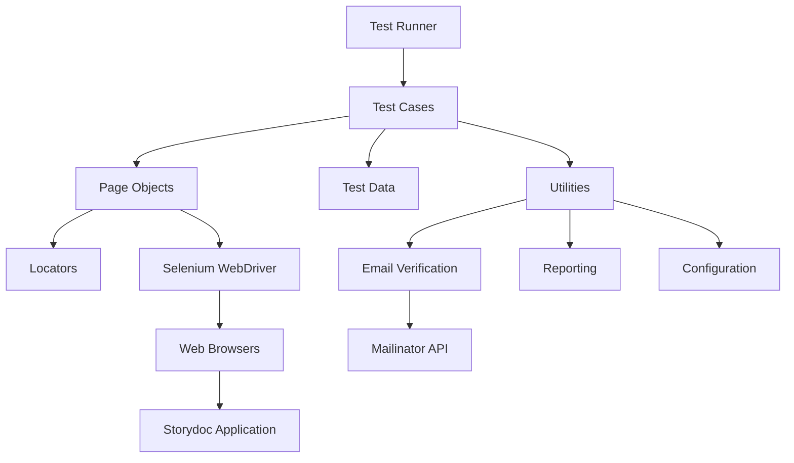
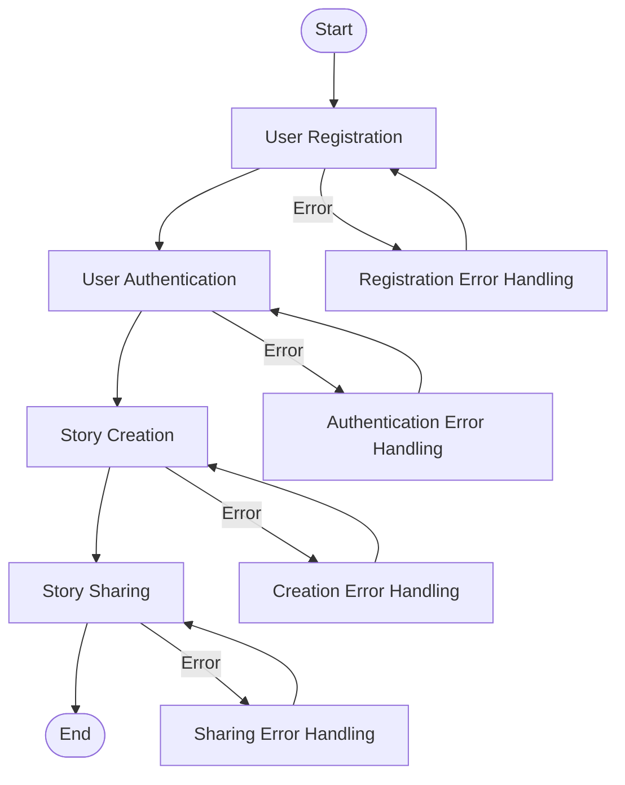

# Storydoc Test Automation Framework

A Page Object Model (POM) based automation framework for testing the Storydoc application's core user flows including user registration, authentication, story creation, and story sharing.

## Project Overview

This project implements a robust, maintainable test automation solution for the Storydoc web application using Python, Selenium WebDriver, and pytest. The framework automates key user workflows to ensure quality and stability of the Storydoc platform.

## Features

- User registration automation with mailinator.com email verification
- User authentication testing
- Story creation workflow automation
- Story sharing and access verification
- Page Object Model architecture for maintainability
- Comprehensive reporting with screenshot capture
- CI/CD integration via GitHub Actions
- Parallel test execution capabilities

## Architecture

The framework follows a layered architecture based on the Page Object Model design pattern, separating test logic from UI implementation details. This provides several benefits including improved maintainability, reusability, readability, and easier maintenance when UI changes occur.



## Framework Structure

```
storydoc-automation/
├── src/test/            # Main test framework directory
│   ├── config/         # Configuration files
│   ├── data/           # Test data
│   ├── utilities/      # Helper functions
│   ├── fixtures/       # pytest fixtures
│   ├── locators/       # Element locators
│   ├── pages/          # Page objects
│   ├── tests/          # Test cases
│   ├── reports/        # Test reports and screenshots
│   ├── scripts/        # Utility scripts
│   ├── docs/           # Framework documentation
│   └── ci/             # CI/CD configuration
├── infrastructure/     # Infrastructure configuration
└── .github/           # GitHub configuration
```

## Core Workflows

The framework automates the following core user workflows:

1. **User Registration**: Automates the signup process with email verification
2. **User Authentication**: Tests the signin process with valid and invalid credentials
3. **Story Creation**: Automates the creation of stories with different templates
4. **Story Sharing**: Tests the sharing functionality with email verification



## Getting Started

### Prerequisites

- Python 3.9+
- Chrome browser
- Git

### Installation

1. Clone the repository
   ```bash
   git clone https://github.com/your-organization/storydoc-automation.git
   cd storydoc-automation
   ```

2. Create and activate a virtual environment
   ```bash
   python -m venv venv
   
   # Windows
   venv\Scripts\activate
   
   # Unix/MacOS
   source venv/bin/activate
   ```

3. Install dependencies
   ```bash
   pip install -r src/test/requirements.txt
   ```

4. Configure environment variables
   ```bash
   cp src/test/.env.example src/test/.env
   # Edit .env with your configuration
   ```

## Running Tests

### Running all tests
```bash
cd src/test
python -m pytest
```

### Running specific test features
```bash
# Run user registration tests
python -m pytest tests/user_registration/

# Run authentication tests
python -m pytest tests/user_authentication/

# Run story creation tests
python -m pytest tests/story_creation/

# Run story sharing tests
python -m pytest tests/story_sharing/
```

### Running with HTML report
```bash
python -m pytest --html=reports/html/report.html
```

### Running with parallel execution
```bash
python -m pytest -n 4
```

### Running end-to-end workflow test
```bash
python -m pytest tests/end_to_end/test_complete_workflow.py
```

## Test Reports

Test reports are generated in HTML format and stored in the `src/test/reports/html/` directory. Screenshots of failures are captured automatically and stored in `src/test/reports/screenshots/`.

## CI/CD Integration

The framework is integrated with GitHub Actions for continuous testing. See the workflow configuration in `.github/workflows/test.yml`.

## Framework Components

### Page Objects
Encapsulate UI interactions for specific pages. Examples include:
- `SignupPage`
- `SigninPage`
- `DashboardPage`
- `StoryEditorPage`
- `ShareDialogPage`

### Utilities
Helper functions for common tasks:
- Email verification using Mailinator
- WebDriver management
- Test data generation
- Configuration management
- Screenshot capture

### Locators
Store element selectors separate from page objects for better maintainability.

## Documentation

Additional documentation is available in the `src/test/docs/` directory:
- [Framework Overview](src/test/docs/framework_overview.md)
- [Setup Guide](src/test/docs/setup_guide.md)
- [Page Objects](src/test/docs/page_objects.md)
- [Test Cases](src/test/docs/test_cases.md)
- [Best Practices](src/test/docs/best_practices.md)
- [Reporting Guide](src/test/docs/reporting_guide.md)
- [Mailinator Integration](src/test/docs/mailinator_integration.md)
- [Troubleshooting](src/test/docs/troubleshooting.md)

## Dependencies

The framework uses the following key dependencies:
- Python 3.9+
- Selenium WebDriver 4.10+
- pytest 7.3+
- pytest-html 3.2+
- pytest-xdist 3.3+
- requests 2.31+
- webdriver-manager 4.0+
- python-dotenv 1.0+

## Contributing

1. Fork the repository
2. Create a feature branch (`git checkout -b feature/your-feature`)
3. Commit your changes (`git commit -m 'Add some feature'`)
4. Push to the branch (`git push origin feature/your-feature`)
5. Open a Pull Request

Please ensure that your code follows the project's coding standards and includes appropriate tests.

## License

This project is licensed under the MIT License - see the LICENSE file for details.