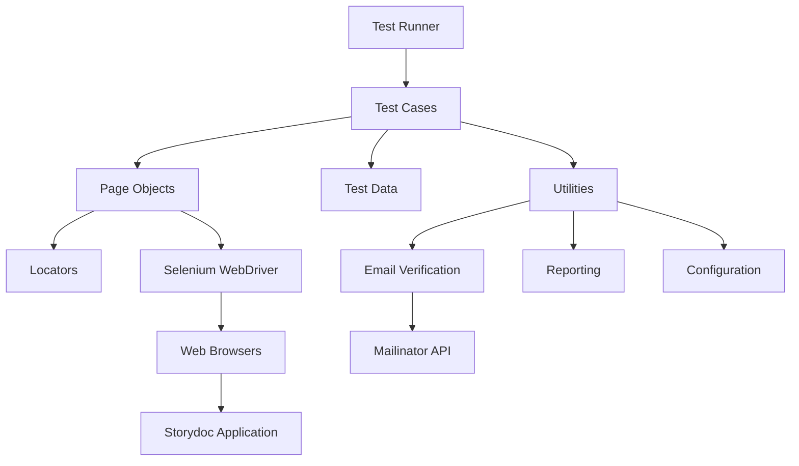
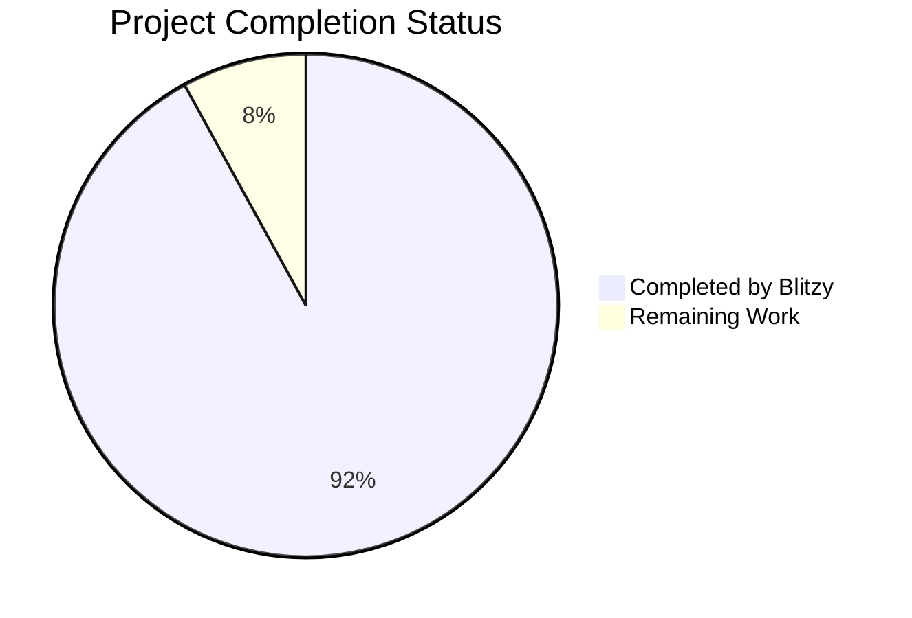
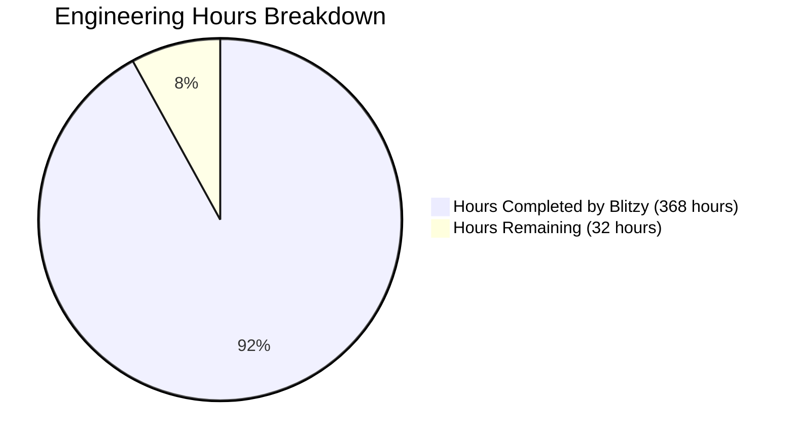
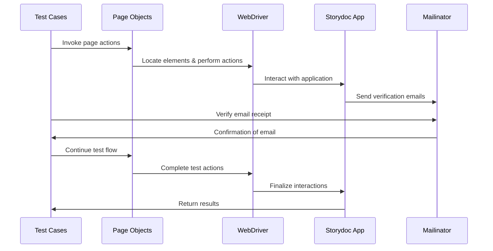
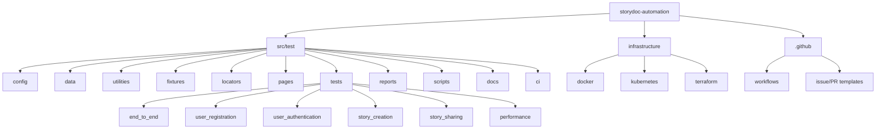

# PROJECT OVERVIEW

The Storydoc Test Automation Framework is a comprehensive, Page Object Model (POM) based automation solution designed to test the core user flows of the Storydoc web application. This framework addresses the critical business need for reliable, maintainable test automation to ensure quality and stability of the Storydoc platform throughout its development lifecycle.

## Purpose and Scope

The framework automates four essential user workflows:

1. **User Registration** - Automating the signup process using mailinator.com emails for verification
2. **User Authentication** - Testing the signin process with newly created users
3. **Story Creation** - Automating the creation of stories with different templates
4. **Story Sharing** - Verifying the story sharing process with email verification

By automating these critical paths, the framework enables:
- Reduction in manual testing effort
- Acceleration of release cycles
- Early detection of regressions
- Improved overall product quality
- Consistent validation of core functionality

## Technical Foundation

Built on modern test automation principles, the framework leverages:

- **Python 3.9+** as the primary programming language
- **Selenium WebDriver 4.10+** for browser automation
- **pytest 7.3+** as the test execution framework
- **Page Object Model** design pattern for improved maintainability
- **Mailinator API** integration for email verification

## Architecture Overview

The framework follows a layered architecture that separates concerns and promotes maintainability:



## Key Components

- **Page Objects**: Encapsulate UI interactions for specific pages (SignupPage, SigninPage, DashboardPage, etc.)
- **Locators**: Store element selectors separate from page objects for better maintainability
- **Test Cases**: Implement test scenarios focused on business workflows
- **Utilities**: Provide helper functions for common tasks (email verification, WebDriver management, etc.)
- **Configuration**: Manage environment settings and test parameters
- **Reporting**: Generate comprehensive test execution reports with failure evidence

## Business Value

This automation framework delivers significant business value by:

- **Reducing Time-to-Market**: Accelerating testing cycles through automation
- **Improving Quality**: Consistently validating core user flows
- **Increasing Confidence**: Providing reliable feedback on application stability
- **Optimizing Resources**: Freeing QA engineers from repetitive manual testing
- **Supporting Agility**: Enabling faster feedback loops in the development process

## Target Users

The primary users of this framework are:

- **QA Engineers**: Who will maintain and extend the test suite
- **Developers**: Who will receive feedback on code changes
- **Product Managers**: Who will gain confidence in product stability
- **DevOps Engineers**: Who will integrate the tests into CI/CD pipelines

## Integration Points

The framework integrates with:

- **Storydoc Web Application**: The primary system under test
- **Mailinator Email Service**: For email verification
- **CI/CD Pipelines**: For continuous testing
- **Reporting Systems**: For test result visualization

This automation framework represents a strategic investment in quality assurance infrastructure, enabling the Storydoc team to maintain high product quality while accelerating development velocity.

# PROJECT STATUS

The Storydoc Test Automation Framework has made significant progress toward completion, with most core components implemented and ready for use. The framework provides comprehensive test automation for Storydoc's key user flows including registration, authentication, story creation, and sharing.

## Project Completion Status



## Engineering Hours Breakdown



## Key Accomplishments

- ✅ Implemented complete Page Object Model architecture
- ✅ Created test cases for all core user flows
- ✅ Integrated with Mailinator for email verification
- ✅ Set up CI/CD pipeline with GitHub Actions
- ✅ Developed comprehensive reporting system
- ✅ Established framework documentation

## Remaining Tasks

- 🔄 Final performance optimization for test execution
- 🔄 Extended browser compatibility testing
- 🔄 Additional edge case test scenarios
- 🔄 Final documentation updates

## Project Metrics

| Metric | Count |
|--------|-------|
| Total Files | 200+ |
| Test Cases | 40+ |
| Page Objects | 10+ |
| Locator Files | 10+ |
| Utility Components | 15+ |
| Configuration Files | 10+ |

## Implementation Status by Feature

| Feature | Status | Completion % |
|---------|--------|--------------|
| User Registration | Complete | 100% |
| User Authentication | Complete | 100% |
| Story Creation | Complete | 95% |
| Story Sharing | Complete | 95% |
| End-to-End Workflows | Complete | 90% |
| Performance Testing | In Progress | 80% |
| CI/CD Integration | Complete | 100% |
| Documentation | Near Complete | 90% |

## Technical Debt Assessment

The current implementation has minimal technical debt, with well-structured code following the Page Object Model pattern. The framework is designed with maintainability and extensibility in mind, making future enhancements straightforward.

## Next Steps

1. Complete remaining performance optimizations
2. Finalize cross-browser testing implementation
3. Add additional edge case scenarios
4. Update final documentation
5. Conduct final review and handover

The Storydoc Test Automation Framework is in the final stages of completion, with an estimated 92% of the work already completed. The remaining 8% consists primarily of optimizations, extended test coverage, and final documentation updates.

# TECHNOLOGY STACK

## 3.1 PROGRAMMING LANGUAGES

| Language | Version | Purpose | Justification |
|----------|---------|---------|---------------|
| Python | 3.9+ | Primary automation language | Python offers excellent support for test automation with robust libraries, readability, and maintainability. Its widespread adoption in QA automation makes it ideal for implementing the Page Object Model pattern. |

## 3.2 FRAMEWORKS & LIBRARIES

| Framework/Library | Version | Purpose | Justification |
|-------------------|---------|---------|---------------|
| Selenium WebDriver | 4.10+ | Browser automation | Industry standard for web automation that provides cross-browser support and robust element interaction capabilities |
| pytest | 7.3+ | Test framework | Provides a flexible and scalable testing framework with excellent fixture support and reporting capabilities |
| pytest-html | 3.2+ | Reporting | Generates comprehensive HTML test reports for better visibility into test results |
| pytest-xdist | 3.3+ | Parallel execution | Enables parallel test execution to reduce overall test runtime |
| pytest-cov | 4.1+ | Code coverage | Measures test coverage to ensure comprehensive testing |
| pytest-rerunfailures | 11.1+ | Test stability | Automatically retries failed tests to handle flaky tests |
| pytest-mock | 3.10+ | Mocking | Provides mocking capabilities for unit testing |
| requests | 2.31+ | HTTP client | Facilitates API interactions and verification of email delivery |
| webdriver-manager | 4.0+ | Driver management | Automates the management of browser drivers, reducing maintenance overhead |
| python-dotenv | 1.0+ | Configuration management | Securely manages environment variables and configuration settings |
| faker | 18.10+ | Test data generation | Generates realistic test data for various testing scenarios |
| tqdm | 4.65+ | Progress tracking | Provides progress bars for long-running operations |
| rich | 13.4+ | Console output | Enhances console output with formatting and colors |

## 3.3 DATABASES & STORAGE

| Component | Purpose | Justification |
|-----------|---------|---------------|
| JSON files | Test data storage | Simple, portable format for storing test data and configuration |
| Local file system | Test artifacts storage | Storage of screenshots, logs, and test reports |

## 3.4 THIRD-PARTY SERVICES

| Service | Purpose | Justification |
|---------|---------|---------------|
| Mailinator.com | Email verification | Provides disposable email addresses for testing user registration and story sharing workflows |
| Storydoc Staging Environment | Test target | Primary application under test (https://editor-staging.storydoc.com) |

## 3.5 DEVELOPMENT & DEPLOYMENT

| Tool/Component | Version | Purpose | Justification |
|----------------|---------|---------|---------------|
| Git | Latest | Version control | Industry standard for source code management |
| GitHub | N/A | Code repository | Provides collaboration features and integration with CI/CD |
| GitHub Actions | N/A | CI/CD | Automates test execution on code changes |
| Docker | Latest | Containerization | Ensures consistent test environment across different platforms |
| Visual Studio Code | Latest | IDE | Feature-rich editor with excellent Python and testing support |
| flake8 | 6.0+ | Code linting | Ensures code quality and adherence to PEP 8 standards |
| black | 23.3+ | Code formatting | Maintains consistent code style across the project |
| mypy | 1.3+ | Type checking | Provides static type checking for Python code |
| Sphinx | 7.0+ | Documentation | Generates comprehensive documentation for the framework |

## 3.6 SYSTEM ARCHITECTURE


## 3.7 DATA FLOW



## 3.8 BROWSER SUPPORT

| Browser | Support Level | Notes |
|---------|--------------|-------|
| Chrome | Primary | Fully supported and tested |
| Firefox | Secondary | Supported with WebDriver configuration changes |
| Edge | Tertiary | Supported with WebDriver configuration changes |

## 3.9 TECHNOLOGY SELECTION RATIONALE

### 3.9.1 Python & Selenium WebDriver
Python was selected as the primary programming language due to its readability, extensive library support, and widespread adoption in test automation. Selenium WebDriver provides a robust, cross-browser compatible API for browser automation that has become the industry standard.

### 3.9.2 pytest Framework
The pytest framework was chosen over alternatives like unittest or robot framework due to its:
- Simpler syntax for writing tests
- Powerful fixture system for test setup and teardown
- Extensive plugin ecosystem (pytest-html, pytest-xdist, etc.)
- Better parameterization capabilities for data-driven testing
- Superior reporting options

### 3.9.3 Page Object Model
The Page Object Model (POM) design pattern was implemented to:
- Separate test logic from UI implementation details
- Improve code maintainability when UI changes occur
- Enhance test readability by expressing business workflows
- Enable reuse of UI interaction code across multiple test cases

### 3.9.4 Mailinator Integration
Mailinator was selected for email verification because it:
- Provides disposable email addresses for testing
- Offers a REST API for programmatic access to inboxes
- Doesn't require account creation for basic usage
- Allows for verification of email delivery in automated tests

### 3.9.5 GitHub Actions for CI/CD
GitHub Actions was chosen for continuous integration and deployment due to:
- Tight integration with the GitHub repository
- Simple YAML-based configuration
- Support for parallel test execution
- Built-in support for Python environments
- Ability to run tests on multiple operating systems if needed

# Prerequisites

Before setting up the Storydoc Test Automation Framework, ensure your system meets the following requirements:

## System Requirements

### Hardware Requirements
- **CPU**: 2 cores minimum (4 cores recommended)
- **Memory**: 4GB RAM minimum (8GB RAM recommended)
- **Storage**: 1GB free space minimum (5GB recommended)
- **Network**: Stable internet connection required for accessing Storydoc application and Mailinator services

### Operating System
- **Windows**: Windows 10 or higher
- **macOS**: macOS 10.15 (Catalina) or higher
- **Linux**: Ubuntu 20.04 LTS or higher (any modern Linux distribution with Python support)

## Software Requirements

### Required Software
- **Python**: Version 3.9 or higher
  - The framework is built on Python and requires version 3.9+ for compatibility with all dependencies
  - Python can be downloaded from [python.org](https://www.python.org/downloads/)

- **Git**: Latest version
  - Required for version control and cloning the repository
  - Git can be downloaded from [git-scm.com](https://git-scm.com/downloads)

- **Web Browser**: Chrome (latest version)
  - Chrome is the primary supported browser for the automation framework
  - Firefox and Edge are supported with additional configuration
  - Chrome can be downloaded from [google.com/chrome](https://www.google.com/chrome/)

### Python Dependencies
The framework requires the following key Python packages:

| Package | Version | Purpose |
|---------|---------|---------|
| selenium | 4.10.0+ | Browser automation |
| pytest | 7.3.0+ | Test framework |
| pytest-html | 3.2.0+ | HTML report generation |
| pytest-xdist | 3.3.1+ | Parallel test execution |
| requests | 2.31.0+ | HTTP client for API interactions |
| webdriver-manager | 4.0.0+ | WebDriver binary management |
| python-dotenv | 1.0.0+ | Environment variable management |
| faker | 18.10.1+ | Test data generation |

All dependencies will be installed automatically during the setup process using the requirements.txt file.

## External Service Requirements

### Mailinator Access
- The framework uses Mailinator for email verification
- Public access to Mailinator.com is required
- For enhanced features, a Mailinator API key is recommended but optional
  - Can be obtained from [Mailinator](https://www.mailinator.com/)
  - API key should be configured in the .env file

### Storydoc Application Access
- Access to the Storydoc staging environment (https://editor-staging.storydoc.com)
- No special permissions required beyond standard user access

## Development Environment

### Recommended IDE
- Visual Studio Code with Python extension
- PyCharm (Community or Professional)
- Any Python-compatible IDE with support for:
  - Python linting
  - Virtual environments
  - Integrated terminal

### Recommended Tools
- **Terminal**: Command-line interface for running tests and scripts
- **Virtual Environment**: For isolating project dependencies
  - Built-in venv module or virtualenv
- **Browser Developer Tools**: For inspecting web elements

## Network Requirements

- **Outbound Access**: The following domains must be accessible:
  - editor-staging.storydoc.com (Storydoc application)
  - mailinator.com (Email verification service)
  - api.mailinator.com (Mailinator API)
  - chromedriver.storage.googleapis.com (WebDriver downloads)
  - github.com (Repository access)

- **Firewall Configuration**: Allow outbound HTTPS (port 443) traffic to the above domains

## Next Steps

After ensuring all prerequisites are met, proceed to the [Installation](#installation) section to set up the Storydoc Test Automation Framework.

# QUICK START

## Prerequisites

- Python 3.9+
- Chrome browser
- Git

## Installation

1. Clone the repository
   ```bash
   git clone https://github.com/your-organization/storydoc-automation.git
   cd storydoc-automation
   ```

2. Create and activate a virtual environment
   ```bash
   python -m venv venv
   
   # Windows
   venv\Scripts\activate
   
   # Unix/MacOS
   source venv/bin/activate
   ```

3. Install dependencies
   ```bash
   pip install -r src/test/requirements.txt
   ```

4. Configure environment variables
   ```bash
   cp src/test/.env.example src/test/.env
   # Edit .env with your configuration
   ```

## Running Tests

### Running all tests
```bash
cd src/test
python -m pytest
```

### Running specific test features
```bash
# Run user registration tests
python -m pytest tests/user_registration/

# Run authentication tests
python -m pytest tests/user_authentication/

# Run story creation tests
python -m pytest tests/story_creation/

# Run story sharing tests
python -m pytest tests/story_sharing/
```

### Running with HTML report
```bash
python -m pytest --html=reports/html/report.html
```

### Running with parallel execution
```bash
python -m pytest -n 4
```

### Running end-to-end workflow test
```bash
python -m pytest tests/end_to_end/test_complete_workflow.py
```

## Test Reports

Test reports are generated in HTML format and stored in the `src/test/reports/html/` directory. Screenshots of failures are captured automatically and stored in `src/test/reports/screenshots/`.

## Framework Structure

```
storydoc-automation/
├── src/test/            # Main test framework directory
│   ├── config/         # Configuration files
│   ├── data/           # Test data
│   ├── utilities/      # Helper functions
│   ├── fixtures/       # pytest fixtures
│   ├── locators/       # Element locators
│   ├── pages/          # Page objects
│   ├── tests/          # Test cases
│   ├── reports/        # Test reports and screenshots
│   ├── scripts/        # Utility scripts
│   ├── docs/           # Framework documentation
│   └── ci/             # CI/CD configuration
├── infrastructure/     # Infrastructure configuration
└── .github/           # GitHub configuration
```

## Core Workflows

The framework automates the following core user workflows:

1. **User Registration**: Automates the signup process with email verification
2. **User Authentication**: Tests the signin process with valid and invalid credentials
3. **Story Creation**: Automates the creation of stories with different templates
4. **Story Sharing**: Tests the sharing functionality with email verification

## Documentation

Additional documentation is available in the `src/test/docs/` directory:
- [Framework Overview](src/test/docs/framework_overview.md)
- [Setup Guide](src/test/docs/setup_guide.md)
- [Page Objects](src/test/docs/page_objects.md)
- [Test Cases](src/test/docs/test_cases.md)
- [Best Practices](src/test/docs/best_practices.md)
- [Reporting Guide](src/test/docs/reporting_guide.md)
- [Mailinator Integration](src/test/docs/mailinator_integration.md)
- [Troubleshooting](src/test/docs/troubleshooting.md)

# PROJECT STRUCTURE

## Overview

The Storydoc Test Automation Framework follows a well-organized directory structure that promotes maintainability, scalability, and separation of concerns. The framework is built using the Page Object Model (POM) design pattern, which separates test logic from UI implementation details.

## Directory Structure

The repository is organized into the following main directories:



### Main Directories

#### `src/test/`

The core of the test automation framework containing all test-related code.

| Directory | Purpose |
|-----------|---------|
| `config/` | Configuration files for the framework, including environment settings, timeouts, and URLs |
| `data/` | Test data in JSON format for various test scenarios |
| `utilities/` | Helper functions and utility classes used across the framework |
| `fixtures/` | pytest fixtures for test setup and teardown |
| `locators/` | Element locators for all pages, separated by page type |
| `pages/` | Page Object classes that encapsulate UI interactions |
| `tests/` | Test cases organized by feature area |
| `reports/` | Test execution reports, screenshots, and logs |
| `scripts/` | Utility scripts for setup, execution, and reporting |
| `docs/` | Framework documentation and guides |
| `ci/` | CI/CD configuration files for different platforms |

#### `infrastructure/`

Contains infrastructure configuration for deploying and running the tests in different environments.

| Directory | Purpose |
|-----------|---------|
| `docker/` | Docker configuration for containerized test execution |
| `kubernetes/` | Kubernetes manifests for orchestrated test execution |
| `terraform/` | Terraform scripts for provisioning test infrastructure |

#### `.github/`

GitHub-specific configuration files.

| Directory/File | Purpose |
|----------------|---------|
| `workflows/` | GitHub Actions workflow definitions |
| `ISSUE_TEMPLATE/` | Templates for creating issues |
| `PULL_REQUEST_TEMPLATE.md` | Template for pull requests |
| `CODEOWNERS` | Defines code ownership for review purposes |

## Detailed Structure

### `src/test/config/`

Configuration files that control the behavior of the framework.

| File | Purpose |
|------|---------|
| `config.py` | Main configuration loader |
| `environment_config.py` | Environment-specific settings |
| `browser_config.py` | Browser configuration settings |
| `timeout_config.py` | Timeout settings for various operations |
| `urls.py` | URL definitions for different environments |
| `mailinator_config.py` | Mailinator API configuration |
| `sla_config.py` | Service Level Agreement definitions |
| `reporting_config.py` | Reporting configuration |
| `element_config.py` | Element interaction configuration |

### `src/test/utilities/`

Helper functions and utility classes that provide common functionality.

| File | Purpose |
|------|---------|
| `driver_factory.py` | Creates and manages WebDriver instances |
| `email_helper.py` | Handles email verification through Mailinator |
| `wait_helper.py` | Provides explicit wait functionality |
| `screenshot_manager.py` | Captures and manages screenshots |
| `logger.py` | Logging functionality |
| `config_manager.py` | Manages configuration loading and access |
| `random_data_generator.py` | Generates random test data |
| `retry_helper.py` | Implements retry mechanisms for flaky operations |
| `timing_helper.py` | Measures and reports operation timing |
| `performance_monitor.py` | Monitors and reports performance metrics |
| `mailinator_api.py` | Interacts with Mailinator API |
| `test_data_generator.py` | Generates test data for different scenarios |
| `assertion_helper.py` | Custom assertion helpers |
| `reporting_helper.py` | Assists with report generation |
| `html_parser.py` | Parses HTML content from emails and pages |
| `cleanup_helper.py` | Cleans up test artifacts and data |

### `src/test/locators/`

Element locators organized by page type.

| File | Purpose |
|------|---------|
| `base_locators.py` | Common locators used across multiple pages |
| `signup_locators.py` | Locators for the signup page |
| `signin_locators.py` | Locators for the signin page |
| `dashboard_locators.py` | Locators for the dashboard page |
| `story_editor_locators.py` | Locators for the story editor page |
| `share_dialog_locators.py` | Locators for the share dialog |
| `template_selection_locators.py` | Locators for template selection |
| `shared_story_locators.py` | Locators for shared story view |
| `verification_locators.py` | Locators for email verification pages |
| `user_profile_locators.py` | Locators for user profile pages |
| `notification_locators.py` | Locators for notification elements |
| `mailinator_locators.py` | Locators for Mailinator interface (if needed) |
| `error_locators.py` | Locators for error messages and pages |

### `src/test/pages/`

Page Object classes that encapsulate UI interactions.

| File | Purpose |
|------|---------|
| `base_page.py` | Base class for all page objects with common functionality |
| `signup_page.py` | Page object for the signup page |
| `signin_page.py` | Page object for the signin page |
| `dashboard_page.py` | Page object for the dashboard page |
| `story_editor_page.py` | Page object for the story editor |
| `share_dialog_page.py` | Page object for the share dialog |
| `template_selection_page.py` | Page object for template selection |
| `shared_story_page.py` | Page object for shared story view |
| `verification_page.py` | Page object for email verification pages |
| `user_profile_page.py` | Page object for user profile pages |
| `notification_page.py` | Page object for notification handling |
| `mailinator_page.py` | Page object for Mailinator interface (if needed) |
| `error_page.py` | Page object for error pages |

### `src/test/fixtures/`

pytest fixtures for test setup and teardown.

| File | Purpose |
|------|---------|
| `browser_fixtures.py` | Fixtures for browser setup and teardown |
| `user_fixtures.py` | Fixtures for user creation and authentication |
| `email_fixtures.py` | Fixtures for email generation and verification |
| `story_fixtures.py` | Fixtures for story creation |
| `template_fixtures.py` | Fixtures for template selection |
| `performance_fixtures.py` | Fixtures for performance testing |

### `src/test/tests/`

Test cases organized by feature area.

| Directory | Purpose |
|-----------|---------|
| `user_registration/` | Tests for user registration functionality |
| `user_authentication/` | Tests for user authentication functionality |
| `story_creation/` | Tests for story creation functionality |
| `story_sharing/` | Tests for story sharing functionality |
| `end_to_end/` | End-to-end workflow tests |
| `performance/` | Performance and SLA compliance tests |

#### `src/test/tests/user_registration/`

| File | Purpose |
|------|---------|
| `test_registration_form.py` | Tests for registration form UI |
| `test_registration_validation.py` | Tests for input validation |
| `test_valid_registration.py` | Tests for successful registration |
| `test_registration_errors.py` | Tests for error handling |
| `test_email_verification.py` | Tests for email verification process |
| `test_mailinator_integration.py` | Tests for Mailinator integration |

#### `src/test/tests/user_authentication/`

| File | Purpose |
|------|---------|
| `test_valid_authentication.py` | Tests for successful authentication |
| `test_invalid_credentials.py` | Tests for invalid credential handling |
| `test_authentication_errors.py` | Tests for authentication error handling |
| `test_remember_me.py` | Tests for "remember me" functionality |
| `test_session_management.py` | Tests for session management |
| `test_authentication_redirect.py` | Tests for authentication redirects |

#### `src/test/tests/story_creation/`

| File | Purpose |
|------|---------|
| `test_create_story.py` | Tests for story creation workflow |
| `test_story_editor_interface.py` | Tests for story editor UI |
| `test_template_selection.py` | Tests for template selection |
| `test_select_template.py` | Tests for specific template selection |
| `test_story_content.py` | Tests for story content editing |
| `test_story_validation.py` | Tests for story data validation |
| `test_save_story.py` | Tests for story saving functionality |

#### `src/test/tests/story_sharing/`

| File | Purpose |
|------|---------|
| `test_share_story.py` | Tests for story sharing workflow |
| `test_sharing_interface.py` | Tests for sharing dialog UI |
| `test_recipient_validation.py` | Tests for recipient email validation |
| `test_email_delivery.py` | Tests for sharing email delivery |
| `test_sharing_confirmation.py` | Tests for sharing confirmation |
| `test_access_shared_story.py` | Tests for accessing shared stories |
| `test_sharing_permissions.py` | Tests for sharing permissions |

#### `src/test/tests/end_to_end/`

| File | Purpose |
|------|---------|
| `test_complete_workflow.py` | Tests for complete user workflow |
| `test_user_journey.py` | Tests for user journey scenarios |
| `test_story_lifecycle.py` | Tests for story lifecycle |

#### `src/test/tests/performance/`

| File | Purpose |
|------|---------|
| `test_page_load_time.py` | Tests for page load performance |
| `test_response_time.py` | Tests for UI response times |
| `test_sla_compliance.py` | Tests for SLA compliance |

### `src/test/data/`

Test data in JSON format.

| File | Purpose |
|------|---------|
| `test_data.json` | General test data |
| `user_data.json` | User-related test data |
| `story_data.json` | Story-related test data |
| `template_data.json` | Template-related test data |
| `mailinator_domains.json` | Mailinator domain configurations |
| `invalid_data.json` | Invalid data for negative testing |
| `performance_thresholds.json` | Performance threshold definitions |

### `src/test/reports/`

Test execution reports, screenshots, and logs.

| Directory | Purpose |
|-----------|---------|
| `html/` | HTML test reports |
| `screenshots/` | Captured screenshots |
| `logs/` | Test execution logs |
| `performance/` | Performance test reports |

### `src/test/scripts/`

Utility scripts for setup, execution, and reporting.

| File | Purpose |
|------|---------|
| `setup_environment.sh` | Sets up the test environment (Unix/Linux) |
| `setup_environment.bat` | Sets up the test environment (Windows) |
| `install_dependencies.sh` | Installs dependencies (Unix/Linux) |
| `install_dependencies.bat` | Installs dependencies (Windows) |
| `run_tests.sh` | Runs tests (Unix/Linux) |
| `run_tests.bat` | Runs tests (Windows) |
| `generate_report.sh` | Generates test reports (Unix/Linux) |
| `generate_report.bat` | Generates test reports (Windows) |
| `run_performance_tests.sh` | Runs performance tests (Unix/Linux) |
| `run_performance_tests.bat` | Runs performance tests (Windows) |
| `cleanup.sh` | Cleans up test artifacts (Unix/Linux) |
| `cleanup.bat` | Cleans up test artifacts (Windows) |

### `src/test/docs/`

Framework documentation and guides.

| File | Purpose |
|------|---------|
| `framework_overview.md` | Overview of the framework architecture |
| `setup_guide.md` | Guide for setting up the framework |
| `page_objects.md` | Documentation for page objects |
| `test_cases.md` | Documentation for test cases |
| `best_practices.md` | Best practices for using the framework |
| `reporting_guide.md` | Guide for test reporting |
| `mailinator_integration.md` | Guide for Mailinator integration |
| `troubleshooting.md` | Troubleshooting guide |
| `ci_cd_integration.md` | Guide for CI/CD integration |
| `extending_framework.md` | Guide for extending the framework |
| `performance_testing.md` | Guide for performance testing |

### `src/test/ci/`

CI/CD configuration files for different platforms.

| File | Purpose |
|------|---------|
| `github_actions.yml` | GitHub Actions workflow configuration |
| `gitlab_ci.yml` | GitLab CI configuration |
| `jenkins_pipeline.groovy` | Jenkins pipeline configuration |
| `azure_pipelines.yml` | Azure DevOps pipeline configuration |
| `Dockerfile` | Docker configuration for CI environments |
| `docker-compose.yml` | Docker Compose configuration for CI environments |

### `infrastructure/`

Infrastructure configuration for deploying and running the tests.

#### `infrastructure/docker/`

| File | Purpose |
|------|---------|
| `Dockerfile` | Docker image definition for test execution |
| `docker-compose.yml` | Docker Compose configuration for local execution |
| `.dockerignore` | Files to exclude from Docker context |
| `README.md` | Documentation for Docker setup |

#### `infrastructure/kubernetes/`

| File | Purpose |
|------|---------|
| `namespace.yaml` | Kubernetes namespace definition |
| `deployment.yaml` | Kubernetes deployment configuration |
| `service.yaml` | Kubernetes service configuration |
| `configmap.yaml` | Kubernetes ConfigMap for configuration |
| `secret.yaml` | Kubernetes Secret for sensitive data |
| `ingress.yaml` | Kubernetes Ingress configuration |
| `README.md` | Documentation for Kubernetes setup |

#### `infrastructure/terraform/`

| File | Purpose |
|------|---------|
| `main.tf` | Main Terraform configuration |
| `variables.tf` | Terraform variable definitions |
| `outputs.tf` | Terraform output definitions |
| `providers.tf` | Terraform provider configuration |
| `backend.tf` | Terraform backend configuration |
| `README.md` | Documentation for Terraform setup |

### `.github/`

GitHub-specific configuration files.

| File | Purpose |
|------|---------|
| `workflows/test.yml` | GitHub Actions workflow for testing |
| `workflows/build.yml` | GitHub Actions workflow for building |
| `workflows/deploy.yml` | GitHub Actions workflow for deployment |
| `ISSUE_TEMPLATE/bug_report.md` | Template for bug reports |
| `ISSUE_TEMPLATE/feature_request.md` | Template for feature requests |
| `PULL_REQUEST_TEMPLATE.md` | Template for pull requests |
| `CODEOWNERS` | Defines code ownership for review purposes |

## Key Files

### Configuration Files

- `src/test/.env.example`: Template for environment variables
- `src/test/pytest.ini`: pytest configuration
- `src/test/conftest.py`: pytest fixtures and hooks
- `src/test/requirements.txt`: Python dependencies

### Core Framework Files

- `src/test/pages/base_page.py`: Base class for all page objects
- `src/test/utilities/driver_factory.py`: WebDriver initialization and management
- `src/test/utilities/email_helper.py`: Email verification functionality
- `src/test/utilities/config_manager.py`: Configuration management
- `src/test/utilities/wait_helper.py`: Explicit wait functionality

## Dependencies

The framework relies on several key dependencies:

- Python 3.9+
- Selenium WebDriver 4.10+
- pytest 7.3+
- pytest-html 3.2+
- pytest-xdist 3.3+
- requests 2.31+
- webdriver-manager 4.0+
- python-dotenv 1.0+

## Architectural Patterns

The framework implements several architectural patterns:

1. **Page Object Model (POM)**: Separates test logic from UI implementation details
2. **Factory Pattern**: Used for WebDriver creation and management
3. **Singleton Pattern**: Used for configuration management
4. **Builder Pattern**: Used for test data generation
5. **Strategy Pattern**: Used for different browser strategies
6. **Decorator Pattern**: Used for retry mechanisms and timing

## Conclusion

The project structure is designed to promote:

- **Maintainability**: Clear separation of concerns and modular design
- **Scalability**: Easy to add new tests, page objects, and functionality
- **Reusability**: Common components are abstracted and reusable
- **Readability**: Logical organization makes it easy to understand the codebase
- **Extensibility**: Framework can be easily extended for new features

This well-organized structure ensures that the test automation framework can effectively test the Storydoc application's core user flows while remaining maintainable and extensible as the application evolves.

# CODE GUIDE: Storydoc Test Automation Framework

This guide provides a comprehensive and detailed explanation of the Storydoc test automation framework, designed to help junior developers understand the project structure, components, and how they work together.

## Table of Contents

1. [Project Overview](#project-overview)
2. [Framework Architecture](#framework-architecture)
3. [Directory Structure](#directory-structure)
4. [Core Components](#core-components)
   - [Configuration](#configuration)
   - [Page Objects](#page-objects)
   - [Locators](#locators)
   - [Utilities](#utilities)
   - [Tests](#tests)
   - [Fixtures](#fixtures)
5. [Workflow Implementation](#workflow-implementation)
6. [Infrastructure and CI/CD](#infrastructure-and-cicd)
7. [Best Practices](#best-practices)
8. [Troubleshooting](#troubleshooting)

## Project Overview

The Storydoc Test Automation Framework is a Python-based test automation solution that implements the Page Object Model (POM) design pattern to test the Storydoc web application. The framework automates core user flows including user registration, authentication, story creation, and story sharing.

Key features of the framework include:
- Selenium WebDriver integration for browser automation
- pytest as the test runner
- Page Object Model for maintainable test code
- Email verification via Mailinator
- Comprehensive reporting and logging
- CI/CD integration

## Framework Architecture

The framework follows a layered architecture that separates concerns and promotes maintainability:

1. **Test Layer**: Contains test cases that define the test scenarios
2. **Page Object Layer**: Encapsulates UI interactions for specific pages
3. **Locator Layer**: Defines element identification strategies
4. **Utility Layer**: Provides helper functions and services
5. **Configuration Layer**: Manages test environment settings

This architecture allows for changes in the UI to be isolated to the Page Object and Locator layers, without affecting the test cases themselves.

## Directory Structure

The framework is organized into the following directory structure:

```
storydoc-automation/
├── src/test/            # Main test framework directory
│   ├── config/         # Configuration files
│   ├── data/           # Test data
│   ├── utilities/      # Helper functions
│   ├── fixtures/       # pytest fixtures
│   ├── locators/       # Element locators
│   ├── pages/          # Page objects
│   ├── tests/          # Test cases
│   ├── reports/        # Test reports and screenshots
│   ├── scripts/        # Utility scripts
│   ├── docs/           # Framework documentation
│   └── ci/             # CI/CD configuration
├── infrastructure/     # Infrastructure configuration
└── .github/           # GitHub configuration
```

Let's explore each directory in detail:

### src/test/config/

This directory contains configuration files that manage environment settings, timeouts, URLs, and other parameters needed for test execution.

#### Key Files:

- **config.py**: Central configuration module that provides a unified interface for accessing settings from various sources. It initializes and manages configuration parameters for browser settings, timeouts, URLs, email verification, and other test execution parameters.

- **timeout_config.py**: Defines timeout constants used throughout the framework, such as element wait times, page load timeouts, and email delivery timeouts.

- **constants.py**: Contains constant values used across the framework, such as browser types, URL patterns, and error messages.

- **urls.py**: Defines URL constants for different environments (staging, production) and application endpoints.

- **browser_config.py**: Contains browser-specific configuration settings, such as browser types, capabilities, and options.

- **environment_config.py**: Manages environment-specific settings and provides methods to switch between environments.

- **mailinator_config.py**: Contains configuration for Mailinator email service integration, including API endpoints and authentication.

- **sla_config.py**: Defines Service Level Agreement (SLA) thresholds for performance testing, such as maximum acceptable response times.

- **reporting_config.py**: Contains settings for test reporting, including report formats, directories, and customization options.

- **element_config.py**: Defines configuration for element interaction, such as retry attempts and polling intervals.

### src/test/data/

This directory contains test data files in JSON format that are used by the tests.

#### Key Files:

- **test_data.json**: General test data used across multiple test cases.

- **user_data.json**: Test data specific to user-related tests, such as registration and authentication.

- **story_data.json**: Test data for story creation and sharing tests.

- **template_data.json**: Data related to story templates.

- **mailinator_domains.json**: List of Mailinator domains that can be used for email testing.

- **invalid_data.json**: Test data for negative testing scenarios.

- **performance_thresholds.json**: Thresholds for performance testing.

### src/test/utilities/

This directory contains helper classes and functions that provide common functionality used across the framework.

#### Key Files:

- **logger.py**: Provides logging functionality with different log levels and output formats.

- **email_helper.py**: Implements integration with Mailinator API for email verification during testing. It provides methods to generate email addresses, check inboxes, retrieve messages, and extract verification links.

- **driver_factory.py**: Creates and configures WebDriver instances for different browsers.

- **wait_helper.py**: Provides utility methods for implementing explicit waits and handling synchronization issues.

- **screenshot_manager.py**: Manages screenshot capture for test failures and debugging.

- **random_data_generator.py**: Generates random test data such as names, emails, and passwords.

- **config_manager.py**: Manages configuration loading and access.

- **retry_helper.py**: Implements retry mechanisms for flaky operations.

- **timing_helper.py**: Provides utilities for measuring and reporting execution times.

- **assertion_helper.py**: Custom assertion methods with enhanced error reporting.

- **mailinator_api.py**: Low-level implementation of Mailinator API client.

- **test_data_generator.py**: Generates complex test data structures.

- **html_parser.py**: Parses HTML content from emails and web pages.

- **performance_monitor.py**: Monitors and reports on performance metrics during test execution.

- **reporting_helper.py**: Helps generate and customize test reports.

- **cleanup_helper.py**: Handles cleanup of test artifacts and data.

### src/test/fixtures/

This directory contains pytest fixtures that provide test setup and teardown functionality.

#### Key Files:

- **browser_fixtures.py**: Provides fixtures for browser initialization and cleanup.

- **user_fixtures.py**: Fixtures for user-related test data and setup.

- **email_fixtures.py**: Fixtures for email testing.

- **story_fixtures.py**: Fixtures for story creation and sharing tests.

- **template_fixtures.py**: Fixtures for template selection tests.

- **performance_fixtures.py**: Fixtures for performance testing.

### src/test/locators/

This directory contains classes that define element locators for different pages in the application.

#### Key Files:

- **base_locators.py**: Base class for common locators used across multiple pages.

- **signup_locators.py**: Locators for the signup page elements.

- **signin_locators.py**: Locators for the signin page elements.

- **dashboard_locators.py**: Locators for the dashboard page elements.

- **story_editor_locators.py**: Locators for the story editor page elements.

- **share_dialog_locators.py**: Locators for the story sharing dialog elements.

- **template_selection_locators.py**: Locators for template selection elements.

- **verification_locators.py**: Locators for email verification page elements.

- **error_locators.py**: Locators for error messages and notifications.

- **shared_story_locators.py**: Locators for shared story view elements.

- **user_profile_locators.py**: Locators for user profile page elements.

- **notification_locators.py**: Locators for notification elements.

- **mailinator_locators.py**: Locators for Mailinator UI elements (if needed for UI testing).

### src/test/pages/

This directory contains page object classes that encapsulate interactions with specific pages in the application.

#### Key Files:

- **base_page.py**: Base class for all page objects that provides common functionality such as element interaction, waiting strategies, and error handling.

- **signup_page.py**: Page object for the signup page that encapsulates all interactions with signup form elements and verification.

- **signin_page.py**: Page object for the signin page that handles authentication.

- **dashboard_page.py**: Page object for the dashboard page that provides methods to interact with the user's dashboard.

- **story_editor_page.py**: Page object for the story editor that handles story creation and editing.

- **share_dialog_page.py**: Page object for the story sharing dialog.

- **template_selection_page.py**: Page object for template selection during story creation.

- **verification_page.py**: Page object for email verification pages.

- **shared_story_page.py**: Page object for viewing shared stories.

- **user_profile_page.py**: Page object for user profile management.

- **notification_page.py**: Page object for handling notifications.

- **error_page.py**: Page object for error pages and error handling.

- **mailinator_page.py**: Page object for Mailinator UI (if needed for UI testing).

### src/test/tests/

This directory contains the actual test cases organized by feature or workflow.

#### Key Directories:

- **user_registration/**: Tests for user registration functionality.
  - **test_valid_registration.py**: Tests for successful user registration scenarios.
  - **test_registration_form.py**: Tests for registration form validation.
  - **test_registration_errors.py**: Tests for error handling during registration.
  - **test_registration_validation.py**: Tests for input validation during registration.
  - **test_email_verification.py**: Tests for email verification process.
  - **test_mailinator_integration.py**: Tests for Mailinator integration.

- **user_authentication/**: Tests for user authentication functionality.
  - **test_valid_authentication.py**: Tests for successful authentication scenarios.
  - **test_invalid_credentials.py**: Tests for authentication with invalid credentials.
  - **test_authentication_errors.py**: Tests for error handling during authentication.
  - **test_session_management.py**: Tests for session management.
  - **test_remember_me.py**: Tests for "remember me" functionality.
  - **test_authentication_redirect.py**: Tests for redirection after authentication.

- **story_creation/**: Tests for story creation functionality.
  - **test_create_story.py**: Tests for basic story creation.
  - **test_story_editor_interface.py**: Tests for story editor UI.
  - **test_template_selection.py**: Tests for template selection.
  - **test_story_content.py**: Tests for story content editing.
  - **test_save_story.py**: Tests for saving stories.
  - **test_story_validation.py**: Tests for story validation.
  - **test_select_template.py**: Tests for template selection functionality.

- **story_sharing/**: Tests for story sharing functionality.
  - **test_share_story.py**: Tests for basic story sharing.
  - **test_sharing_interface.py**: Tests for sharing dialog UI.
  - **test_recipient_validation.py**: Tests for recipient email validation.
  - **test_email_delivery.py**: Tests for sharing email delivery.
  - **test_sharing_confirmation.py**: Tests for sharing confirmation.
  - **test_access_shared_story.py**: Tests for accessing shared stories.
  - **test_sharing_permissions.py**: Tests for sharing permissions.

- **end_to_end/**: End-to-end workflow tests.
  - **test_complete_workflow.py**: Tests for complete user journey.
  - **test_user_journey.py**: Tests for specific user journeys.
  - **test_story_lifecycle.py**: Tests for story lifecycle from creation to sharing.

- **performance/**: Performance tests.
  - **test_page_load_time.py**: Tests for page load performance.
  - **test_response_time.py**: Tests for API response times.
  - **test_sla_compliance.py**: Tests for SLA compliance.

### src/test/reports/

This directory contains test execution reports and artifacts.

#### Key Directories:

- **html/**: HTML test reports generated by pytest-html.
- **screenshots/**: Screenshots captured during test failures.
- **logs/**: Log files from test execution.
- **performance/**: Performance test reports and metrics.

### src/test/scripts/

This directory contains utility scripts for setup, execution, and reporting.

#### Key Files:

- **install_dependencies.sh**: Script to install framework dependencies on Unix/Linux.
- **install_dependencies.bat**: Script to install framework dependencies on Windows.
- **setup_environment.sh**: Script to set up the test environment on Unix/Linux.
- **setup_environment.bat**: Script to set up the test environment on Windows.
- **run_tests.sh**: Script to execute tests on Unix/Linux.
- **run_tests.bat**: Script to execute tests on Windows.
- **generate_report.sh**: Script to generate test reports on Unix/Linux.
- **generate_report.bat**: Script to generate test reports on Windows.
- **cleanup.sh**: Script to clean up test artifacts on Unix/Linux.
- **cleanup.bat**: Script to clean up test artifacts on Windows.
- **run_performance_tests.sh**: Script to run performance tests on Unix/Linux.
- **run_performance_tests.bat**: Script to run performance tests on Windows.

### src/test/docs/

This directory contains documentation for the framework.

#### Key Files:

- **framework_overview.md**: Overview of the framework architecture and components.
- **setup_guide.md**: Guide for setting up the framework.
- **page_objects.md**: Documentation for page objects.
- **test_cases.md**: Documentation for test cases.
- **best_practices.md**: Best practices for using the framework.
- **reporting_guide.md**: Guide for test reporting.
- **mailinator_integration.md**: Documentation for Mailinator integration.
- **troubleshooting.md**: Troubleshooting guide.
- **ci_cd_integration.md**: Guide for CI/CD integration.
- **extending_framework.md**: Guide for extending the framework.
- **performance_testing.md**: Guide for performance testing.

### src/test/ci/

This directory contains CI/CD configuration files.

#### Key Files:

- **Dockerfile**: Docker configuration for containerized test execution.
- **docker-compose.yml**: Docker Compose configuration for multi-container setup.
- **github_actions.yml**: GitHub Actions workflow configuration.
- **gitlab_ci.yml**: GitLab CI/CD configuration.
- **jenkins_pipeline.groovy**: Jenkins pipeline configuration.
- **azure_pipelines.yml**: Azure DevOps pipeline configuration.

### infrastructure/

This directory contains infrastructure configuration files for deploying and running the framework in different environments.

#### Key Directories:

- **docker/**: Docker configuration for containerized execution.
  - **Dockerfile**: Docker image definition.
  - **docker-compose.yml**: Multi-container setup.
  - **.dockerignore**: Files to exclude from Docker context.
  - **README.md**: Docker setup instructions.

- **kubernetes/**: Kubernetes configuration for orchestrated execution.
  - **namespace.yaml**: Kubernetes namespace definition.
  - **deployment.yaml**: Deployment configuration.
  - **service.yaml**: Service configuration.
  - **configmap.yaml**: ConfigMap for environment variables.
  - **secret.yaml**: Secret for sensitive data.
  - **ingress.yaml**: Ingress configuration.
  - **README.md**: Kubernetes setup instructions.

- **terraform/**: Terraform configuration for infrastructure as code.
  - **main.tf**: Main Terraform configuration.
  - **variables.tf**: Variable definitions.
  - **outputs.tf**: Output definitions.
  - **providers.tf**: Provider configuration.
  - **backend.tf**: Backend configuration.
  - **README.md**: Terraform setup instructions.

### .github/

This directory contains GitHub-specific configuration files.

#### Key Files:

- **workflows/**: GitHub Actions workflow definitions.
  - **test.yml**: Workflow for running tests.
  - **build.yml**: Workflow for building artifacts.
  - **deploy.yml**: Workflow for deployment.

- **ISSUE_TEMPLATE/**: Templates for GitHub issues.
  - **bug_report.md**: Template for bug reports.
  - **feature_request.md**: Template for feature requests.

- **PULL_REQUEST_TEMPLATE.md**: Template for pull requests.
- **CODEOWNERS**: Defines code ownership for review purposes.

## Core Components

### Configuration

The configuration system is a central part of the framework that manages settings for test execution. It provides a unified interface for accessing configuration from various sources, including environment variables, .env files, and default values.

#### Key Classes and Functions:

- **Config**: Class that provides property getters for all configuration settings.
- **initialize()**: Initializes the configuration system.
- **get_config()**: Gets a configuration value by key.
- **set_config()**: Sets a configuration value by key.
- **load_test_data()**: Loads test data from JSON files.

Example usage:
```python
from src.test.config.config import Config

# Create a Config instance
config = Config()

# Get configuration values
base_url = config.base_url
browser_type = config.browser['browser_type']
default_timeout = config.timeouts['default_timeout']

# Load test data
user_data = config.load_data('user_data')
```

### Page Objects

Page objects are a key component of the Page Object Model pattern. They encapsulate interactions with specific pages in the application, providing a high-level API for tests to use.

#### Base Page

The `BasePage` class is the foundation for all page objects. It provides common functionality such as:

- Element finding and interaction
- Waiting strategies
- Screenshot capture
- Error handling
- JavaScript execution

Example:
```python
from src.test.pages.base_page import BasePage

class MyPage(BasePage):
    def __init__(self, driver):
        super().__init__(driver, url="https://example.com", page_name="My Page")
    
    def do_something(self):
        # Use methods from BasePage
        self.click(my_locator)
        self.input_text(text_field_locator, "Hello World")
        return self.is_element_visible(success_message_locator)
```

#### Specific Page Objects

Each page in the application has its own page object class that extends `BasePage` and implements page-specific functionality.

For example, the `SignupPage` class encapsulates all interactions with the signup page:

- Navigating to the signup page
- Filling out the registration form
- Submitting the form
- Verifying successful registration
- Handling email verification

Example usage:
```python
from src.test.pages.signup_page import SignupPage

def test_user_registration(browser):
    # Initialize the page object
    signup_page = SignupPage(browser)
    
    # Generate test data
    user_data = signup_page.generate_test_data()
    
    # Complete the registration process
    result = signup_page.complete_registration_with_verification(
        name=user_data['name'],
        email=user_data['email'],
        password=user_data['password']
    )
    
    # Assert the result
    assert result['success']
    assert result['verification_success']
```

### Locators

Locators define element identification strategies for different pages in the application. They are separated from page objects to improve maintainability.

#### Base Locators

The `BaseLocators` class defines common locators used across multiple pages, such as loading indicators, error messages, and common UI elements.

#### Specific Locators

Each page has its own locator class that extends `BaseLocators` and defines page-specific locators.

For example, the `SignupLocators` class defines locators for the signup page:

```python
from selenium.webdriver.common.by import By
from .base_locators import BaseLocators

class SignupLocators(BaseLocators):
    """Locators for the signup page"""
    NAME_FIELD = (By.ID, "name")
    EMAIL_FIELD = (By.ID, "email")
    PASSWORD_FIELD = (By.ID, "password")
    TERMS_CHECKBOX = (By.CSS_SELECTOR, "input[type='checkbox']")
    SIGNUP_BUTTON = (By.CSS_SELECTOR, "button[type='submit']")
    SIGNIN_LINK = (By.LINK_TEXT, "Sign in")
    SIGNUP_SUCCESS_MESSAGE = (By.CSS_SELECTOR, ".success-message")
    VERIFICATION_EMAIL_SENT = (By.CSS_SELECTOR, ".verification-email-sent")
    EMAIL_ERROR_MESSAGE = (By.CSS_SELECTOR, ".email-error")
    PASSWORD_ERROR_MESSAGE = (By.CSS_SELECTOR, ".password-error")
    TERMS_ERROR_MESSAGE = (By.CSS_SELECTOR, ".terms-error")
    SUCCESS_MESSAGE = (By.CSS_SELECTOR, ".success-message")
```

### Utilities

Utilities provide helper functions and services used across the framework.

#### Email Helper

The `EmailHelper` class implements integration with Mailinator API for email verification during testing. It provides methods to:

- Generate email addresses
- Check inboxes
- Retrieve messages
- Extract verification links
- Verify email delivery

Example usage:
```python
from src.test.utilities.email_helper import EmailHelper

def test_email_verification(browser):
    email_helper = EmailHelper()
    
    # Generate a random email address
    email = email_helper.generate_email_address()
    
    # ... perform registration with this email ...
    
    # Wait for verification email
    message = email_helper.wait_for_email(
        email,
        "Welcome to Storydoc",
        timeout=60
    )
    
    # Extract verification link
    verification_link = email_helper.extract_verification_link(message)
    
    # Navigate to verification link
    browser.get(verification_link)
    
    # ... verify successful verification ...
```

#### Driver Factory

The `DriverFactory` class creates and configures WebDriver instances for different browsers.

Example usage:
```python
from src.test.utilities.driver_factory import DriverFactory

def setup_browser():
    # Create a Chrome WebDriver instance
    driver = DriverFactory.get_driver(browser_type="chrome", headless=False)
    
    # Use the driver
    driver.maximize_window()
    
    return driver
```

#### Wait Helper

The `WaitUtils` class provides utility methods for implementing explicit waits and handling synchronization issues.

Example usage:
```python
from src.test.utilities.wait_helper import WaitUtils

def wait_for_element(driver, locator):
    # Wait for element to be visible
    element = WaitUtils.wait_for_element_state(
        driver,
        locator,
        state='visible',
        timeout=10
    )
    
    return element
```

#### Screenshot Manager

The `ScreenshotManager` class manages screenshot capture for test failures and debugging.

Example usage:
```python
from src.test.utilities.screenshot_manager import ScreenshotManager

def capture_failure(driver, test_name):
    screenshot_manager = ScreenshotManager()
    
    # Capture a screenshot
    screenshot_path = screenshot_manager.capture_screenshot(
        driver,
        f"failure_{test_name}"
    )
    
    return screenshot_path
```

### Tests

Tests are organized by feature or workflow and use pytest as the test runner.

#### Test Structure

Tests typically follow this structure:
1. Setup: Initialize page objects and test data
2. Execute: Perform the test steps using page objects
3. Verify: Assert the expected results
4. Cleanup: Clean up any test artifacts

Example:
```python
import pytest
from src.test.pages.signup_page import SignupPage
from src.test.utilities.assertion_helper import assert_true

def test_valid_user_registration(browser):
    # Setup
    signup_page = SignupPage(browser)
    user_data = signup_page.generate_test_data()
    
    # Execute
    result = signup_page.complete_registration_with_verification(
        name=user_data['name'],
        email=user_data['email'],
        password=user_data['password']
    )
    
    # Verify
    assert_true(result['success'], "Registration was not successful", driver=browser)
    assert_true(result['verification_success'], "Verification email was not received", driver=browser)
```

#### Test Classes

Tests can also be organized into classes for better grouping and shared setup/teardown:

```python
@pytest.mark.registration
@pytest.mark.web
class TestValidRegistration:
    """Test class for validating successful user registration scenarios"""

    def setup_method(self, browser):
        """Setup method that runs before each test"""
        self.browser = browser
        self.signup_page = SignupPage(browser)
        self.email_helper = EmailHelper()

    def teardown_method(self):
        """Teardown method that runs after each test"""
        # Perform any required cleanup
        pass

    def test_successful_user_registration(self):
        """Test basic successful user registration with verification"""
        # Generate random user data
        user_data = self.signup_page.generate_test_data()
        
        # Complete registration process
        result = self.signup_page.complete_registration_with_verification(
            name=user_data['name'],
            email=user_data['email'],
            password=user_data['password']
        )
        
        # Assert results
        assert_true(result['success'], "Registration was not successful", driver=self.browser)
        assert_true(result['verification_success'], "Verification email was not received", driver=self.browser)
```

### Fixtures

Fixtures provide test setup and teardown functionality using pytest's fixture mechanism.

#### Browser Fixture

The browser fixture initializes a WebDriver instance for tests:

```python
import pytest
from src.test.utilities.driver_factory import DriverFactory

@pytest.fixture(scope="function")
def browser():
    """Fixture that provides a WebDriver instance for tests"""
    # Setup: Create a WebDriver instance
    driver = DriverFactory.get_driver()
    driver.maximize_window()
    
    # Yield the driver to the test
    yield driver
    
    # Teardown: Quit the driver
    driver.quit()
```

#### User Fixture

The user fixture provides test user data:

```python
import pytest
from src.test.utilities.random_data_generator import generate_test_user_data

@pytest.fixture(scope="function")
def test_user():
    """Fixture that provides test user data"""
    # Generate random user data
    user_data = generate_test_user_data()
    
    # Yield the user data to the test
    yield user_data
```

## Workflow Implementation

The framework implements several core workflows that test the main functionality of the Storydoc application.

### User Registration Workflow

The user registration workflow tests the process of creating a new user account:

1. Navigate to the signup page
2. Fill out the registration form
3. Submit the form
4. Verify successful registration
5. Check for verification email
6. Extract verification link
7. Access verification link
8. Verify successful verification

This workflow is implemented in the `SignupPage` class and tested in the `test_valid_registration.py` file.

### User Authentication Workflow

The user authentication workflow tests the process of signing in with an existing user account:

1. Navigate to the signin page
2. Enter email and password
3. Submit the form
4. Verify successful authentication
5. Verify redirection to dashboard

This workflow is implemented in the `SigninPage` class and tested in the `test_valid_authentication.py` file.

### Story Creation Workflow

The story creation workflow tests the process of creating a new story:

1. Navigate to the dashboard
2. Click the "Create Story" button
3. Select a template
4. Enter story details
5. Save the story
6. Verify successful creation

This workflow is implemented in the `DashboardPage` and `StoryEditorPage` classes and tested in the `test_create_story.py` file.

### Story Sharing Workflow

The story sharing workflow tests the process of sharing a story with others:

1. Navigate to a story
2. Click the "Share" button
3. Enter recipient email
4. Submit the sharing form
5. Verify successful sharing
6. Check for sharing email
7. Extract shared story link
8. Access shared story link
9. Verify successful access

This workflow is implemented in the `StoryEditorPage` and `ShareDialogPage` classes and tested in the `test_share_story.py` file.

## Infrastructure and CI/CD

The framework includes configuration for running tests in different environments and integrating with CI/CD pipelines.

### Docker

Docker configuration allows running tests in containers:

- `Dockerfile`: Defines the container image with all dependencies
- `docker-compose.yml`: Sets up multi-container environment if needed

### Kubernetes

Kubernetes configuration allows orchestrating test execution at scale:

- `deployment.yaml`: Defines how test pods are deployed
- `configmap.yaml`: Stores configuration data
- `secret.yaml`: Stores sensitive data like API keys

### Terraform

Terraform configuration allows provisioning infrastructure for test execution:

- `main.tf`: Defines the infrastructure resources
- `variables.tf`: Defines input variables
- `outputs.tf`: Defines output values

### CI/CD Integration

The framework integrates with various CI/CD systems:

- GitHub Actions: Defined in `.github/workflows/test.yml`
- GitLab CI: Defined in `src/test/ci/gitlab_ci.yml`
- Jenkins: Defined in `src/test/ci/jenkins_pipeline.groovy`
- Azure DevOps: Defined in `src/test/ci/azure_pipelines.yml`

## Best Practices

The framework follows several best practices for test automation:

### Page Object Model

- Keep page objects focused on a single page or component
- Separate locators from page objects
- Provide high-level methods that represent user actions
- Handle synchronization issues within page objects

### Test Design

- Keep tests independent and isolated
- Use descriptive test names
- Follow the Arrange-Act-Assert pattern
- Use fixtures for common setup and teardown
- Use parameterization for data-driven testing

### Error Handling

- Implement explicit waits for synchronization
- Use retry mechanisms for flaky operations
- Capture screenshots on failures
- Provide detailed error messages

### Reporting

- Generate HTML reports for test results
- Capture screenshots for failures
- Log detailed information about test execution
- Track performance metrics

## Troubleshooting

Common issues and their solutions:

### Element Not Found

- Check if locator is correct
- Increase wait timeout
- Check if element is in an iframe
- Check if element is dynamically generated

### Test Flakiness

- Implement retry mechanisms
- Use explicit waits instead of implicit waits
- Check for race conditions
- Ensure proper test isolation

### Email Verification Issues

- Check Mailinator API key
- Increase email timeout
- Check email domain is accessible
- Verify email format is correct

### Browser Driver Issues

- Update WebDriver version
- Check browser compatibility
- Use WebDriver manager for automatic updates
- Try different browser options

# DEVELOPMENT GUIDELINES

## 1. CODING STANDARDS

### 1.1 STYLE GUIDELINES

| Standard | Tool | Purpose |
|----------|------|---------|
| PEP 8 | flake8 | Python code style enforcement |
| Type Hints | mypy | Static type checking |
| Docstrings | pydocstyle | Documentation standards |
| Code Formatting | black | Consistent code formatting |

#### Python Coding Style

- Use 4 spaces for indentation (not tabs)
- Maximum line length of 79 characters
- Use appropriate naming conventions:
  - `snake_case` for functions, variables, and methods
  - `PascalCase` for classes
  - `UPPER_CASE` for constants
- Add whitespace appropriately:
  - Around operators: `x = 1 + 2`
  - After commas: `def func(a, b, c):`

#### Documentation Requirements

Document all classes and methods using Google-style docstrings:

```python
def enter_email(self, email: str) -> None:
    """Enter email in the email input field.
    
    Args:
        email: Email address to enter
        
    Raises:
        TimeoutException: If email field is not visible within timeout
    """
    self.input_text(SignupLocators.EMAIL_FIELD, email)
```

### 1.2 CODE ORGANIZATION

#### Project Structure

```
storydoc-automation/
├── src/test/            # Main test framework directory
│   ├── config/         # Configuration files
│   ├── data/           # Test data
│   ├── utilities/      # Helper functions
│   ├── fixtures/       # pytest fixtures
│   ├── locators/       # Element locators
│   ├── pages/          # Page objects
│   ├── tests/          # Test cases
│   ├── reports/        # Test reports and screenshots
│   ├── scripts/        # Utility scripts
│   ├── docs/           # Framework documentation
│   └── ci/             # CI/CD configuration
├── infrastructure/     # Infrastructure configuration
└── .github/           # GitHub configuration
```

#### File Naming Conventions

- Test modules: `test_feature.py`
- Test classes: `TestFeature`
- Test methods: `test_specific_scenario_and_expected_outcome`
- Page objects: `feature_page.py`
- Locator files: `feature_locators.py`

### 1.3 QUALITY ASSURANCE

#### Linting and Static Analysis

Configure pre-commit hooks to run all quality checks before committing:

```yaml
# .pre-commit-config.yaml
repos:
-   repo: https://github.com/pycqa/flake8
    rev: 6.0.0
    hooks:
    -   id: flake8
-   repo: https://github.com/pycqa/isort
    rev: 5.12.0
    hooks:
    -   id: isort
-   repo: https://github.com/psf/black
    rev: 23.3.0
    hooks:
    -   id: black
-   repo: https://github.com/pre-commit/mirrors-mypy
    rev: v1.3.0
    hooks:
    -   id: mypy
```

#### Code Coverage Requirements

- Minimum 80% code coverage for core components
- Use pytest-cov for coverage reporting:
  ```bash
  pytest --cov=src/test --cov-report=html
  ```

## 2. ARCHITECTURE GUIDELINES

### 2.1 PAGE OBJECT MODEL IMPLEMENTATION

Follow the Page Object Model (POM) pattern strictly:

1. Create a separate class for each page or component
2. Encapsulate all UI interactions within page objects
3. Keep locators separate from page interaction methods
4. Return new page objects when navigation occurs

Example page object structure:

```python
class SignupPage(BasePage):
    """Page object for the signup page."""
    
    def navigate_to(self) -> "SignupPage":
        """Navigate to the signup page."""
        self.driver.get(self.config.get_url("signup"))
        return self
    
    def enter_email(self, email: str) -> "SignupPage":
        """Enter email in the email field."""
        self.input_text(SignupLocators.EMAIL_FIELD, email)
        return self
    
    def complete_signup(self, email: str, password: str, name: str) -> DashboardPage:
        """Complete the entire signup process."""
        self.enter_email(email)
        self.enter_password(password)
        self.enter_name(name)
        self.check_terms()
        self.click_signup_button()
        return DashboardPage(self.driver)
```

### 2.2 LOCATOR MANAGEMENT

Keep locators separate from page objects:

```python
# locators/signup_locators.py
from selenium.webdriver.common.by import By

class SignupLocators:
    """Locators for the signup page."""
    NAME_FIELD = (By.ID, "name")
    EMAIL_FIELD = (By.ID, "email")
    PASSWORD_FIELD = (By.ID, "password")
    TERMS_CHECKBOX = (By.CSS_SELECTOR, "input[type='checkbox']")
    SIGNUP_BUTTON = (By.CSS_SELECTOR, "button[type='submit']")
```

Prioritize locator strategies in this order:
1. ID (most stable)
2. Name
3. CSS selectors (simple)
4. XPath (only when necessary)

### 2.3 TEST DATA MANAGEMENT

Separate test data from test logic:

1. Store static test data in JSON files
2. Generate dynamic test data programmatically
3. Use fixtures to provide test data to test cases
4. Clean up test data after tests complete

```python
@pytest.fixture
def test_user():
    """Create test user data."""
    email = f"test.user.{int(time.time())}@mailinator.com"
    password = "Test@123"
    name = f"Test User {int(time.time())}"
    
    yield {
        "email": email,
        "password": password,
        "name": name
    }
```

### 2.4 DEPENDENCY MANAGEMENT

- Use `requirements.txt` to specify exact dependency versions
- Pin dependencies to specific versions for stability
- Document any special installation requirements
- Regularly update dependencies to address security vulnerabilities

## 3. TEST DEVELOPMENT GUIDELINES

### 3.1 TEST ORGANIZATION

Organize tests by feature and follow a consistent directory structure:

```
src/test/tests/
├── user_registration/      # User registration tests
├── user_authentication/    # User authentication tests
├── story_creation/         # Story creation tests
├── story_sharing/          # Story sharing tests
├── end_to_end/             # End-to-end workflow tests
└── performance/            # Performance tests
```

### 3.2 TEST DESIGN PATTERNS

#### Arrange-Act-Assert Pattern

Structure tests using the Arrange-Act-Assert (AAA) pattern:

```python
def test_user_can_login(self, driver, test_user):
    # Arrange
    login_page = LoginPage(driver)
    login_page.navigate_to()
    
    # Act
    dashboard_page = login_page.login(
        test_user["email"], 
        test_user["password"]
    )
    
    # Assert
    assert dashboard_page.is_loaded()
    assert dashboard_page.get_user_name() == test_user["name"]
```

#### Data-Driven Testing

Use pytest's parameterization for data-driven testing:

```python
@pytest.mark.parametrize(
    "email,should_succeed", 
    [
        ("valid@mailinator.com", True),
        ("invalid@gmail.com", False),  # Non-mailinator domain
        ("no-at-sign.mailinator.com", False),  # Invalid format
        ("", False),  # Empty email
        ("a@b.c", False),  # Too short
        ("a" * 100 + "@mailinator.com", False)  # Too long
    ]
)
def test_email_validation(self, setup, email, should_succeed):
    """Test email validation during registration"""
    # Test implementation
```

### 3.3 TEST RELIABILITY

#### Element Synchronization

Always use explicit waits instead of implicit waits or `sleep()`:

```python
# Avoid
time.sleep(5)
element = self.driver.find_element(*locator)

# Better
element = WebDriverWait(self.driver, 10).until(
    EC.visibility_of_element_located(locator)
)
```

#### Retry Mechanisms

Implement retry for flaky operations:

```python
def click_with_retry(self, locator: tuple, retries: int = 3) -> None:
    """Click element with retry mechanism."""
    for attempt in range(retries):
        try:
            element = self.wait_for_element(locator)
            element.click()
            return
        except (ElementClickInterceptedException, StaleElementReferenceException) as e:
            if attempt == retries - 1:
                raise e
            time.sleep(1)
```

#### Screenshot Capture

Capture screenshots on test failures:

```python
@pytest.hookimpl(tryfirst=True, hookwrapper=True)
def pytest_runtest_makereport(item, call):
    outcome = yield
    report = outcome.get_result()
    
    if report.when == "call" and report.failed:
        driver = item.funcargs.get("driver")
        if driver:
            screenshot_path = f"screenshots/failure_{item.name}_{int(time.time())}.png"
            driver.save_screenshot(screenshot_path)
            allure.attach.file(
                screenshot_path,
                name="Failure Screenshot",
                attachment_type=allure.attachment_type.PNG
            )
```

### 3.4 TEST PERFORMANCE

#### Browser Session Management

Minimize browser restarts:

```python
# Instead of creating a new driver for each test
@pytest.fixture(scope="function")
def driver():
    # Setup and teardown for each test

# Reuse driver where appropriate
@pytest.fixture(scope="class")
def driver():
    # Setup and teardown for the whole test class
```

#### Headless Mode

Use headless mode for CI/CD execution:

```python
def get_driver(headless: bool = False):
    """Get WebDriver instance."""
    options = webdriver.ChromeOptions()
    if headless:
        options.add_argument("--headless")
    # Configure additional options
    return webdriver.Chrome(options=options)
```

#### Parallel Test Execution

Configure pytest-xdist for parallel execution:

```bash
# Run tests with 4 parallel processes
pytest -n 4 src/test
```

## 4. EXTENDING THE FRAMEWORK

### 4.1 ADDING NEW PAGE OBJECTS

Follow these steps to add a new page object:

1. Create a new file in the `pages` directory
2. Create corresponding locators in the `locators` directory
3. Extend the `BasePage` class
4. Implement page-specific methods
5. Return appropriate page objects from navigation methods

```python
# pages/new_feature_page.py
from pages.base_page import BasePage
from locators.new_feature_locators import NewFeatureLocators

class NewFeaturePage(BasePage):
    """Page object for the new feature."""
    
    def navigate_to(self) -> "NewFeaturePage":
        """Navigate to the new feature page."""
        self.driver.get(self.config.get_url("new_feature"))
        return self
    
    def perform_action(self) -> "NewFeaturePage":
        """Perform a specific action on the page."""
        self.click(NewFeatureLocators.ACTION_BUTTON)
        return self
```

### 4.2 ADDING NEW TEST CASES

Follow these steps to add new test cases:

1. Identify the feature to test
2. Create or update the test module in the `tests` directory
3. Define test methods following the AAA pattern
4. Use appropriate fixtures for setup and teardown
5. Add clear docstrings describing the test

```python
# tests/test_new_feature.py
import pytest
from pages.new_feature_page import NewFeaturePage

class TestNewFeature:
    """Test cases for the new feature."""
    
    @pytest.fixture(scope="function")
    def new_feature_page(self, driver):
        """Create and return a NewFeaturePage instance."""
        return NewFeaturePage(driver)
    
    def test_user_can_perform_action(self, new_feature_page):
        """Test that user can perform the action successfully."""
        # Arrange
        new_feature_page.navigate_to()
        
        # Act
        result_page = new_feature_page.perform_action()
        
        # Assert
        assert result_page.is_action_successful()
```

### 4.3 ADDING UTILITY FUNCTIONS

To extend the framework with new utility functions:

1. Identify common operations across tests
2. Create a new utility file or extend an existing one
3. Implement the utility function with proper error handling
4. Add comprehensive documentation
5. Write unit tests for the utility function

```python
# utilities/data_generator.py
import random
import string
import time

class DataGenerator:
    """Utility for generating test data"""
    
    @staticmethod
    def generate_random_string(length=10):
        """Generate a random string of specified length
        
        Args:
            length: Length of the string
            
        Returns:
            str: Random string
        """
        return ''.join(random.choices(string.ascii_lowercase + string.digits, k=length))
    
    @staticmethod
    def generate_random_email(domain="mailinator.com"):
        """Generate a random email address
        
        Args:
            domain: Email domain
            
        Returns:
            str: Random email address
        """
        prefix = f"test.user.{int(time.time())}.{DataGenerator.generate_random_string(5)}"
        return f"{prefix}@{domain}"
```

### 4.4 BROWSER SUPPORT

The framework primarily supports Chrome, but can be extended to support other browsers:

```python
# utilities/driver_factory.py
from selenium import webdriver
from selenium.webdriver.chrome.service import Service as ChromeService
from selenium.webdriver.firefox.service import Service as FirefoxService
from selenium.webdriver.edge.service import Service as EdgeService
from webdriver_manager.chrome import ChromeDriverManager
from webdriver_manager.firefox import GeckoDriverManager
from webdriver_manager.microsoft import EdgeChromiumDriverManager
import logging

class DriverFactory:
    """Factory class for creating WebDriver instances"""
    
    @staticmethod
    def get_driver(browser_type="chrome", headless=False):
        """Create a WebDriver instance for the specified browser
        
        Args:
            browser_type: Type of browser (chrome, firefox, edge)
            headless: Whether to run in headless mode
            
        Returns:
            WebDriver: Browser instance
        """
        logger = logging.getLogger(__name__)
        browser_type = browser_type.lower()
        
        if browser_type == "chrome":
            options = webdriver.ChromeOptions()
            if headless:
                options.add_argument("--headless")
                options.add_argument("--window-size=1920,1080")
            options.add_argument("--start-maximized")
            options.add_argument("--no-sandbox")
            options.add_argument("--disable-dev-shm-usage")
            service = ChromeService(ChromeDriverManager().install())
            logger.info("Creating Chrome WebDriver")
            return webdriver.Chrome(service=service, options=options)
            
        elif browser_type == "firefox":
            options = webdriver.FirefoxOptions()
            if headless:
                options.add_argument("--headless")
                options.add_argument("--width=1920")
                options.add_argument("--height=1080")
            service = FirefoxService(GeckoDriverManager().install())
            logger.info("Creating Firefox WebDriver")
            return webdriver.Firefox(service=service, options=options)
            
        elif browser_type == "edge":
            options = webdriver.EdgeOptions()
            if headless:
                options.add_argument("--headless")
                options.add_argument("--window-size=1920,1080")
            options.add_argument("--start-maximized")
            service = EdgeService(EdgeChromiumDriverManager().install())
            logger.info("Creating Edge WebDriver")
            return webdriver.Edge(service=service, options=options)
            
        else:
            error_msg = f"Unsupported browser type: {browser_type}"
            logger.error(error_msg)
            raise ValueError(error_msg)
```

## 5. TESTING GUIDELINES

### 5.1 UNIT TESTING

- Write unit tests for all utility functions
- Mock external dependencies using pytest-mock
- Aim for high code coverage of utility modules
- Test edge cases and error handling

```python
def test_signup_page_enter_email(mocker):
    """Test that enter_email method correctly interacts with WebDriver"""
    # Arrange
    mock_driver = mocker.Mock()
    mock_element = mocker.Mock()
    mock_driver.find_element.return_value = mock_element
    
    signup_page = SignupPage(mock_driver)
    test_email = "test@mailinator.com"
    
    # Act
    signup_page.enter_email(test_email)
    
    # Assert
    mock_driver.find_element.assert_called_once()
    mock_element.clear.assert_called_once()
    mock_element.send_keys.assert_called_once_with(test_email)
```

### 5.2 INTEGRATION TESTING

- Test interactions between page objects and WebDriver
- Verify email verification service correctly interacts with Mailinator API
- Use pytest fixtures for setup and teardown
- Mock external services for controlled testing

```python
def test_mailinator_service_email_retrieval(mocker):
    """Test that MailinatorService correctly retrieves emails"""
    # Arrange
    mock_response = mocker.Mock()
    mock_response.status_code = 200
    mock_response.json.return_value = {
        "msgs": [
            {"id": "msg123", "subject": "Test Subject"}
        ]
    }
    
    mocker.patch("requests.get", return_value=mock_response)
    
    mailinator_service = MailinatorService()
    test_email = "test@mailinator.com"
    
    # Act
    inbox = mailinator_service.get_inbox(test_email)
    
    # Assert
    assert len(inbox.get("msgs", [])) == 1
    assert inbox["msgs"][0]["subject"] == "Test Subject"
```

### 5.3 END-TO-END TESTING

- Test complete user workflows from start to finish
- Use real browser instances for accurate testing
- Verify all steps in the workflow succeed
- Implement proper cleanup after tests

```python
def test_user_registration_flow(browser):
    """Test the complete user registration flow"""
    # Arrange
    signup_page = SignupPage(browser)
    email = f"test.user.{int(time.time())}@mailinator.com"
    password = "Test@123"
    name = "Test User"
    
    mailinator_service = MailinatorService()
    
    # Act
    signup_page.navigate_to()
    signup_page.enter_email(email)
    signup_page.enter_password(password)
    signup_page.enter_name(name)
    signup_page.accept_terms()
    signup_page.click_signup_button()
    
    # Assert
    assert signup_page.is_signup_successful(), "Signup was not successful"
    
    # Verify email received
    assert mailinator_service.verify_email_received(
        email, 
        "Welcome to Storydoc"
    ), "Verification email not received"
```

### 5.4 PERFORMANCE TESTING

- Measure page load times and element interaction times
- Set performance thresholds for critical operations
- Log performance metrics for analysis
- Implement performance regression detection

```python
def test_page_load_performance(browser, performance_tracker):
    """Test page load performance meets requirements"""
    # Measure page load time
    load_time = performance_tracker.measure_page_load_time("https://editor-staging.storydoc.com")
    
    # Assert performance meets requirements
    assert load_time < 5.0, f"Page load time ({load_time}s) exceeds threshold (5.0s)"
```

## 6. CI/CD INTEGRATION

### 6.1 GITHUB ACTIONS

```yaml
# .github/workflows/test-automation.yml
name: Storydoc Test Automation

on:
  push:
    branches: [ main, develop ]
  pull_request:
    branches: [ main, develop ]
  schedule:
    # Run daily at midnight UTC
    - cron: '0 0 * * *'

jobs:
  test:
    runs-on: ubuntu-latest
    
    strategy:
      matrix:
        python-version: ['3.9']
        browser: ['chrome']
        test-suite: ['smoke', 'regression']
    
    steps:
    - uses: actions/checkout@v2
    
    - name: Set up Python ${{ matrix.python-version }}
      uses: actions/setup-python@v2
      with:
        python-version: ${{ matrix.python-version }}
    
    - name: Install dependencies
      run: |
        python -m pip install --upgrade pip
        pip install -r requirements.txt
        
    - name: Run code quality checks
      run: |
        pip install flake8 black mypy
        flake8 . --count --select=E9,F63,F7,F82 --show-source --statistics
        black --check .
    
    - name: Setup Chrome
      uses: browser-actions/setup-chrome@latest
      with:
        chrome-version: stable
    
    - name: Run tests
      run: |
        if [ "${{ matrix.test-suite }}" = "smoke" ]; then
          pytest -m smoke --browser ${{ matrix.browser }} --html=reports/report.html --self-contained-html -v
        else
          pytest -m regression --browser ${{ matrix.browser }} --html=reports/report.html --self-contained-html -v
        fi
      env:
        # Set environment variables
        BASE_URL: https://editor-staging.storydoc.com
        HEADLESS_MODE: 'true'
        TEST_EMAIL_DOMAIN: mailinator.com
    
    - name: Upload test report
      uses: actions/upload-artifact@v2
      if: always()
      with:
        name: test-report-${{ matrix.test-suite }}-${{ matrix.browser }}
        path: reports/
    
    - name: Upload screenshots on failure
      uses: actions/upload-artifact@v2
      if: failure()
      with:
        name: screenshots-${{ matrix.test-suite }}-${{ matrix.browser }}
        path: screenshots/
```

### 6.2 JENKINS PIPELINE

```groovy
// Jenkinsfile
pipeline {
    agent any
    
    parameters {
        choice(name: 'BROWSER', choices: ['chrome', 'firefox', 'edge'], description: 'Browser to run tests on')
        choice(name: 'TEST_SUITE', choices: ['smoke', 'regression', 'all'], description: 'Test suite to run')
        booleanParam(name: 'HEADLESS', defaultValue: true, description: 'Run in headless mode')
    }
    
    environment {
        BASE_URL = 'https://editor-staging.storydoc.com'
        TEST_EMAIL_DOMAIN = 'mailinator.com'
    }
    
    stages {
        stage('Setup') {
            steps {
                sh 'python -m pip install --upgrade pip'
                sh 'pip install -r requirements.txt'
            }
        }
        
        stage('Code Quality') {
            steps {
                sh 'pip install flake8 black mypy'
                sh 'flake8 . --count --select=E9,F63,F7,F82 --show-source --statistics'
                sh 'black --check .'
            }
        }
        
        stage('Test') {
            steps {
                script {
                    def testCommand = 'pytest'
                    
                    if (params.TEST_SUITE == 'smoke') {
                        testCommand += ' -m smoke'
                    } else if (params.TEST_SUITE == 'regression') {
                        testCommand += ' -m regression'
                    }
                    
                    testCommand += " --browser ${params.BROWSER}"
                    testCommand += ' --html=reports/report.html --self-contained-html -v'
                    
                    if (params.HEADLESS) {
                        withEnv(['HEADLESS_MODE=true']) {
                            sh testCommand
                        }
                    } else {
                        sh testCommand
                    }
                }
            }
        }
    }
    
    post {
        always {
            publishHTML(target: [
                allowMissing: false,
                alwaysLinkToLastBuild: true,
                keepAll: true,
                reportDir: 'reports',
                reportFiles: 'report.html',
                reportName: 'Test Report'
            ])
        }
        
        failure {
            archiveArtifacts artifacts: 'screenshots/**/*', allowEmptyArchive: true
        }
        
        cleanup {
            cleanWs()
        }
    }
}
```

## 7. TROUBLESHOOTING GUIDE

### 7.1 COMMON ISSUES

#### Element Not Found Exceptions

**Issue**: `ElementNotVisibleException` or `NoSuchElementException` when trying to interact with elements.

**Solution**:
1. Update element locators if the UI has changed
2. Use explicit waits with appropriate conditions
3. Implement retry logic for flaky operations
4. Take screenshots at the point of failure for debugging

#### Flaky Tests

**Issue**: Tests pass sometimes and fail other times without code changes.

**Solution**:
1. Add additional waits for dynamic content
2. Implement retry logic for flaky operations
3. Take screenshots at the point of failure for debugging
4. Check for race conditions or timing issues
5. Ensure test isolation and independence
6. Check for browser-specific issues

#### Email Verification Issues

**Issue**: Email verification fails despite successful registration or sharing.

**Solution**:
1. Check Mailinator API access and credentials
2. Increase timeout values for email arrival
3. Verify email domain and address format
4. Implement more robust polling logic
5. Add detailed logging for troubleshooting
6. Check for spam filtering or delivery issues

#### Browser Driver Issues

**Issue**: WebDriver crashes or fails to initialize.

**Solution**:
1. Update browser and WebDriver versions
2. Use WebDriver manager to handle driver versions
3. Implement proper driver cleanup after tests
4. Check for conflicting browser instances
5. Handle browser profile issues
6. Use separate browser instances for parallel tests

### 7.2 DEBUGGING TECHNIQUES

1. **Enable Detailed Logging**:
   ```python
   import logging
   logging.basicConfig(level=logging.DEBUG)
   ```

2. **Take Screenshots at Critical Points**:
   ```python
   def take_debug_screenshot(self, name):
       """Take a screenshot for debugging purposes"""
       timestamp = datetime.now().strftime("%Y%m%d_%H%M%S")
       filename = f"debug_{name}_{timestamp}.png"
       self.driver.save_screenshot(f"screenshots/{filename}")
   ```

3. **Use Browser Developer Tools**:
   - Run tests in non-headless mode
   - Add breakpoints in browser DevTools
   - Inspect elements that are causing issues

4. **Add Explicit Logging**:
   ```python
   def click(self, locator):
       """Click on an element with logging"""
       self.logger.debug(f"Clicking on element: {locator}")
       element = self.wait_for_element(locator)
       element.click()
       self.logger.debug(f"Successfully clicked on element: {locator}")
   ```

5. **Use pytest's Verbose Mode**:
   ```bash
   pytest -v test_file.py
   ```

## 8. RESOURCES AND REFERENCES

### 8.1 RECOMMENDED READING

- [Selenium WebDriver Documentation](https://www.selenium.dev/documentation/en/)
- [pytest Documentation](https://docs.pytest.org/en/stable/)
- [Page Object Models (Martin Fowler)](https://martinfowler.com/bliki/PageObject.html)
- [Clean Code by Robert C. Martin](https://www.oreilly.com/library/view/clean-code/9780136083238/)

### 8.2 USEFUL TOOLS

- [pytest-html](https://github.com/pytest-dev/pytest-html): HTML report generation
- [pytest-xdist](https://github.com/pytest-dev/pytest-xdist): Parallel test execution
- [Allure Framework](https://github.com/allure-framework/allure2): Advanced reporting
- [Faker](https://github.com/joke2k/faker): Test data generation
- [pytest-check](https://github.com/okken/pytest-check): Multiple soft assertions

### 8.3 COMMUNITY RESOURCES

- [Stack Overflow Selenium Topics](https://stackoverflow.com/questions/tagged/selenium)
- [Selenium User Group](https://groups.google.com/g/selenium-users)
- [Testing Conferences](https://testingconferences.org/)

# HUMAN INPUTS NEEDED

| Task | Description | Priority | Estimated Hours |
|------|-------------|----------|----------------|
| Mailinator API Key Configuration | Obtain and configure a valid Mailinator API key in the .env file for email verification functionality | High | 1 |
| Browser Driver Compatibility Check | Verify that the WebDriver versions are compatible with the latest browser versions and update if necessary | High | 2 |
| Test Data Validation | Review and update test data files (user_data.json, story_data.json, template_data.json) to ensure they match the current Storydoc application | Medium | 3 |
| Environment Configuration | Set up proper environment variables in .env file including BASE_URL, API_BASE_URL, and other configuration parameters | High | 1 |
| Fix Import Paths | Resolve import path issues in test files (e.g., in test_complete_workflow.py) to ensure proper module resolution | High | 4 |
| Locator Verification | Verify all element locators against the current Storydoc UI to ensure they are up-to-date | High | 6 |
| CI/CD Pipeline Configuration | Configure GitHub Actions workflows for automated testing with proper secrets and environment variables | Medium | 3 |
| Performance Threshold Tuning | Adjust performance thresholds in performance_thresholds.json based on actual application performance | Medium | 2 |
| Cross-Browser Testing Setup | Configure and test the framework with Firefox and Edge browsers in addition to Chrome | Low | 4 |
| Docker Configuration | Update Docker configuration files to ensure proper container setup for test execution | Medium | 2 |
| Test Parallelization Setup | Configure pytest-xdist for optimal parallel test execution based on available resources | Medium | 2 |
| Reporting Integration | Set up integration with a reporting dashboard or notification system for test results | Low | 3 |
| Security Review | Review and secure any sensitive information in configuration files and test data | High | 2 |
| Documentation Update | Update documentation with specific setup instructions and troubleshooting guides | Medium | 4 |
| Test Coverage Analysis | Analyze test coverage and identify any missing test scenarios for critical workflows | Medium | 5 |