# Technical Specifications

## 1. INTRODUCTION

### EXECUTIVE SUMMARY
- This project aims to develop a Page Object Model (POM) based automation framework for testing the Storydoc application's core user flows
- The framework will address the business need for reliable, maintainable test automation to ensure quality and stability of the Storydoc platform
- Key stakeholders include QA engineers, developers, and product managers responsible for the Storydoc application
- The automation framework will reduce manual testing effort, accelerate release cycles, and improve overall product quality

### SYSTEM OVERVIEW

#### Project Context
- The automation framework will support testing of Storydoc's web application, specifically targeting the staging environment
- Current testing processes may be manual or have limited automation coverage
- The framework will integrate with existing CI/CD pipelines to provide continuous quality feedback

#### High-Level Description
- Primary capabilities include automating user signup, signin, story creation, and story sharing workflows
- Key architectural decision is the implementation of the Page Object Model pattern for improved maintainability
- Major components include page objects, test cases, utilities, and configuration modules
- Core technical approach leverages Python with Selenium WebDriver and pytest for test execution

#### Success Criteria

| Criteria | Description |
| --- | --- |
| Functional Coverage | Successfully automate all specified user workflows |
| Code Quality | Maintainable, well-structured code following POM design pattern |
| Reliability | Tests execute consistently with minimal flakiness |
| Extensibility | Framework can be easily extended to cover additional test scenarios |

### SCOPE

#### In-Scope:

##### Core Features and Functionalities

| Feature | Description |
| --- | --- |
| User Registration | Automating the signup process using mailinator.com emails |
| User Authentication | Automating the signin process with newly created users |
| Content Creation | Automating the creation of stories within the application |
| Content Sharing | Automating the story sharing process with email verification |

##### Implementation Boundaries

| Boundary | Description |
| --- | --- |
| System Coverage | Storydoc web application (https://editor-staging.storydoc.com) |
| User Flows | Registration, authentication, content creation, and sharing |
| Test Environment | Staging environment only |
| Technical Stack | Python, Selenium WebDriver, pytest |

#### Out-of-Scope:

- Mobile application testing
- Performance or load testing
- Security testing
- API-level test automation
- Production environment testing
- Browser compatibility testing beyond primary supported browsers
- Negative test scenarios beyond basic validation

## 2. PRODUCT REQUIREMENTS

### 2.1 FEATURE CATALOG

#### F-001: User Registration
- **Feature Metadata**
  * **Feature Name**: User Registration
  * **Feature Category**: Authentication
  * **Priority Level**: Critical
  * **Status**: Approved

- **Description**
  * **Overview**: Allows new users to create an account on the Storydoc platform using mailinator.com email addresses
  * **Business Value**: Enables user acquisition and onboarding to the platform
  * **User Benefits**: Provides access to Storydoc's content creation capabilities
  * **Technical Context**: Requires form validation, email verification, and secure user data storage

- **Dependencies**
  * **Prerequisite Features**: None
  * **System Dependencies**: Email service integration
  * **External Dependencies**: Mailinator.com for email verification
  * **Integration Requirements**: User database, email service

#### F-002: User Authentication
- **Feature Metadata**
  * **Feature Name**: User Authentication
  * **Feature Category**: Authentication
  * **Priority Level**: Critical
  * **Status**: Approved

- **Description**
  * **Overview**: Allows registered users to sign in to their Storydoc accounts
  * **Business Value**: Secures user accounts and provides personalized access to the platform
  * **User Benefits**: Access to personal content and settings
  * **Technical Context**: Requires secure credential validation and session management

- **Dependencies**
  * **Prerequisite Features**: F-001 (User Registration)
  * **System Dependencies**: Authentication service
  * **External Dependencies**: None
  * **Integration Requirements**: User database, session management

#### F-003: Story Creation
- **Feature Metadata**
  * **Feature Name**: Story Creation
  * **Feature Category**: Content Management
  * **Priority Level**: Critical
  * **Status**: Approved

- **Description**
  * **Overview**: Enables users to create new stories within the Storydoc platform
  * **Business Value**: Core product functionality that delivers value to users
  * **User Benefits**: Ability to create and manage presentation content
  * **Technical Context**: Requires content editor, template system, and data persistence

- **Dependencies**
  * **Prerequisite Features**: F-002 (User Authentication)
  * **System Dependencies**: Content management system
  * **External Dependencies**: None
  * **Integration Requirements**: User database, content storage

#### F-004: Story Sharing
- **Feature Metadata**
  * **Feature Name**: Story Sharing
  * **Feature Category**: Collaboration
  * **Priority Level**: High
  * **Status**: Approved

- **Description**
  * **Overview**: Allows users to share created stories with others via email
  * **Business Value**: Enables collaboration and content distribution
  * **User Benefits**: Ability to distribute content to stakeholders
  * **Technical Context**: Requires email integration and access control management

- **Dependencies**
  * **Prerequisite Features**: F-003 (Story Creation)
  * **System Dependencies**: Email service integration
  * **External Dependencies**: Mailinator.com for email verification
  * **Integration Requirements**: Email service, content access control

### 2.2 FUNCTIONAL REQUIREMENTS TABLE

#### User Registration (F-001)

| Requirement ID | Description | Acceptance Criteria | Priority |
|----------------|-------------|---------------------|----------|
| F-001-RQ-001 | System shall provide a sign-up form with fields for email, password, and other required information | Form displays correctly with all required fields | Must-Have |
| F-001-RQ-002 | System shall accept mailinator.com email addresses for registration | Registration completes successfully with mailinator.com email | Must-Have |
| F-001-RQ-003 | System shall validate email format and password strength | Invalid inputs trigger appropriate error messages | Must-Have |
| F-001-RQ-004 | System shall create a new user account upon successful form submission | User account is created in the system | Must-Have |

**Technical Specifications**:
- **Input Parameters**: Email address, password, user details
- **Output/Response**: Account creation confirmation, redirect to appropriate page
- **Performance Criteria**: Registration process completes within 3 seconds
- **Data Requirements**: Valid email format, password meeting security requirements

**Validation Rules**:
- **Business Rules**: Email must be unique in the system
- **Data Validation**: Email format validation, password strength requirements
- **Security Requirements**: Secure password storage, protection against automated registrations
- **Compliance Requirements**: GDPR compliance for user data collection

#### User Authentication (F-002)

| Requirement ID | Description | Acceptance Criteria | Priority |
|----------------|-------------|---------------------|----------|
| F-002-RQ-001 | System shall provide a sign-in form with fields for email and password | Form displays correctly with all required fields | Must-Have |
| F-002-RQ-002 | System shall authenticate users with valid credentials | Users with correct credentials are granted access | Must-Have |
| F-002-RQ-003 | System shall display appropriate error messages for invalid credentials | Error messages display for incorrect login attempts | Must-Have |
| F-002-RQ-004 | System shall redirect authenticated users to their dashboard | Successful login redirects to user dashboard | Must-Have |

**Technical Specifications**:
- **Input Parameters**: Email address, password
- **Output/Response**: Authentication success/failure, session creation
- **Performance Criteria**: Authentication process completes within 2 seconds
- **Data Requirements**: Registered email and corresponding password

**Validation Rules**:
- **Business Rules**: Account must exist and be active
- **Data Validation**: Credential format validation
- **Security Requirements**: Protection against brute force attacks, secure session management
- **Compliance Requirements**: Audit logging of authentication attempts

#### Story Creation (F-003)

| Requirement ID | Description | Acceptance Criteria | Priority |
|----------------|-------------|---------------------|----------|
| F-003-RQ-001 | System shall provide interface for creating new stories | Story creation interface is accessible and functional | Must-Have |
| F-003-RQ-002 | System shall allow users to select templates for new stories | Template selection options are available | Should-Have |
| F-003-RQ-003 | System shall save created stories to user's account | Stories are persisted and associated with user account | Must-Have |
| F-003-RQ-004 | System shall display created stories in user's dashboard | Created stories appear in user dashboard | Must-Have |

**Technical Specifications**:
- **Input Parameters**: Story title, content, template selection
- **Output/Response**: Created story, confirmation message
- **Performance Criteria**: Story creation and saving completes within 5 seconds
- **Data Requirements**: Valid story title and content

**Validation Rules**:
- **Business Rules**: Users must be authenticated to create stories
- **Data Validation**: Required fields validation
- **Security Requirements**: Content sanitization, access control
- **Compliance Requirements**: Content ownership and copyright compliance

#### Story Sharing (F-004)

| Requirement ID | Description | Acceptance Criteria | Priority |
|----------------|-------------|---------------------|----------|
| F-004-RQ-001 | System shall provide interface for sharing stories via email | Sharing interface is accessible and functional | Must-Have |
| F-004-RQ-002 | System shall send sharing invitations to specified email addresses | Sharing emails are delivered to recipients | Must-Have |
| F-004-RQ-003 | System shall provide access to shared stories via unique links | Recipients can access shared stories via links | Must-Have |
| F-004-RQ-004 | System shall verify email delivery for testing purposes | Email delivery can be verified on mailinator.com | Must-Have |

**Technical Specifications**:
- **Input Parameters**: Recipient email addresses, optional message
- **Output/Response**: Sharing confirmation, email delivery
- **Performance Criteria**: Sharing process initiates within 3 seconds
- **Data Requirements**: Valid email addresses

**Validation Rules**:
- **Business Rules**: Users must own or have sharing rights to the story
- **Data Validation**: Email format validation
- **Security Requirements**: Access control for shared content
- **Compliance Requirements**: Email communication opt-out options

### 2.3 FEATURE RELATIONSHIPS

#### Dependency Map

| Feature | Depends On | Required By |
|---------|------------|-------------|
| F-001: User Registration | None | F-002: User Authentication |
| F-002: User Authentication | F-001: User Registration | F-003: Story Creation |
| F-003: Story Creation | F-002: User Authentication | F-004: Story Sharing |
| F-004: Story Sharing | F-003: Story Creation | None |

#### Integration Points
- User Registration integrates with email verification system
- User Authentication integrates with session management
- Story Creation integrates with content management system
- Story Sharing integrates with email delivery system

#### Shared Components
- Email validation component used in both Registration and Story Sharing
- User session management used across all authenticated features
- Content access control used in both Story Creation and Sharing

### 2.4 IMPLEMENTATION CONSIDERATIONS

#### User Registration (F-001)
- **Technical Constraints**: Must support mailinator.com email domains
- **Performance Requirements**: Registration process must complete within 3 seconds
- **Scalability Considerations**: Must handle concurrent registration requests
- **Security Implications**: Protection against automated registrations, secure credential storage
- **Maintenance Requirements**: Email validation rules may need updates

#### User Authentication (F-002)
- **Technical Constraints**: Must integrate with existing user database
- **Performance Requirements**: Authentication must complete within 2 seconds
- **Scalability Considerations**: Must handle peak login traffic
- **Security Implications**: Protection against credential theft, session hijacking
- **Maintenance Requirements**: Regular security review of authentication mechanisms

#### Story Creation (F-003)
- **Technical Constraints**: Must support various content types and templates
- **Performance Requirements**: Content saving must complete within 5 seconds
- **Scalability Considerations**: Must handle large content sizes and quantities
- **Security Implications**: Content validation to prevent XSS attacks
- **Maintenance Requirements**: Template system may require updates

#### Story Sharing (F-004)
- **Technical Constraints**: Must integrate with email delivery system
- **Performance Requirements**: Sharing requests must be processed within 3 seconds
- **Scalability Considerations**: Must handle bulk sharing operations
- **Security Implications**: Access control for shared content
- **Maintenance Requirements**: Email templates may require updates

## 3. TECHNOLOGY STACK

### 3.1 PROGRAMMING LANGUAGES

| Language | Version | Purpose | Justification |
|----------|---------|---------|---------------|
| Python | 3.9+ | Primary automation language | Python offers excellent support for test automation with robust libraries, readability, and maintainability. Its widespread adoption in QA automation makes it ideal for implementing the Page Object Model pattern. |

### 3.2 FRAMEWORKS & LIBRARIES

| Framework/Library | Version | Purpose | Justification |
|-------------------|---------|---------|---------------|
| Selenium WebDriver | 4.10+ | Browser automation | Industry standard for web automation that provides cross-browser support and robust element interaction capabilities |
| pytest | 7.3+ | Test framework | Provides a flexible and scalable testing framework with excellent fixture support and reporting capabilities |
| pytest-html | 3.2+ | Reporting | Generates comprehensive HTML test reports for better visibility into test results |
| pytest-xdist | 3.3+ | Parallel execution | Enables parallel test execution to reduce overall test runtime |
| requests | 2.31+ | HTTP client | Facilitates API interactions and verification of email delivery |
| webdriver-manager | 4.0+ | Driver management | Automates the management of browser drivers, reducing maintenance overhead |
| python-dotenv | 1.0+ | Configuration management | Securely manages environment variables and configuration settings |

### 3.3 DATABASES & STORAGE

| Component | Purpose | Justification |
|-----------|---------|---------------|
| JSON files | Test data storage | Simple, portable format for storing test data and configuration |
| Local file system | Test artifacts storage | Storage of screenshots, logs, and test reports |

### 3.4 THIRD-PARTY SERVICES

| Service | Purpose | Justification |
|---------|---------|---------------|
| Mailinator.com | Email verification | Provides disposable email addresses for testing user registration and story sharing workflows |
| Storydoc Staging Environment | Test target | Primary application under test (https://editor-staging.storydoc.com) |

### 3.5 DEVELOPMENT & DEPLOYMENT

| Tool/Component | Version | Purpose | Justification |
|----------------|---------|---------|---------------|
| Git | Latest | Version control | Industry standard for source code management |
| GitHub | N/A | Code repository | Provides collaboration features and integration with CI/CD |
| Visual Studio Code | Latest | IDE | Feature-rich editor with excellent Python and testing support |
| pytest-cov | 4.1+ | Code coverage | Measures test coverage to ensure comprehensive testing |
| flake8 | 6.0+ | Code linting | Ensures code quality and adherence to PEP 8 standards |
| black | 23.3+ | Code formatting | Maintains consistent code style across the project |
| GitHub Actions | N/A | CI/CD | Automates test execution on code changes |

### 3.6 SYSTEM ARCHITECTURE

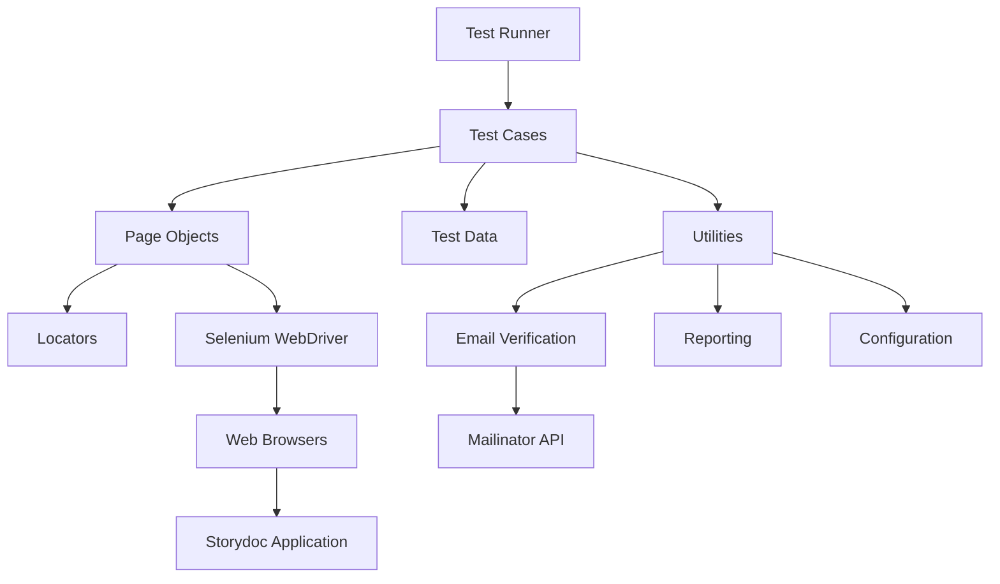
```mermaid
graph TD
    A[Test Runner] --> B[Test Cases]
    B --> C[Page Objects]
    C --> D[Locators]
    C --> E[Selenium WebDriver]
    E --> F[Web Browsers]
    F --> G[Storydoc Application]
    B --> H[Test Data]
    B --> I[Utilities]
    I --> J[Email Verification]
    J --> K[Mailinator API]
    I --> L[Reporting]
    I --> M[Configuration]
```

### 3.7 DATA FLOW

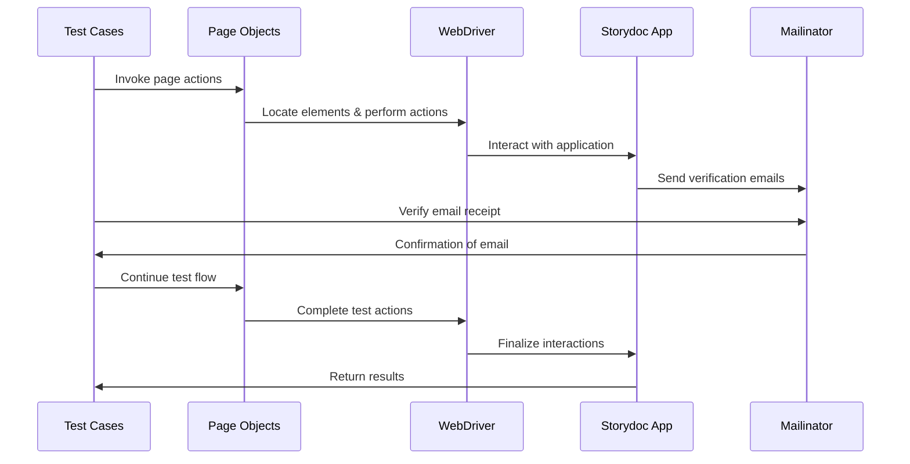
```mermaid
sequenceDiagram
    participant TC as Test Cases
    participant PO as Page Objects
    participant WD as WebDriver
    participant App as Storydoc App
    participant Mail as Mailinator
    
    TC->>PO: Invoke page actions
    PO->>WD: Locate elements & perform actions
    WD->>App: Interact with application
    App->>Mail: Send verification emails
    TC->>Mail: Verify email receipt
    Mail->>TC: Confirmation of email
    TC->>PO: Continue test flow
    PO->>WD: Complete test actions
    WD->>App: Finalize interactions
    App->>TC: Return results
```

## 4. PROCESS FLOWCHART

### 4.1 SYSTEM WORKFLOWS

#### 4.1.1 Core Business Processes

##### End-to-End User Journey

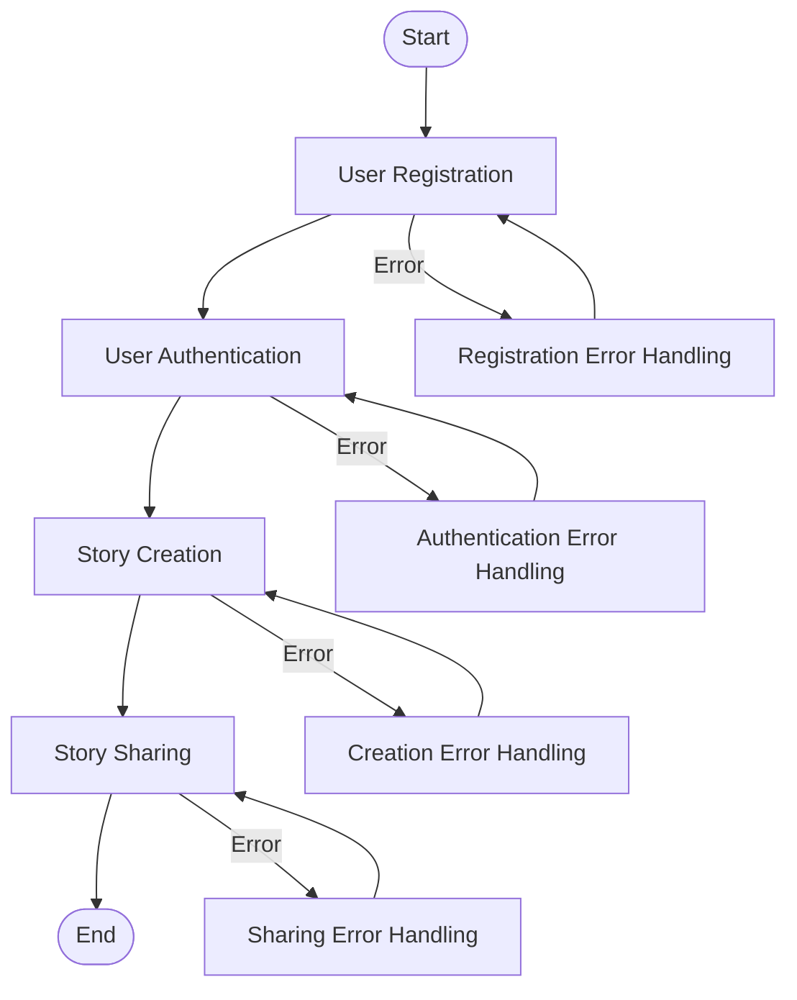
```mermaid
flowchart TD
    Start([Start]) --> UserRegistration[User Registration]
    UserRegistration --> UserAuthentication[User Authentication]
    UserAuthentication --> StoryCreation[Story Creation]
    StoryCreation --> StorySharing[Story Sharing]
    StorySharing --> End([End])
    
    %% Error paths
    UserRegistration -- Error --> RegistrationError[Registration Error Handling]
    RegistrationError --> UserRegistration
    
    UserAuthentication -- Error --> AuthenticationError[Authentication Error Handling]
    AuthenticationError --> UserAuthentication
    
    StoryCreation -- Error --> CreationError[Creation Error Handling]
    CreationError --> StoryCreation
    
    StorySharing -- Error --> SharingError[Sharing Error Handling]
    SharingError --> StorySharing
```

##### System Interactions and Decision Points

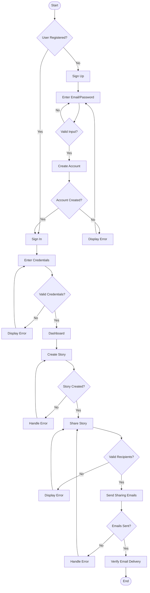
```mermaid
flowchart TD
    Start([Start]) --> A{User Registered?}
    A -- Yes --> B[Sign In]
    A -- No --> C[Sign Up]
    
    C --> D[Enter Email/Password]
    D --> E{Valid Input?}
    E -- No --> D
    E -- Yes --> F[Create Account]
    F --> G{Account Created?}
    G -- No --> H[Display Error]
    H --> D
    G -- Yes --> B
    
    B --> I[Enter Credentials]
    I --> J{Valid Credentials?}
    J -- No --> K[Display Error]
    K --> I
    J -- Yes --> L[Dashboard]
    
    L --> M[Create Story]
    M --> N{Story Created?}
    N -- No --> O[Handle Error]
    O --> M
    N -- Yes --> P[Share Story]
    
    P --> Q{Valid Recipients?}
    Q -- No --> R[Display Error]
    R --> P
    Q -- Yes --> S[Send Sharing Emails]
    S --> T{Emails Sent?}
    T -- No --> U[Handle Error]
    U --> P
    T -- Yes --> V[Verify Email Delivery]
    V --> End([End])
```

##### Error Handling Paths

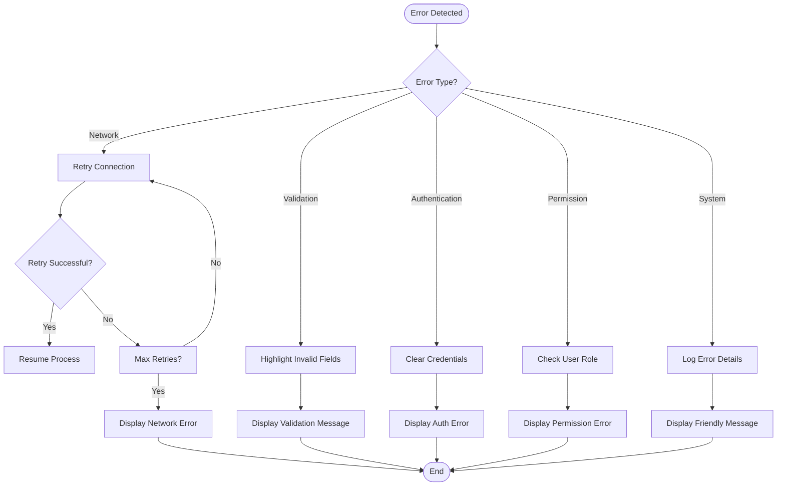
```mermaid
flowchart TD
    Start([Error Detected]) --> A{Error Type?}
    
    A -- Network --> B[Retry Connection]
    B --> C{Retry Successful?}
    C -- Yes --> D[Resume Process]
    C -- No --> E[Max Retries?]
    E -- No --> B
    E -- Yes --> F[Display Network Error]
    
    A -- Validation --> G[Highlight Invalid Fields]
    G --> H[Display Validation Message]
    
    A -- Authentication --> I[Clear Credentials]
    I --> J[Display Auth Error]
    
    A -- Permission --> K[Check User Role]
    K --> L[Display Permission Error]
    
    A -- System --> M[Log Error Details]
    M --> N[Display Friendly Message]
    
    F --> End([End])
    H --> End
    J --> End
    L --> End
    N --> End
```

#### 4.1.2 Integration Workflows

##### Data Flow Between Systems

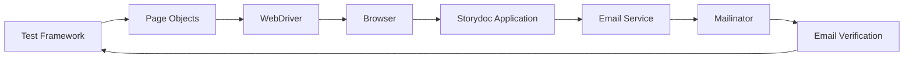
```mermaid
flowchart LR
    A[Test Framework] --> B[Page Objects]
    B --> C[WebDriver]
    C --> D[Browser]
    D --> E[Storydoc Application]
    E --> F[Email Service]
    F --> G[Mailinator]
    G --> H[Email Verification]
    H --> A
```

##### API Interactions

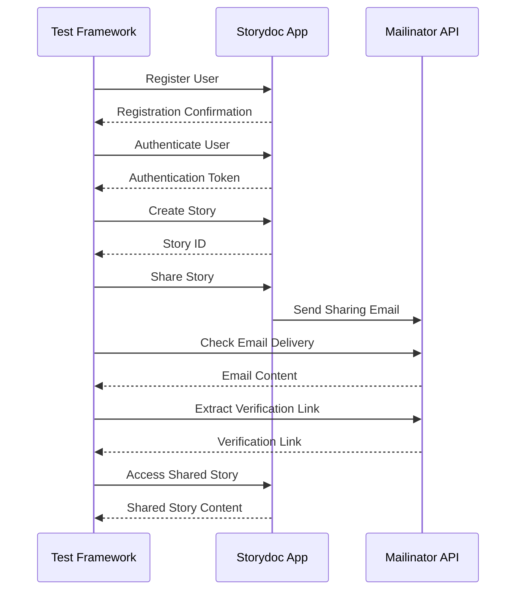
```mermaid
sequenceDiagram
    participant TF as Test Framework
    participant SD as Storydoc App
    participant MA as Mailinator API
    
    TF->>SD: Register User
    SD-->>TF: Registration Confirmation
    
    TF->>SD: Authenticate User
    SD-->>TF: Authentication Token
    
    TF->>SD: Create Story
    SD-->>TF: Story ID
    
    TF->>SD: Share Story
    SD->>MA: Send Sharing Email
    
    TF->>MA: Check Email Delivery
    MA-->>TF: Email Content
    
    TF->>MA: Extract Verification Link
    MA-->>TF: Verification Link
    
    TF->>SD: Access Shared Story
    SD-->>TF: Shared Story Content
```

### 4.2 FLOWCHART REQUIREMENTS

#### 4.2.1 User Registration Workflow

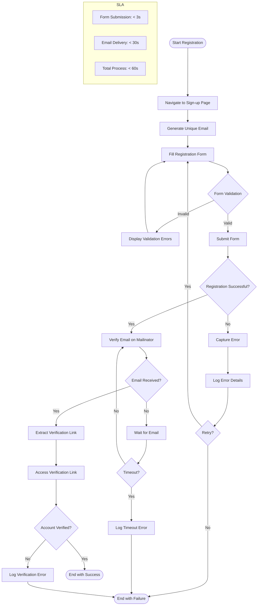
```mermaid
flowchart TD
    Start([Start Registration]) --> A[Navigate to Sign-up Page]
    A --> B[Generate Unique Email]
    B --> C[Fill Registration Form]
    C --> D{Form Validation}
    D -- Invalid --> E[Display Validation Errors]
    E --> C
    D -- Valid --> F[Submit Form]
    F --> G{Registration Successful?}
    G -- No --> H[Capture Error]
    H --> I[Log Error Details]
    I --> J{Retry?}
    J -- Yes --> C
    J -- No --> End1([End with Failure])
    G -- Yes --> K[Verify Email on Mailinator]
    K --> L{Email Received?}
    L -- No --> M[Wait for Email]
    M --> N{Timeout?}
    N -- Yes --> O[Log Timeout Error]
    O --> End1
    N -- No --> K
    L -- Yes --> P[Extract Verification Link]
    P --> Q[Access Verification Link]
    Q --> R{Account Verified?}
    R -- No --> S[Log Verification Error]
    S --> End1
    R -- Yes --> End2([End with Success])
    
    subgraph SLA
        direction LR
        SLA1[Form Submission: < 3s]
        SLA2[Email Delivery: < 30s]
        SLA3[Total Process: < 60s]
    end
```

#### 4.2.2 User Authentication Workflow

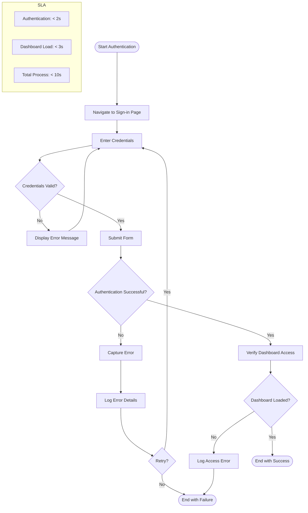
```mermaid
flowchart TD
    Start([Start Authentication]) --> A[Navigate to Sign-in Page]
    A --> B[Enter Credentials]
    B --> C{Credentials Valid?}
    C -- No --> D[Display Error Message]
    D --> B
    C -- Yes --> E[Submit Form]
    E --> F{Authentication Successful?}
    F -- No --> G[Capture Error]
    G --> H[Log Error Details]
    H --> I{Retry?}
    I -- Yes --> B
    I -- No --> End1([End with Failure])
    F -- Yes --> J[Verify Dashboard Access]
    J --> K{Dashboard Loaded?}
    K -- No --> L[Log Access Error]
    L --> End1
    K -- Yes --> End2([End with Success])
    
    subgraph SLA
        direction LR
        SLA1[Authentication: < 2s]
        SLA2[Dashboard Load: < 3s]
        SLA3[Total Process: < 10s]
    end
```

#### 4.2.3 Story Creation Workflow

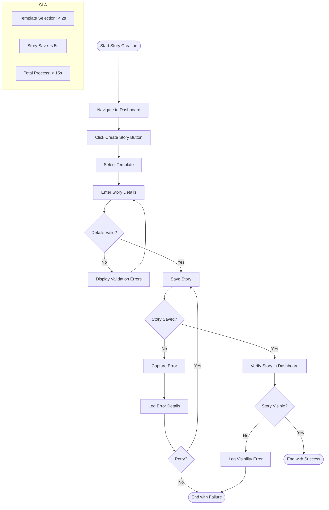
```mermaid
flowchart TD
    Start([Start Story Creation]) --> A[Navigate to Dashboard]
    A --> B[Click Create Story Button]
    B --> C[Select Template]
    C --> D[Enter Story Details]
    D --> E{Details Valid?}
    E -- No --> F[Display Validation Errors]
    F --> D
    E -- Yes --> G[Save Story]
    G --> H{Story Saved?}
    H -- No --> I[Capture Error]
    I --> J[Log Error Details]
    J --> K{Retry?}
    K -- Yes --> G
    K -- No --> End1([End with Failure])
    H -- Yes --> L[Verify Story in Dashboard]
    L --> M{Story Visible?}
    M -- No --> N[Log Visibility Error]
    N --> End1
    M -- Yes --> End2([End with Success])
    
    subgraph SLA
        direction LR
        SLA1[Template Selection: < 2s]
        SLA2[Story Save: < 5s]
        SLA3[Total Process: < 15s]
    end
```

#### 4.2.4 Story Sharing Workflow

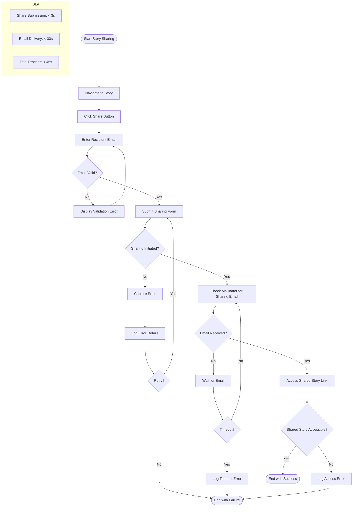
```mermaid
flowchart TD
    Start([Start Story Sharing]) --> A[Navigate to Story]
    A --> B[Click Share Button]
    B --> C[Enter Recipient Email]
    C --> D{Email Valid?}
    D -- No --> E[Display Validation Error]
    E --> C
    D -- Yes --> F[Submit Sharing Form]
    F --> G{Sharing Initiated?}
    G -- No --> H[Capture Error]
    H --> I[Log Error Details]
    I --> J{Retry?}
    J -- Yes --> F
    J -- No --> End1([End with Failure])
    G -- Yes --> K[Check Mailinator for Sharing Email]
    K --> L{Email Received?}
    L -- No --> M[Wait for Email]
    M --> N{Timeout?}
    N -- Yes --> O[Log Timeout Error]
    O --> End1
    N -- No --> K
    L -- Yes --> P[Access Shared Story Link]
    P --> Q{Shared Story Accessible?}
    Q -- No --> R[Log Access Error]
    R --> End1
    Q -- Yes --> End2([End with Success])
    
    subgraph SLA
        direction LR
        SLA1[Share Submission: < 3s]
        SLA2[Email Delivery: < 30s]
        SLA3[Total Process: < 45s]
    end
```

### 4.3 TECHNICAL IMPLEMENTATION

#### 4.3.1 State Management

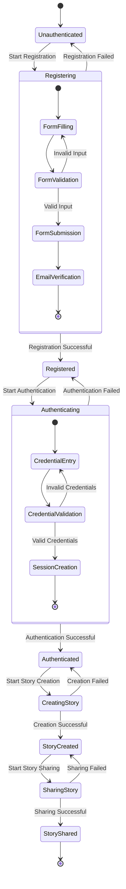
```mermaid
stateDiagram-v2
    [*] --> Unauthenticated
    
    Unauthenticated --> Registering: Start Registration
    Registering --> Unauthenticated: Registration Failed
    Registering --> Registered: Registration Successful
    
    Registered --> Authenticating: Start Authentication
    Authenticating --> Registered: Authentication Failed
    Authenticating --> Authenticated: Authentication Successful
    
    Authenticated --> CreatingStory: Start Story Creation
    CreatingStory --> Authenticated: Creation Failed
    CreatingStory --> StoryCreated: Creation Successful
    
    StoryCreated --> SharingStory: Start Story Sharing
    SharingStory --> StoryCreated: Sharing Failed
    SharingStory --> StoryShared: Sharing Successful
    
    StoryShared --> [*]
    
    state Registering {
        [*] --> FormFilling
        FormFilling --> FormValidation
        FormValidation --> FormFilling: Invalid Input
        FormValidation --> FormSubmission: Valid Input
        FormSubmission --> EmailVerification
        EmailVerification --> [*]
    }
    
    state Authenticating {
        [*] --> CredentialEntry
        CredentialEntry --> CredentialValidation
        CredentialValidation --> CredentialEntry: Invalid Credentials
        CredentialValidation --> SessionCreation: Valid Credentials
        SessionCreation --> [*]
    }
```

#### 4.3.2 Error Handling

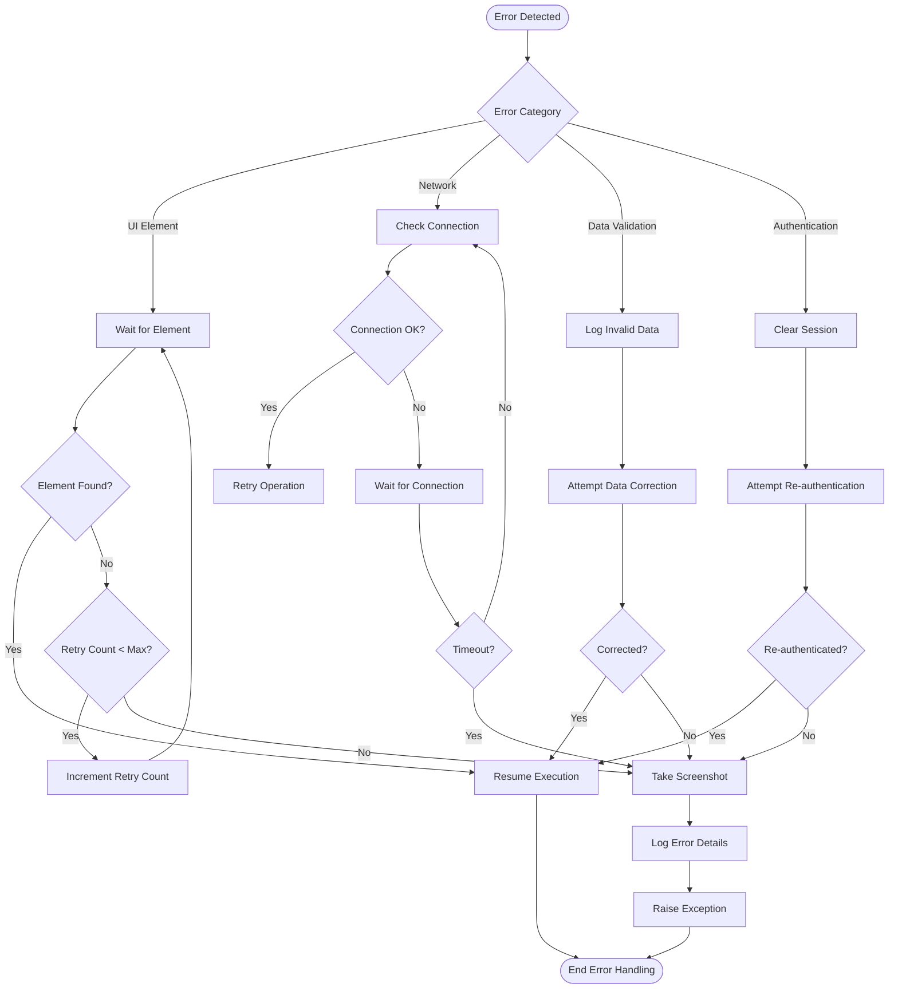
```mermaid
flowchart TD
    Start([Error Detected]) --> A{Error Category}
    
    A -- UI Element --> B[Wait for Element]
    B --> C{Element Found?}
    C -- Yes --> D[Resume Execution]
    C -- No --> E{Retry Count < Max?}
    E -- Yes --> F[Increment Retry Count]
    F --> B
    E -- No --> G[Take Screenshot]
    G --> H[Log Error Details]
    H --> I[Raise Exception]
    
    A -- Network --> J[Check Connection]
    J --> K{Connection OK?}
    K -- Yes --> L[Retry Operation]
    K -- No --> M[Wait for Connection]
    M --> N{Timeout?}
    N -- No --> J
    N -- Yes --> G
    
    A -- Data Validation --> O[Log Invalid Data]
    O --> P[Attempt Data Correction]
    P --> Q{Corrected?}
    Q -- Yes --> D
    Q -- No --> G
    
    A -- Authentication --> R[Clear Session]
    R --> S[Attempt Re-authentication]
    S --> T{Re-authenticated?}
    T -- Yes --> D
    T -- No --> G
    
    I --> End([End Error Handling])
    D --> End
```

### 4.4 REQUIRED DIAGRAMS

#### 4.4.1 High-Level System Workflow

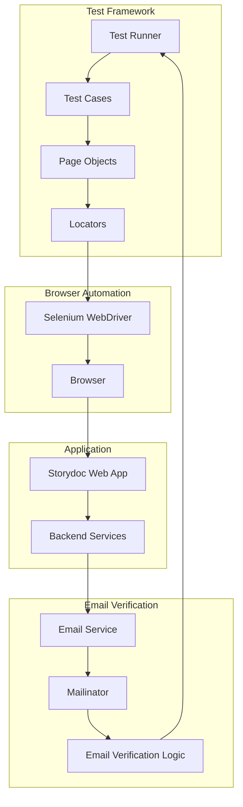
```mermaid
flowchart TD
    subgraph Test Framework
        A[Test Runner] --> B[Test Cases]
        B --> C[Page Objects]
        C --> D[Locators]
    end
    
    subgraph Browser Automation
        D --> E[Selenium WebDriver]
        E --> F[Browser]
    end
    
    subgraph Application
        F --> G[Storydoc Web App]
        G --> H[Backend Services]
    end
    
    subgraph Email Verification
        H --> I[Email Service]
        I --> J[Mailinator]
        J --> K[Email Verification Logic]
        K --> A
    end
```

#### 4.4.2 Integration Sequence Diagram

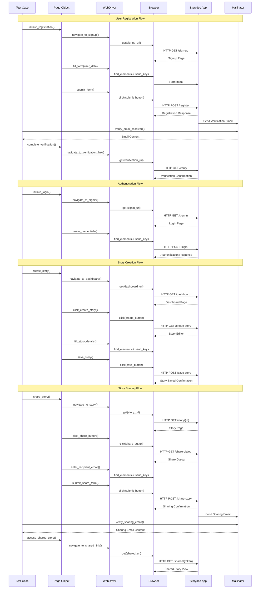
```mermaid
sequenceDiagram
    participant TC as Test Case
    participant PO as Page Object
    participant WD as WebDriver
    participant BR as Browser
    participant SD as Storydoc App
    participant MA as Mailinator
    
    Note over TC,MA: User Registration Flow
    TC->>PO: initiate_registration()
    PO->>WD: navigate_to_signup()
    WD->>BR: get(signup_url)
    BR->>SD: HTTP GET /sign-up
    SD-->>BR: Signup Page
    PO->>WD: fill_form(user_data)
    WD->>BR: find_elements & send_keys
    BR->>SD: Form Input
    PO->>WD: submit_form()
    WD->>BR: click(submit_button)
    BR->>SD: HTTP POST /register
    SD-->>BR: Registration Response
    SD->>MA: Send Verification Email
    TC->>MA: verify_email_received()
    MA-->>TC: Email Content
    TC->>PO: complete_verification()
    PO->>WD: navigate_to_verification_link()
    WD->>BR: get(verification_url)
    BR->>SD: HTTP GET /verify
    SD-->>BR: Verification Confirmation
    
    Note over TC,MA: Authentication Flow
    TC->>PO: initiate_login()
    PO->>WD: navigate_to_signin()
    WD->>BR: get(signin_url)
    BR->>SD: HTTP GET /sign-in
    SD-->>BR: Login Page
    PO->>WD: enter_credentials()
    WD->>BR: find_elements & send_keys
    BR->>SD: HTTP POST /login
    SD-->>BR: Authentication Response
    
    Note over TC,MA: Story Creation Flow
    TC->>PO: create_story()
    PO->>WD: navigate_to_dashboard()
    WD->>BR: get(dashboard_url)
    BR->>SD: HTTP GET /dashboard
    SD-->>BR: Dashboard Page
    PO->>WD: click_create_story()
    WD->>BR: click(create_button)
    BR->>SD: HTTP GET /create-story
    SD-->>BR: Story Editor
    PO->>WD: fill_story_details()
    WD->>BR: find_elements & send_keys
    PO->>WD: save_story()
    WD->>BR: click(save_button)
    BR->>SD: HTTP POST /save-story
    SD-->>BR: Story Saved Confirmation
    
    Note over TC,MA: Story Sharing Flow
    TC->>PO: share_story()
    PO->>WD: navigate_to_story()
    WD->>BR: get(story_url)
    BR->>SD: HTTP GET /story/{id}
    SD-->>BR: Story Page
    PO->>WD: click_share_button()
    WD->>BR: click(share_button)
    BR->>SD: HTTP GET /share-dialog
    SD-->>BR: Share Dialog
    PO->>WD: enter_recipient_email()
    WD->>BR: find_elements & send_keys
    PO->>WD: submit_share_form()
    WD->>BR: click(submit_button)
    BR->>SD: HTTP POST /share-story
    SD-->>BR: Sharing Confirmation
    SD->>MA: Send Sharing Email
    TC->>MA: verify_sharing_email()
    MA-->>TC: Sharing Email Content
    TC->>PO: access_shared_story()
    PO->>WD: navigate_to_shared_link()
    WD->>BR: get(shared_url)
    BR->>SD: HTTP GET /shared/{token}
    SD-->>BR: Shared Story View
```

#### 4.4.3 State Transition Diagram

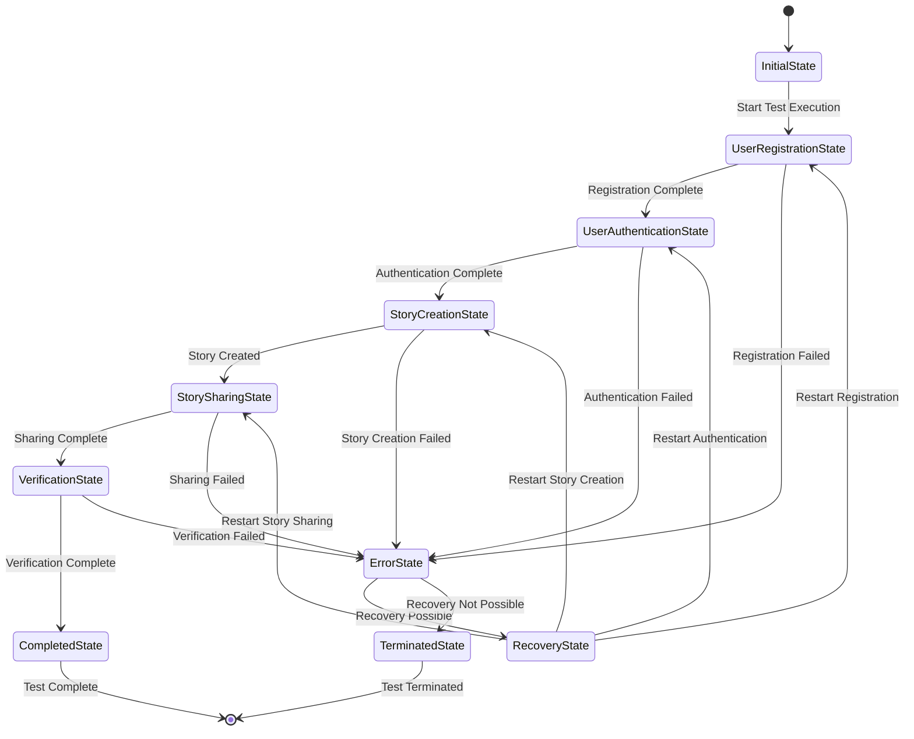
```mermaid
stateDiagram-v2
    [*] --> InitialState
    
    InitialState --> UserRegistrationState: Start Test Execution
    
    UserRegistrationState --> UserAuthenticationState: Registration Complete
    UserRegistrationState --> ErrorState: Registration Failed
    
    UserAuthenticationState --> StoryCreationState: Authentication Complete
    UserAuthenticationState --> ErrorState: Authentication Failed
    
    StoryCreationState --> StorySharingState: Story Created
    StoryCreationState --> ErrorState: Story Creation Failed
    
    StorySharingState --> VerificationState: Sharing Complete
    StorySharingState --> ErrorState: Sharing Failed
    
    VerificationState --> CompletedState: Verification Complete
    VerificationState --> ErrorState: Verification Failed
    
    ErrorState --> RecoveryState: Recovery Possible
    ErrorState --> TerminatedState: Recovery Not Possible
    
    RecoveryState --> UserRegistrationState: Restart Registration
    RecoveryState --> UserAuthenticationState: Restart Authentication
    RecoveryState --> StoryCreationState: Restart Story Creation
    RecoveryState --> StorySharingState: Restart Story Sharing
    
    CompletedState --> [*]: Test Complete
    TerminatedState --> [*]: Test Terminated
```

## 5. SYSTEM ARCHITECTURE

### 5.1 HIGH-LEVEL ARCHITECTURE

#### 5.1.1 System Overview

The automation framework follows a layered architecture based on the Page Object Model (POM) design pattern, which separates test logic from UI implementation details. This architecture provides several key benefits:

- **Separation of Concerns**: Test logic is decoupled from UI implementation details, improving maintainability
- **Reusability**: Page objects encapsulate UI interactions, enabling reuse across multiple test cases
- **Readability**: Tests express business workflows rather than low-level UI interactions
- **Maintainability**: UI changes require updates only to the relevant page objects, not to test cases

The system boundaries include the test framework (pytest), browser automation layer (Selenium WebDriver), and integration points with external systems (Mailinator for email verification). The architecture follows a layered approach with clear interfaces between components.

#### 5.1.2 Core Components Table

| Component Name | Primary Responsibility | Key Dependencies | Critical Considerations |
|----------------|------------------------|------------------|-------------------------|
| Test Cases | Define test scenarios and assertions | Page Objects, pytest | Must focus on business workflows rather than implementation details |
| Page Objects | Encapsulate UI interactions for specific pages | Locators, WebDriver | Must maintain clean separation from test logic and handle synchronization issues |
| Locators | Define element identification strategies | None | Must be maintainable and resilient to UI changes |
| WebDriver Manager | Manage browser driver lifecycle | Selenium WebDriver | Must handle cross-browser compatibility and driver versioning |
| Configuration Manager | Manage test environment settings | python-dotenv | Must support multiple environments without code changes |
| Test Data Manager | Provide test data to test cases | JSON files | Must support data-driven testing and test isolation |
| Email Verification Service | Verify emails in Mailinator | Requests library | Must handle asynchronous email delivery and retrieval |
| Reporting Service | Generate test execution reports | pytest-html | Must provide clear visibility into test results and failures |

#### 5.1.3 Data Flow Description

The primary data flow begins with test cases invoking methods on page objects, which in turn use locators to find elements and interact with them via WebDriver. The WebDriver communicates with the browser, which interacts with the Storydoc application. For email verification flows, the application sends emails to Mailinator, which the Email Verification Service queries to verify receipt and extract content.

Configuration data flows from environment variables and configuration files to the Configuration Manager, which provides settings to other components. Test data flows from JSON files to test cases via the Test Data Manager. Test execution results flow from test cases to the Reporting Service, which generates HTML reports.

Key data transformation points include:
- Converting test data from JSON format to Python objects
- Transforming WebDriver responses into meaningful test assertions
- Parsing email content from Mailinator API responses

#### 5.1.4 External Integration Points

| System Name | Integration Type | Data Exchange Pattern | Protocol/Format | SLA Requirements |
|-------------|------------------|------------------------|-----------------|------------------|
| Storydoc Web Application | UI Automation | Request-Response | HTTP/HTML | Page load < 5s, Element interactions < 2s |
| Mailinator | API | Request-Response | HTTP/JSON | API response < 3s, Email delivery < 30s |

### 5.2 COMPONENT DETAILS

#### 5.2.1 Test Cases Component

- **Purpose**: Define test scenarios that validate business workflows
- **Technologies**: pytest, Python
- **Key Interfaces**: 
  - Page Objects (for UI interactions)
  - Test Data Manager (for test data)
  - Assertions (for validations)
- **Data Persistence**: Test results stored as HTML reports
- **Scaling Considerations**: Support parallel execution via pytest-xdist

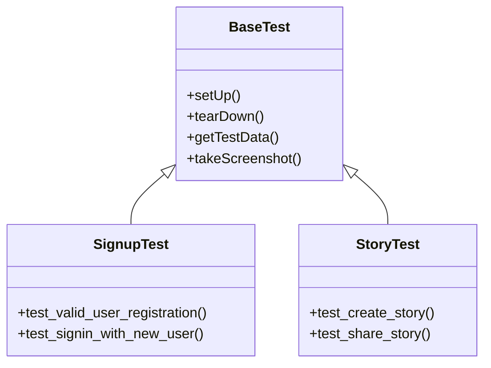
```mermaid
classDiagram
    class BaseTest {
        +setUp()
        +tearDown()
        +getTestData()
        +takeScreenshot()
    }
    class SignupTest {
        +test_valid_user_registration()
        +test_signin_with_new_user()
    }
    class StoryTest {
        +test_create_story()
        +test_share_story()
    }
    BaseTest <|-- SignupTest
    BaseTest <|-- StoryTest
```

#### 5.2.2 Page Objects Component

- **Purpose**: Encapsulate UI interactions for specific pages
- **Technologies**: Python, Selenium WebDriver
- **Key Interfaces**:
  - Locators (for element identification)
  - WebDriver (for browser interactions)
- **Data Persistence**: None (stateless)
- **Scaling Considerations**: Thread-safe implementation for parallel execution

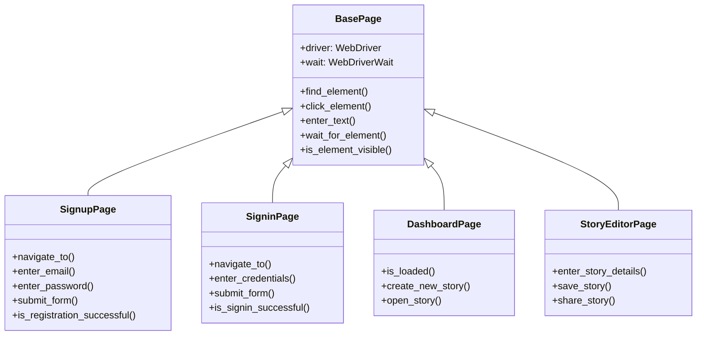
```mermaid
classDiagram
    class BasePage {
        +driver: WebDriver
        +wait: WebDriverWait
        +find_element()
        +click_element()
        +enter_text()
        +wait_for_element()
        +is_element_visible()
    }
    class SignupPage {
        +navigate_to()
        +enter_email()
        +enter_password()
        +submit_form()
        +is_registration_successful()
    }
    class SigninPage {
        +navigate_to()
        +enter_credentials()
        +submit_form()
        +is_signin_successful()
    }
    class DashboardPage {
        +is_loaded()
        +create_new_story()
        +open_story()
    }
    class StoryEditorPage {
        +enter_story_details()
        +save_story()
        +share_story()
    }
    BasePage <|-- SignupPage
    BasePage <|-- SigninPage
    BasePage <|-- DashboardPage
    BasePage <|-- StoryEditorPage
```

#### 5.2.3 Locators Component

- **Purpose**: Define element identification strategies
- **Technologies**: Python, Selenium selectors
- **Key Interfaces**: Page Objects (consumers of locators)
- **Data Persistence**: None (static definitions)
- **Scaling Considerations**: Maintainability and resilience to UI changes

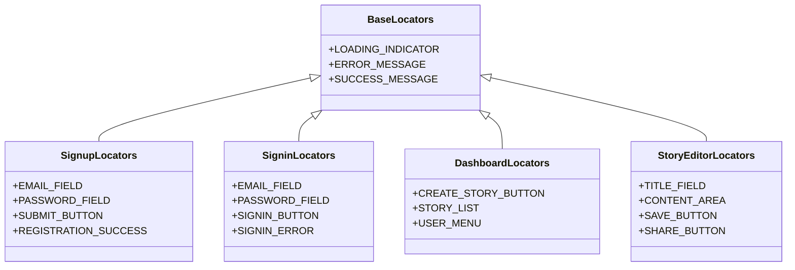
```mermaid
classDiagram
    class BaseLocators {
        +LOADING_INDICATOR
        +ERROR_MESSAGE
        +SUCCESS_MESSAGE
    }
    class SignupLocators {
        +EMAIL_FIELD
        +PASSWORD_FIELD
        +SUBMIT_BUTTON
        +REGISTRATION_SUCCESS
    }
    class SigninLocators {
        +EMAIL_FIELD
        +PASSWORD_FIELD
        +SIGNIN_BUTTON
        +SIGNIN_ERROR
    }
    class DashboardLocators {
        +CREATE_STORY_BUTTON
        +STORY_LIST
        +USER_MENU
    }
    class StoryEditorLocators {
        +TITLE_FIELD
        +CONTENT_AREA
        +SAVE_BUTTON
        +SHARE_BUTTON
    }
    BaseLocators <|-- SignupLocators
    BaseLocators <|-- SigninLocators
    BaseLocators <|-- DashboardLocators
    BaseLocators <|-- StoryEditorLocators
```

#### 5.2.4 Email Verification Service

- **Purpose**: Verify emails in Mailinator and extract content
- **Technologies**: Python, Requests library
- **Key Interfaces**: 
  - Mailinator API (for email retrieval)
  - Test Cases (for verification results)
- **Data Persistence**: None (stateless)
- **Scaling Considerations**: Handle rate limiting and API throttling

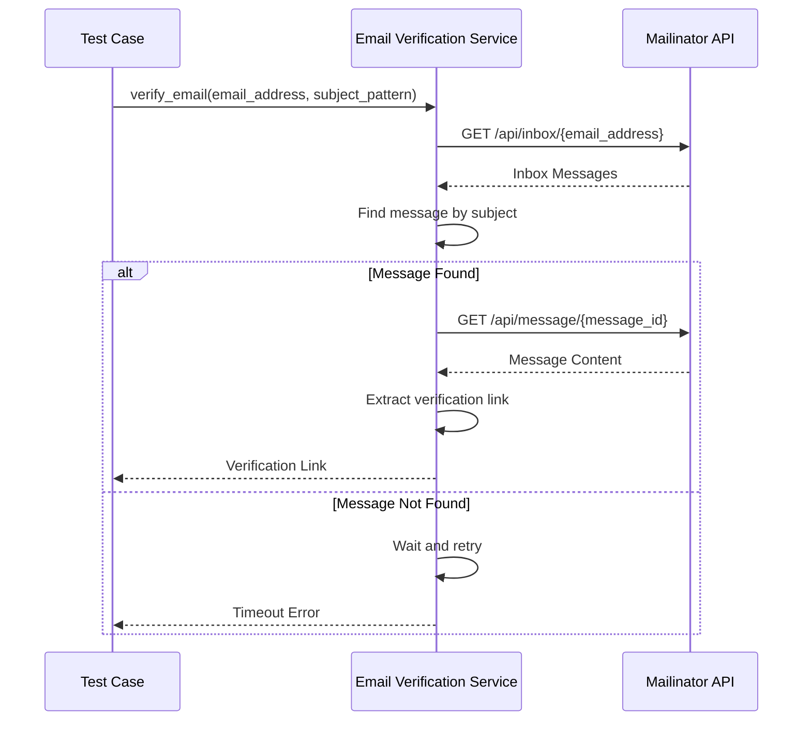
```mermaid
sequenceDiagram
    participant TC as Test Case
    participant EVS as Email Verification Service
    participant MA as Mailinator API
    
    TC->>EVS: verify_email(email_address, subject_pattern)
    EVS->>MA: GET /api/inbox/{email_address}
    MA-->>EVS: Inbox Messages
    EVS->>EVS: Find message by subject
    alt Message Found
        EVS->>MA: GET /api/message/{message_id}
        MA-->>EVS: Message Content
        EVS->>EVS: Extract verification link
        EVS-->>TC: Verification Link
    else Message Not Found
        EVS->>EVS: Wait and retry
        EVS-->>TC: Timeout Error
    end
```

### 5.3 TECHNICAL DECISIONS

#### 5.3.1 Architecture Style Decisions

| Decision | Options Considered | Selected Approach | Rationale |
|----------|-------------------|-------------------|-----------|
| Test Architecture | Linear Scripts, Data-Driven, Keyword-Driven, POM | Page Object Model | POM provides the best balance of maintainability, reusability, and readability for UI automation |
| Browser Automation | Selenium, Cypress, Playwright | Selenium WebDriver | Selenium offers mature Python support, cross-browser compatibility, and extensive community resources |
| Test Framework | unittest, pytest, robot | pytest | pytest provides better fixtures, parameterization, and plugin ecosystem than alternatives |
| Email Verification | UI Automation, API Integration | API Integration | API approach is more reliable and faster than UI automation for email verification |

```mermaid
graph TD
    A[Architecture Decision] --> B{Test Architecture}
    B -->|Option 1| C[Linear Scripts]
    B -->|Option 2| D[Data-Driven]
    B -->|Option 3| E[Keyword-Driven]
    B -->|Option 4| F[Page Object Model]
    F -->|Selected| G[Benefits]
    G --> H[Maintainability]
    G --> I[Reusability]
    G --> J[Readability]
    
    A --> K{Browser Automation}
    K -->|Option 1| L[Selenium]
    K -->|Option 2| M[Cypress]
    K -->|Option 3| N[Playwright]
    L -->|Selected| O[Benefits]
    O --> P[Python Support]
    O --> Q[Cross-browser]
    O --> R[Community]
```

#### 5.3.2 Communication Pattern Choices

The framework uses a combination of synchronous method calls between components and asynchronous waiting patterns for UI interactions. For email verification, a polling approach is used to handle the asynchronous nature of email delivery.

Key communication patterns include:
- **Command Pattern**: Test cases issue commands to page objects
- **Facade Pattern**: Page objects provide a simplified interface to WebDriver
- **Observer Pattern**: Wait conditions observe element state changes
- **Polling Pattern**: Email verification service polls Mailinator for new messages

#### 5.3.3 Data Storage Solution Rationale

Test data is stored in JSON files rather than databases for simplicity, portability, and version control integration. This approach allows test data to be easily modified, versioned, and reviewed alongside code changes. For test results, the framework uses pytest-html to generate HTML reports that provide comprehensive information about test execution.

### 5.4 CROSS-CUTTING CONCERNS

#### 5.4.1 Monitoring and Observability Approach

The framework implements comprehensive logging at multiple levels:
- **Test Level**: Test start/end, assertions, and major steps
- **Page Object Level**: Page navigation, element interactions
- **WebDriver Level**: Driver initialization, browser actions
- **API Level**: API requests and responses

Screenshots are captured automatically on test failures to aid in debugging. Test execution metrics (duration, pass/fail counts) are included in HTML reports.

#### 5.4.2 Error Handling Patterns

The framework implements a robust error handling strategy with multiple layers:

- **Explicit Waits**: Handle timing issues and synchronization
- **Retry Logic**: Automatically retry flaky operations
- **Exception Handling**: Catch and handle expected exceptions
- **Graceful Degradation**: Continue testing when possible after non-critical failures
- **Detailed Logging**: Capture context for debugging

```mermaid
flowchart TD
    A[Operation] --> B{Success?}
    B -->|Yes| C[Continue]
    B -->|No| D{Retry Possible?}
    D -->|Yes| E[Increment Retry Count]
    E --> F{Max Retries?}
    F -->|No| A
    F -->|Yes| G[Log Failure]
    D -->|No| G
    G --> H[Capture Screenshot]
    H --> I{Critical Failure?}
    I -->|Yes| J[Abort Test]
    I -->|No| K[Continue with Next Step]
```

#### 5.4.3 Performance Requirements and SLAs

| Operation | Target Response Time | Timeout | Retry Strategy |
|-----------|----------------------|---------|----------------|
| Page Navigation | < 5 seconds | 10 seconds | Retry once |
| Element Interaction | < 2 seconds | 5 seconds | Retry twice |
| Form Submission | < 3 seconds | 10 seconds | Retry once |
| Email Delivery | < 30 seconds | 60 seconds | Poll every 5 seconds |
| Test Execution | < 5 minutes | 10 minutes | No retry |

The framework implements these SLAs through explicit waits, timeouts, and retry logic. Performance metrics are captured in test reports to identify slow operations and potential bottlenecks.

## 6. SYSTEM COMPONENTS DESIGN

### 6.1 COMPONENT ARCHITECTURE

#### 6.1.1 Page Object Model Structure

```mermaid
classDiagram
    class BasePage {
        +driver: WebDriver
        +wait: WebDriverWait
        +url: str
        +__init__(driver)
        +open()
        +find_element(locator)
        +find_elements(locator)
        +click(locator)
        +input_text(locator, text)
        +get_text(locator)
        +is_element_visible(locator)
        +wait_for_element(locator)
        +wait_for_element_to_disappear(locator)
        +take_screenshot(filename)
    }
    
    class SignupPage {
        +url: str
        +navigate_to()
        +enter_email(email)
        +enter_password(password)
        +enter_name(name)
        +accept_terms()
        +click_signup_button()
        +is_signup_successful()
        +complete_signup(email, password, name)
    }
    
    class SigninPage {
        +url: str
        +navigate_to()
        +enter_email(email)
        +enter_password(password)
        +click_signin_button()
        +is_signin_successful()
        +complete_signin(email, password)
    }
    
    class DashboardPage {
        +url: str
        +is_loaded()
        +click_create_story_button()
        +get_story_list()
        +open_story(story_name)
    }
    
    class StoryEditorPage {
        +is_loaded()
        +enter_story_title(title)
        +select_template(template_name)
        +save_story()
        +click_share_button()
        +is_story_saved()
    }
    
    class ShareDialogPage {
        +enter_recipient_email(email)
        +click_share_button()
        +is_sharing_successful()
        +complete_sharing(email)
    }
    
    class MailinatorService {
        +base_url: str
        +api_key: str
        +get_inbox(email_address)
        +get_message(message_id)
        +wait_for_email(email_address, subject, timeout)
        +extract_verification_link(message)
        +verify_email_received(email_address, subject)
    }
    
    BasePage <|-- SignupPage
    BasePage <|-- SigninPage
    BasePage <|-- DashboardPage
    BasePage <|-- StoryEditorPage
    BasePage <|-- ShareDialogPage
```

#### 6.1.2 Locators Structure

```mermaid
classDiagram
    class BaseLocators {
        +LOADING_INDICATOR: tuple
        +ERROR_MESSAGE: tuple
        +SUCCESS_MESSAGE: tuple
    }
    
    class SignupLocators {
        +EMAIL_FIELD: tuple
        +PASSWORD_FIELD: tuple
        +NAME_FIELD: tuple
        +TERMS_CHECKBOX: tuple
        +SIGNUP_BUTTON: tuple
        +SIGNUP_SUCCESS: tuple
    }
    
    class SigninLocators {
        +EMAIL_FIELD: tuple
        +PASSWORD_FIELD: tuple
        +SIGNIN_BUTTON: tuple
        +SIGNIN_ERROR: tuple
    }
    
    class DashboardLocators {
        +CREATE_STORY_BUTTON: tuple
        +STORY_LIST: tuple
        +STORY_ITEM: tuple
        +USER_MENU: tuple
    }
    
    class StoryEditorLocators {
        +TITLE_FIELD: tuple
        +TEMPLATE_OPTION: tuple
        +SAVE_BUTTON: tuple
        +SHARE_BUTTON: tuple
        +SAVE_SUCCESS: tuple
    }
    
    class ShareDialogLocators {
        +RECIPIENT_EMAIL: tuple
        +SHARE_BUTTON: tuple
        +SHARING_SUCCESS: tuple
    }
    
    BaseLocators <|-- SignupLocators
    BaseLocators <|-- SigninLocators
    BaseLocators <|-- DashboardLocators
    BaseLocators <|-- StoryEditorLocators
    BaseLocators <|-- ShareDialogLocators
```

#### 6.1.3 Test Structure

```mermaid
classDiagram
    class BaseTest {
        +driver: WebDriver
        +setup()
        +teardown()
        +generate_random_email()
        +generate_test_data()
    }
    
    class TestUserWorkflow {
        +test_user_registration()
        +test_user_authentication()
        +test_story_creation()
        +test_story_sharing()
        +test_end_to_end_workflow()
    }
    
    BaseTest <|-- TestUserWorkflow
```

### 6.2 DETAILED COMPONENT SPECIFICATIONS

#### 6.2.1 Base Page Component

**Purpose**: Provides common functionality for all page objects

**Key Responsibilities**:
- Initialize WebDriver and WebDriverWait
- Provide wrapper methods for Selenium operations
- Handle element finding and interaction
- Implement waiting strategies
- Capture screenshots

**Key Methods**:

| Method | Parameters | Return Type | Description |
|--------|------------|-------------|-------------|
| `__init__` | driver: WebDriver | None | Initializes the page object with WebDriver instance |
| `open` | None | None | Opens the page URL in the browser |
| `find_element` | locator: tuple | WebElement | Finds a single element using the provided locator |
| `find_elements` | locator: tuple | List[WebElement] | Finds multiple elements using the provided locator |
| `click` | locator: tuple | None | Clicks on the element identified by the locator |
| `input_text` | locator: tuple, text: str | None | Enters text into the element identified by the locator |
| `get_text` | locator: tuple | str | Gets text from the element identified by the locator |
| `is_element_visible` | locator: tuple | bool | Checks if the element is visible on the page |
| `wait_for_element` | locator: tuple, timeout: int = 10 | WebElement | Waits for the element to be visible and returns it |
| `wait_for_element_to_disappear` | locator: tuple, timeout: int = 10 | bool | Waits for the element to disappear from the page |
| `take_screenshot` | filename: str | str | Captures a screenshot and saves it with the given filename |

**Error Handling**:
- Implements explicit waits to handle timing issues
- Catches and logs WebDriver exceptions
- Takes screenshots on failures

#### 6.2.2 Signup Page Component

**Purpose**: Encapsulates interactions with the signup page

**Key Responsibilities**:
- Navigate to the signup page
- Enter registration details
- Submit the signup form
- Verify successful registration

**Key Methods**:

| Method | Parameters | Return Type | Description |
|--------|------------|-------------|-------------|
| `navigate_to` | None | None | Navigates to the signup page |
| `enter_email` | email: str | None | Enters the email address in the email field |
| `enter_password` | password: str | None | Enters the password in the password field |
| `enter_name` | name: str | None | Enters the name in the name field |
| `accept_terms` | None | None | Checks the terms and conditions checkbox |
| `click_signup_button` | None | None | Clicks the signup button |
| `is_signup_successful` | None | bool | Verifies if signup was successful |
| `complete_signup` | email: str, password: str, name: str | bool | Completes the entire signup process |

**Locators Used**:
- EMAIL_FIELD
- PASSWORD_FIELD
- NAME_FIELD
- TERMS_CHECKBOX
- SIGNUP_BUTTON
- SIGNUP_SUCCESS

**Error Handling**:
- Validates input parameters
- Handles form validation errors
- Retries on network issues

#### 6.2.3 Signin Page Component

**Purpose**: Encapsulates interactions with the signin page

**Key Responsibilities**:
- Navigate to the signin page
- Enter credentials
- Submit the signin form
- Verify successful authentication

**Key Methods**:

| Method | Parameters | Return Type | Description |
|--------|------------|-------------|-------------|
| `navigate_to` | None | None | Navigates to the signin page |
| `enter_email` | email: str | None | Enters the email address in the email field |
| `enter_password` | password: str | None | Enters the password in the password field |
| `click_signin_button` | None | None | Clicks the signin button |
| `is_signin_successful` | None | bool | Verifies if signin was successful |
| `complete_signin` | email: str, password: str | bool | Completes the entire signin process |

**Locators Used**:
- EMAIL_FIELD
- PASSWORD_FIELD
- SIGNIN_BUTTON
- SIGNIN_ERROR

**Error Handling**:
- Validates input parameters
- Handles authentication errors
- Retries on network issues

#### 6.2.4 Dashboard Page Component

**Purpose**: Encapsulates interactions with the user dashboard

**Key Responsibilities**:
- Verify dashboard is loaded
- Create new stories
- Access existing stories

**Key Methods**:

| Method | Parameters | Return Type | Description |
|--------|------------|-------------|-------------|
| `is_loaded` | None | bool | Verifies if the dashboard page is loaded |
| `click_create_story_button` | None | None | Clicks the create story button |
| `get_story_list` | None | List[str] | Gets the list of available stories |
| `open_story` | story_name: str | None | Opens a specific story by name |

**Locators Used**:
- CREATE_STORY_BUTTON
- STORY_LIST
- STORY_ITEM
- USER_MENU

**Error Handling**:
- Handles empty story list
- Retries on element not found
- Waits for dashboard to fully load

#### 6.2.5 Story Editor Page Component

**Purpose**: Encapsulates interactions with the story editor

**Key Responsibilities**:
- Enter story details
- Select templates
- Save stories
- Share stories

**Key Methods**:

| Method | Parameters | Return Type | Description |
|--------|------------|-------------|-------------|
| `is_loaded` | None | bool | Verifies if the story editor is loaded |
| `enter_story_title` | title: str | None | Enters the title for the story |
| `select_template` | template_name: str | None | Selects a template for the story |
| `save_story` | None | None | Saves the current story |
| `click_share_button` | None | None | Opens the share dialog |
| `is_story_saved` | None | bool | Verifies if the story was saved successfully |

**Locators Used**:
- TITLE_FIELD
- TEMPLATE_OPTION
- SAVE_BUTTON
- SHARE_BUTTON
- SAVE_SUCCESS

**Error Handling**:
- Handles unsaved changes
- Retries on save failures
- Waits for editor to fully load

#### 6.2.6 Share Dialog Component

**Purpose**: Encapsulates interactions with the story sharing dialog

**Key Responsibilities**:
- Enter recipient email
- Submit sharing request
- Verify successful sharing

**Key Methods**:

| Method | Parameters | Return Type | Description |
|--------|------------|-------------|-------------|
| `enter_recipient_email` | email: str | None | Enters the recipient's email address |
| `click_share_button` | None | None | Clicks the share button |
| `is_sharing_successful` | None | bool | Verifies if sharing was successful |
| `complete_sharing` | email: str | bool | Completes the entire sharing process |

**Locators Used**:
- RECIPIENT_EMAIL
- SHARE_BUTTON
- SHARING_SUCCESS

**Error Handling**:
- Validates email format
- Handles sharing errors
- Retries on network issues

#### 6.2.7 Mailinator Service Component

**Purpose**: Provides integration with Mailinator for email verification

**Key Responsibilities**:
- Check for received emails
- Retrieve email content
- Extract verification links
- Verify email delivery

**Key Methods**:

| Method | Parameters | Return Type | Description |
|--------|------------|-------------|-------------|
| `get_inbox` | email_address: str | dict | Gets the inbox for the specified email address |
| `get_message` | message_id: str | dict | Gets a specific message by ID |
| `wait_for_email` | email_address: str, subject: str, timeout: int = 60 | dict | Waits for an email with the specified subject |
| `extract_verification_link` | message: dict | str | Extracts verification link from the email content |
| `verify_email_received` | email_address: str, subject: str | bool | Verifies if an email with the specified subject was received |

**Error Handling**:
- Implements polling with timeout
- Handles API errors
- Retries on network issues

### 6.3 LOCATORS SPECIFICATION

#### 6.3.1 Base Locators

```python
class BaseLocators:
    """Base locators used across multiple pages"""
    LOADING_INDICATOR = (By.CSS_SELECTOR, ".loading-spinner")
    ERROR_MESSAGE = (By.CSS_SELECTOR, ".error-message")
    SUCCESS_MESSAGE = (By.CSS_SELECTOR, ".success-message")
```

#### 6.3.2 Signup Page Locators

```python
class SignupLocators(BaseLocators):
    """Locators for the signup page"""
    EMAIL_FIELD = (By.ID, "email")
    PASSWORD_FIELD = (By.ID, "password")
    NAME_FIELD = (By.ID, "name")
    TERMS_CHECKBOX = (By.CSS_SELECTOR, "input[type='checkbox']")
    SIGNUP_BUTTON = (By.CSS_SELECTOR, "button[type='submit']")
    SIGNUP_SUCCESS = (By.CSS_SELECTOR, ".signup-success")
```

#### 6.3.3 Signin Page Locators

```python
class SigninLocators(BaseLocators):
    """Locators for the signin page"""
    EMAIL_FIELD = (By.ID, "email")
    PASSWORD_FIELD = (By.ID, "password")
    SIGNIN_BUTTON = (By.CSS_SELECTOR, "button[type='submit']")
    SIGNIN_ERROR = (By.CSS_SELECTOR, ".signin-error")
```

#### 6.3.4 Dashboard Page Locators

```python
class DashboardLocators(BaseLocators):
    """Locators for the dashboard page"""
    CREATE_STORY_BUTTON = (By.CSS_SELECTOR, "button.create-story")
    STORY_LIST = (By.CSS_SELECTOR, ".story-list")
    STORY_ITEM = (By.CSS_SELECTOR, ".story-item")
    USER_MENU = (By.CSS_SELECTOR, ".user-menu")
```

#### 6.3.5 Story Editor Page Locators

```python
class StoryEditorLocators(BaseLocators):
    """Locators for the story editor page"""
    TITLE_FIELD = (By.CSS_SELECTOR, "input.story-title")
    TEMPLATE_OPTION = (By.CSS_SELECTOR, ".template-option")
    SAVE_BUTTON = (By.CSS_SELECTOR, "button.save-story")
    SHARE_BUTTON = (By.CSS_SELECTOR, "button.share-story")
    SAVE_SUCCESS = (By.CSS_SELECTOR, ".save-success")
```

#### 6.3.6 Share Dialog Locators

```python
class ShareDialogLocators(BaseLocators):
    """Locators for the share dialog"""
    RECIPIENT_EMAIL = (By.CSS_SELECTOR, "input.recipient-email")
    SHARE_BUTTON = (By.CSS_SELECTOR, "button.share-submit")
    SHARING_SUCCESS = (By.CSS_SELECTOR, ".sharing-success")
```

### 6.4 COMPONENT INTERACTIONS

#### 6.4.1 User Registration Flow

```mermaid
sequenceDiagram
    participant Test as TestUserWorkflow
    participant SP as SignupPage
    participant BP as BasePage
    participant WD as WebDriver
    participant MS as MailinatorService
    
    Test->>Test: generate_random_email()
    Test->>SP: navigate_to()
    SP->>BP: open()
    BP->>WD: get(url)
    
    Test->>SP: enter_email(email)
    SP->>BP: input_text(EMAIL_FIELD, email)
    BP->>WD: find_element(EMAIL_FIELD).send_keys(email)
    
    Test->>SP: enter_password(password)
    SP->>BP: input_text(PASSWORD_FIELD, password)
    BP->>WD: find_element(PASSWORD_FIELD).send_keys(password)
    
    Test->>SP: enter_name(name)
    SP->>BP: input_text(NAME_FIELD, name)
    BP->>WD: find_element(NAME_FIELD).send_keys(name)
    
    Test->>SP: accept_terms()
    SP->>BP: click(TERMS_CHECKBOX)
    BP->>WD: find_element(TERMS_CHECKBOX).click()
    
    Test->>SP: click_signup_button()
    SP->>BP: click(SIGNUP_BUTTON)
    BP->>WD: find_element(SIGNUP_BUTTON).click()
    
    Test->>SP: is_signup_successful()
    SP->>BP: is_element_visible(SIGNUP_SUCCESS)
    BP->>WD: find_element(SIGNUP_SUCCESS).is_displayed()
    WD-->>BP: True
    BP-->>SP: True
    SP-->>Test: True
    
    Test->>MS: verify_email_received(email, "Welcome to Storydoc")
    MS->>MS: wait_for_email(email, "Welcome to Storydoc")
    MS-->>Test: True
```

#### 6.4.2 User Authentication Flow

```mermaid
sequenceDiagram
    participant Test as TestUserWorkflow
    participant SIP as SigninPage
    participant BP as BasePage
    participant WD as WebDriver
    participant DP as DashboardPage
    
    Test->>SIP: navigate_to()
    SIP->>BP: open()
    BP->>WD: get(url)
    
    Test->>SIP: enter_email(email)
    SIP->>BP: input_text(EMAIL_FIELD, email)
    BP->>WD: find_element(EMAIL_FIELD).send_keys(email)
    
    Test->>SIP: enter_password(password)
    SIP->>BP: input_text(PASSWORD_FIELD, password)
    BP->>WD: find_element(PASSWORD_FIELD).send_keys(password)
    
    Test->>SIP: click_signin_button()
    SIP->>BP: click(SIGNIN_BUTTON)
    BP->>WD: find_element(SIGNIN_BUTTON).click()
    
    Test->>SIP: is_signin_successful()
    SIP->>DP: is_loaded()
    DP->>BP: is_element_visible(USER_MENU)
    BP->>WD: find_element(USER_MENU).is_displayed()
    WD-->>BP: True
    BP-->>DP: True
    DP-->>SIP: True
    SIP-->>Test: True
```

#### 6.4.3 Story Creation Flow

```mermaid
sequenceDiagram
    participant Test as TestUserWorkflow
    participant DP as DashboardPage
    participant BP as BasePage
    participant WD as WebDriver
    participant SEP as StoryEditorPage
    
    Test->>DP: is_loaded()
    DP->>BP: is_element_visible(CREATE_STORY_BUTTON)
    BP->>WD: find_element(CREATE_STORY_BUTTON).is_displayed()
    WD-->>BP: True
    BP-->>DP: True
    DP-->>Test: True
    
    Test->>DP: click_create_story_button()
    DP->>BP: click(CREATE_STORY_BUTTON)
    BP->>WD: find_element(CREATE_STORY_BUTTON).click()
    
    Test->>SEP: is_loaded()
    SEP->>BP: is_element_visible(TITLE_FIELD)
    BP->>WD: find_element(TITLE_FIELD).is_displayed()
    WD-->>BP: True
    BP-->>SEP: True
    SEP-->>Test: True
    
    Test->>SEP: enter_story_title("Test Story")
    SEP->>BP: input_text(TITLE_FIELD, "Test Story")
    BP->>WD: find_element(TITLE_FIELD).send_keys("Test Story")
    
    Test->>SEP: select_template("Basic")
    SEP->>BP: click(TEMPLATE_OPTION)
    BP->>WD: find_element(TEMPLATE_OPTION).click()
    
    Test->>SEP: save_story()
    SEP->>BP: click(SAVE_BUTTON)
    BP->>WD: find_element(SAVE_BUTTON).click()
    
    Test->>SEP: is_story_saved()
    SEP->>BP: is_element_visible(SAVE_SUCCESS)
    BP->>WD: find_element(SAVE_SUCCESS).is_displayed()
    WD-->>BP: True
    BP-->>SEP: True
    SEP-->>Test: True
```

#### 6.4.4 Story Sharing Flow

```mermaid
sequenceDiagram
    participant Test as TestUserWorkflow
    participant SEP as StoryEditorPage
    participant BP as BasePage
    participant WD as WebDriver
    participant SDP as ShareDialogPage
    participant MS as MailinatorService
    
    Test->>SEP: click_share_button()
    SEP->>BP: click(SHARE_BUTTON)
    BP->>WD: find_element(SHARE_BUTTON).click()
    
    Test->>SDP: enter_recipient_email(recipient_email)
    SDP->>BP: input_text(RECIPIENT_EMAIL, recipient_email)
    BP->>WD: find_element(RECIPIENT_EMAIL).send_keys(recipient_email)
    
    Test->>SDP: click_share_button()
    SDP->>BP: click(SHARE_BUTTON)
    BP->>WD: find_element(SHARE_BUTTON).click()
    
    Test->>SDP: is_sharing_successful()
    SDP->>BP: is_element_visible(SHARING_SUCCESS)
    BP->>WD: find_element(SHARING_SUCCESS).is_displayed()
    WD-->>BP: True
    BP-->>SDP: True
    SDP-->>Test: True
    
    Test->>MS: verify_email_received(recipient_email, "Story shared with you")
    MS->>MS: wait_for_email(recipient_email, "Story shared with you")
    MS-->>Test: True
    
    Test->>MS: extract_verification_link(message)
    MS-->>Test: verification_link
    
    Test->>WD: get(verification_link)
```

### 6.5 IMPLEMENTATION DETAILS

#### 6.5.1 Base Page Implementation

```python
from selenium.webdriver.support.ui import WebDriverWait
from selenium.webdriver.support import expected_conditions as EC
from selenium.common.exceptions import TimeoutException, NoSuchElementException
import logging
import os

class BasePage:
    """Base class for all page objects"""
    
    def __init__(self, driver):
        """Initialize the base page with WebDriver instance
        
        Args:
            driver: WebDriver instance
        """
        self.driver = driver
        self.wait = WebDriverWait(driver, 10)
        self.url = None
        self.logger = logging.getLogger(__name__)
    
    def open(self):
        """Open the page URL in the browser"""
        if self.url:
            self.logger.info(f"Opening URL: {self.url}")
            self.driver.get(self.url)
        else:
            self.logger.error("URL not defined for page")
            raise ValueError("URL not defined for page")
    
    def find_element(self, locator):
        """Find an element using the provided locator
        
        Args:
            locator: Tuple containing locator strategy and value
            
        Returns:
            WebElement: The found element
        """
        try:
            self.logger.debug(f"Finding element: {locator}")
            return self.driver.find_element(*locator)
        except NoSuchElementException as e:
            self.logger.error(f"Element not found: {locator}")
            self.take_screenshot(f"element_not_found_{locator[1]}")
            raise e
    
    def find_elements(self, locator):
        """Find elements using the provided locator
        
        Args:
            locator: Tuple containing locator strategy and value
            
        Returns:
            List[WebElement]: The found elements
        """
        self.logger.debug(f"Finding elements: {locator}")
        return self.driver.find_elements(*locator)
    
    def click(self, locator):
        """Click on the element identified by the locator
        
        Args:
            locator: Tuple containing locator strategy and value
        """
        self.logger.debug(f"Clicking element: {locator}")
        element = self.wait_for_element(locator)
        element.click()
    
    def input_text(self, locator, text):
        """Enter text into the element identified by the locator
        
        Args:
            locator: Tuple containing locator strategy and value
            text: Text to enter
        """
        self.logger.debug(f"Entering text '{text}' into element: {locator}")
        element = self.wait_for_element(locator)
        element.clear()
        element.send_keys(text)
    
    def get_text(self, locator):
        """Get text from the element identified by the locator
        
        Args:
            locator: Tuple containing locator strategy and value
            
        Returns:
            str: Text of the element
        """
        self.logger.debug(f"Getting text from element: {locator}")
        element = self.wait_for_element(locator)
        return element.text
    
    def is_element_visible(self, locator, timeout=10):
        """Check if the element is visible on the page
        
        Args:
            locator: Tuple containing locator strategy and value
            timeout: Maximum time to wait for element visibility
            
        Returns:
            bool: True if element is visible, False otherwise
        """
        try:
            self.logger.debug(f"Checking if element is visible: {locator}")
            WebDriverWait(self.driver, timeout).until(
                EC.visibility_of_element_located(locator)
            )
            return True
        except TimeoutException:
            self.logger.debug(f"Element not visible: {locator}")
            return False
    
    def wait_for_element(self, locator, timeout=10):
        """Wait for the element to be visible and return it
        
        Args:
            locator: Tuple containing locator strategy and value
            timeout: Maximum time to wait for element
            
        Returns:
            WebElement: The found element
        """
        try:
            self.logger.debug(f"Waiting for element: {locator}")
            return WebDriverWait(self.driver, timeout).until(
                EC.visibility_of_element_located(locator)
            )
        except TimeoutException as e:
            self.logger.error(f"Timeout waiting for element: {locator}")
            self.take_screenshot(f"timeout_{locator[1]}")
            raise e
    
    def wait_for_element_to_disappear(self, locator, timeout=10):
        """Wait for the element to disappear from the page
        
        Args:
            locator: Tuple containing locator strategy and value
            timeout: Maximum time to wait for element to disappear
            
        Returns:
            bool: True if element disappeared, False otherwise
        """
        try:
            self.logger.debug(f"Waiting for element to disappear: {locator}")
            WebDriverWait(self.driver, timeout).until(
                EC.invisibility_of_element_located(locator)
            )
            return True
        except TimeoutException:
            self.logger.debug(f"Element still visible: {locator}")
            return False
    
    def take_screenshot(self, filename):
        """Capture a screenshot and save it with the given filename
        
        Args:
            filename: Name for the screenshot file
            
        Returns:
            str: Path to the saved screenshot
        """
        screenshots_dir = os.path.join(os.getcwd(), "screenshots")
        if not os.path.exists(screenshots_dir):
            os.makedirs(screenshots_dir)
        
        filepath = os.path.join(screenshots_dir, f"{filename}.png")
        self.driver.save_screenshot(filepath)
        self.logger.info(f"Screenshot saved: {filepath}")
        return filepath
```

#### 6.5.2 Signup Page Implementation

```python
from selenium.webdriver.common.by import By
from .base_page import BasePage
from .locators import SignupLocators

class SignupPage(BasePage):
    """Page object for the signup page"""
    
    def __init__(self, driver):
        """Initialize the signup page
        
        Args:
            driver: WebDriver instance
        """
        super().__init__(driver)
        self.url = "https://editor-staging.storydoc.com/sign-up"
    
    def navigate_to(self):
        """Navigate to the signup page"""
        self.open()
    
    def enter_email(self, email):
        """Enter the email address in the email field
        
        Args:
            email: Email address to enter
        """
        self.input_text(SignupLocators.EMAIL_FIELD, email)
    
    def enter_password(self, password):
        """Enter the password in the password field
        
        Args:
            password: Password to enter
        """
        self.input_text(SignupLocators.PASSWORD_FIELD, password)
    
    def enter_name(self, name):
        """Enter the name in the name field
        
        Args:
            name: Name to enter
        """
        self.input_text(SignupLocators.NAME_FIELD, name)
    
    def accept_terms(self):
        """Check the terms and conditions checkbox"""
        self.click(SignupLocators.TERMS_CHECKBOX)
    
    def click_signup_button(self):
        """Click the signup button"""
        self.click(SignupLocators.SIGNUP_BUTTON)
    
    def is_signup_successful(self):
        """Verify if signup was successful
        
        Returns:
            bool: True if signup was successful, False otherwise
        """
        return self.is_element_visible(SignupLocators.SIGNUP_SUCCESS)
    
    def complete_signup(self, email, password, name):
        """Complete the entire signup process
        
        Args:
            email: Email address to use
            password: Password to use
            name: Name to use
            
        Returns:
            bool: True if signup was successful, False otherwise
        """
        self.navigate_to()
        self.enter_email(email)
        self.enter_password(password)
        self.enter_name(name)
        self.accept_terms()
        self.click_signup_button()
        return self.is_signup_successful()
```

#### 6.5.3 Mailinator Service Implementation

```python
import requests
import time
import re
import logging
from urllib.parse import quote_plus

class MailinatorService:
    """Service for interacting with Mailinator"""
    
    def __init__(self, api_key=None):
        """Initialize the Mailinator service
        
        Args:
            api_key: Optional API key for Mailinator
        """
        self.base_url = "https://api.mailinator.com/api/v2"
        self.api_key = api_key
        self.logger = logging.getLogger(__name__)
    
    def get_inbox(self, email_address):
        """Get the inbox for the specified email address
        
        Args:
            email_address: Email address to check
            
        Returns:
            dict: Inbox data
        """
        username = email_address.split('@')[0]
        url = f"{self.base_url}/domains/mailinator.com/inboxes/{username}"
        
        headers = {}
        if self.api_key:
            headers["Authorization"] = f"Bearer {self.api_key}"
        
        self.logger.info(f"Checking inbox for: {email_address}")
        response = requests.get(url, headers=headers)
        
        if response.status_code == 200:
            return response.json()
        else:
            self.logger.error(f"Failed to get inbox: {response.status_code} - {response.text}")
            return {"msgs": []}
    
    def get_message(self, message_id):
        """Get a specific message by ID
        
        Args:
            message_id: ID of the message to retrieve
            
        Returns:
            dict: Message data
        """
        url = f"{self.base_url}/message/{message_id}"
        
        headers = {}
        if self.api_key:
            headers["Authorization"] = f"Bearer {self.api_key}"
        
        self.logger.info(f"Getting message: {message_id}")
        response = requests.get(url, headers=headers)
        
        if response.status_code == 200:
            return response.json()
        else:
            self.logger.error(f"Failed to get message: {response.status_code} - {response.text}")
            return {}
    
    def wait_for_email(self, email_address, subject, timeout=60):
        """Wait for an email with the specified subject
        
        Args:
            email_address: Email address to check
            subject: Subject of the email to wait for
            timeout: Maximum time to wait in seconds
            
        Returns:
            dict: Message data or empty dict if not found
        """
        self.logger.info(f"Waiting for email with subject '{subject}' for {email_address}")
        start_time = time.time()
        
        while time.time() - start_time < timeout:
            inbox = self.get_inbox(email_address)
            
            for message in inbox.get("msgs", []):
                if subject.lower() in message.get("subject", "").lower():
                    self.logger.info(f"Found email with subject: {subject}")
                    return self.get_message(message.get("id"))
            
            self.logger.debug(f"Email not found, waiting 5 seconds...")
            time.sleep(5)
        
        self.logger.warning(f"Timeout waiting for email with subject: {subject}")
        return {}
    
    def extract_verification_link(self, message):
        """Extract verification link from the email content
        
        Args:
            message: Message data
            
        Returns:
            str: Verification link or empty string if not found
        """
        if not message:
            return ""
        
        parts = message.get("parts", [])
        for part in parts:
            if part.get("headers", {}).get("content-type", "").startswith("text/html"):
                content = part.get("body", "")
                # Look for URLs in the content
                urls = re.findall(r'https?://[^\s<>"]+|www\.[^\s<>"]+', content)
                
                # Filter for verification links
                for url in urls:
                    if "verify" in url or "confirm" in url or "activate" in url:
                        self.logger.info(f"Found verification link: {url}")
                        return url
        
        self.logger.warning("No verification link found in email")
        return ""
    
    def verify_email_received(self, email_address, subject):
        """Verify if an email with the specified subject was received
        
        Args:
            email_address: Email address to check
            subject: Subject of the email to verify
            
        Returns:
            bool: True if email was received, False otherwise
        """
        message = self.wait_for_email(email_address, subject)
        return bool(message)
```

#### 6.5.4 Test Implementation

```python
import pytest
import random
import string
import time
from selenium import webdriver
from selenium.webdriver.chrome.service import Service
from webdriver_manager.chrome import ChromeDriverManager
from pages.signup_page import SignupPage
from pages.signin_page import SigninPage
from pages.dashboard_page import DashboardPage
from pages.story_editor_page import StoryEditorPage
from pages.share_dialog_page import ShareDialogPage
from services.mailinator_service import MailinatorService

class TestUserWorkflow:
    """Test class for user workflows"""
    
    @pytest.fixture(scope="function")
    def setup(self):
        """Setup for each test"""
        service = Service(ChromeDriverManager().install())
        self.driver = webdriver.Chrome(service=service)
        self.driver.maximize_window()
        self.driver.implicitly_wait(10)
        
        # Initialize page objects
        self.signup_page = SignupPage(self.driver)
        self.signin_page = SigninPage(self.driver)
        self.dashboard_page = DashboardPage(self.driver)
        self.story_editor_page = StoryEditorPage(self.driver)
        self.share_dialog_page = ShareDialogPage(self.driver)
        
        # Initialize services
        self.mailinator_service = MailinatorService()
        
        # Generate test data
        self.test_data = self.generate_test_data()
        
        yield
        
        # Teardown
        self.driver.quit()
    
    def generate_random_email(self):
        """Generate a random email address using mailinator.com
        
        Returns:
            str: Random email address
        """
        random_string = ''.join(random.choices(string.ascii_lowercase + string.digits, k=10))
        return f"test.{random_string}@mailinator.com"
    
    def generate_test_data(self):
        """Generate test data for the tests
        
        Returns:
            dict: Test data
        """
        return {
            "user": {
                "email": self.generate_random_email(),
                "password": "Test@123",
                "name": "Test User"
            },
            "story": {
                "title": f"Test Story {random.randint(1000, 9999)}"
            },
            "sharing": {
                "recipient_email": self.generate_random_email()
            }
        }
    
    def test_user_registration(self, setup):
        """Test user registration"""
        # Navigate to signup page
        self.signup_page.navigate_to()
        
        # Enter registration details
        self.signup_page.enter_email(self.test_data["user"]["email"])
        self.signup_page.enter_password(self.test_data["user"]["password"])
        self.signup_page.enter_name(self.test_data["user"]["name"])
        self.signup_page.accept_terms()
        
        # Submit form
        self.signup_page.click_signup_button()
        
        # Verify successful registration
        assert self.signup_page.is_signup_successful(), "Registration failed"
        
        # Verify email received
        assert self.mailinator_service.verify_email_received(
            self.test_data["user"]["email"], 
            "Welcome to Storydoc"
        ), "Verification email not received"
    
    def test_user_authentication(self, setup):
        """Test user authentication"""
        # Register a new user first
        self.signup_page.complete_signup(
            self.test_data["user"]["email"],
            self.test_data["user"]["password"],
            self.test_data["user"]["name"]
        )
        
        # Navigate to signin page
        self.signin_page.navigate_to()
        
        # Enter credentials
        self.signin_page.enter_email(self.test_data["user"]["email"])
        self.signin_page.enter_password(self.test_data["user"]["password"])
        
        # Submit form
        self.signin_page.click_signin_button()
        
        # Verify successful authentication
        assert self.signin_page.is_signin_successful(), "Authentication failed"
        assert self.dashboard_page.is_loaded(), "Dashboard not loaded after signin"
    
    def test_story_creation(self, setup):
        """Test story creation"""
        # Sign in first
        self.signin_page.complete_signin(
            self.test_data["user"]["email"],
            self.test_data["user"]["password"]
        )
        
        # Verify dashboard is loaded
        assert self.dashboard_page.is_loaded(), "Dashboard not loaded"
        
        # Create a new story
        self.dashboard_page.click_create_story_button()
        
        # Verify story editor is loaded
        assert self.story_editor_page.is_loaded(), "Story editor not loaded"
        
        # Enter story details
        self.story_editor_page.enter_story_title(self.test_data["story"]["title"])
        self.story_editor_page.select_template("Basic")
        
        # Save the story
        self.story_editor_page.save_story()
        
        # Verify story is saved
        assert self.story_editor_page.is_story_saved(), "Story not saved"
    
    def test_story_sharing(self, setup):
        """Test story sharing"""
        # Sign in and create a story first
        self.signin_page.complete_signin(
            self.test_data["user"]["email"],
            self.test_data["user"]["password"]
        )
        self.dashboard_page.click_create_story_button()
        self.story_editor_page.enter_story_title(self.test_data["story"]["title"])
        self.story_editor_page.select_template("Basic")
        self.story_editor_page.save_story()
        
        # Share the story
        self.story_editor_page.click_share_button()
        
        # Enter recipient email
        self.share_dialog_page.enter_recipient_email(self.test_data["sharing"]["recipient_email"])
        
        # Submit sharing form
        self.share_dialog_page.click_share_button()
        
        # Verify sharing is successful
        assert self.share_dialog_page.is_sharing_successful(), "Story sharing failed"
        
        # Verify sharing email received
        assert self.mailinator_service.verify_email_received(
            self.test_data["sharing"]["recipient_email"], 
            "Story shared with you"
        ), "Sharing email not received"
        
        # Get the sharing email and extract the verification link
        message = self.mailinator_service.wait_for_email(
            self.test_data["sharing"]["recipient_email"], 
            "Story shared with you"
        )
        verification_link = self.mailinator_service.extract_verification_link(message)
        
        # Verify link is extracted
        assert verification_link, "Verification link not found in email"
        
        # Access the shared story
        self.driver.get(verification_link)
        
        # Verify shared story is accessible
        # This would depend on the specific UI elements of a shared story view
        time.sleep(5)  # Wait for page to load
        assert "Storydoc" in self.driver.title, "Shared story not accessible"
    
    def test_end_to_end_workflow(self, setup):
        """Test the complete end-to-end workflow"""
        # 1. Register a new user
        self.signup_page.complete_signup(
            self.test_data["user"]["email"],
            self.test_data["user"]["password"],
            self.test_data["user"]["name"]
        )
        
        # 2. Sign in with the new user
        self.signin_page.navigate_to()
        self.signin_page.complete_signin(
            self.test_data["user"]["email"],
            self.test_data["user"]["password"]
        )
        
        # 3. Create a story
        self.dashboard_page.click_create_story_button()
        self.story_editor_page.enter_story_title(self.test_data["story"]["title"])
        self.story_editor_page.select_template("Basic")
        self.story_editor_page.save_story()
        
        # 4. Share the story
        self.story_editor_page.click_share_button()
        self.share_dialog_page.complete_sharing(self.test_data["sharing"]["recipient_email"])
        
        # 5. Verify email on mailinator
        message = self.mailinator_service.wait_for_email(
            self.test_data["sharing"]["recipient_email"], 
            "Story shared with you"
        )
        verification_link = self.mailinator_service.extract_verification_link(message)
        
        # 6. Access the shared story
        self.driver.get(verification_link)
        time.sleep(5)  # Wait for page to load
        
        # Verify the entire workflow was successful
        assert "Storydoc" in self.driver.title, "End-to-end workflow failed"
```

### 6.6 COMPONENT DEPENDENCIES

#### 6.6.1 Internal Dependencies

| Component | Depends On | Dependency Type | Justification |
|-----------|------------|-----------------|---------------|
| SignupPage | BasePage | Inheritance | Reuses common page functionality |
| SignupPage | SignupLocators | Composition | Separates UI element locators from page logic |
| SigninPage | BasePage | Inheritance | Reuses common page functionality |
| SigninPage | SigninLocators | Composition | Separates UI element locators from page logic |
| DashboardPage | BasePage | Inheritance | Reuses common page functionality |
| DashboardPage | DashboardLocators | Composition | Separates UI element locators from page logic |
| StoryEditorPage | BasePage | Inheritance | Reuses common page functionality |
| StoryEditorPage | StoryEditorLocators | Composition | Separates UI element locators from page logic |
| ShareDialogPage | BasePage | Inheritance | Reuses common page functionality |
| ShareDialogPage | ShareDialogLocators | Composition | Separates UI element locators from page logic |
| TestUserWorkflow | All Page Objects | Composition | Uses page objects to implement test cases |
| TestUserWorkflow | MailinatorService | Composition | Uses service for email verification |

#### 6.6.2 External Dependencies

| Component | External Dependency | Version | Purpose |
|-----------|---------------------|---------|---------|
| BasePage | Selenium WebDriver | 4.10+ | Browser automation |
| BasePage | WebDriverWait | 4.10+ | Explicit waiting for elements |
| MailinatorService | Requests | 2.31+ | HTTP client for API calls |
| TestUserWorkflow | pytest | 7.3+ | Test framework |
| TestUserWorkflow | webdriver_manager | 4.0+ | Browser driver management |

#### 6.6.3 Dependency Graph

```mermaid
graph TD
    A[TestUserWorkflow] --> B[SignupPage]
    A --> C[SigninPage]
    A --> D[DashboardPage]
    A --> E[StoryEditorPage]
    A --> F[ShareDialogPage]
    A --> G[MailinatorService]
    
    B --> H[BasePage]
    C --> H
    D --> H
    E --> H
    F --> H
    
    B --> I[SignupLocators]
    C --> J[SigninLocators]
    D --> K[DashboardLocators]
    E --> L[StoryEditorLocators]
    F --> M[ShareDialogLocators]
    
    H --> N[Selenium WebDriver]
    G --> O[Requests]
    A --> P[pytest]
    A --> Q[webdriver_manager]
```

## 6.1 CORE SERVICES ARCHITECTURE

While this automation framework does not require a full microservices architecture, it does benefit from a modular service-oriented approach to handle different aspects of the test automation process. The framework is designed with distinct service components that have clear responsibilities and communication patterns.

### SERVICE COMPONENTS

#### Service Boundaries and Responsibilities

| Service Component | Primary Responsibility | Key Interfaces |
|-------------------|------------------------|----------------|
| WebDriver Service | Manages browser interactions and element operations | Page Objects, Configuration Service |
| Page Object Service | Encapsulates UI interactions for specific pages | Test Cases, WebDriver Service |
| Email Verification Service | Handles email verification through Mailinator | Test Cases, External Email API |
| Configuration Service | Manages environment settings and test parameters | All other services |

#### Inter-service Communication Patterns

```mermaid
flowchart TD
    A[Test Runner] --> B[Test Cases]
    B <--> C[Page Object Service]
    C <--> D[WebDriver Service]
    B <--> E[Email Verification Service]
    F[Configuration Service] --> B
    F --> C
    F --> D
    F --> E
    D <--> G[Browser]
    G <--> H[Storydoc Application]
    E <--> I[Mailinator API]
```

#### Service Discovery and Communication

| Communication Pattern | Implementation | Purpose |
|------------------------|----------------|---------|
| Direct Method Invocation | Synchronous calls between components | Primary communication method for test flow |
| Polling | Asynchronous checking for state changes | Used for email verification and UI state changes |
| Event-based | Callbacks for asynchronous operations | Used for handling WebDriver events |

### SCALABILITY DESIGN

#### Horizontal/Vertical Scaling Approach

```mermaid
flowchart TD
    subgraph "Horizontal Scaling"
        A1[Test Runner 1] --> B1[Test Suite 1]
        A2[Test Runner 2] --> B2[Test Suite 2]
        A3[Test Runner 3] --> B3[Test Suite 3]
    end
    
    subgraph "Vertical Scaling"
        C[Single Test Runner] --> D[Increased Resources]
        D --> E[Parallel Test Execution]
    end
    
    F[CI/CD Pipeline] --> A1
    F --> A2
    F --> A3
    F --> C
```

#### Scaling Strategy

| Scaling Approach | Implementation | Benefits |
|------------------|----------------|----------|
| Horizontal Scaling | Multiple test runners executing different test suites | Increased test coverage, reduced execution time |
| Vertical Scaling | pytest-xdist for parallel test execution | Better resource utilization, faster feedback |
| Resource Optimization | Headless browser execution | Reduced memory and CPU usage |

#### Performance Optimization Techniques

| Technique | Implementation | Impact |
|-----------|----------------|--------|
| Explicit Waits | WebDriverWait with expected conditions | Reduces flakiness, improves reliability |
| Resource Pooling | WebDriver reuse across test cases | Reduces initialization overhead |
| Selective Testing | Test prioritization based on impact | Focuses resources on critical paths |
| Data Caching | Reuse of test data across tests | Reduces setup time for tests |

### RESILIENCE PATTERNS

#### Fault Tolerance Mechanisms

```mermaid
stateDiagram-v2
    [*] --> Normal
    Normal --> Degraded: Minor Failure
    Normal --> Failed: Critical Failure
    Degraded --> Recovery: Retry Mechanism
    Recovery --> Normal: Success
    Recovery --> Failed: Continued Failure
    Failed --> [*]
```

#### Resilience Implementation

| Resilience Pattern | Implementation | Purpose |
|--------------------|----------------|---------|
| Retry Mechanism | Automatic retry for flaky operations | Handles transient failures |
| Circuit Breaker | Skip dependent tests after critical failures | Prevents cascading failures |
| Graceful Degradation | Continue testing after non-critical failures | Maximizes test coverage |
| Timeout Management | Configurable timeouts for different operations | Prevents test hangs |

#### Recovery Procedures

| Failure Scenario | Recovery Approach | Fallback Strategy |
|------------------|-------------------|-------------------|
| Element Not Found | Retry with increased wait time | Skip test with clear reporting |
| Network Issues | Implement connection retry | Use cached data if possible |
| Browser Crashes | Restart WebDriver instance | Continue with next test |
| Email Verification Failure | Implement polling with timeout | Skip dependent tests |

### IMPLEMENTATION DETAILS

#### WebDriver Service Implementation

The WebDriver Service manages browser interactions and provides a stable interface for Page Objects:

```python
class WebDriverService:
    def __init__(self, config_service):
        self.config = config_service
        self.driver = None
        self.wait = None
    
    def initialize(self, browser_type="chrome"):
        """Initialize WebDriver with specified browser"""
        if browser_type == "chrome":
            options = webdriver.ChromeOptions()
            if self.config.get("headless_mode"):
                options.add_argument("--headless")
            
            service = Service(ChromeDriverManager().install())
            self.driver = webdriver.Chrome(service=service, options=options)
        # Additional browser support can be added here
        
        self.driver.maximize_window()
        self.wait = WebDriverWait(self.driver, self.config.get("default_timeout", 10))
        return self.driver
    
    def find_element(self, locator, timeout=None):
        """Find element with retry mechanism"""
        timeout = timeout or self.config.get("default_timeout", 10)
        try:
            return self.wait_for_element(locator, timeout)
        except TimeoutException:
            # Retry once with increased timeout
            try:
                return self.wait_for_element(locator, timeout * 2)
            except TimeoutException as e:
                # Take screenshot and re-raise
                self.take_screenshot(f"element_not_found_{locator[1]}")
                raise e
    
    def wait_for_element(self, locator, timeout=None):
        """Wait for element to be visible"""
        timeout = timeout or self.config.get("default_timeout", 10)
        return WebDriverWait(self.driver, timeout).until(
            EC.visibility_of_element_located(locator)
        )
    
    def take_screenshot(self, filename):
        """Capture screenshot with timestamp"""
        timestamp = datetime.now().strftime("%Y%m%d_%H%M%S")
        filepath = f"screenshots/{timestamp}_{filename}.png"
        os.makedirs(os.path.dirname(filepath), exist_ok=True)
        self.driver.save_screenshot(filepath)
        return filepath
    
    def close(self):
        """Close WebDriver instance"""
        if self.driver:
            self.driver.quit()
            self.driver = None
```

#### Email Verification Service Implementation

The Email Verification Service handles the asynchronous nature of email delivery and verification:

```python
class EmailVerificationService:
    def __init__(self, config_service):
        self.config = config_service
        self.base_url = "https://api.mailinator.com/api/v2"
        self.api_key = self.config.get("mailinator_api_key")
    
    def wait_for_email(self, email_address, subject, timeout=60, polling_interval=5):
        """Wait for email with retry and circuit breaker pattern"""
        start_time = time.time()
        attempts = 0
        max_attempts = timeout // polling_interval
        
        while attempts < max_attempts:
            try:
                inbox = self.get_inbox(email_address)
                
                for message in inbox.get("msgs", []):
                    if subject.lower() in message.get("subject", "").lower():
                        return self.get_message(message.get("id"))
                
                # Email not found, wait and retry
                time.sleep(polling_interval)
                attempts += 1
                
            except Exception as e:
                # Implement circuit breaker pattern
                if self._should_break_circuit(e, attempts):
                    raise Exception(f"Circuit broken after {attempts} attempts: {str(e)}")
                
                # Wait before retry
                time.sleep(polling_interval)
                attempts += 1
        
        # Timeout reached
        raise TimeoutException(f"Email with subject '{subject}' not found after {timeout} seconds")
    
    def _should_break_circuit(self, exception, attempts):
        """Determine if circuit should be broken based on exception type and attempts"""
        # Break immediately for authentication errors
        if "401" in str(exception) or "403" in str(exception):
            return True
        
        # Break after 3 attempts for connection errors
        if "Connection" in str(exception) and attempts >= 3:
            return True
        
        return False
    
    # Additional methods for inbox retrieval, message parsing, etc.
```

#### Configuration Service Implementation

The Configuration Service provides centralized configuration management:

```python
class ConfigurationService:
    def __init__(self, env_file=".env"):
        """Initialize configuration from environment variables and .env file"""
        # Load environment variables from .env file
        load_dotenv(env_file)
        
        # Default configuration
        self.config = {
            "base_url": "https://editor-staging.storydoc.com",
            "default_timeout": 10,
            "retry_attempts": 3,
            "headless_mode": False,
            "screenshot_dir": "screenshots",
            "report_dir": "reports",
            "mailinator_domain": "mailinator.com",
            "mailinator_api_key": None,
        }
        
        # Override with environment variables
        self._load_from_env()
    
    def _load_from_env(self):
        """Load configuration from environment variables"""
        for key in self.config.keys():
            env_key = f"TEST_{key.upper()}"
            if env_key in os.environ:
                # Convert string values to appropriate types
                value = os.environ[env_key]
                if value.lower() in ("true", "false"):
                    value = value.lower() == "true"
                elif value.isdigit():
                    value = int(value)
                self.config[key] = value
    
    def get(self, key, default=None):
        """Get configuration value with fallback to default"""
        return self.config.get(key, default)
    
    def set(self, key, value):
        """Set configuration value"""
        self.config[key] = value
```

### SCALABILITY CONSIDERATIONS

For larger test suites, the framework can be scaled in the following ways:

1. **Parallel Execution**: Using pytest-xdist to run tests in parallel across multiple processes
2. **Distributed Execution**: Running tests across multiple machines in a CI/CD environment
3. **Resource Optimization**: Using headless browsers for reduced resource consumption
4. **Test Prioritization**: Running critical tests first to get faster feedback on core functionality

```mermaid
flowchart TD
    A[CI/CD Trigger] --> B{Test Prioritization}
    B --> C[Critical Path Tests]
    B --> D[Secondary Tests]
    B --> E[Full Regression]
    
    C --> F[Parallel Execution]
    D --> F
    E --> F
    
    F --> G[Test Runner 1]
    F --> H[Test Runner 2]
    F --> I[Test Runner n]
    
    G --> J[Test Results]
    H --> J
    I --> J
    
    J --> K[Report Generation]
    K --> L[Notification Service]
```

### RESILIENCE CONSIDERATIONS

The framework implements several resilience patterns to handle common failure scenarios:

1. **Explicit Waits**: All element interactions use explicit waits to handle timing issues
2. **Retry Logic**: Critical operations have built-in retry mechanisms
3. **Error Recovery**: Tests can continue after non-critical failures
4. **Detailed Logging**: Comprehensive logging helps diagnose issues
5. **Screenshot Capture**: Automatic screenshot capture on failures

```mermaid
sequenceDiagram
    participant TC as Test Case
    participant PO as Page Object
    participant WD as WebDriver Service
    participant BR as Browser
    
    TC->>PO: perform_action()
    PO->>WD: find_element(locator)
    
    alt Element Found
        WD->>BR: locate element
        BR-->>WD: element reference
        WD-->>PO: element
        PO->>WD: interact with element
        WD->>BR: perform interaction
        BR-->>WD: success
        WD-->>PO: success
        PO-->>TC: success
    else Element Not Found (First Attempt)
        WD->>BR: locate element
        BR-->>WD: element not found
        WD->>WD: retry with increased timeout
        WD->>BR: locate element again
        
        alt Element Found on Retry
            BR-->>WD: element reference
            WD-->>PO: element
            PO->>WD: interact with element
            WD->>BR: perform interaction
            BR-->>WD: success
            WD-->>PO: success
            PO-->>TC: success
        else Element Not Found (After Retry)
            BR-->>WD: element not found
            WD->>WD: take screenshot
            WD-->>PO: raise exception
            PO-->>TC: handle exception
            TC->>TC: mark test as failed
        end
    end
```

The framework's architecture balances simplicity with robustness, providing a maintainable solution for automating the Storydoc application while incorporating service-oriented principles for better organization and resilience.

## 6.2 DATABASE DESIGN

Database Design is not applicable to this system. The automation framework being developed is a test automation solution that interacts with the Storydoc application through its user interface using Selenium WebDriver. It does not require its own persistent data storage for several reasons:

1. **Stateless Test Execution**: The framework executes tests in a stateless manner, where each test creates the data it needs during execution and verifies the application's behavior.

2. **External Data Storage**: Any persistent data created during testing (user accounts, stories) is stored in the Storydoc application's own database, not in the test framework.

3. **Ephemeral Test Data**: Test data such as email addresses and credentials are generated dynamically during test execution and do not need to be persisted between test runs.

4. **File-Based Storage**: The framework uses simple file-based storage for:
   - Test configuration (stored in environment variables or configuration files)
   - Test data (stored in JSON files)
   - Test results (stored as HTML reports)
   - Screenshots (stored as PNG files for debugging)

### Alternative Data Storage Approach

While a traditional database is not required, the framework does implement lightweight data management through:

```mermaid
graph TD
    A[Test Framework] --> B[File System]
    B --> C[Configuration Files]
    B --> D[Test Data Files]
    B --> E[Test Results]
    B --> F[Screenshots]
    A --> G[In-Memory Storage]
    G --> H[Runtime Test Data]
    G --> I[Session Information]
```

#### File-Based Storage Details

| Storage Type | Purpose | Implementation |
|--------------|---------|----------------|
| Configuration Files | Store environment settings | .env files, python-dotenv |
| Test Data Files | Store test input data | JSON files |
| Test Results | Store test execution results | pytest-html reports |
| Screenshots | Store failure evidence | PNG files in screenshots directory |

#### In-Memory Storage Details

| Storage Type | Purpose | Implementation |
|--------------|---------|----------------|
| Runtime Test Data | Store dynamically generated test data | Python dictionaries |
| Session Information | Store WebDriver session data | Object attributes |

### Data Flow During Test Execution

```mermaid
sequenceDiagram
    participant Test as Test Case
    participant Config as Configuration
    participant Data as Test Data
    participant App as Storydoc App
    participant Results as Test Results
    
    Test->>Config: Load test configuration
    Test->>Data: Load/generate test data
    Test->>App: Execute test actions
    App-->>Test: Return application state
    Test->>Test: Verify expected behavior
    Test->>Results: Record test results
    
    alt Test Failure
        Test->>Results: Capture screenshot
        Test->>Results: Record detailed error
    end
```

### Test Data Management

Although the framework doesn't use a database, it does implement structured test data management:

| Aspect | Implementation | Purpose |
|--------|----------------|---------|
| Data Generation | Random data generators | Create unique test data for each run |
| Data Isolation | Test-specific data | Prevent test interference |
| Data Cleanup | Teardown procedures | Clean up created test data when possible |

By using this lightweight approach to data management, the framework maintains simplicity while providing all necessary functionality for effective test automation of the Storydoc application.

## 6.3 INTEGRATION ARCHITECTURE

The automation framework requires integration with external systems to successfully test the Storydoc application's core workflows. These integrations are primarily focused on email verification through Mailinator and browser automation through Selenium WebDriver.

### 6.3.1 API DESIGN

#### Protocol Specifications

| Protocol | Purpose | Implementation Details |
|----------|---------|------------------------|
| HTTP/HTTPS | Communication with Mailinator API | RESTful API calls for email verification |
| WebDriver Protocol | Browser automation | JSON Wire Protocol for Selenium WebDriver communication |

#### Authentication Methods

| System | Authentication Method | Implementation |
|--------|----------------------|----------------|
| Mailinator API | API Key Authentication | Bearer token in Authorization header |
| Storydoc Application | Session-based Authentication | Cookie-based authentication after login |

#### Authorization Framework

| Access Level | Scope | Implementation |
|--------------|-------|----------------|
| Mailinator API | Read-only access to specified inboxes | API key with limited permissions |
| Storydoc Application | User-level access | Standard user credentials with appropriate permissions |

#### Rate Limiting Strategy

| Integration Point | Rate Limit | Handling Strategy |
|-------------------|------------|-------------------|
| Mailinator API | 100 requests per minute | Exponential backoff with retry mechanism |
| Storydoc Application | No specific limit | Throttling between actions to prevent overloading |

#### Versioning Approach

```mermaid
graph TD
    A[Integration Points] --> B[Mailinator API]
    A --> C[Storydoc UI]
    
    B --> D[Version Handling]
    D --> E[API Version in URL]
    D --> F[Version-specific Client]
    
    C --> G[UI Version Handling]
    G --> H[Locator Versioning]
    G --> I[Page Object Versioning]
```

#### Documentation Standards

| Documentation Type | Format | Purpose |
|--------------------|--------|---------|
| API Integration | Markdown | Document Mailinator API integration details |
| Page Objects | Docstrings | Document page object methods and parameters |
| Test Cases | Docstrings | Document test purpose and workflow |

### 6.3.2 MESSAGE PROCESSING

#### Event Processing Patterns

```mermaid
flowchart TD
    A[Test Events] --> B{Event Type}
    B -->|UI Event| C[WebDriver Action]
    B -->|Verification Event| D[Assertion]
    B -->|Email Event| E[Mailinator Check]
    
    C --> F[Browser]
    D --> G[Test Result]
    E --> H[Email API]
    
    F --> I[Application Response]
    H --> J[Email Verification]
    
    I --> D
    J --> D
```

#### Message Queue Architecture

The framework implements a lightweight message queue pattern for handling asynchronous operations, particularly for email verification:

```mermaid
sequenceDiagram
    participant Test as Test Case
    participant Queue as Verification Queue
    participant Worker as Verification Worker
    participant API as Mailinator API
    
    Test->>Queue: Request Email Verification
    Queue->>Worker: Process Verification Request
    
    loop Until timeout or success
        Worker->>API: Check for Email
        API-->>Worker: Email Status
        
        alt Email Found
            Worker->>Queue: Verification Success
            Queue->>Test: Continue Test Flow
        else Email Not Found
            Worker->>Worker: Wait for Interval
        end
    end
    
    alt Timeout Reached
        Worker->>Queue: Verification Failed
        Queue->>Test: Handle Failure
    end
```

#### Error Handling Strategy

| Error Type | Handling Approach | Recovery Mechanism |
|------------|-------------------|-------------------|
| API Connection Errors | Retry with exponential backoff | Maximum 3 retries before failure |
| Email Verification Timeout | Configurable timeout period | Fail test with clear error message |
| UI Element Not Found | Wait and retry strategy | Screenshot capture for debugging |

### 6.3.3 EXTERNAL SYSTEMS

#### Third-party Integration Patterns

```mermaid
graph TD
    A[Test Framework] --> B[External Integrations]
    
    B --> C[Mailinator]
    B --> D[WebDriver]
    B --> E[Storydoc Application]
    
    C --> F[Adapter Pattern]
    D --> G[Facade Pattern]
    E --> H[Page Object Pattern]
    
    F --> I[MailinatorService]
    G --> J[WebDriverService]
    H --> K[Page Objects]
```

#### External Service Contracts

| Service | Contract Type | Key Requirements |
|---------|---------------|------------------|
| Mailinator | REST API | API key, domain access, inbox retrieval capabilities |
| Selenium WebDriver | Protocol | Browser driver compatibility, element interaction support |
| Storydoc Application | UI Contract | Stable UI elements, consistent navigation flow |

#### API Gateway Configuration

The framework uses a service adapter pattern to abstract external API interactions:

```mermaid
classDiagram
    class ExternalServiceAdapter {
        +configure()
        +execute_request()
        +handle_response()
        +handle_error()
    }
    
    class MailinatorAdapter {
        +api_key: string
        +base_url: string
        +get_inbox(email_address)
        +get_message(message_id)
        +wait_for_email(email, subject, timeout)
        +extract_verification_link(message)
    }
    
    ExternalServiceAdapter <|-- MailinatorAdapter
```

### 6.3.4 INTEGRATION FLOW DIAGRAMS

#### User Registration and Email Verification Flow

```mermaid
sequenceDiagram
    participant Test as Test Case
    participant PO as Page Objects
    participant WD as WebDriver
    participant SD as Storydoc App
    participant MA as Mailinator API
    
    Test->>Test: Generate random email
    Test->>PO: Navigate to signup page
    PO->>WD: Load signup page
    WD->>SD: GET /sign-up
    SD-->>WD: Signup page HTML
    
    Test->>PO: Fill signup form
    PO->>WD: Enter email, password, etc.
    WD->>SD: Input form data
    
    Test->>PO: Submit form
    PO->>WD: Click signup button
    WD->>SD: POST /register
    SD->>SD: Create user account
    SD->>SD: Send verification email
    SD-->>WD: Registration success page
    
    Test->>MA: Check for verification email
    
    loop Until email found or timeout
        MA->>MA: Check inbox
        MA-->>Test: Email status
    end
    
    alt Email Found
        Test->>MA: Extract verification link
        MA-->>Test: Verification link
        Test->>WD: Navigate to verification link
        WD->>SD: GET /verify?token=xyz
        SD->>SD: Verify user account
        SD-->>WD: Verification success page
    else Email Not Found
        Test->>Test: Handle verification failure
    end
```

#### Story Creation and Sharing Flow

```mermaid
sequenceDiagram
    participant Test as Test Case
    participant PO as Page Objects
    participant WD as WebDriver
    participant SD as Storydoc App
    participant MA as Mailinator API
    
    Test->>PO: Navigate to login page
    PO->>WD: Load login page
    WD->>SD: GET /sign-in
    SD-->>WD: Login page HTML
    
    Test->>PO: Enter credentials
    PO->>WD: Input email and password
    WD->>SD: POST /login
    SD->>SD: Authenticate user
    SD-->>WD: Dashboard page
    
    Test->>PO: Create new story
    PO->>WD: Click create button
    WD->>SD: GET /create-story
    SD-->>WD: Story editor page
    
    Test->>PO: Enter story details
    PO->>WD: Input story title, content
    WD->>SD: POST /save-story
    SD->>SD: Save story data
    SD-->>WD: Success confirmation
    
    Test->>PO: Share story
    PO->>WD: Click share button
    WD->>SD: GET /share-dialog
    SD-->>WD: Share dialog HTML
    
    Test->>PO: Enter recipient email
    PO->>WD: Input email address
    WD->>SD: POST /share-story
    SD->>SD: Process sharing request
    SD->>SD: Send sharing email
    SD-->>WD: Sharing confirmation
    
    Test->>MA: Verify sharing email
    
    loop Until email found or timeout
        MA->>MA: Check recipient inbox
        MA-->>Test: Email status
    end
    
    alt Email Found
        Test->>MA: Extract shared story link
        MA-->>Test: Shared story link
        Test->>WD: Navigate to shared story link
        WD->>SD: GET /shared-story?token=xyz
        SD-->>WD: Shared story view
        Test->>Test: Verify story access
    else Email Not Found
        Test->>Test: Handle sharing verification failure
    end
```

### 6.3.5 API ARCHITECTURE DIAGRAMS

#### Mailinator API Integration

```mermaid
graph TD
    A[Test Framework] --> B[MailinatorService]
    
    B --> C{API Operations}
    
    C --> D[Get Inbox]
    C --> E[Get Message]
    C --> F[Extract Content]
    
    D --> G[HTTP GET /api/v2/domains/{domain}/inboxes/{inbox}]
    E --> H[HTTP GET /api/v2/message/{message_id}]
    
    G --> I[Mailinator API]
    H --> I
    
    I --> J[Response Processing]
    J --> K[Email Verification]
    K --> L[Link Extraction]
    L --> M[Test Flow Continuation]
```

#### WebDriver Integration

```mermaid
graph TD
    A[Test Framework] --> B[Page Objects]
    B --> C[WebDriver Service]
    
    C --> D{Browser Operations}
    
    D --> E[Navigation]
    D --> F[Element Location]
    D --> G[Element Interaction]
    D --> H[State Verification]
    
    E --> I[WebDriver Protocol]
    F --> I
    G --> I
    H --> I
    
    I --> J[Browser Driver]
    J --> K[Browser]
    K --> L[Storydoc Application]
```

### 6.3.6 MESSAGE FLOW DIAGRAMS

#### Email Verification Message Flow

```mermaid
sequenceDiagram
    participant Test as Test Case
    participant EVS as Email Verification Service
    participant API as Mailinator API
    participant Parser as Email Parser
    
    Test->>EVS: verify_email(email, subject)
    
    EVS->>EVS: Initialize verification
    
    loop Until timeout or success
        EVS->>API: GET /api/v2/domains/mailinator.com/inboxes/{inbox}
        API-->>EVS: Inbox messages
        
        EVS->>EVS: Filter messages by subject
        
        alt Message Found
            EVS->>API: GET /api/v2/message/{message_id}
            API-->>EVS: Message content
            EVS->>Parser: Parse message content
            Parser->>Parser: Extract verification link
            Parser-->>EVS: Verification link
            EVS-->>Test: Verification success with link
        else Message Not Found
            EVS->>EVS: Wait for polling interval
        end
    end
    
    alt Timeout Reached
        EVS-->>Test: Verification timeout error
    end
```

#### WebDriver Command Flow

```mermaid
sequenceDiagram
    participant Test as Test Case
    participant PO as Page Object
    participant WDS as WebDriver Service
    participant Driver as Browser Driver
    participant Browser as Browser
    
    Test->>PO: perform_action()
    PO->>WDS: execute_command(locator, action)
    
    WDS->>WDS: Apply wait strategy
    WDS->>Driver: find_element(locator)
    Driver->>Browser: Locate element
    Browser-->>Driver: Element reference
    
    alt Element Found
        Driver-->>WDS: Element reference
        WDS->>Driver: perform_action(element, action)
        Driver->>Browser: Execute action
        Browser-->>Driver: Action result
        Driver-->>WDS: Command result
        WDS-->>PO: Action success
        PO-->>Test: Operation complete
    else Element Not Found
        Driver-->>WDS: Element not found error
        WDS->>WDS: Apply retry strategy
        
        alt Retry Successful
            WDS->>Driver: find_element(locator)
            Driver->>Browser: Locate element
            Browser-->>Driver: Element reference
            Driver-->>WDS: Element reference
            WDS->>Driver: perform_action(element, action)
            Driver->>Browser: Execute action
            Browser-->>Driver: Action result
            Driver-->>WDS: Command result
            WDS-->>PO: Action success
            PO-->>Test: Operation complete
        else Retry Failed
            WDS->>WDS: Capture screenshot
            WDS-->>PO: Element not found exception
            PO-->>Test: Operation failed
        end
    end
```

### 6.3.7 EXTERNAL DEPENDENCIES

| Dependency | Version | Purpose | Integration Method |
|------------|---------|---------|-------------------|
| Mailinator API | v2 | Email verification | REST API calls via requests library |
| Selenium WebDriver | 4.10+ | Browser automation | Python client library |
| pytest | 7.3+ | Test execution | Python framework |
| requests | 2.31+ | HTTP client for API calls | Python library |
| webdriver-manager | 4.0+ | WebDriver binary management | Python library |

The integration architecture of this automation framework is designed to provide reliable, maintainable interactions with external systems while maintaining clear separation of concerns. By implementing appropriate design patterns and error handling strategies, the framework can robustly test the Storydoc application's core workflows.

### 6.4 SECURITY ARCHITECTURE

While this automation framework does not require an extensive security architecture, it does interact with authentication systems and handles sensitive data. Therefore, standard security practices must be implemented to ensure secure testing operations.

#### 6.4.1 AUTHENTICATION FRAMEWORK

The framework interacts with Storydoc's authentication system but does not implement its own authentication mechanisms. It handles user credentials for testing purposes only.

| Authentication Aspect | Implementation | Purpose |
|----------------------|----------------|---------|
| Credential Management | Environment variables or encrypted configuration files | Securely store test user credentials |
| Session Handling | WebDriver cookie management | Maintain authenticated sessions during test execution |
| Token Storage | In-memory only, not persisted | Temporarily store authentication tokens during test execution |

```mermaid
sequenceDiagram
    participant Test as Test Framework
    participant Config as Configuration Service
    participant PO as Page Objects
    participant App as Storydoc Application
    
    Test->>Config: Request credentials
    Config->>Test: Return encrypted credentials
    Test->>PO: Perform login with credentials
    PO->>App: Submit authentication request
    App->>App: Validate credentials
    App-->>PO: Return authentication cookies/tokens
    PO->>Test: Store session state
    
    Note over Test,App: Session maintained via browser cookies
```

#### 6.4.2 AUTHORIZATION SYSTEM

The framework operates with standard user permissions and does not require special authorization mechanisms.

| Authorization Aspect | Implementation | Purpose |
|---------------------|----------------|---------|
| Test User Permissions | Standard user accounts | Access only required functionality for testing |
| Resource Access | Limited to test data only | Prevent access to production data |
| Audit Logging | Test execution logs | Track all test activities for troubleshooting |

```mermaid
flowchart TD
    A[Test Framework] --> B[Standard User Context]
    B --> C{Permission Boundary}
    C --> D[Create Content]
    C --> E[Share Content]
    C --> F[View Content]
    
    G[Production Data] --> H{Access Control}
    H --> |Denied| B
    
    I[Test Data] --> J{Access Control}
    J --> |Allowed| B
```

#### 6.4.3 DATA PROTECTION

The framework handles test data and credentials that require protection.

| Data Protection Aspect | Implementation | Purpose |
|------------------------|----------------|---------|
| Test Credentials | Environment variables or encrypted files | Prevent exposure of test credentials |
| Generated Test Data | Random data generation | Ensure uniqueness and prevent data leakage |
| Test Results | Sanitized logs and reports | Remove sensitive information from outputs |
| Communication | HTTPS for all external API calls | Secure data in transit |

```mermaid
flowchart TD
    subgraph "Secure Zone"
        A[Test Credentials] --> B[Environment Variables]
        C[Test Data] --> D[Memory Only]
    end
    
    subgraph "Communication Channels"
        E[API Requests] --> F[HTTPS]
        G[Browser Automation] --> H[WebDriver Protocol]
    end
    
    subgraph "Output Management"
        I[Test Results] --> J[Sanitization]
        K[Screenshots] --> L[Sensitive Data Masking]
    end
```

#### 6.4.4 SECURITY CONTROLS

| Control Category | Implementation | Verification Method |
|------------------|----------------|---------------------|
| Input Validation | Form data validation before submission | Automated tests for validation |
| Output Encoding | Proper handling of data from external sources | Code review and static analysis |
| Secure Configuration | Environment-specific configuration | Configuration validation tests |

#### 6.4.5 COMPLIANCE CONSIDERATIONS

The automation framework must adhere to the following compliance requirements:

| Requirement | Implementation | Verification |
|-------------|----------------|-------------|
| Data Privacy | Use of temporary test data only | Automated cleanup procedures |
| Access Control | Least privilege principle for test accounts | Regular permission review |
| Secure Coding | Follow secure coding guidelines | Static code analysis |

#### 6.4.6 SECURITY IMPLEMENTATION DETAILS

```python
# Example of secure credential handling
class SecureConfigurationManager:
    def __init__(self, env_file=".env"):
        """Initialize with encrypted or environment-based configuration"""
        load_dotenv(env_file)
        self._config = {}
        self._load_sensitive_data()
    
    def _load_sensitive_data(self):
        """Load sensitive data from environment variables"""
        self._config["test_user_email"] = os.getenv("TEST_USER_EMAIL")
        self._config["test_user_password"] = os.getenv("TEST_USER_PASSWORD")
    
    def get_credential(self, key):
        """Get credential with secure handling"""
        value = self._config.get(key)
        if not value:
            logging.warning(f"Credential {key} not found")
        return value
    
    def generate_secure_password(self):
        """Generate a secure random password for test user creation"""
        chars = string.ascii_letters + string.digits + string.punctuation
        return ''.join(random.choice(chars) for _ in range(12))
```

```python
# Example of secure API communication
class SecureApiClient:
    def __init__(self, base_url, api_key=None):
        """Initialize secure API client"""
        self.base_url = base_url
        self.api_key = api_key
        self.session = requests.Session()
        # Enforce TLS verification
        self.session.verify = True
    
    def get(self, endpoint, params=None):
        """Make secure GET request"""
        headers = self._get_secure_headers()
        response = self.session.get(
            f"{self.base_url}/{endpoint}",
            headers=headers,
            params=params
        )
        return self._handle_response(response)
    
    def _get_secure_headers(self):
        """Create secure headers with authentication"""
        headers = {
            "User-Agent": "StorydocAutomationFramework/1.0",
            "Content-Type": "application/json"
        }
        if self.api_key:
            headers["Authorization"] = f"Bearer {self.api_key}"
        return headers
    
    def _handle_response(self, response):
        """Securely handle API response"""
        try:
            response.raise_for_status()
            return response.json()
        except requests.exceptions.HTTPError as e:
            logging.error(f"HTTP error: {e}")
            # Don't expose full error details in logs
            raise Exception(f"API request failed: {response.status_code}")
        except ValueError:
            logging.error("Invalid JSON response")
            raise Exception("Invalid API response format")
```

#### 6.4.7 SECURITY TESTING CONSIDERATIONS

While the framework itself is not subject to security testing, it should follow these practices to maintain security:

1. **Secure Coding**: Follow secure coding practices to prevent vulnerabilities
2. **Dependency Management**: Regularly update dependencies to address security vulnerabilities
3. **Credential Protection**: Never hardcode or commit credentials to version control
4. **Secure Communication**: Use HTTPS for all external API calls
5. **Data Minimization**: Use only the minimum data required for testing

By implementing these standard security practices, the automation framework can safely interact with the Storydoc application while maintaining appropriate security controls.

## 6.5 MONITORING AND OBSERVABILITY

While this test automation framework doesn't require an enterprise-level monitoring infrastructure, implementing appropriate monitoring and observability practices is essential for maintaining reliable test execution and providing visibility into test results. The monitoring approach focuses on test execution metrics, failure detection, and reporting rather than traditional application monitoring.

### 6.5.1 MONITORING INFRASTRUCTURE

#### Metrics Collection

| Metric Type | Implementation | Purpose |
|-------------|----------------|---------|
| Test Execution Metrics | pytest-metrics plugin | Track test execution time, pass/fail rates |
| Browser Performance | Selenium performance API | Monitor browser response times during tests |
| Resource Utilization | psutil library | Track CPU/memory usage during test execution |

#### Log Aggregation

```python
# Example logging configuration
import logging
import os
from datetime import datetime

def configure_logging():
    """Configure centralized logging for the test framework"""
    log_dir = os.path.join(os.getcwd(), "logs")
    os.makedirs(log_dir, exist_ok=True)
    
    timestamp = datetime.now().strftime("%Y%m%d_%H%M%S")
    log_file = os.path.join(log_dir, f"test_run_{timestamp}.log")
    
    logging.basicConfig(
        level=logging.INFO,
        format='%(asctime)s [%(levelname)s] %(name)s: %(message)s',
        handlers=[
            logging.FileHandler(log_file),
            logging.StreamHandler()
        ]
    )
```

#### Dashboard Design

```mermaid
graph TD
    A[Test Execution Dashboard] --> B[Test Results Summary]
    A --> C[Failure Analysis]
    A --> D[Performance Metrics]
    
    B --> B1[Pass/Fail Counts]
    B --> B2[Success Rate Trend]
    B --> B3[Test Duration]
    
    C --> C1[Failure Categories]
    C --> C2[Screenshot Gallery]
    C --> C3[Error Logs]
    
    D --> D1[Browser Response Times]
    D --> D2[Resource Utilization]
    D --> D3[API Response Times]
```

### 6.5.2 OBSERVABILITY PATTERNS

#### Health Checks

| Health Check | Implementation | Frequency |
|--------------|----------------|-----------|
| WebDriver Connectivity | Connection verification before test suite | Start of each test run |
| Application Availability | Basic page load check | Start of each test run |
| Mailinator API Status | API connectivity check | Start of each test run |

```python
def perform_health_checks():
    """Perform basic health checks before test execution"""
    checks = {
        "webdriver": check_webdriver_connectivity(),
        "application": check_application_availability(),
        "mailinator_api": check_mailinator_api_status()
    }
    
    failed_checks = {k: v for k, v in checks.items() if not v["status"]}
    if failed_checks:
        logging.error(f"Health checks failed: {failed_checks}")
        return False
    
    logging.info("All health checks passed")
    return True
```

#### Performance Metrics

| Metric | Description | Collection Method |
|--------|-------------|-------------------|
| Page Load Time | Time to load key application pages | Navigation Timing API |
| Test Execution Time | Duration of each test case | pytest hooks |
| Element Interaction Time | Time to find and interact with elements | Custom timing decorators |

#### Test Execution Metrics

```mermaid
graph LR
    A[Test Execution] --> B{Metrics Collection}
    B --> C[Test Duration]
    B --> D[Pass/Fail Status]
    B --> E[Resource Usage]
    
    C --> F[Time Series Database]
    D --> F
    E --> F
    
    F --> G[Reporting Dashboard]
    G --> H[HTML Reports]
    G --> I[Trend Analysis]
    G --> J[Failure Patterns]
```

### 6.5.3 INCIDENT RESPONSE

#### Alert Routing

For test automation, "incidents" are primarily test failures that require investigation. The framework implements a notification system for test failures:

```python
def send_test_failure_notification(test_name, error_message, screenshot_path=None):
    """Send notification for test failures"""
    if os.getenv("SLACK_WEBHOOK_URL"):
        send_slack_notification(test_name, error_message, screenshot_path)
    
    if os.getenv("EMAIL_NOTIFICATIONS_ENABLED") == "true":
        send_email_notification(test_name, error_message, screenshot_path)
    
    logging.info(f"Sent failure notification for test: {test_name}")
```

#### Failure Analysis Process

```mermaid
flowchart TD
    A[Test Failure Detected] --> B{Failure Type}
    
    B -->|Element Not Found| C[Check Locator]
    B -->|Timeout| D[Check Performance]
    B -->|Assertion Error| E[Check Business Logic]
    B -->|Exception| F[Check Code]
    
    C --> G[Update Locator]
    D --> H[Adjust Timeouts]
    E --> I[Update Test Logic]
    F --> J[Fix Code Issue]
    
    G --> K[Verify Fix]
    H --> K
    I --> K
    J --> K
    
    K --> L[Update Documentation]
    L --> M[Commit Changes]
```

#### Post-Execution Analysis

| Analysis Type | Implementation | Purpose |
|---------------|----------------|---------|
| Flaky Test Detection | Track intermittent failures | Identify unstable tests |
| Execution Time Trends | Track test duration over time | Identify performance degradation |
| Failure Patterns | Categorize and group failures | Identify common failure points |

### 6.5.4 MONITORING IMPLEMENTATION

#### Test Result Monitoring

```python
class TestResultMonitor:
    """Monitor and track test execution results"""
    
    def __init__(self):
        self.results = {
            "passed": [],
            "failed": [],
            "skipped": [],
            "execution_times": {},
            "start_time": None,
            "end_time": None
        }
    
    def start_test_run(self):
        """Record test run start time"""
        self.results["start_time"] = datetime.now()
    
    def end_test_run(self):
        """Record test run end time"""
        self.results["end_time"] = datetime.now()
    
    def record_test_result(self, test_name, result, duration):
        """Record individual test result"""
        self.results[result].append(test_name)
        self.results["execution_times"][test_name] = duration
    
    def generate_summary(self):
        """Generate test execution summary"""
        total_tests = len(self.results["passed"]) + len(self.results["failed"]) + len(self.results["skipped"])
        pass_rate = len(self.results["passed"]) / total_tests * 100 if total_tests > 0 else 0
        
        total_duration = (self.results["end_time"] - self.results["start_time"]).total_seconds() \
            if self.results["end_time"] and self.results["start_time"] else 0
        
        return {
            "total_tests": total_tests,
            "passed": len(self.results["passed"]),
            "failed": len(self.results["failed"]),
            "skipped": len(self.results["skipped"]),
            "pass_rate": pass_rate,
            "total_duration": total_duration,
            "slowest_tests": self._get_slowest_tests(3)
        }
    
    def _get_slowest_tests(self, n=3):
        """Get the n slowest tests"""
        sorted_times = sorted(
            self.results["execution_times"].items(),
            key=lambda x: x[1],
            reverse=True
        )
        return sorted_times[:n]
```

#### Performance Monitoring

```python
class PerformanceMonitor:
    """Monitor performance metrics during test execution"""
    
    def __init__(self):
        self.metrics = {
            "page_load_times": {},
            "element_interaction_times": {},
            "resource_usage": []
        }
    
    def record_page_load_time(self, page_name, load_time):
        """Record page load time"""
        if page_name not in self.metrics["page_load_times"]:
            self.metrics["page_load_times"][page_name] = []
        
        self.metrics["page_load_times"][page_name].append(load_time)
    
    def record_element_interaction(self, element_name, interaction_time):
        """Record element interaction time"""
        if element_name not in self.metrics["element_interaction_times"]:
            self.metrics["element_interaction_times"][element_name] = []
        
        self.metrics["element_interaction_times"][element_name].append(interaction_time)
    
    def record_resource_usage(self):
        """Record current resource usage"""
        if psutil:
            self.metrics["resource_usage"].append({
                "timestamp": datetime.now(),
                "cpu_percent": psutil.cpu_percent(),
                "memory_percent": psutil.virtual_memory().percent
            })
    
    def get_performance_summary(self):
        """Generate performance summary"""
        summary = {
            "average_page_load_times": {},
            "average_element_interaction_times": {},
            "peak_resource_usage": {
                "cpu_percent": 0,
                "memory_percent": 0
            }
        }
        
        # Calculate average page load times
        for page, times in self.metrics["page_load_times"].items():
            summary["average_page_load_times"][page] = sum(times) / len(times) if times else 0
        
        # Calculate average element interaction times
        for element, times in self.metrics["element_interaction_times"].items():
            summary["average_element_interaction_times"][element] = sum(times) / len(times) if times else 0
        
        # Find peak resource usage
        for usage in self.metrics["resource_usage"]:
            summary["peak_resource_usage"]["cpu_percent"] = max(
                summary["peak_resource_usage"]["cpu_percent"],
                usage["cpu_percent"]
            )
            summary["peak_resource_usage"]["memory_percent"] = max(
                summary["peak_resource_usage"]["memory_percent"],
                usage["memory_percent"]
            )
        
        return summary
```

### 6.5.5 OBSERVABILITY IMPLEMENTATION

#### Test Execution Hooks

```python
# pytest hooks for monitoring test execution
def pytest_runtest_setup(item):
    """Setup monitoring for test execution"""
    item._start_time = time.time()
    performance_monitor.record_resource_usage()

def pytest_runtest_teardown(item):
    """Record test execution metrics"""
    if hasattr(item, "_start_time"):
        duration = time.time() - item._start_time
        test_name = item.name
        result_monitor.record_test_result(
            test_name,
            "passed" if item.session.testsfailed == 0 else "failed",
            duration
        )
        performance_monitor.record_resource_usage()

def pytest_terminal_summary(terminalreporter, exitstatus):
    """Generate and output test execution summary"""
    result_monitor.end_test_run()
    summary = result_monitor.generate_summary()
    performance_summary = performance_monitor.get_performance_summary()
    
    # Output summary to terminal
    terminalreporter.write_sep("=", "Test Execution Summary")
    terminalreporter.write_line(f"Total Tests: {summary['total_tests']}")
    terminalreporter.write_line(f"Passed: {summary['passed']}")
    terminalreporter.write_line(f"Failed: {summary['failed']}")
    terminalreporter.write_line(f"Skipped: {summary['skipped']}")
    terminalreporter.write_line(f"Pass Rate: {summary['pass_rate']:.2f}%")
    terminalreporter.write_line(f"Total Duration: {summary['total_duration']:.2f} seconds")
    
    # Output performance metrics
    terminalreporter.write_sep("=", "Performance Summary")
    terminalreporter.write_line("Average Page Load Times:")
    for page, time in performance_summary["average_page_load_times"].items():
        terminalreporter.write_line(f"  {page}: {time:.2f} seconds")
    
    terminalreporter.write_line("Peak Resource Usage:")
    terminalreporter.write_line(f"  CPU: {performance_summary['peak_resource_usage']['cpu_percent']}%")
    terminalreporter.write_line(f"  Memory: {performance_summary['peak_resource_usage']['memory_percent']}%")
```

#### Health Check Implementation

```python
def check_webdriver_connectivity():
    """Check WebDriver connectivity"""
    try:
        driver = webdriver.Chrome(service=Service(ChromeDriverManager().install()))
        driver.get("about:blank")
        status = driver.title is not None
        driver.quit()
        return {"status": status, "message": "WebDriver connection successful"}
    except Exception as e:
        return {"status": False, "message": f"WebDriver connection failed: {str(e)}"}

def check_application_availability():
    """Check if the application is available"""
    try:
        response = requests.get("https://editor-staging.storydoc.com")
        return {
            "status": response.status_code == 200,
            "message": f"Application responded with status code {response.status_code}"
        }
    except Exception as e:
        return {"status": False, "message": f"Application check failed: {str(e)}"}

def check_mailinator_api_status():
    """Check Mailinator API status"""
    try:
        # Simple check without authentication
        response = requests.get("https://api.mailinator.com/v2/domains")
        return {
            "status": response.status_code != 500,  # Even 401 is OK as it means the service is up
            "message": f"Mailinator API responded with status code {response.status_code}"
        }
    except Exception as e:
        return {"status": False, "message": f"Mailinator API check failed: {str(e)}"}
```

### 6.5.6 ALERT THRESHOLDS

| Metric | Warning Threshold | Critical Threshold | Action |
|--------|-------------------|-------------------|--------|
| Test Pass Rate | < 90% | < 80% | Notify team, investigate failures |
| Test Duration | > 120% of baseline | > 150% of baseline | Investigate performance issues |
| Element Wait Time | > 5 seconds | > 10 seconds | Check application performance |
| Resource Usage | > 80% CPU/Memory | > 90% CPU/Memory | Optimize resource usage |

### 6.5.7 MONITORING ARCHITECTURE

```mermaid
graph TD
    A[Test Execution] --> B[Monitoring Components]
    
    B --> C[Test Result Monitor]
    B --> D[Performance Monitor]
    B --> E[Health Check Service]
    
    C --> F[Test Metrics]
    D --> G[Performance Metrics]
    E --> H[Health Status]
    
    F --> I[HTML Reports]
    G --> I
    H --> I
    
    F --> J[Notification Service]
    H --> J
    
    J --> K[Email Alerts]
    J --> L[Slack Notifications]
    
    I --> M[Test Dashboard]
```

### 6.5.8 ALERT FLOW

```mermaid
flowchart TD
    A[Test Execution] --> B{Test Result}
    
    B -->|Pass| C[Record Success]
    B -->|Fail| D[Failure Analysis]
    
    D --> E{Failure Type}
    
    E -->|Critical| F[High Priority Alert]
    E -->|Non-Critical| G[Standard Alert]
    E -->|Flaky| H[Flaky Test Alert]
    
    F --> I[Immediate Notification]
    G --> J[End of Run Notification]
    H --> K[Flaky Test Report]
    
    I --> L[Team Chat]
    I --> M[Email]
    J --> L
    K --> N[Test Improvement Backlog]
```

### 6.5.9 SLA REQUIREMENTS

| Test Type | Maximum Duration | Success Rate | Reporting Latency |
|-----------|------------------|--------------|-------------------|
| User Registration | 30 seconds | 98% | < 1 minute |
| User Authentication | 20 seconds | 99% | < 1 minute |
| Story Creation | 45 seconds | 95% | < 1 minute |
| Story Sharing | 60 seconds | 95% | < 1 minute |
| Full Workflow | 3 minutes | 90% | < 5 minutes |

The monitoring and observability approach for this test automation framework focuses on providing visibility into test execution, detecting failures early, and facilitating quick troubleshooting. While not as complex as production application monitoring, these practices ensure reliable test execution and meaningful reporting of test results.

## 6.6 TESTING STRATEGY

### 6.6.1 TESTING APPROACH

#### Unit Testing

| Aspect | Description | Implementation |
|--------|-------------|----------------|
| Testing Framework | pytest will be used as the primary unit testing framework | `pytest` with standard assertions |
| Test Organization | Tests will be organized by component with clear separation of concerns | Directory structure mirroring the application structure |
| Mocking Strategy | External dependencies will be mocked using pytest-mock | Mock WebDriver and API responses for isolated testing |
| Code Coverage | Minimum 80% code coverage for core components | pytest-cov for coverage reporting |

**Test Naming Conventions:**
```
test_[component]_[functionality]_[scenario].py

Examples:
- test_signup_page_valid_input.py
- test_mailinator_service_email_retrieval.py
```

**Test Data Management:**
```python
# Example of test data fixture
@pytest.fixture
def user_test_data():
    """Generate test user data for testing"""
    return {
        "email": f"test.user.{int(time.time())}@mailinator.com",
        "password": "Test@123",
        "name": "Test User"
    }
```

#### Integration Testing

| Aspect | Description | Implementation |
|--------|-------------|----------------|
| Service Integration | Test interactions between page objects and WebDriver | Verify page object methods correctly interact with WebDriver |
| API Testing | Test Mailinator API integration | Verify email verification service correctly interacts with Mailinator API |
| External Service Mocking | Mock external services for controlled testing | Use pytest-mock for Mailinator API responses |

**Test Environment Management:**
```mermaid
flowchart TD
    A[Test Setup] --> B[Configure Environment]
    B --> C[Initialize WebDriver]
    C --> D[Execute Test]
    D --> E[Capture Results]
    E --> F[Cleanup Resources]
    F --> G[Generate Reports]
```

#### End-to-End Testing

| Scenario | Description | Validation Points |
|----------|-------------|------------------|
| User Registration | Test complete signup flow | Verify successful registration and email verification |
| User Authentication | Test signin with created user | Verify successful authentication and dashboard access |
| Story Creation | Test story creation workflow | Verify story is created and appears in dashboard |
| Story Sharing | Test story sharing workflow | Verify sharing email is received and link works |

**UI Automation Approach:**
- Page Object Model (POM) pattern for UI interaction
- Separate locators from page objects for maintainability
- Explicit waits for reliable element interaction
- Screenshot capture on test failures

**Test Data Setup/Teardown:**
```python
# Example of test setup and teardown
@pytest.fixture(scope="function")
def browser():
    """Setup and teardown for browser instance"""
    # Setup
    service = Service(ChromeDriverManager().install())
    driver = webdriver.Chrome(service=service)
    driver.maximize_window()
    
    yield driver
    
    # Teardown
    driver.quit()
```

**Cross-browser Testing Strategy:**

| Browser | Version | Testing Frequency |
|---------|---------|-------------------|
| Chrome | Latest | Every test run |
| Firefox | Latest | Weekly |
| Edge | Latest | Monthly |

### 6.6.2 TEST AUTOMATION

**CI/CD Integration:**

```mermaid
flowchart TD
    A[Code Commit] --> B[CI Pipeline Trigger]
    B --> C[Install Dependencies]
    C --> D[Run Unit Tests]
    D --> E{Tests Pass?}
    E -->|Yes| F[Run Integration Tests]
    E -->|No| G[Fail Build]
    F --> H{Tests Pass?}
    H -->|Yes| I[Run E2E Tests]
    H -->|No| G
    I --> J{Tests Pass?}
    J -->|Yes| K[Generate Reports]
    J -->|No| G
    K --> L[Deploy to Test Environment]
```

**Automated Test Triggers:**

| Trigger | Test Scope | Frequency |
|---------|------------|-----------|
| Pull Request | Unit + Integration | Every PR |
| Merge to Main | Unit + Integration + E2E | Every merge |
| Scheduled | Full Test Suite | Daily |

**Parallel Test Execution:**
- Use pytest-xdist for parallel test execution
- Group tests by feature to prevent interference
- Implement proper test isolation for parallel execution

**Test Reporting Requirements:**
- HTML reports using pytest-html
- Test execution time tracking
- Screenshot capture for failures
- Trend analysis for test stability

**Failed Test Handling:**
```python
# Example of failure handling
@pytest.hookimpl(hookwrapper=True)
def pytest_runtest_makereport(item, call):
    outcome = yield
    report = outcome.get_result()
    
    if report.when == "call" and report.failed:
        driver = item.funcargs.get("browser")
        if driver:
            timestamp = datetime.now().strftime("%Y%m%d_%H%M%S")
            screenshot_path = f"screenshots/failure_{item.name}_{timestamp}.png"
            driver.save_screenshot(screenshot_path)
            report.extra = [{"name": "screenshot", "file": screenshot_path}]
```

**Flaky Test Management:**
- Use pytest-rerunfailures to retry flaky tests
- Track flaky tests in a dedicated report
- Implement stability improvements for frequently failing tests

### 6.6.3 QUALITY METRICS

| Metric | Target | Measurement Method |
|--------|--------|-------------------|
| Code Coverage | 80% overall, 90% for core components | pytest-cov reporting |
| Test Success Rate | 98% pass rate for all test runs | CI/CD pipeline metrics |
| Test Execution Time | < 10 minutes for full suite | Test execution timing |

**Quality Gates:**

```mermaid
flowchart TD
    A[Code Changes] --> B{Unit Tests Pass?}
    B -->|No| C[Reject Changes]
    B -->|Yes| D{Code Coverage >= 80%?}
    D -->|No| C
    D -->|Yes| E{Integration Tests Pass?}
    E -->|No| C
    E -->|Yes| F{E2E Tests Pass?}
    F -->|No| C
    F -->|Yes| G[Approve Changes]
```

**Documentation Requirements:**
- Test plan documentation
- Test case documentation with clear steps
- Test report documentation
- Test environment setup documentation

### 6.6.4 TEST EXECUTION FLOW

```mermaid
sequenceDiagram
    participant Dev as Developer
    participant CI as CI/CD Pipeline
    participant UT as Unit Tests
    participant IT as Integration Tests
    participant E2E as E2E Tests
    participant Rep as Reports
    
    Dev->>CI: Commit Code
    CI->>UT: Run Unit Tests
    
    alt Unit Tests Pass
        UT->>CI: Success
        CI->>IT: Run Integration Tests
        
        alt Integration Tests Pass
            IT->>CI: Success
            CI->>E2E: Run E2E Tests
            
            alt E2E Tests Pass
                E2E->>CI: Success
                CI->>Rep: Generate Reports
                Rep->>Dev: Notify Success
            else E2E Tests Fail
                E2E->>CI: Failure
                CI->>Rep: Generate Failure Reports
                Rep->>Dev: Notify Failure
            end
            
        else Integration Tests Fail
            IT->>CI: Failure
            CI->>Rep: Generate Failure Reports
            Rep->>Dev: Notify Failure
        end
        
    else Unit Tests Fail
        UT->>CI: Failure
        CI->>Rep: Generate Failure Reports
        Rep->>Dev: Notify Failure
    end
```

### 6.6.5 TEST ENVIRONMENT ARCHITECTURE

```mermaid
graph TD
    subgraph "Test Execution Environment"
        A[Test Runner] --> B[pytest]
        B --> C[Test Modules]
        C --> D[Page Objects]
        D --> E[WebDriver]
        E --> F[Browser]
        F --> G[Storydoc Application]
        C --> H[Mailinator Service]
        H --> I[Mailinator API]
    end
    
    subgraph "CI/CD Environment"
        J[GitHub Actions] --> K[Test Pipeline]
        K --> L[Test Environment Setup]
        L --> M[Dependency Installation]
        M --> N[Test Execution]
        N --> O[Report Generation]
    end
    
    subgraph "Reporting Environment"
        P[Test Reports] --> Q[HTML Reports]
        P --> R[Coverage Reports]
        P --> S[Failure Analysis]
    end
```

### 6.6.6 TEST DATA FLOW

```mermaid
flowchart TD
    A[Test Data Generation] --> B[User Data]
    A --> C[Story Data]
    A --> D[Sharing Data]
    
    B --> E[User Registration Test]
    B --> F[User Authentication Test]
    
    C --> G[Story Creation Test]
    
    D --> H[Story Sharing Test]
    
    E --> I[Created User]
    I --> F
    F --> J[Authenticated Session]
    J --> G
    G --> K[Created Story]
    K --> H
    H --> L[Shared Story]
    
    I --> M[Test Cleanup]
    K --> M
    L --> M
```

### 6.6.7 TESTING TOOLS AND FRAMEWORKS

| Tool/Framework | Version | Purpose | Implementation |
|----------------|---------|---------|----------------|
| pytest | 7.3+ | Test framework | Core testing framework for all test types |
| Selenium WebDriver | 4.10+ | Browser automation | UI interaction for E2E tests |
| pytest-html | 3.2+ | Test reporting | Generate HTML test reports |
| pytest-cov | 4.1+ | Code coverage | Measure and report code coverage |
| pytest-xdist | 3.3+ | Parallel execution | Run tests in parallel |
| pytest-mock | 3.10+ | Mocking | Mock external dependencies |
| webdriver-manager | 4.0+ | Driver management | Manage WebDriver binaries |
| requests | 2.31+ | HTTP client | API testing for Mailinator |

### 6.6.8 EXAMPLE TEST PATTERNS

**Unit Test Pattern:**

```python
def test_signup_page_enter_email(mocker):
    """Test that enter_email method correctly interacts with WebDriver"""
    # Arrange
    mock_driver = mocker.Mock()
    mock_element = mocker.Mock()
    mock_driver.find_element.return_value = mock_element
    
    signup_page = SignupPage(mock_driver)
    test_email = "test@mailinator.com"
    
    # Act
    signup_page.enter_email(test_email)
    
    # Assert
    mock_driver.find_element.assert_called_once()
    mock_element.clear.assert_called_once()
    mock_element.send_keys.assert_called_once_with(test_email)
```

**Integration Test Pattern:**

```python
def test_mailinator_service_email_retrieval(mocker):
    """Test that MailinatorService correctly retrieves emails"""
    # Arrange
    mock_response = mocker.Mock()
    mock_response.status_code = 200
    mock_response.json.return_value = {
        "msgs": [
            {"id": "msg123", "subject": "Test Subject"}
        ]
    }
    
    mocker.patch("requests.get", return_value=mock_response)
    
    mailinator_service = MailinatorService()
    test_email = "test@mailinator.com"
    
    # Act
    inbox = mailinator_service.get_inbox(test_email)
    
    # Assert
    assert len(inbox.get("msgs", [])) == 1
    assert inbox["msgs"][0]["subject"] == "Test Subject"
```

**E2E Test Pattern:**

```python
def test_user_registration_flow(browser):
    """Test the complete user registration flow"""
    # Arrange
    signup_page = SignupPage(browser)
    email = f"test.user.{int(time.time())}@mailinator.com"
    password = "Test@123"
    name = "Test User"
    
    mailinator_service = MailinatorService()
    
    # Act
    signup_page.navigate_to()
    signup_page.enter_email(email)
    signup_page.enter_password(password)
    signup_page.enter_name(name)
    signup_page.accept_terms()
    signup_page.click_signup_button()
    
    # Assert
    assert signup_page.is_signup_successful(), "Signup was not successful"
    
    # Verify email received
    assert mailinator_service.verify_email_received(
        email, 
        "Welcome to Storydoc"
    ), "Verification email not received"
```

### 6.6.9 SECURITY TESTING REQUIREMENTS

| Security Test | Description | Implementation |
|---------------|-------------|----------------|
| Input Validation | Test form validation for security | Test with malicious input patterns |
| Authentication | Test authentication mechanisms | Verify proper session handling |
| Data Protection | Test data protection measures | Verify sensitive data handling |

### 6.6.10 TEST ENVIRONMENT NEEDS

| Requirement | Specification | Purpose |
|-------------|--------------|---------|
| Operating System | Linux/Windows/macOS | Test execution environment |
| Memory | 8GB minimum | Support browser automation |
| Storage | 10GB minimum | Store test artifacts and reports |
| Network | Stable internet connection | Access to Storydoc and Mailinator |
| Browser | Chrome, Firefox, Edge | Cross-browser testing |

### 6.6.11 RESOURCE REQUIREMENTS

| Resource | Requirement | Justification |
|----------|-------------|---------------|
| CI/CD Runner | 2 CPU cores, 8GB RAM | Support parallel test execution |
| Test Execution Time | 10-15 minutes | Complete test suite execution |
| Storage | 1GB per test run | Test artifacts and reports |

## 7. USER INTERFACE DESIGN

This section outlines the user interface design for the test automation framework. While the framework itself doesn't have a traditional user interface, this section provides visual representations of the key application screens that will be automated, along with the corresponding page objects and locators.

### 7.1 WIREFRAME LEGEND

```
+-------+  Box/Container border
|       |  Vertical border
+-------+  Horizontal border

[Button]   Button element
[...]      Text input field
[ ]        Checkbox
(•)        Selected radio button
( )        Unselected radio button
[v]        Dropdown menu
[=====]    Progress indicator
[?]        Help/Info icon
[+]        Add/Create icon
[x]        Close/Delete icon
[<] [>]    Navigation arrows
[@]        User/Profile icon
[!]        Alert/Warning icon
[#]        Menu/Dashboard icon
[=]        Settings/Menu icon
```

### 7.2 APPLICATION SCREENS

#### 7.2.1 Signup Page

```
+----------------------------------------------------------------------+
|                           Storydoc Signup                             |
+----------------------------------------------------------------------+
|                                                                      |
|  +------------------------------------------------------------------+
|  |                      Create your account                         |
|  +------------------------------------------------------------------+
|  |                                                                  |
|  |  Full name                                                       |
|  |  [......................................................]        |
|  |                                                                  |
|  |  Work email                                                      |
|  |  [......................................................]        |
|  |                                                                  |
|  |  Password                                                        |
|  |  [......................................................]        |
|  |                                                                  |
|  |  [ ] I agree to Storydoc's Terms of Service and Privacy Policy   |
|  |                                                                  |
|  |  [             Create account             ]                      |
|  |                                                                  |
|  |  Already have an account? Sign in                                |
|  |                                                                  |
|  +------------------------------------------------------------------+
|                                                                      |
+----------------------------------------------------------------------+
```

**Page Object: SignupPage**

Key Elements:
- Full name input field
- Work email input field
- Password input field
- Terms agreement checkbox
- Create account button
- Sign in link

**Locators:**
```python
# In locators.py
class SignupLocators:
    NAME_FIELD = (By.ID, "name")
    EMAIL_FIELD = (By.ID, "email")
    PASSWORD_FIELD = (By.ID, "password")
    TERMS_CHECKBOX = (By.CSS_SELECTOR, "input[type='checkbox']")
    SIGNUP_BUTTON = (By.CSS_SELECTOR, "button[type='submit']")
    SIGNIN_LINK = (By.LINK_TEXT, "Sign in")
    SIGNUP_SUCCESS_MESSAGE = (By.CSS_SELECTOR, ".success-message")
```

#### 7.2.2 Signin Page

```
+----------------------------------------------------------------------+
|                           Storydoc Signin                             |
+----------------------------------------------------------------------+
|                                                                      |
|  +------------------------------------------------------------------+
|  |                      Sign in to Storydoc                         |
|  +------------------------------------------------------------------+
|  |                                                                  |
|  |  Work email                                                      |
|  |  [......................................................]        |
|  |                                                                  |
|  |  Password                                                        |
|  |  [......................................................]        |
|  |                                                                  |
|  |  [                Sign in                ]                       |
|  |                                                                  |
|  |  Forgot password?                                                |
|  |                                                                  |
|  |  Don't have an account? Sign up                                  |
|  |                                                                  |
|  +------------------------------------------------------------------+
|                                                                      |
+----------------------------------------------------------------------+
```

**Page Object: SigninPage**

Key Elements:
- Work email input field
- Password input field
- Sign in button
- Forgot password link
- Sign up link

**Locators:**
```python
# In locators.py
class SigninLocators:
    EMAIL_FIELD = (By.ID, "email")
    PASSWORD_FIELD = (By.ID, "password")
    SIGNIN_BUTTON = (By.CSS_SELECTOR, "button[type='submit']")
    FORGOT_PASSWORD_LINK = (By.LINK_TEXT, "Forgot password?")
    SIGNUP_LINK = (By.LINK_TEXT, "Sign up")
    SIGNIN_ERROR_MESSAGE = (By.CSS_SELECTOR, ".error-message")
```

#### 7.2.3 Dashboard Page

```
+----------------------------------------------------------------------+
|  Storydoc  [#] Dashboard  [=] Settings  [@] Profile                  |
+----------------------------------------------------------------------+
|                                                                      |
|  +------------------------------------------------------------------+
|  |  My Stories                                      [+] New Story   |
|  +------------------------------------------------------------------+
|  |                                                                  |
|  |  +--------------------------------------------------------------+
|  |  |  Story Title 1                                               |
|  |  |  Last edited: 01/01/2023                                     |
|  |  |  [Edit] [Share] [Delete]                                     |
|  |  +--------------------------------------------------------------+
|  |                                                                  |
|  |  +--------------------------------------------------------------+
|  |  |  Story Title 2                                               |
|  |  |  Last edited: 02/01/2023                                     |
|  |  |  [Edit] [Share] [Delete]                                     |
|  |  +--------------------------------------------------------------+
|  |                                                                  |
|  |  +--------------------------------------------------------------+
|  |  |  Story Title 3                                               |
|  |  |  Last edited: 03/01/2023                                     |
|  |  |  [Edit] [Share] [Delete]                                     |
|  |  +--------------------------------------------------------------+
|  |                                                                  |
|  +------------------------------------------------------------------+
|                                                                      |
+----------------------------------------------------------------------+
```

**Page Object: DashboardPage**

Key Elements:
- Dashboard navigation
- Settings menu
- Profile menu
- New Story button
- Story list items
- Edit, Share, Delete buttons for each story

**Locators:**
```python
# In locators.py
class DashboardLocators:
    DASHBOARD_NAV = (By.CSS_SELECTOR, ".dashboard-nav")
    SETTINGS_MENU = (By.CSS_SELECTOR, ".settings-menu")
    PROFILE_MENU = (By.CSS_SELECTOR, ".profile-menu")
    NEW_STORY_BUTTON = (By.CSS_SELECTOR, ".new-story-button")
    STORY_LIST = (By.CSS_SELECTOR, ".story-list")
    STORY_ITEMS = (By.CSS_SELECTOR, ".story-item")
    EDIT_BUTTON = (By.CSS_SELECTOR, ".edit-button")
    SHARE_BUTTON = (By.CSS_SELECTOR, ".share-button")
    DELETE_BUTTON = (By.CSS_SELECTOR, ".delete-button")
```

#### 7.2.4 Story Editor Page

```
+----------------------------------------------------------------------+
|  Storydoc Editor                                   [Save] [Share]     |
+----------------------------------------------------------------------+
|                                                                      |
|  Story Title: [....................................................]  |
|                                                                      |
|  +------------------------------------------------------------------+
|  |  Templates                                                       |
|  |  +----------------+  +----------------+  +----------------+      |
|  |  |                |  |                |  |                |      |
|  |  |   Template 1   |  |   Template 2   |  |   Template 3   |      |
|  |  |                |  |                |  |                |      |
|  |  +----------------+  +----------------+  +----------------+      |
|  |                                                                  |
|  +------------------------------------------------------------------+
|                                                                      |
|  +------------------------------------------------------------------+
|  |  Content Editor                                                  |
|  |  +--------------------------------------------------------------+
|  |  |                                                              |
|  |  |  [Content editing area with various formatting options]      |
|  |  |                                                              |
|  |  +--------------------------------------------------------------+
|  |                                                                  |
|  +------------------------------------------------------------------+
|                                                                      |
+----------------------------------------------------------------------+
```

**Page Object: StoryEditorPage**

Key Elements:
- Story title input
- Template selection options
- Content editing area
- Save button
- Share button

**Locators:**
```python
# In locators.py
class StoryEditorLocators:
    STORY_TITLE_INPUT = (By.CSS_SELECTOR, ".story-title-input")
    TEMPLATE_OPTIONS = (By.CSS_SELECTOR, ".template-option")
    CONTENT_EDITOR = (By.CSS_SELECTOR, ".content-editor")
    SAVE_BUTTON = (By.CSS_SELECTOR, ".save-button")
    SHARE_BUTTON = (By.CSS_SELECTOR, ".share-button")
    SAVE_SUCCESS_MESSAGE = (By.CSS_SELECTOR, ".save-success-message")
```

#### 7.2.5 Share Dialog

```
+----------------------------------------------------------------------+
|  Share Story                                              [x]         |
+----------------------------------------------------------------------+
|                                                                      |
|  Share "Story Title" with others                                     |
|                                                                      |
|  Recipient email:                                                    |
|  [......................................................]            |
|                                                                      |
|  Add a personal message (optional):                                  |
|  [                                                       ]           |
|  [                                                       ]           |
|                                                                      |
|  [       Cancel       ]     [       Share       ]                    |
|                                                                      |
+----------------------------------------------------------------------+
```

**Page Object: ShareDialogPage**

Key Elements:
- Dialog title
- Recipient email input
- Personal message textarea
- Cancel button
- Share button
- Close (X) button

**Locators:**
```python
# In locators.py
class ShareDialogLocators:
    DIALOG_TITLE = (By.CSS_SELECTOR, ".dialog-title")
    RECIPIENT_EMAIL_INPUT = (By.CSS_SELECTOR, ".recipient-email")
    PERSONAL_MESSAGE_TEXTAREA = (By.CSS_SELECTOR, ".personal-message")
    CANCEL_BUTTON = (By.CSS_SELECTOR, ".cancel-button")
    SHARE_BUTTON = (By.CSS_SELECTOR, ".share-button")
    CLOSE_BUTTON = (By.CSS_SELECTOR, ".close-button")
    SHARE_SUCCESS_MESSAGE = (By.CSS_SELECTOR, ".share-success-message")
```

#### 7.2.6 Mailinator Email Verification

```
+----------------------------------------------------------------------+
|  Mailinator - Public Email                                           |
+----------------------------------------------------------------------+
|                                                                      |
|  Inbox: test.user@mailinator.com                     [Refresh]       |
|                                                                      |
|  +------------------------------------------------------------------+
|  |  From                 Subject                  Received           |
|  +------------------------------------------------------------------+
|  |  Storydoc             Welcome to Storydoc      Today, 10:15 AM   |
|  +------------------------------------------------------------------+
|  |  Storydoc             Story shared with you    Today, 10:30 AM   |
|  +------------------------------------------------------------------+
|                                                                      |
|  +------------------------------------------------------------------+
|  |  Email Content                                                   |
|  +------------------------------------------------------------------+
|  |                                                                  |
|  |  From: Storydoc <noreply@storydoc.com>                          |
|  |  Subject: Story shared with you                                 |
|  |                                                                  |
|  |  Hello,                                                         |
|  |                                                                  |
|  |  A story has been shared with you.                              |
|  |  Click the link below to view it:                               |
|  |                                                                  |
|  |  [View Shared Story]                                            |
|  |                                                                  |
|  |  Thanks,                                                        |
|  |  The Storydoc Team                                              |
|  |                                                                  |
|  +------------------------------------------------------------------+
|                                                                      |
+----------------------------------------------------------------------+
```

**Note:** The Mailinator interface will be accessed via API in the automation framework, not through UI automation. This wireframe is for reference only.

### 7.3 NAVIGATION FLOW

```
+----------------+     +----------------+     +----------------+
|                |     |                |     |                |
|  Signup Page   +---->+  Signin Page   +---->+   Dashboard   |
|                |     |                |     |                |
+----------------+     +----------------+     +-------+--------+
                                                      |
                                                      v
                       +----------------+     +----------------+
                       |                |     |                |
                       | Share Dialog   +<----+  Story Editor  |
                       |                |     |                |
                       +-------+--------+     +----------------+
                               |
                               v
                       +----------------+
                       |                |
                       |   Mailinator   |
                       |                |
                       +----------------+
```

### 7.4 INTERACTION PATTERNS

#### 7.4.1 User Registration Flow

1. Navigate to Signup Page
2. Enter full name
3. Enter unique email (using mailinator.com domain)
4. Enter password
5. Check terms agreement checkbox
6. Click Create account button
7. Verify successful registration

#### 7.4.2 User Authentication Flow

1. Navigate to Signin Page
2. Enter registered email
3. Enter password
4. Click Sign in button
5. Verify successful login (Dashboard page loads)

#### 7.4.3 Story Creation Flow

1. From Dashboard, click New Story button
2. Enter story title
3. Select a template
4. Edit content as needed
5. Click Save button
6. Verify successful save

#### 7.4.4 Story Sharing Flow

1. From Story Editor, click Share button
2. Enter recipient email (using mailinator.com domain)
3. Add optional message
4. Click Share button
5. Verify successful share
6. Check Mailinator for sharing email
7. Verify email received and contains sharing link

### 7.5 RESPONSIVE DESIGN CONSIDERATIONS

While the automation framework will primarily target desktop browsers, the application may have responsive design elements. The page objects and locators should be designed to work with different viewport sizes if needed.

### 7.6 ACCESSIBILITY CONSIDERATIONS

The automation framework should consider accessibility attributes when defining locators, as they provide more stable selectors and better represent the application's structure.

### 7.7 PAGE OBJECT MODEL IMPLEMENTATION

Each screen will be represented by a corresponding Page Object class that encapsulates the interactions with that screen. The locators will be maintained in separate files for better maintainability.

```python
# Example Page Object implementation for SignupPage
from selenium.webdriver.support.ui import WebDriverWait
from selenium.webdriver.support import expected_conditions as EC
from locators import SignupLocators

class SignupPage:
    def __init__(self, driver):
        self.driver = driver
        self.wait = WebDriverWait(driver, 10)
    
    def navigate_to(self):
        self.driver.get("https://editor-staging.storydoc.com/sign-up")
    
    def enter_name(self, name):
        name_field = self.wait.until(EC.visibility_of_element_located(SignupLocators.NAME_FIELD))
        name_field.clear()
        name_field.send_keys(name)
    
    def enter_email(self, email):
        email_field = self.wait.until(EC.visibility_of_element_located(SignupLocators.EMAIL_FIELD))
        email_field.clear()
        email_field.send_keys(email)
    
    def enter_password(self, password):
        password_field = self.wait.until(EC.visibility_of_element_located(SignupLocators.PASSWORD_FIELD))
        password_field.clear()
        password_field.send_keys(password)
    
    def check_terms(self):
        terms_checkbox = self.wait.until(EC.element_to_be_clickable(SignupLocators.TERMS_CHECKBOX))
        if not terms_checkbox.is_selected():
            terms_checkbox.click()
    
    def click_signup_button(self):
        signup_button = self.wait.until(EC.element_to_be_clickable(SignupLocators.SIGNUP_BUTTON))
        signup_button.click()
    
    def is_signup_successful(self):
        try:
            self.wait.until(EC.visibility_of_element_located(SignupLocators.SIGNUP_SUCCESS_MESSAGE))
            return True
        except:
            return False
    
    def complete_signup(self, name, email, password):
        """Complete the entire signup process"""
        self.navigate_to()
        self.enter_name(name)
        self.enter_email(email)
        self.enter_password(password)
        self.check_terms()
        self.click_signup_button()
        return self.is_signup_successful()
```

This UI design section provides a comprehensive overview of the application screens that will be automated, along with the corresponding page objects and locators that will be implemented in the automation framework.

## 8. INFRASTRUCTURE

### 8.1 DEPLOYMENT ENVIRONMENT

#### 8.1.1 Target Environment Assessment

This test automation framework is designed to be lightweight and run in various environments with minimal infrastructure requirements. It does not require complex deployment infrastructure as it's primarily a development and testing tool.

| Environment Aspect | Requirement |
|-------------------|-------------|
| Environment Type | Local development machines and CI/CD runners |
| Geographic Distribution | Not applicable - runs wherever tests are executed |
| Resource Requirements | Minimal: 2 CPU cores, 4GB RAM, 1GB storage |
| Compliance Requirements | None specific to infrastructure |

#### 8.1.2 Environment Management

The test automation framework requires a consistent environment for reliable test execution:

| Management Aspect | Approach |
|-------------------|----------|
| Environment Setup | Python virtual environment with requirements.txt |
| Configuration Management | Environment variables and .env files |
| Environment Consistency | WebDriver manager for browser driver compatibility |
| Backup Strategy | Source code version control (Git) |

### 8.2 CI/CD PIPELINE

#### 8.2.1 Build Pipeline

The test automation framework will be integrated with CI/CD for continuous testing:

| Pipeline Component | Implementation |
|--------------------|----------------|
| Source Control | GitHub repository |
| Build Triggers | Pull requests, scheduled runs, manual triggers |
| Build Environment | GitHub Actions runners with Python 3.9+ |
| Dependency Management | pip with requirements.txt |

```mermaid
flowchart TD
    A[Code Push] --> B[GitHub Actions Trigger]
    B --> C[Setup Python Environment]
    C --> D[Install Dependencies]
    D --> E[Install WebDrivers]
    E --> F[Run Linting]
    F --> G[Run Unit Tests]
    G --> H[Run Integration Tests]
    H --> I[Run E2E Tests]
    I --> J[Generate Reports]
```

#### 8.2.2 Deployment Pipeline

Since this is a test automation framework rather than an application, the deployment process is simplified:

| Deployment Aspect | Implementation |
|-------------------|----------------|
| Framework Distribution | Git repository cloning |
| Version Management | Git tags for releases |
| Dependency Resolution | requirements.txt for Python dependencies |
| Configuration | .env.example template for environment setup |

### 8.3 ENVIRONMENT PROMOTION FLOW

```mermaid
flowchart LR
    A[Local Development] --> B[Feature Branch Tests]
    B --> C[Pull Request Validation]
    C --> D[Main Branch Integration]
    D --> E[Release Tagging]
```

### 8.4 RESOURCE REQUIREMENTS

#### 8.4.1 Local Development Environment

| Resource | Minimum Requirement | Recommended |
|----------|---------------------|-------------|
| CPU | 2 cores | 4 cores |
| Memory | 4GB RAM | 8GB RAM |
| Storage | 1GB free space | 5GB free space |
| Network | Internet connection | Stable broadband connection |
| Operating System | Windows 10+, macOS 10.15+, Ubuntu 20.04+ | Latest stable versions |

#### 8.4.2 CI/CD Environment

| Resource | Minimum Requirement | Recommended |
|----------|---------------------|-------------|
| CPU | 2 cores | 4 cores |
| Memory | 4GB RAM | 8GB RAM |
| Storage | 2GB free space | 10GB free space |
| Network | Internet connection | Stable broadband connection |

### 8.5 INFRASTRUCTURE MONITORING

For test execution monitoring rather than traditional infrastructure monitoring:

| Monitoring Aspect | Implementation |
|-------------------|----------------|
| Test Execution | pytest-html reports |
| Test Performance | Test duration tracking |
| Resource Usage | Basic logging of memory/CPU usage |
| Failure Analysis | Screenshot capture and error logging |

### 8.6 SETUP AND INSTALLATION

#### 8.6.1 Local Setup Instructions

```mermaid
flowchart TD
    A[Clone Repository] --> B[Create Virtual Environment]
    B --> C[Install Dependencies]
    C --> D[Configure Environment Variables]
    D --> E[Install Browser Drivers]
    E --> F[Run Tests]
```

#### 8.6.2 CI Setup Instructions

| Setup Step | Implementation |
|------------|----------------|
| Runner Configuration | GitHub Actions workflow YAML |
| Environment Setup | Python setup and dependency installation |
| Secret Management | GitHub Secrets for sensitive configuration |
| Artifact Storage | Test reports and screenshots as artifacts |

### 8.7 INFRASTRUCTURE ARCHITECTURE

```mermaid
flowchart TD
    subgraph "Development Environment"
        A[Local Machine] --> B[Python Environment]
        B --> C[WebDriver]
        C --> D[Browser]
        D --> E[Storydoc Application]
    end
    
    subgraph "CI Environment"
        F[GitHub Actions] --> G[Runner]
        G --> H[Python Environment]
        H --> I[WebDriver]
        I --> J[Headless Browser]
        J --> K[Storydoc Application]
    end
    
    subgraph "External Services"
        L[Mailinator API]
    end
    
    E --> L
    K --> L
```

### 8.8 EXTERNAL DEPENDENCIES

| Dependency | Purpose | Version Requirement |
|------------|---------|---------------------|
| Python | Runtime environment | 3.9+ |
| Chrome/Firefox | Browser for WebDriver | Latest stable |
| Internet access | Access to application and Mailinator | Stable connection |
| Mailinator.com | Email verification service | Public access |

### 8.9 MAINTENANCE PROCEDURES

| Procedure | Frequency | Description |
|-----------|-----------|-------------|
| Dependency Updates | Monthly | Update Python packages to latest compatible versions |
| WebDriver Updates | As needed | Update browser drivers when browser versions change |
| Locator Verification | After application changes | Verify and update locators if application UI changes |
| Framework Refactoring | As needed | Improve framework based on usage patterns and feedback |

### 8.10 COST CONSIDERATIONS

| Resource | Cost Factor | Optimization Strategy |
|----------|-------------|----------------------|
| Developer Time | Framework maintenance | Invest in maintainable design patterns |
| CI/CD Runtime | Test execution time | Optimize test execution with parallel runs |
| Mailinator | Free tier limitations | Use free tier efficiently, consider paid tier for heavy usage |

### 8.11 DISASTER RECOVERY

| Risk | Mitigation Strategy |
|------|---------------------|
| Test Flakiness | Implement retry mechanisms and detailed logging |
| Application Changes | Regular maintenance of page objects and locators |
| Environment Issues | Clear documentation and setup automation |
| Data Corruption | Source control for code, no persistent test data |

### 8.12 SCALING CONSIDERATIONS

| Scaling Dimension | Implementation |
|-------------------|----------------|
| Test Volume | Parallel execution with pytest-xdist |
| Browser Coverage | WebDriver abstraction for multi-browser support |
| Team Adoption | Clear documentation and examples |
| CI Integration | Flexible configuration for different CI systems |

## APPENDICES

### A.1 ADDITIONAL TECHNICAL INFORMATION

#### A.1.1 Browser Compatibility

The automation framework is designed to work primarily with Chrome browser, but can be extended to support other browsers with minimal changes:

| Browser | Support Level | Notes |
|---------|--------------|-------|
| Chrome | Primary | Fully supported and tested |
| Firefox | Secondary | Supported with WebDriver configuration changes |
| Edge | Tertiary | Supported with WebDriver configuration changes |

#### A.1.2 Test Data Management

The framework implements a flexible approach to test data management:

| Test Data Type | Storage Method | Purpose |
|----------------|---------------|---------|
| Static Test Data | JSON files | Configuration values, test constants |
| Dynamic Test Data | Generated at runtime | Unique emails, timestamps |
| Test Results | HTML reports | Test execution outcomes |

#### A.1.3 Error Handling Strategies

The framework implements multiple layers of error handling:

| Error Type | Handling Strategy | Recovery Mechanism |
|------------|-------------------|-------------------|
| Element Not Found | Explicit waits with timeouts | Retry with increased timeout |
| Network Issues | Exception catching with retry | Exponential backoff |
| Assertion Failures | Detailed error messages | Screenshot capture |
| Browser Crashes | WebDriver exception handling | Session restart |

#### A.1.4 Recommended Project Structure

```
storydoc-automation/
├── conftest.py                # pytest configuration
├── requirements.txt           # dependencies
├── .env.example               # environment variables template
├── README.md                  # documentation
├── pages/                     # page objects
│   ├── __init__.py
│   ├── base_page.py           # base page class
│   ├── signup_page.py         # signup page object
│   ├── signin_page.py         # signin page object
│   ├── dashboard_page.py      # dashboard page object
│   ├── story_editor_page.py   # story editor page object
│   └── share_dialog_page.py   # share dialog page object
├── locators/                  # element locators
│   ├── __init__.py
│   ├── signup_locators.py     # signup page locators
│   ├── signin_locators.py     # signin page locators
│   ├── dashboard_locators.py  # dashboard page locators
│   ├── story_editor_locators.py # story editor locators
│   └── share_dialog_locators.py # share dialog locators
├── tests/                     # test cases
│   ├── __init__.py
│   ├── test_signup.py         # signup tests
│   ├── test_signin.py         # signin tests
│   ├── test_story_creation.py # story creation tests
│   ├── test_story_sharing.py  # story sharing tests
│   └── test_end_to_end.py     # end-to-end workflow tests
├── utilities/                 # helper functions
│   ├── __init__.py
│   ├── email_helper.py        # email verification utilities
│   ├── driver_factory.py      # webdriver setup
│   └── config_manager.py      # configuration management
└── reports/                   # test reports directory
    └── screenshots/           # failure screenshots
```

### A.2 GLOSSARY

| Term | Definition |
|------|------------|
| Page Object Model (POM) | A design pattern that creates an object repository for web UI elements, improving test maintenance and reducing code duplication |
| Locator | A mechanism to identify elements on a web page (e.g., ID, CSS selector, XPath) |
| WebDriver | An interface to write instructions that can be executed across various browsers |
| Test Case | A set of conditions or variables under which a tester will determine if a system satisfies requirements |
| Test Suite | A collection of test cases intended to test a behavior or set of behaviors |
| Fixture | In pytest, a function that provides a fixed baseline for tests to run from |
| Assertion | A statement that verifies the expected behavior of the application |
| Flaky Test | A test that sometimes passes and sometimes fails without any code changes |
| Explicit Wait | A wait strategy that waits for certain conditions to occur before proceeding |
| Implicit Wait | A wait strategy that tells WebDriver to poll the DOM for a certain amount of time |
| Mailinator | A public email service that allows instant creation of email addresses for testing |
| Story | In Storydoc context, a presentation or document created by users |

### A.3 ACRONYMS

| Acronym | Expanded Form |
|---------|---------------|
| POM | Page Object Model |
| UI | User Interface |
| API | Application Programming Interface |
| HTML | HyperText Markup Language |
| CSS | Cascading Style Sheets |
| DOM | Document Object Model |
| JSON | JavaScript Object Notation |
| HTTP | HyperText Transfer Protocol |
| HTTPS | HyperText Transfer Protocol Secure |
| CI | Continuous Integration |
| CD | Continuous Deployment |
| SLA | Service Level Agreement |
| IDE | Integrated Development Environment |
| XPath | XML Path Language |
| URL | Uniform Resource Locator |
| REST | Representational State Transfer |
| YAML | YAML Ain't Markup Language |
| E2E | End-to-End |

### A.4 IMPLEMENTATION EXAMPLES

#### A.4.1 Example Configuration File (.env.example)

```
# Application Settings
BASE_URL=https://editor-staging.storydoc.com
DEFAULT_TIMEOUT=10
HEADLESS_MODE=false

# Test Data
TEST_EMAIL_DOMAIN=mailinator.com
TEST_PASSWORD=Test@123
TEST_USER_NAME=Test User

# Reporting
SCREENSHOT_DIR=reports/screenshots
REPORT_DIR=reports/html
```

#### A.4.2 Example Driver Factory Implementation

```python
from selenium import webdriver
from selenium.webdriver.chrome.service import Service
from webdriver_manager.chrome import ChromeDriverManager
from webdriver_manager.firefox import GeckoDriverManager
from webdriver_manager.microsoft import EdgeChromiumDriverManager

class DriverFactory:
    """Factory class for creating WebDriver instances"""
    
    @staticmethod
    def get_driver(browser_type="chrome", headless=False):
        """
        Get a WebDriver instance based on browser type
        
        Args:
            browser_type (str): Type of browser (chrome, firefox, edge)
            headless (bool): Whether to run in headless mode
            
        Returns:
            WebDriver: Configured WebDriver instance
        """
        if browser_type.lower() == "chrome":
            options = webdriver.ChromeOptions()
            if headless:
                options.add_argument("--headless")
            options.add_argument("--start-maximized")
            service = Service(ChromeDriverManager().install())
            return webdriver.Chrome(service=service, options=options)
            
        elif browser_type.lower() == "firefox":
            options = webdriver.FirefoxOptions()
            if headless:
                options.add_argument("--headless")
            service = Service(GeckoDriverManager().install())
            return webdriver.Firefox(service=service, options=options)
            
        elif browser_type.lower() == "edge":
            options = webdriver.EdgeOptions()
            if headless:
                options.add_argument("--headless")
            service = Service(EdgeChromiumDriverManager().install())
            return webdriver.Edge(service=service, options=options)
            
        else:
            raise ValueError(f"Unsupported browser type: {browser_type}")
```

#### A.4.3 Example Email Helper Implementation

```python
import requests
import time
import re
import logging
import os
from dotenv import load_dotenv

load_dotenv()

class EmailHelper:
    """Helper class for email verification using Mailinator"""
    
    def __init__(self):
        """Initialize the email helper"""
        self.base_url = "https://api.mailinator.com/api/v2"
        self.api_key = os.getenv("MAILINATOR_API_KEY")  # Optional
        self.logger = logging.getLogger(__name__)
    
    def generate_email_address(self, prefix=None):
        """
        Generate a unique email address using mailinator.com
        
        Args:
            prefix (str, optional): Email prefix. If None, a timestamp will be used
            
        Returns:
            str: Generated email address
        """
        if prefix is None:
            prefix = f"test.user.{int(time.time())}"
        
        domain = os.getenv("TEST_EMAIL_DOMAIN", "mailinator.com")
        return f"{prefix}@{domain}"
    
    def get_inbox(self, email_address):
        """
        Get the inbox for the specified email address
        
        Args:
            email_address (str): Email address to check
            
        Returns:
            dict: Inbox data
        """
        username = email_address.split('@')[0]
        url = f"{self.base_url}/domains/mailinator.com/inboxes/{username}"
        
        headers = {}
        if self.api_key:
            headers["Authorization"] = f"Bearer {self.api_key}"
        
        self.logger.info(f"Checking inbox for: {email_address}")
        response = requests.get(url, headers=headers)
        
        if response.status_code == 200:
            return response.json()
        else:
            self.logger.error(f"Failed to get inbox: {response.status_code} - {response.text}")
            return {"msgs": []}
    
    def wait_for_email(self, email_address, subject, timeout=60, polling_interval=5):
        """
        Wait for an email with the specified subject
        
        Args:
            email_address (str): Email address to check
            subject (str): Subject of the email to wait for
            timeout (int): Maximum time to wait in seconds
            polling_interval (int): Time between checks in seconds
            
        Returns:
            dict: Message data or None if not found
        """
        self.logger.info(f"Waiting for email with subject '{subject}' for {email_address}")
        start_time = time.time()
        
        while time.time() - start_time < timeout:
            inbox = self.get_inbox(email_address)
            
            for message in inbox.get("msgs", []):
                if subject.lower() in message.get("subject", "").lower():
                    self.logger.info(f"Found email with subject: {subject}")
                    return self.get_message(message.get("id"))
            
            self.logger.debug(f"Email not found, waiting {polling_interval} seconds...")
            time.sleep(polling_interval)
        
        self.logger.warning(f"Timeout waiting for email with subject: {subject}")
        return None
    
    def get_message(self, message_id):
        """
        Get a specific message by ID
        
        Args:
            message_id (str): ID of the message to retrieve
            
        Returns:
            dict: Message data
        """
        url = f"{self.base_url}/message/{message_id}"
        
        headers = {}
        if self.api_key:
            headers["Authorization"] = f"Bearer {self.api_key}"
        
        self.logger.info(f"Getting message: {message_id}")
        response = requests.get(url, headers=headers)
        
        if response.status_code == 200:
            return response.json()
        else:
            self.logger.error(f"Failed to get message: {response.status_code} - {response.text}")
            return {}
    
    def extract_verification_link(self, message):
        """
        Extract verification link from the email content
        
        Args:
            message (dict): Message data
            
        Returns:
            str: Verification link or None if not found
        """
        if not message:
            return None
        
        parts = message.get("parts", [])
        for part in parts:
            if part.get("headers", {}).get("content-type", "").startswith("text/html"):
                content = part.get("body", "")
                # Look for URLs in the content
                urls = re.findall(r'https?://[^\s<>"]+|www\.[^\s<>"]+', content)
                
                # Filter for verification links
                for url in urls:
                    if "verify" in url or "confirm" in url or "activate" in url or "shared" in url:
                        self.logger.info(f"Found verification link: {url}")
                        return url
        
        self.logger.warning("No verification link found in email")
        return None
```

#### A.4.4 Example End-to-End Test Implementation

```python
import pytest
import time
from pages.signup_page import SignupPage
from pages.signin_page import SigninPage
from pages.dashboard_page import DashboardPage
from pages.story_editor_page import StoryEditorPage
from pages.share_dialog_page import ShareDialogPage
from utilities.email_helper import EmailHelper
from utilities.driver_factory import DriverFactory

class TestEndToEndWorkflow:
    """Test class for end-to-end user workflow"""
    
    @pytest.fixture(scope="function")
    def setup(self):
        """Setup for each test"""
        self.driver = DriverFactory.get_driver()
        self.driver.maximize_window()
        
        # Initialize page objects
        self.signup_page = SignupPage(self.driver)
        self.signin_page = SigninPage(self.driver)
        self.dashboard_page = DashboardPage(self.driver)
        self.story_editor_page = StoryEditorPage(self.driver)
        self.share_dialog_page = ShareDialogPage(self.driver)
        
        # Initialize utilities
        self.email_helper = EmailHelper()
        
        # Generate test data
        self.user_email = self.email_helper.generate_email_address()
        self.user_password = "Test@123"
        self.user_name = f"Test User {int(time.time())}"
        self.story_title = f"Test Story {int(time.time())}"
        self.recipient_email = self.email_helper.generate_email_address("recipient")
        
        yield
        
        # Teardown
        self.driver.quit()
    
    def test_end_to_end_workflow(self, setup):
        """Test the complete end-to-end workflow"""
        # Step 1: User Registration
        self.signup_page.navigate_to()
        self.signup_page.enter_name(self.user_name)
        self.signup_page.enter_email(self.user_email)
        self.signup_page.enter_password(self.user_password)
        self.signup_page.check_terms()
        self.signup_page.click_signup_button()
        
        # Verify registration success
        assert self.signup_page.is_signup_successful(), "User registration failed"
        
        # Step 2: User Authentication
        self.signin_page.navigate_to()
        self.signin_page.enter_email(self.user_email)
        self.signin_page.enter_password(self.user_password)
        self.signin_page.click_signin_button()
        
        # Verify authentication success
        assert self.dashboard_page.is_loaded(), "User authentication failed"
        
        # Step 3: Story Creation
        self.dashboard_page.click_create_story_button()
        assert self.story_editor_page.is_loaded(), "Story editor not loaded"
        
        self.story_editor_page.enter_story_title(self.story_title)
        self.story_editor_page.select_template("Basic")  # Assuming "Basic" is a template option
        self.story_editor_page.save_story()
        
        # Verify story creation success
        assert self.story_editor_page.is_story_saved(), "Story creation failed"
        
        # Step 4: Story Sharing
        self.story_editor_page.click_share_button()
        self.share_dialog_page.enter_recipient_email(self.recipient_email)
        self.share_dialog_page.click_share_button()
        
        # Verify sharing success
        assert self.share_dialog_page.is_sharing_successful(), "Story sharing failed"
        
        # Step 5: Email Verification
        message = self.email_helper.wait_for_email(
            self.recipient_email, 
            "Story shared with you"
        )
        assert message is not None, "Sharing email not received"
        
        # Extract and verify sharing link
        sharing_link = self.email_helper.extract_verification_link(message)
        assert sharing_link is not None, "Sharing link not found in email"
        
        # Step 6: Access Shared Story
        self.driver.get(sharing_link)
        # Add verification for shared story access based on application behavior
        
        # Complete test
        print(f"Successfully completed end-to-end workflow for user: {self.user_email}")
```

### A.5 BEST PRACTICES

#### A.5.1 Code Quality Standards

| Standard | Tool | Purpose |
|----------|------|---------|
| PEP 8 | flake8 | Python code style enforcement |
| Type Hints | mypy | Static type checking |
| Docstrings | pydocstyle | Documentation standards |
| Code Formatting | black | Consistent code formatting |

#### A.5.2 Test Automation Best Practices

1. **Maintainability**
   - Use Page Object Model to separate test logic from UI implementation
   - Keep locators in separate files for easy updates
   - Use descriptive method and variable names

2. **Reliability**
   - Use explicit waits instead of implicit waits or sleep
   - Implement retry mechanisms for flaky operations
   - Take screenshots on test failures for debugging

3. **Performance**
   - Minimize browser restarts between tests
   - Use headless mode for CI/CD execution
   - Implement parallel test execution for faster feedback

4. **Readability**
   - Follow consistent naming conventions
   - Add clear docstrings to all classes and methods
   - Structure tests in Arrange-Act-Assert pattern

### A.6 TROUBLESHOOTING GUIDE

| Issue | Possible Cause | Resolution |
|-------|---------------|------------|
| Element not found | Locator changed in application | Update locator in locators file |
| Element not found | Timing issue | Increase explicit wait timeout |
| Test fails intermittently | Network latency | Implement retry mechanism |
| WebDriver initialization fails | Browser version mismatch | Update WebDriver version |
| Email verification fails | Mailinator rate limiting | Implement exponential backoff |

### A.7 FUTURE ENHANCEMENTS

| Enhancement | Description | Priority |
|-------------|-------------|----------|
| API Integration | Add API-level testing for faster execution | Medium |
| Visual Testing | Implement screenshot comparison for UI verification | Low |
| Performance Metrics | Capture and report page load times | Low |
| Cross-Browser Testing | Extend framework to support multiple browsers | Medium |
| Data-Driven Testing | Implement parameterized tests with multiple data sets | High |