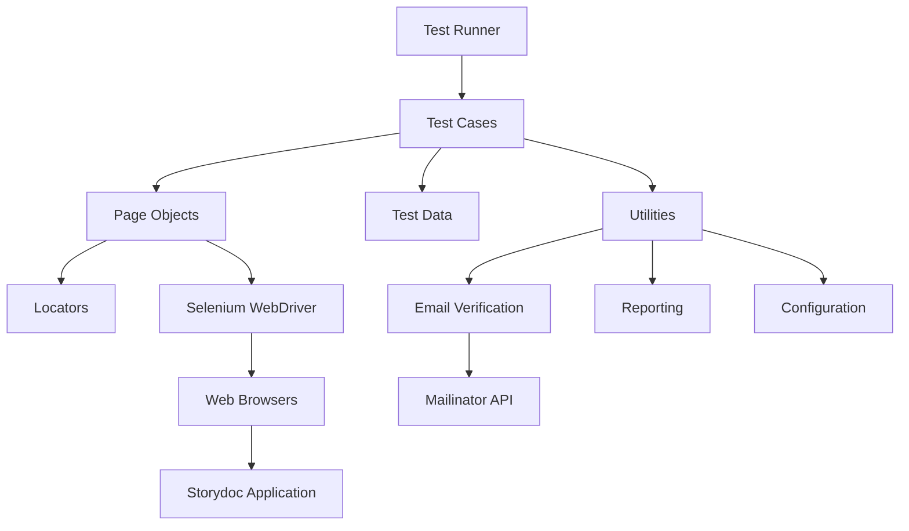
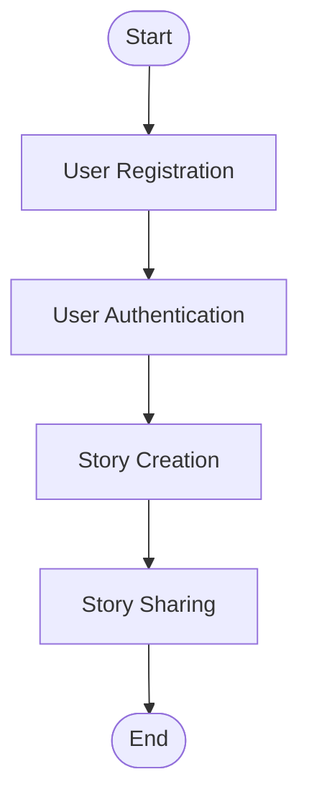

# Storydoc Test Automation Framework


A comprehensive Page Object Model (POM) based automation framework for testing the Storydoc application's core user flows. This framework ensures reliable, maintainable test automation to maintain quality and stability of the Storydoc platform.

## Table of Contents

- [Introduction](#introduction)
- [Framework Architecture](#framework-architecture)
- [Directory Structure](#directory-structure)
- [Setup and Installation](#setup-and-installation)
- [Test Execution](#test-execution)
- [Page Objects](#page-objects)
- [Utilities](#utilities)
- [Test Data Management](#test-data-management)
- [Reporting](#reporting)
- [CI/CD Integration](#cicd-integration)
- [Troubleshooting](#troubleshooting)
- [Contributing](#contributing)
- [Best Practices](#best-practices)

## Introduction

The Storydoc Test Automation Framework is designed to automate the testing of core user workflows in the Storydoc application. The framework focuses on four key features:

1. **User Registration** - Automating the signup process using mailinator.com emails
2. **User Authentication** - Automating the signin process with newly created users
3. **Content Creation** - Automating the creation of stories within the application
4. **Content Sharing** - Automating the story sharing process with email verification

This framework addresses the business need for reliable, maintainable test automation by:
- Reducing manual testing effort
- Accelerating release cycles
- Improving overall product quality
- Providing early feedback on potential issues

The framework targets the Storydoc web application, specifically the staging environment at https://editor-staging.storydoc.com.

## Framework Architecture

The automation framework follows the Page Object Model (POM) design pattern, which separates test logic from UI implementation details. This architecture provides several key benefits:

- **Separation of Concerns**: Test logic is decoupled from UI implementation details
- **Reusability**: Page objects encapsulate UI interactions, enabling reuse across multiple test cases
- **Readability**: Tests express business workflows rather than low-level UI interactions
- **Maintainability**: UI changes require updates only to the relevant page objects, not to test cases



### Core Components

| Component | Purpose | Description |
|-----------|---------|-------------|
| Test Cases | Define test scenarios | Test cases that validate specific user workflows |
| Page Objects | Encapsulate UI interactions | Classes that represent application pages and their interactions |
| Locators | Identify UI elements | Selectors to identify and interact with UI elements |
| WebDriver | Automate browser interactions | Interface to control browser actions |
| Utilities | Provide helper functions | Reusable helper functions for common tasks |
| Configuration | Manage environment settings | Environment-specific configuration parameters |
| Test Data | Provide test inputs | Test data for test case execution |
| Reporting | Generate test results | Test execution reports and results |

### Test Workflow

The framework is designed to automate the following key workflows:



## Directory Structure

The framework follows a well-organized directory structure to maintain a clean separation of concerns:

```
storydoc-automation/
├── config/                 # Configuration files
│   ├── .env.example        # Example environment variables
│   └── config.py           # Configuration management
├── data/                   # Test data
│   └── test_data.json      # JSON test data
├── utilities/              # Utility functions
│   ├── driver_factory.py   # WebDriver setup
│   ├── email_helper.py     # Email verification
│   └── logger.py           # Logging setup
├── fixtures/               # pytest fixtures
│   └── conftest.py         # Test fixtures
├── locators/               # Element locators
│   ├── base_locators.py    # Common locators
│   ├── signin_locators.py  # Signin page locators
│   ├── signup_locators.py  # Signup page locators
│   └── ...                 # Other page locators
├── pages/                  # Page objects
│   ├── base_page.py        # Base page object
│   ├── signin_page.py      # Signin page object
│   ├── signup_page.py      # Signup page object
│   └── ...                 # Other page objects
├── tests/                  # Test cases
│   ├── user_registration/  # Registration tests
│   ├── user_authentication/# Authentication tests
│   ├── story_creation/     # Story creation tests
│   ├── story_sharing/      # Story sharing tests
│   └── end_to_end/         # End-to-end workflow tests
├── reports/                # Test reports
│   ├── html/               # HTML reports
│   └── screenshots/        # Failure screenshots
├── scripts/                # Utility scripts
│   ├── setup.py            # Setup script
│   └── run_tests.py        # Test runner script
├── docs/                   # Documentation
│   └── README.md           # Primary documentation
├── ci/                     # CI/CD configuration
│   └── github-actions.yml  # GitHub Actions config
├── .gitignore              # Git ignore file
├── requirements.txt        # Python dependencies
└── README.md               # Project README
```

## Setup and Installation

### Prerequisites

- Python 3.9 or higher
- Chrome/Firefox browser
- Git

### Installation Steps

```bash
# Create virtual environment
python -m venv venv

# Activate virtual environment
# Windows
venv\Scripts\activate
# Unix/MacOS
source venv/bin/activate

# Install dependencies
pip install -r requirements.txt

# Setup environment variables
cp .env.example .env
# Edit .env with your configuration
```

### Environment Configuration

The `.env` file contains important configuration parameters:

| Parameter | Description | Default Value |
|-----------|-------------|---------------|
| BASE_URL | Base URL of the application | https://editor-staging.storydoc.com |
| BROWSER | Browser to use for testing | chrome |
| HEADLESS | Run in headless mode | false |
| TIMEOUT | Default timeout in seconds | 10 |
| EMAIL_DOMAIN | Email domain for test users | mailinator.com |

## Test Execution

### Running Tests

```bash
# Run all tests
python -m pytest

# Run specific test feature
python -m pytest src/test/tests/user_registration/

# Run with HTML report
python -m pytest --html=reports/html/report.html

# Run with parallel execution
python -m pytest -n 4

# Run end-to-end workflow test
python -m pytest src/test/tests/end_to_end/test_complete_workflow.py
```

### Test Tags

You can run tests based on tags:

```bash
# Run smoke tests
python -m pytest -m smoke

# Run regression tests
python -m pytest -m regression

# Run critical path tests
python -m pytest -m critical
```

### Example Test Case

Here's an example of a test case for user registration:

```python
def test_user_registration(browser, email_helper):
    # Initialize page objects
    signup_page = SignupPage(browser)
    
    # Generate test data
    email = email_helper.generate_email_address()
    password = "Test@123"
    name = "Test User"
    
    # Execute test steps
    signup_page.navigate_to()
    signup_page.enter_name(name)
    signup_page.enter_email(email)
    signup_page.enter_password(password)
    signup_page.accept_terms()
    signup_page.click_signup_button()
    
    # Verify results
    assert signup_page.is_signup_successful(), "Registration failed"
    assert email_helper.verify_email_received(email, "Welcome to Storydoc"), "Verification email not received"
```

## Page Objects

The framework implements the Page Object Model (POM) design pattern. Each page in the application has a corresponding page object class that encapsulates the UI interactions.

### Base Page

The `BasePage` class provides common functionality for all page objects:

- Navigation to page URL
- Element finding and interaction
- Waiting for elements
- Error handling
- Screenshot capture

### Page Object Example

```python
from selenium.webdriver.common.by import By
from .base_page import BasePage
from ..locators.signup_locators import SignupLocators

class SignupPage(BasePage):
    def __init__(self, driver):
        super().__init__(driver, "https://editor-staging.storydoc.com/sign-up", "Signup Page")
    
    def enter_name(self, name):
        return self.input_text(SignupLocators.NAME_FIELD, name)
    
    def enter_email(self, email):
        return self.input_text(SignupLocators.EMAIL_FIELD, email)
    
    def enter_password(self, password):
        return self.input_text(SignupLocators.PASSWORD_FIELD, password)
    
    def accept_terms(self):
        return self.check_checkbox(SignupLocators.TERMS_CHECKBOX)
    
    def click_signup_button(self):
        return self.click(SignupLocators.SIGNUP_BUTTON)
    
    def is_signup_successful(self):
        return self.is_element_visible(SignupLocators.SIGNUP_SUCCESS)
```

### Key Page Objects

| Page Object | Purpose | Methods |
|-------------|---------|---------|
| SignupPage | User registration | enter_name, enter_email, enter_password, accept_terms, click_signup_button |
| SigninPage | User authentication | enter_email, enter_password, click_signin_button |
| DashboardPage | Access dashboard features | click_create_story, get_story_list, open_story |
| StoryEditorPage | Create/edit stories | enter_story_title, select_template, save_story, share_story |
| ShareDialogPage | Share stories | enter_recipient_email, click_share_button |

## Utilities

The framework includes several utility modules to support test execution:

### WebDriver Factory

The `DriverFactory` class manages WebDriver instances:
- Browser driver initialization
- Driver configuration (headless, timeouts, etc.)
- Cross-browser support

### Email Helper

The `EmailHelper` class provides email verification capabilities:
- Generate unique email addresses
- Verify email delivery via Mailinator API
- Extract verification links from emails

### Logger

The `Logger` class provides structured logging:
- Test execution logging
- Error logging
- Test result logging

### Screenshot Manager

The `ScreenshotManager` class handles screenshot capture:
- Capture screenshots on test failures
- Capture screenshots at key steps
- Integrate screenshots with HTML reports

## Test Data Management

The framework implements a flexible approach to test data management:

### Data Generation

- Random data generators for unique test data
- Test data fixtures for reusable data
- Environment-specific test data

### Data Storage

- JSON files for static test data
- Environment variables for configuration
- In-memory storage for dynamic test data

### Data Access

- Test data providers for data-driven testing
- Configuration manager for environment settings
- Runtime data generation for unique values

## Reporting

The framework generates comprehensive test reports:

### HTML Reports

- Summary of test execution
- Detailed test results
- Test execution times
- Failure information
- Screenshots of failures

### Console Output

- Real-time test execution status
- Error messages
- Test progress

### CI/CD Integration

- Reports compatible with CI/CD systems
- JUnit XML output for integration
- Dashboard visualization

## CI/CD Integration

The framework is designed to integrate with CI/CD pipelines for continuous testing:

### GitHub Actions

The repository includes GitHub Actions workflows for:
- Running tests on pull requests
- Scheduled test execution
- Test report generation

### Jenkins

The framework can be integrated with Jenkins using:
- Jenkinsfile configuration
- JUnit report integration
- Test execution as build steps

### Configuration

- Environment-specific configuration
- Secrets management
- Parallel test execution

## Troubleshooting

### Common Issues

| Issue | Solution |
|-------|----------|
| Element not found | Check if locator has changed, increase wait timeout |
| Test timing out | Verify application performance, adjust timeouts |
| Email verification failing | Check Mailinator API access, email delivery time |
| Browser driver issues | Update WebDriver, check browser compatibility |

### Debugging Techniques

- Enable verbose logging with `--log-cli-level=DEBUG`
- Use screenshots for visual verification
- Check HTML reports for detailed error information
- Review application logs for server-side issues

## Contributing

### Getting Started

1. Fork the repository
2. Create a feature branch
3. Implement your changes
4. Add tests for your changes
5. Ensure all tests pass
6. Submit a pull request

### Coding Standards

- Follow PEP 8 style guide
- Use type hints
- Add docstrings to all functions and classes
- Maintain test independence

### Pull Request Process

1. Update documentation
2. Add necessary tests
3. Get code review from a team member
4. Address review comments
5. Merge once approved

## Best Practices

### Test Writing

- Test one thing per test case
- Make tests independent
- Avoid hardcoded test data
- Use appropriate assertions

### Page Objects

- Keep page objects focused on a single page
- Separate locators from page actions
- Return page objects for method chaining
- Provide meaningful method names

### Test Reliability

- Use explicit waits, not implicit waits or sleep
- Handle timing issues properly
- Make tests resilient to UI changes
- Implement proper cleanup in teardown

### Performance

- Minimize browser restarts
- Use headless mode when possible
- Implement parallel test execution
- Keep tests focused and fast

---

## Technologies

The framework uses the following technologies:

| Technology | Version | Purpose |
|------------|---------|---------|
| Python | 3.9+ | Primary programming language |
| Selenium WebDriver | 4.10+ | Browser automation |
| pytest | 7.3+ | Test framework |
| pytest-html | 3.2+ | HTML reporting |
| pytest-xdist | 3.3+ | Parallel test execution |
| requests | 2.31+ | HTTP client for API interactions |
| webdriver-manager | 4.0+ | Driver management |
| python-dotenv | 1.0+ | Environment configuration |

## License

This project is licensed under the MIT License - see the LICENSE file for details.