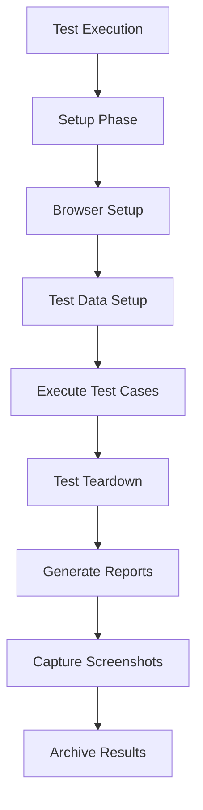
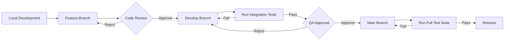
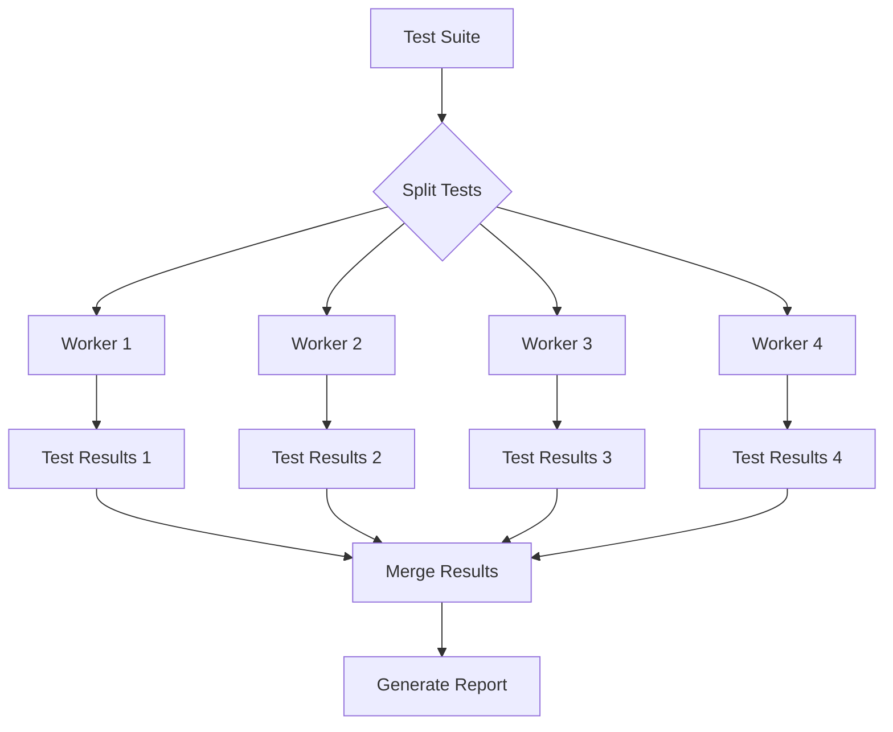

flowchart TD
    A[Code Changes] --> B[Version Control]
    B --> C{CI Trigger}
    C -->|Pull Request| D[PR Build]
    C -->|Merge to Main| E[Main Build]
    C -->|Schedule| F[Scheduled Build]
    
    D --> G[Setup Environment]
    E --> G
    F --> G
    
    G --> H[Install Dependencies]
    H --> I[Run Tests]
    I --> J{Tests Pass?}
    
    J -->|Yes| K[Publish Reports]
    J -->|No| L[Notify Failure]
    
    K --> M[Archive Artifacts]
    L --> M
    M --> N[Pipeline Complete]
```

### Test Execution Pipeline



## GitHub Actions Integration

GitHub Actions provides an integrated CI/CD solution within GitHub repositories. It allows you to automate test execution directly from your repository.

### Workflow Configuration

Create a `.github/workflows/test-automation.yml` file in your repository with the following content:

```yaml
name: Storydoc Test Automation

on:
  push:
    branches: [ main, develop ]
  pull_request:
    branches: [ main, develop ]
  schedule:
    - cron: '0 0 * * *'  # Run daily at midnight UTC

jobs:
  test:
    runs-on: ubuntu-latest
    
    steps:
    - uses: actions/checkout@v2
    
    - name: Set up Python
      uses: actions/setup-python@v2
      with:
        python-version: '3.9'
    
    - name: Install dependencies
      run: |
        python -m pip install --upgrade pip
        if [ -f requirements.txt ]; then pip install -r requirements.txt; fi
    
    - name: Install Chrome
      run: |
        wget -q -O - https://dl-ssl.google.com/linux/linux_signing_key.pub | sudo apt-key add -
        sudo sh -c 'echo "deb [arch=amd64] http://dl.google.com/linux/chrome/deb/ stable main" >> /etc/apt/sources.list.d/google.list'
        sudo apt-get update
        sudo apt-get install -y google-chrome-stable
    
    - name: Run tests
      run: |
        pytest tests/ --html=reports/report.html
      env:
        BASE_URL: https://editor-staging.storydoc.com
        HEADLESS_MODE: 'true'
    
    - name: Archive test results
      uses: actions/upload-artifact@v2
      with:
        name: test-report
        path: |
          reports/
          screenshots/
      if: always()  # Archive reports even if tests fail
```

### Configuring Test Triggers

GitHub Actions supports multiple trigger events:

- **Push**: Run tests when code is pushed to specific branches
- **Pull Request**: Run tests when pull requests are created or updated
- **Schedule**: Run tests on a regular schedule (daily, weekly, etc.)
- **Manual**: Run tests on-demand using workflow_dispatch event

### Environment Variables

Store sensitive information like API keys as GitHub Secrets and reference them in the workflow:

```yaml
- name: Run tests
  run: |
    pytest tests/ --html=reports/report.html
  env:
    BASE_URL: https://editor-staging.storydoc.com
    HEADLESS_MODE: 'true'
    MAILINATOR_API_KEY: ${{ secrets.MAILINATOR_API_KEY }}
```

## GitLab CI Integration

GitLab CI/CD is a built-in feature of GitLab that allows for automated testing and deployment.

### Pipeline Configuration

Create a `.gitlab-ci.yml` file in your repository root:

```yaml
image: python:3.9

variables:
  BASE_URL: https://editor-staging.storydoc.com
  HEADLESS_MODE: 'true'
  PIP_CACHE_DIR: "$CI_PROJECT_DIR/.pip-cache"

cache:
  paths:
    - .pip-cache/

stages:
  - test

before_script:
  - apt-get update
  - apt-get install -y wget gnupg
  - wget -q -O - https://dl-ssl.google.com/linux/linux_signing_key.pub | apt-key add -
  - echo "deb [arch=amd64] http://dl.google.com/linux/chrome/deb/ stable main" >> /etc/apt/sources.list.d/google.list
  - apt-get update
  - apt-get install -y google-chrome-stable
  - python -m pip install --upgrade pip
  - pip install -r requirements.txt

test:
  stage: test
  script:
    - pytest tests/ --html=reports/report.html
  artifacts:
    paths:
      - reports/
      - screenshots/
    when: always
    expire_in: 1 week
  rules:
    - if: $CI_PIPELINE_SOURCE == "merge_request_event"
    - if: $CI_COMMIT_BRANCH == "main"
    - if: $CI_COMMIT_BRANCH == "develop"
    - if: $CI_PIPELINE_SOURCE == "schedule"
```

### Scheduled Pipelines

Configure scheduled pipelines in GitLab CI through the UI or using the `.gitlab-ci.yml` file:

```yaml
test:scheduled:
  stage: test
  script:
    - pytest tests/ --html=reports/report.html
  artifacts:
    paths:
      - reports/
      - screenshots/
  only:
    - schedules
```

### Environment Configuration

GitLab CI allows you to define environment-specific variables through the UI or in the `.gitlab-ci.yml` file:

```yaml
test:staging:
  stage: test
  script:
    - pytest tests/ --html=reports/report.html
  variables:
    BASE_URL: https://editor-staging.storydoc.com
  environment:
    name: staging
```

## Jenkins Pipeline Integration

Jenkins is a widely-used automation server that can be configured to execute test pipelines.

### Jenkinsfile Configuration

Create a `Jenkinsfile` in your repository root:

```groovy
pipeline {
    agent {
        docker {
            image 'python:3.9'
            args '-v /var/run/docker.sock:/var/run/docker.sock'
        }
    }
    
    environment {
        BASE_URL = 'https://editor-staging.storydoc.com'
        HEADLESS_MODE = 'true'
        MAILINATOR_API_KEY = credentials('mailinator-api-key')
    }
    
    stages {
        stage('Setup') {
            steps {
                sh '''
                    apt-get update
                    apt-get install -y wget gnupg
                    wget -q -O - https://dl-ssl.google.com/linux/linux_signing_key.pub | apt-key add -
                    echo "deb [arch=amd64] http://dl.google.com/linux/chrome/deb/ stable main" >> /etc/apt/sources.list.d/google.list
                    apt-get update
                    apt-get install -y google-chrome-stable
                    python -m pip install --upgrade pip
                    pip install -r requirements.txt
                '''
            }
        }
        
        stage('Test') {
            steps {
                sh 'pytest tests/ --html=reports/report.html'
            }
            post {
                always {
                    archiveArtifacts artifacts: 'reports/**, screenshots/**', allowEmptyArchive: true
                    publishHTML([
                        allowMissing: false,
                        alwaysLinkToLastBuild: true,
                        keepAll: true,
                        reportDir: 'reports',
                        reportFiles: 'report.html',
                        reportName: 'Test Report'
                    ])
                }
            }
        }
    }
    
    triggers {
        cron('0 0 * * *') // Run daily at midnight
    }
}
```

### Configuring Jenkins Pipeline Triggers

Jenkins supports various triggers for pipeline execution:

- **SCM Polling**: Check for code changes on a schedule
- **Webhooks**: Trigger builds on repository events
- **Scheduled Builds**: Run builds on a regular schedule
- **Manual Triggers**: Start builds on-demand

### Parameterized Builds

Enable parameterized builds to customize test execution:

```groovy
pipeline {
    agent { docker { image 'python:3.9' } }
    
    parameters {
        string(name: 'BASE_URL', defaultValue: 'https://editor-staging.storydoc.com', description: 'Application URL to test')
        booleanParam(name: 'HEADLESS_MODE', defaultValue: true, description: 'Run tests in headless mode')
        choice(name: 'BROWSER', choices: ['chrome', 'firefox'], description: 'Browser to use for testing')
    }
    
    environment {
        BASE_URL = "${params.BASE_URL}"
        HEADLESS_MODE = "${params.HEADLESS_MODE}"
        BROWSER = "${params.BROWSER}"
    }
    
    stages {
        // Pipeline stages as before
    }
}
```

## Azure DevOps Integration

Azure DevOps provides comprehensive CI/CD capabilities with easy integration for test automation.

### Pipeline Configuration

Create an `azure-pipelines.yml` file in your repository root:

```yaml
trigger:
  branches:
    include:
      - main
      - develop
  
schedules:
- cron: "0 0 * * *"
  displayName: Daily midnight build
  branches:
    include:
    - main

pool:
  vmImage: 'ubuntu-latest'

steps:
- task: UsePythonVersion@0
  inputs:
    versionSpec: '3.9'
    addToPath: true

- script: |
    wget -q -O - https://dl-ssl.google.com/linux/linux_signing_key.pub | sudo apt-key add -
    echo "deb [arch=amd64] http://dl.google.com/linux/chrome/deb/ stable main" | sudo tee /etc/apt/sources.list.d/google.list
    sudo apt-get update
    sudo apt-get install -y google-chrome-stable
  displayName: 'Install Chrome'

- script: |
    python -m pip install --upgrade pip
    pip install -r requirements.txt
  displayName: 'Install dependencies'

- script: |
    pytest tests/ --html=reports/report.html
  displayName: 'Run tests'
  env:
    BASE_URL: https://editor-staging.storydoc.com
    HEADLESS_MODE: 'true'
    MAILINATOR_API_KEY: $(mailinator-api-key)

- task: PublishTestResults@2
  inputs:
    testResultsFormat: 'JUnit'
    testResultsFiles: '**/junit-*.xml'
    mergeTestResults: true
    testRunTitle: 'Storydoc Tests'
  condition: succeededOrFailed()

- task: PublishPipelineArtifact@1
  inputs:
    targetPath: 'reports'
    artifact: 'test-reports'
    publishLocation: 'pipeline'
  condition: succeededOrFailed()

- task: PublishPipelineArtifact@1
  inputs:
    targetPath: 'screenshots'
    artifact: 'test-screenshots'
    publishLocation: 'pipeline'
  condition: succeededOrFailed()
```

### Variable Groups and Secret Management

Create variable groups in the Azure DevOps Library to manage environment-specific configurations:

```yaml
variables:
- group: storydoc-test-variables

steps:
- script: |
    pytest tests/ --html=reports/report.html
  displayName: 'Run tests'
  env:
    BASE_URL: $(BASE_URL)
    HEADLESS_MODE: $(HEADLESS_MODE)
    MAILINATOR_API_KEY: $(MAILINATOR_API_KEY)
```

## Docker-based Test Execution

Containerizing test execution ensures consistent environments across different CI/CD systems.

### Dockerfile

Create a `Dockerfile` for the test environment:

```dockerfile
FROM python:3.9

# Install Chrome
RUN wget -q -O - https://dl-ssl.google.com/linux/linux_signing_key.pub | apt-key add - \
    && echo "deb [arch=amd64] http://dl.google.com/linux/chrome/deb/ stable main" >> /etc/apt/sources.list.d/google.list \
    && apt-get update \
    && apt-get install -y google-chrome-stable \
    && rm -rf /var/lib/apt/lists/*

# Set working directory
WORKDIR /app

# Copy requirements and install dependencies
COPY requirements.txt .
RUN pip install --no-cache-dir -r requirements.txt

# Copy test framework files
COPY . .

# Set environment variables
ENV PYTHONUNBUFFERED=1 \
    HEADLESS_MODE=true

# Command to run tests
CMD ["pytest", "tests/", "--html=reports/report.html"]
```

### docker-compose.yml

Create a `docker-compose.yml` file for easier local execution:

```yaml
version: '3'

services:
  test:
    build: .
    volumes:
      - ./reports:/app/reports
      - ./screenshots:/app/screenshots
    environment:
      - BASE_URL=https://editor-staging.storydoc.com
      - HEADLESS_MODE=true
```

### Environment Promotion Flow



## Parallel Test Execution

Running tests in parallel reduces execution time significantly.



### pytest-xdist Configuration

Install and configure pytest-xdist:

```bash
pip install pytest-xdist
```

Run tests in parallel:

```bash
pytest tests/ -n 4  # Run with 4 workers
```

Configure in CI/CD pipelines:

```yaml
# GitHub Actions example
- name: Run tests in parallel
  run: pytest tests/ -n auto --html=reports/report.html
```

## Managing Test Data

Properly managing test data is crucial for reliable test execution in CI/CD environments.

### Test Data Isolation

Ensure tests use unique data to prevent conflicts:

```python
import time
import uuid

def generate_unique_email():
    """Generate a unique email address for testing"""
    timestamp = int(time.time())
    unique_id = uuid.uuid4().hex[:8]
    return f"test.{timestamp}.{unique_id}@mailinator.com"
```

### Data Cleanup

Implement cleanup mechanisms to remove test data after execution:

```python
# In conftest.py
@pytest.fixture(scope="session", autouse=True)
def cleanup(request):
    """Cleanup test data after test execution"""
    yield
    # Perform cleanup operations
    cleanup_test_data()

def cleanup_test_data():
    """Clean up any test data created during test execution"""
    # Implementation depends on your application and test data
    pass
```

## Test Reporting

Comprehensive test reporting provides visibility into test results.

### Generating HTML Reports

Use pytest-html to generate HTML reports:

```python
# In conftest.py
def pytest_configure(config):
    """Configure pytest"""
    config.option.htmlpath = 'reports/report.html'
```

Run tests with the HTML report option:

```bash
pytest tests/ --html=reports/report.html
```

### JUnit XML Reports

Generate JUnit XML reports for CI/CD integration:

```bash
pytest tests/ --junitxml=reports/junit.xml
```

## Handling Test Failures

Properly handling test failures is crucial for CI/CD integration.

### Failure Notification

Configure notifications for test failures:

```yaml
# GitHub Actions example
- name: Notify on failure
  if: failure()
  uses: rtCamp/action-slack-notify@v2
  env:
    SLACK_WEBHOOK: ${{ secrets.SLACK_WEBHOOK }}
    SLACK_CHANNEL: test-failures
    SLACK_TITLE: Test Failures
    SLACK_MESSAGE: 'Test run failed on branch ${{ github.ref }}'
```

### Retry Strategy

Implement retry for flaky tests:

```bash
pip install pytest-rerunfailures
```

Run with retry:

```bash
pytest tests/ --reruns 3 --reruns-delay 1
```

Configure in CI/CD:

```yaml
# GitLab CI example
test:
  script:
    - pytest tests/ --reruns 3 --reruns-delay 1 --html=reports/report.html