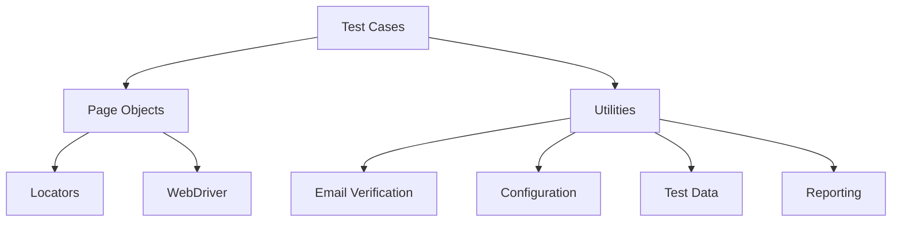

# Extending the Storydoc Test Automation Framework

## Introduction

The Storydoc Test Automation Framework is designed with extensibility in mind, allowing QA engineers and developers to build upon the core functionality to address evolving testing needs. This guide provides comprehensive instructions on how to extend the framework to support new features, test scenarios, and integration points beyond the initial implementation.

Key use cases for extending the framework include:

- Adding support for new Storydoc features and UI components
- Implementing additional test scenarios for existing features
- Supporting new browsers or execution environments
- Enhancing reporting and monitoring capabilities
- Integrating with additional third-party services
- Customizing test data generation and verification

This documentation will walk you through the process of extending each component of the framework while maintaining its architectural integrity and following established best practices.

## Framework Architecture Overview

Before diving into framework extension, it's essential to understand the existing architecture. The Storydoc Test Automation Framework follows the Page Object Model (POM) pattern and is organized into several key components:



Key components include:

- **Test Cases**: Define test scenarios using pytest
- **Page Objects**: Encapsulate interactions with specific pages
- **Locators**: Define element identification strategies
- **Utilities**: Provide common functionality for tests
- **Configuration**: Manage environment settings
- **WebDriver**: Interface with browsers through Selenium
- **Email Verification**: Verify emails using Mailinator

The framework follows a layered architecture with clear separation of concerns, making it straightforward to extend individual components without affecting others.

## Adding New Page Objects

Page Objects are the foundation of the framework's interaction with the Storydoc application. To add a new Page Object:

### Step 1: Identify the page and its elements

Analyze the new page in the Storydoc application and identify all interactive elements and verification points.

### Step 2: Create a new Page Object class

Create a new Python file in the `pages` directory following the naming convention `page_name_page.py`.

```python
# pages/template_gallery_page.py
from selenium.webdriver.support.ui import WebDriverWait
from selenium.webdriver.support import expected_conditions as EC
from locators.template_gallery_locators import TemplateGalleryLocators
from pages.base_page import BasePage

class TemplateGalleryPage(BasePage):
    """Page object for the Template Gallery page"""
    
    def __init__(self, driver):
        """Initialize the Template Gallery page
        
        Args:
            driver: WebDriver instance
        """
        super().__init__(driver)
        self.url = "https://editor-staging.storydoc.com/templates"
    
    def navigate_to(self):
        """Navigate to the Template Gallery page"""
        self.open()
    
    def select_template(self, template_name):
        """Select a template by name
        
        Args:
            template_name: Name of the template to select
            
        Returns:
            bool: True if template was selected, False otherwise
        """
        templates = self.find_elements(TemplateGalleryLocators.TEMPLATE_CARDS)
        for template in templates:
            name_element = template.find_element(*TemplateGalleryLocators.TEMPLATE_NAME)
            if template_name.lower() in name_element.text.lower():
                template.find_element(*TemplateGalleryLocators.SELECT_BUTTON).click()
                return True
        return False
    
    def is_template_gallery_loaded(self):
        """Check if the Template Gallery page is loaded
        
        Returns:
            bool: True if the page is loaded, False otherwise
        """
        return self.is_element_visible(TemplateGalleryLocators.GALLERY_TITLE)
    
    def get_template_count(self):
        """Get the number of templates available
        
        Returns:
            int: Number of templates
        """
        templates = self.find_elements(TemplateGalleryLocators.TEMPLATE_CARDS)
        return len(templates)
```

### Step 3: Implement all necessary methods

Include methods for:
- Navigation to the page
- Interaction with page elements
- Verification of page state
- Retrieval of page data
- Common workflows involving the page

### Step 4: Follow established patterns

Maintain consistency with existing Page Objects:
- Inherit from BasePage
- Use explicit waits for element interactions
- Implement clear error handling
- Include comprehensive docstrings
- Provide meaningful return values

## Extending Locators

Locators define the element identification strategies used by Page Objects. To extend locators:

### Step 1: Create a new Locators class

Create a new Python file in the `locators` directory following the naming convention `page_name_locators.py`.

```python
# locators/template_gallery_locators.py
from selenium.webdriver.common.by import By
from locators.base_locators import BaseLocators

class TemplateGalleryLocators(BaseLocators):
    """Locators for the Template Gallery page"""
    
    # Page elements
    GALLERY_TITLE = (By.CSS_SELECTOR, ".gallery-title")
    TEMPLATE_CARDS = (By.CSS_SELECTOR, ".template-card")
    
    # Template card elements
    TEMPLATE_NAME = (By.CSS_SELECTOR, ".template-name")
    TEMPLATE_DESCRIPTION = (By.CSS_SELECTOR, ".template-description")
    TEMPLATE_THUMBNAIL = (By.CSS_SELECTOR, ".template-thumbnail")
    SELECT_BUTTON = (By.CSS_SELECTOR, ".select-template-button")
    
    # Filter elements
    FILTER_DROPDOWN = (By.CSS_SELECTOR, ".filter-dropdown")
    CATEGORY_FILTER = (By.CSS_SELECTOR, ".category-filter")
    SEARCH_BOX = (By.CSS_SELECTOR, ".template-search")
```

### Step 2: Use robust locator strategies

Follow these guidelines for creating reliable locators:
- Prefer IDs and unique attributes when available
- Use CSS selectors for better performance
- Avoid absolute XPaths
- Consider using data attributes for testing (e.g., `data-testid`)
- Add context in comments for complex locators

### Step 3: Maintain locator maintainability

Keep locators organized and maintainable:
- Group related locators together
- Use clear naming conventions
- Include comments for complicated locators
- Inherit from BaseLocators for common elements

### Step 4: Test locator resilience

Verify locators work across different scenarios:
- Different browser viewport sizes
- Various application states
- After UI updates (when possible)

## Creating New Test Cases

Test cases define the actual test scenarios that validate the Storydoc application's functionality. To create new test cases:

### Step 1: Create a new test file

Create a new Python file in the `tests` directory following the naming convention `test_feature_name.py`.

```python
# tests/test_template_selection.py
import pytest
import time
from pages.signin_page import SigninPage
from pages.dashboard_page import DashboardPage
from pages.template_gallery_page import TemplateGalleryPage
from pages.story_editor_page import StoryEditorPage
from utilities.test_data_helper import TestDataHelper

class TestTemplateSelection:
    """Test class for template selection feature"""
    
    @pytest.fixture(scope="function")
    def setup(self):
        """Setup for template selection tests"""
        # Setup code for browser, etc.
        self.signin_page = SigninPage(self.driver)
        self.dashboard_page = DashboardPage(self.driver)
        self.template_gallery_page = TemplateGalleryPage(self.driver)
        self.story_editor_page = StoryEditorPage(self.driver)
        
        # Generate test data
        self.test_data = TestDataHelper.generate_test_data()
        
        # Log in with existing user
        self.signin_page.complete_signin(
            self.test_data["user"]["email"],
            self.test_data["user"]["password"]
        )
        
        yield
        
        # Teardown
        self.driver.quit()
    
    def test_template_selection(self, setup):
        """Test selecting a template from the gallery"""
        # Navigate to template gallery
        self.dashboard_page.click_create_story_button()
        
        # Verify template gallery is loaded
        assert self.template_gallery_page.is_template_gallery_loaded(), \
            "Template gallery not loaded"
        
        # Select a template
        template_name = "Business Proposal"
        assert self.template_gallery_page.select_template(template_name), \
            f"Failed to select template: {template_name}"
        
        # Verify story editor is loaded with template
        assert self.story_editor_page.is_loaded(), \
            "Story editor not loaded after template selection"
        
        # Verify template was applied
        assert self.story_editor_page.is_template_applied(template_name), \
            f"Template not applied: {template_name}"
```

### Step 2: Implement test fixtures

Define pytest fixtures for:
- Setting up the test environment
- Creating necessary test data
- Handling preconditions (e.g., user login)
- Cleaning up after tests

### Step 3: Write test methods

Create test methods that:
- Follow the Arrange-Act-Assert pattern
- Use clear, descriptive method names
- Include comprehensive assertions
- Handle test data appropriately
- Document test purpose and steps

### Step 4: Implement test parameterization

Use pytest's parameterization for data-driven testing:

```python
@pytest.mark.parametrize(
    "template_name,expected_sections", 
    [
        ("Business Proposal", 5),
        ("Sales Pitch", 4),
        ("Marketing Plan", 6)
    ]
)
def test_template_section_count(self, setup, template_name, expected_sections):
    """Test that templates have the correct number of sections"""
    # Test implementation with parametrized data
    self.dashboard_page.click_create_story_button()
    self.template_gallery_page.select_template(template_name)
    assert self.story_editor_page.get_section_count() == expected_sections, \
        f"Incorrect section count for template: {template_name}"
```

## Extending User Registration Tests

User Registration (F-001) is a critical feature of the Storydoc application. To extend tests for this feature:

### Step 1: Identify additional test scenarios

Consider scenarios like:
- Registration with invalid email formats
- Password strength validation
- Duplicate email handling
- Terms acceptance requirement
- Field length validations
- Special character handling in name fields

### Step 2: Implement the test methods

Example of extending registration tests:

```python
# tests/test_user_registration.py
import pytest
from pages.signup_page import SignupPage
from utilities.email_helper import EmailHelper

class TestUserRegistration:
    # Existing test methods...
    
    @pytest.mark.parametrize(
        "email,should_succeed", 
        [
            ("valid@mailinator.com", True),
            ("invalid@gmail.com", False),  # Non-mailinator domain
            ("no-at-sign.mailinator.com", False),  # Invalid format
            ("", False),  # Empty email
            ("a@b.c", False),  # Too short
            ("a" * 100 + "@mailinator.com", False)  # Too long
        ]
    )
    def test_email_validation(self, setup, email, should_succeed):
        """Test email validation during registration"""
        self.signup_page.navigate_to()
        self.signup_page.enter_name("Test User")
        self.signup_page.enter_email(email)
        self.signup_page.enter_password("Test@123")
        self.signup_page.accept_terms()
        self.signup_page.click_signup_button()
        
        if should_succeed:
            assert self.signup_page.is_signup_successful(), \
                f"Registration should succeed with email: {email}"
        else:
            assert self.signup_page.is_email_error_displayed(), \
                f"Registration should fail with email: {email}"
```

### Step 3: Add validation methods to page objects

Update the SignupPage class to support new validations:

```python
# pages/signup_page.py
# Add these methods to the existing SignupPage class

def is_email_error_displayed(self):
    """Check if email error message is displayed
    
    Returns:
        bool: True if error is displayed, False otherwise
    """
    return self.is_element_visible(SignupLocators.EMAIL_ERROR_MESSAGE)

def is_password_error_displayed(self):
    """Check if password error message is displayed
    
    Returns:
        bool: True if error is displayed, False otherwise
    """
    return self.is_element_visible(SignupLocators.PASSWORD_ERROR_MESSAGE)

def get_error_message_text(self):
    """Get the text of the error message
    
    Returns:
        str: Error message text
    """
    if self.is_element_visible(SignupLocators.ERROR_MESSAGE):
        return self.get_text(SignupLocators.ERROR_MESSAGE)
    return ""
```

### Step 4: Add new locators

Update the SignupLocators class to include error message locators:

```python
# locators/signup_locators.py
# Add these locators to the existing SignupLocators class

EMAIL_ERROR_MESSAGE = (By.CSS_SELECTOR, ".email-field .error-message")
PASSWORD_ERROR_MESSAGE = (By.CSS_SELECTOR, ".password-field .error-message")
NAME_ERROR_MESSAGE = (By.CSS_SELECTOR, ".name-field .error-message")
TERMS_ERROR_MESSAGE = (By.CSS_SELECTOR, ".terms-checkbox .error-message")
ERROR_MESSAGE = (By.CSS_SELECTOR, ".form-error-message")
```

## Extending User Authentication Tests

User Authentication (F-002) is another critical feature. To extend tests for this feature:

### Step 1: Identify additional test scenarios

Consider scenarios like:
- Sign-in with invalid credentials
- Password reset functionality
- Remember me functionality
- Session persistence
- Account lockout after failed attempts
- Session timeout behavior

### Step 2: Implement the test methods

Example of extending authentication tests:

```python
# tests/test_user_authentication.py
import pytest
import time
from pages.signin_page import SigninPage
from pages.dashboard_page import DashboardPage
from pages.forgot_password_page import ForgotPasswordPage
from utilities.email_helper import EmailHelper

class TestUserAuthentication:
    # Existing test methods...
    
    def test_failed_login_attempts(self, setup):
        """Test account behavior after multiple failed login attempts"""
        email = "existing.user@mailinator.com"
        wrong_password = "WrongPassword123"
        
        # Attempt login with wrong password multiple times
        for i in range(5):
            self.signin_page.navigate_to()
            self.signin_page.enter_email(email)
            self.signin_page.enter_password(wrong_password)
            self.signin_page.click_signin_button()
            
            # Verify error message
            assert self.signin_page.is_signin_error_displayed(), \
                f"Error not displayed on attempt {i+1}"
        
        # Verify account lockout message
        assert "account has been locked" in self.signin_page.get_error_message_text().lower(), \
            "Account lockout message not displayed after multiple failed attempts"
```

### Step 3: Implement password reset testing

Add test for the password reset flow:

```python
def test_password_reset(self, setup):
    """Test password reset functionality"""
    email = "existing.user@mailinator.com"
    new_password = f"NewPassword{int(time.time())}"
    
    # Navigate to forgot password page
    self.signin_page.navigate_to()
    self.signin_page.click_forgot_password_link()
    
    # Request password reset
    assert self.forgot_password_page.is_loaded(), "Forgot password page not loaded"
    self.forgot_password_page.enter_email(email)
    self.forgot_password_page.click_reset_button()
    
    # Verify reset email sent confirmation
    assert self.forgot_password_page.is_reset_email_sent(), \
        "Reset email sent confirmation not displayed"
    
    # Check for reset email
    email_helper = EmailHelper()
    reset_email = email_helper.wait_for_email(
        email,
        "Reset your Storydoc password"
    )
    assert reset_email, "Password reset email not received"
    
    # Extract reset link and navigate to it
    reset_link = email_helper.extract_verification_link(reset_email)
    assert reset_link, "Reset link not found in email"
    self.driver.get(reset_link)
    
    # Set new password
    assert self.forgot_password_page.is_new_password_form_displayed(), \
        "New password form not displayed"
    self.forgot_password_page.enter_new_password(new_password)
    self.forgot_password_page.confirm_new_password(new_password)
    self.forgot_password_page.click_submit_button()
    
    # Verify password reset success
    assert self.forgot_password_page.is_reset_successful(), \
        "Password reset success message not displayed"
    
    # Test login with new password
    self.signin_page.navigate_to()
    self.signin_page.enter_email(email)
    self.signin_page.enter_password(new_password)
    self.signin_page.click_signin_button()
    
    # Verify successful login with new password
    assert self.dashboard_page.is_loaded(), \
        "Login with new password failed"
```

### Step 4: Add necessary page objects and locators

Create a new ForgotPasswordPage class and corresponding locators:

```python
# pages/forgot_password_page.py
from selenium.webdriver.support.ui import WebDriverWait
from selenium.webdriver.support import expected_conditions as EC
from locators.forgot_password_locators import ForgotPasswordLocators
from pages.base_page import BasePage

class ForgotPasswordPage(BasePage):
    """Page object for the Forgot Password page"""
    
    def __init__(self, driver):
        """Initialize the Forgot Password page"""
        super().__init__(driver)
        self.url = "https://editor-staging.storydoc.com/forgot-password"
    
    def is_loaded(self):
        """Check if the page is loaded"""
        return self.is_element_visible(ForgotPasswordLocators.RESET_FORM)
    
    def enter_email(self, email):
        """Enter email for password reset"""
        self.input_text(ForgotPasswordLocators.EMAIL_FIELD, email)
    
    def click_reset_button(self):
        """Click the reset button"""
        self.click(ForgotPasswordLocators.RESET_BUTTON)
    
    def is_reset_email_sent(self):
        """Check if reset email sent confirmation is displayed"""
        return self.is_element_visible(ForgotPasswordLocators.EMAIL_SENT_MESSAGE)
    
    # Add methods for new password form
    def is_new_password_form_displayed(self):
        """Check if new password form is displayed"""
        return self.is_element_visible(ForgotPasswordLocators.NEW_PASSWORD_FORM)
    
    def enter_new_password(self, password):
        """Enter new password"""
        self.input_text(ForgotPasswordLocators.NEW_PASSWORD_FIELD, password)
    
    def confirm_new_password(self, password):
        """Confirm new password"""
        self.input_text(ForgotPasswordLocators.CONFIRM_PASSWORD_FIELD, password)
    
    def click_submit_button(self):
        """Click the submit button"""
        self.click(ForgotPasswordLocators.SUBMIT_BUTTON)
    
    def is_reset_successful(self):
        """Check if password reset was successful"""
        return self.is_element_visible(ForgotPasswordLocators.RESET_SUCCESS_MESSAGE)
```

## Extending Story Creation Tests

Story Creation (F-003) is a core feature of Storydoc. To extend tests for this feature:

### Step 1: Identify additional test scenarios

Consider scenarios like:
- Creating stories with different templates
- Story content editing functionality
- Saving and auto-saving behavior
- Story metadata editing
- Content validation
- Media embedding

### Step 2: Implement the test methods

Example of extending story creation tests:

```python
# tests/test_story_creation.py
import pytest
import time
from pages.signin_page import SigninPage
from pages.dashboard_page import DashboardPage
from pages.story_editor_page import StoryEditorPage
from utilities.test_data_helper import TestDataHelper

class TestStoryCreation:
    # Existing test methods...
    
    @pytest.mark.parametrize(
        "content_type,content_data", 
        [
            ("text", "This is a test paragraph"),
            ("heading", "Test Heading"),
            ("image", "test_image.jpg"),
            ("video", "https://www.youtube.com/watch?v=test")
        ]
    )
    def test_add_content(self, setup, content_type, content_data):
        """Test adding different types of content to a story"""
        # Log in and create a new story
        self.signin_page.complete_signin(
            self.test_data["user"]["email"],
            self.test_data["user"]["password"]
        )
        self.dashboard_page.click_create_story_button()
        self.story_editor_page.enter_story_title("Content Test Story")
        
        # Add content based on content type
        if content_type == "text":
            self.story_editor_page.add_text_block(content_data)
            assert self.story_editor_page.get_text_content().strip() == content_data, \
                "Text content not added correctly"
                
        elif content_type == "heading":
            self.story_editor_page.add_heading(content_data)
            assert self.story_editor_page.get_heading_content().strip() == content_data, \
                "Heading not added correctly"
                
        elif content_type == "image":
            self.story_editor_page.add_image(content_data)
            assert self.story_editor_page.is_image_displayed(), \
                "Image not added correctly"
                
        elif content_type == "video":
            self.story_editor_page.add_video(content_data)
            assert self.story_editor_page.is_video_displayed(), \
                "Video not added correctly"
        
        # Save the story
        self.story_editor_page.save_story()
        assert self.story_editor_page.is_story_saved(), \
            "Story not saved after adding content"
```

### Step 3: Extend the story editor page object

Add new methods to the StoryEditorPage class:

```python
# pages/story_editor_page.py
# Add these methods to the existing StoryEditorPage class

def add_text_block(self, text):
    """Add a text block to the story
    
    Args:
        text: Text content to add
    """
    self.click(StoryEditorLocators.ADD_CONTENT_BUTTON)
    self.click(StoryEditorLocators.TEXT_BLOCK_OPTION)
    self.wait_for_element(StoryEditorLocators.TEXT_EDITOR)
    self.input_text(StoryEditorLocators.TEXT_EDITOR, text)

def add_heading(self, heading_text):
    """Add a heading to the story
    
    Args:
        heading_text: Heading text to add
    """
    self.click(StoryEditorLocators.ADD_CONTENT_BUTTON)
    self.click(StoryEditorLocators.HEADING_OPTION)
    self.wait_for_element(StoryEditorLocators.HEADING_EDITOR)
    self.input_text(StoryEditorLocators.HEADING_EDITOR, heading_text)

def add_image(self, image_path):
    """Add an image to the story
    
    Args:
        image_path: Path to the image file
    """
    self.click(StoryEditorLocators.ADD_CONTENT_BUTTON)
    self.click(StoryEditorLocators.IMAGE_OPTION)
    self.wait_for_element(StoryEditorLocators.IMAGE_UPLOAD_INPUT)
    
    # Use absolute path for the image file
    import os
    absolute_path = os.path.abspath(f"test_data/images/{image_path}")
    self.find_element(StoryEditorLocators.IMAGE_UPLOAD_INPUT).send_keys(absolute_path)
    
    # Wait for image to upload
    self.wait_for_element(StoryEditorLocators.UPLOADED_IMAGE)

def add_video(self, video_url):
    """Add a video to the story
    
    Args:
        video_url: URL of the video to add
    """
    self.click(StoryEditorLocators.ADD_CONTENT_BUTTON)
    self.click(StoryEditorLocators.VIDEO_OPTION)
    self.wait_for_element(StoryEditorLocators.VIDEO_URL_INPUT)
    self.input_text(StoryEditorLocators.VIDEO_URL_INPUT, video_url)
    self.click(StoryEditorLocators.VIDEO_EMBED_BUTTON)
    
    # Wait for video to embed
    self.wait_for_element(StoryEditorLocators.EMBEDDED_VIDEO)

def get_text_content(self):
    """Get the text content from the story
    
    Returns:
        str: Text content
    """
    return self.get_text(StoryEditorLocators.TEXT_CONTENT)

def get_heading_content(self):
    """Get the heading content from the story
    
    Returns:
        str: Heading content
    """
    return self.get_text(StoryEditorLocators.HEADING_CONTENT)

def is_image_displayed(self):
    """Check if an image is displayed in the story
    
    Returns:
        bool: True if image is displayed, False otherwise
    """
    return self.is_element_visible(StoryEditorLocators.UPLOADED_IMAGE)

def is_video_displayed(self):
    """Check if a video is displayed in the story
    
    Returns:
        bool: True if video is displayed, False otherwise
    """
    return self.is_element_visible(StoryEditorLocators.EMBEDDED_VIDEO)
```

### Step 4: Add new locators

Update the StoryEditorLocators class:

```python
# locators/story_editor_locators.py
# Add these locators to the existing StoryEditorLocators class

ADD_CONTENT_BUTTON = (By.CSS_SELECTOR, ".add-content-button")
TEXT_BLOCK_OPTION = (By.CSS_SELECTOR, ".text-block-option")
HEADING_OPTION = (By.CSS_SELECTOR, ".heading-option")
IMAGE_OPTION = (By.CSS_SELECTOR, ".image-option")
VIDEO_OPTION = (By.CSS_SELECTOR, ".video-option")

TEXT_EDITOR = (By.CSS_SELECTOR, ".text-editor")
HEADING_EDITOR = (By.CSS_SELECTOR, ".heading-editor")
IMAGE_UPLOAD_INPUT = (By.CSS_SELECTOR, "input[type='file']")
VIDEO_URL_INPUT = (By.CSS_SELECTOR, ".video-url-input")
VIDEO_EMBED_BUTTON = (By.CSS_SELECTOR, ".embed-video-button")

TEXT_CONTENT = (By.CSS_SELECTOR, ".text-content")
HEADING_CONTENT = (By.CSS_SELECTOR, ".heading-content")
UPLOADED_IMAGE = (By.CSS_SELECTOR, ".uploaded-image")
EMBEDDED_VIDEO = (By.CSS_SELECTOR, ".embedded-video")
```

## Extending Story Sharing Tests

Story Sharing (F-004) allows users to collaborate. To extend tests for this feature:

### Step 1: Identify additional test scenarios

Consider scenarios like:
- Sharing with multiple recipients
- Different permission levels (view, edit)
- Revoking access
- Checking notification settings
- Verifying access as the recipient
- Testing sharing comments

### Step 2: Implement the test methods

Example of extending story sharing tests:

```python
# tests/test_story_sharing.py
import pytest
from pages.signin_page import SigninPage
from pages.dashboard_page import DashboardPage
from pages.story_editor_page import StoryEditorPage
from pages.share_dialog_page import ShareDialogPage
from pages.shared_story_page import SharedStoryPage
from utilities.email_helper import EmailHelper

class TestStorySharing:
    # Existing test methods...
    
    @pytest.mark.parametrize(
        "permission_level", 
        ["viewer", "editor", "commenter"]
    )
    def test_sharing_permissions(self, setup, permission_level):
        """Test sharing with different permission levels"""
        # Setup - create a story and prepare for sharing
        self.signin_page.complete_signin(
            self.test_data["user"]["email"],
            self.test_data["user"]["password"]
        )
        self.dashboard_page.click_create_story_button()
        self.story_editor_page.enter_story_title("Permission Test Story")
        self.story_editor_page.add_text_block("This is a test story for permission testing")
        self.story_editor_page.save_story()
        
        # Share the story
        self.story_editor_page.click_share_button()
        
        # Set permission level
        recipient_email = self.email_helper.generate_email_address()
        self.share_dialog_page.enter_recipient_email(recipient_email)
        self.share_dialog_page.set_permission_level(permission_level)
        self.share_dialog_page.click_share_button()
        
        # Verify sharing success
        assert self.share_dialog_page.is_sharing_successful(), \
            f"Story sharing failed with permission level: {permission_level}"
        
        # Verify email received with correct permission information
        sharing_email = self.email_helper.wait_for_email(
            recipient_email,
            "Story shared with you"
        )
        assert sharing_email, "Sharing email not received"
        
        # Extract and access shared link
        sharing_link = self.email_helper.extract_verification_link(sharing_email)
        assert sharing_link, "Sharing link not found in email"
        
        # Open in a new browser session
        self.open_new_browser_session()
        self.driver2.get(sharing_link)
        
        # Create Shared Story page object
        shared_story_page = SharedStoryPage(self.driver2)
        
        # Verify access based on permission level
        assert shared_story_page.is_loaded(), "Shared story not accessible"
        
        if permission_level == "viewer":
            assert shared_story_page.is_view_only_mode(), \
                "View-only mode not active for viewer permission"
            assert not shared_story_page.is_edit_enabled(), \
                "Edit should not be enabled for viewer permission"
                
        elif permission_level == "editor":
            assert shared_story_page.is_edit_enabled(), \
                "Edit not enabled for editor permission"
            
        elif permission_level == "commenter":
            assert shared_story_page.is_comment_enabled(), \
                "Comment not enabled for commenter permission"
            assert not shared_story_page.is_edit_enabled(), \
                "Edit should not be enabled for commenter permission"
        
        # Clean up
        self.close_new_browser_session()
```

### Step 3: Add a shared story page object

Create a new SharedStoryPage class:

```python
# pages/shared_story_page.py
from selenium.webdriver.support.ui import WebDriverWait
from selenium.webdriver.support import expected_conditions as EC
from locators.shared_story_locators import SharedStoryLocators
from pages.base_page import BasePage

class SharedStoryPage(BasePage):
    """Page object for the Shared Story page"""
    
    def __init__(self, driver):
        """Initialize the Shared Story page"""
        super().__init__(driver)
    
    def is_loaded(self):
        """Check if the page is loaded
        
        Returns:
            bool: True if the page is loaded, False otherwise
        """
        return self.is_element_visible(SharedStoryLocators.STORY_CONTENT)
    
    def is_view_only_mode(self):
        """Check if the story is in view-only mode
        
        Returns:
            bool: True if in view-only mode, False otherwise
        """
        return self.is_element_visible(SharedStoryLocators.VIEW_ONLY_INDICATOR)
    
    def is_edit_enabled(self):
        """Check if editing is enabled
        
        Returns:
            bool: True if editing is enabled, False otherwise
        """
        return self.is_element_visible(SharedStoryLocators.EDIT_BUTTON) and \
               self.is_element_clickable(SharedStoryLocators.EDIT_BUTTON)
    
    def is_comment_enabled(self):
        """Check if commenting is enabled
        
        Returns:
            bool: True if commenting is enabled, False otherwise
        """
        return self.is_element_visible(SharedStoryLocators.COMMENT_BUTTON) and \
               self.is_element_clickable(SharedStoryLocators.COMMENT_BUTTON)
    
    def add_comment(self, comment_text):
        """Add a comment to the story
        
        Args:
            comment_text: Text of the comment
            
        Returns:
            bool: True if comment was added successfully, False otherwise
        """
        if not self.is_comment_enabled():
            return False
            
        self.click(SharedStoryLocators.COMMENT_BUTTON)
        self.wait_for_element(SharedStoryLocators.COMMENT_TEXTAREA)
        self.input_text(SharedStoryLocators.COMMENT_TEXTAREA, comment_text)
        self.click(SharedStoryLocators.SUBMIT_COMMENT_BUTTON)
        
        return self.is_element_visible(SharedStoryLocators.COMMENT_INDICATOR)
```

### Step 4: Add locators for the shared story page

Create a new SharedStoryLocators class:

```python
# locators/shared_story_locators.py
from selenium.webdriver.common.by import By
from locators.base_locators import BaseLocators

class SharedStoryLocators(BaseLocators):
    """Locators for the Shared Story page"""
    
    STORY_CONTENT = (By.CSS_SELECTOR, ".story-content")
    VIEW_ONLY_INDICATOR = (By.CSS_SELECTOR, ".view-only-indicator")
    EDIT_BUTTON = (By.CSS_SELECTOR, ".edit-button")
    COMMENT_BUTTON = (By.CSS_SELECTOR, ".comment-button")
    COMMENT_TEXTAREA = (By.CSS_SELECTOR, ".comment-textarea")
    SUBMIT_COMMENT_BUTTON = (By.CSS_SELECTOR, ".submit-comment-button")
    COMMENT_INDICATOR = (By.CSS_SELECTOR, ".comment-indicator")
```

### Step 5: Extend share dialog page object

Update the ShareDialogPage class:

```python
# pages/share_dialog_page.py
# Add these methods to the existing ShareDialogPage class

def set_permission_level(self, permission_level):
    """Set the permission level for sharing
    
    Args:
        permission_level: Permission level (viewer, editor, commenter)
    """
    self.click(ShareDialogLocators.PERMISSION_DROPDOWN)
    
    if permission_level == "viewer":
        self.click(ShareDialogLocators.VIEWER_OPTION)
    elif permission_level == "editor":
        self.click(ShareDialogLocators.EDITOR_OPTION)
    elif permission_level == "commenter":
        self.click(ShareDialogLocators.COMMENTER_OPTION)
    else:
        raise ValueError(f"Unsupported permission level: {permission_level}")
```

## Extending Browser Support

The framework primarily supports Chrome, but can be extended to support other browsers:

### Step 1: Update the DriverFactory class

Enhance the driver factory to support multiple browsers:

```python
# utilities/driver_factory.py
from selenium import webdriver
from selenium.webdriver.chrome.service import Service as ChromeService
from selenium.webdriver.firefox.service import Service as FirefoxService
from selenium.webdriver.edge.service import Service as EdgeService
from webdriver_manager.chrome import ChromeDriverManager
from webdriver_manager.firefox import GeckoDriverManager
from webdriver_manager.microsoft import EdgeChromiumDriverManager
import logging

class DriverFactory:
    """Factory class for creating WebDriver instances"""
    
    @staticmethod
    def get_driver(browser_type="chrome", headless=False):
        """Create a WebDriver instance for the specified browser
        
        Args:
            browser_type: Type of browser (chrome, firefox, edge)
            headless: Whether to run in headless mode
            
        Returns:
            WebDriver: Browser instance
        """
        logger = logging.getLogger(__name__)
        browser_type = browser_type.lower()
        
        if browser_type == "chrome":
            options = webdriver.ChromeOptions()
            if headless:
                options.add_argument("--headless")
                options.add_argument("--window-size=1920,1080")
            options.add_argument("--start-maximized")
            options.add_argument("--no-sandbox")
            options.add_argument("--disable-dev-shm-usage")
            service = ChromeService(ChromeDriverManager().install())
            logger.info("Creating Chrome WebDriver")
            return webdriver.Chrome(service=service, options=options)
            
        elif browser_type == "firefox":
            options = webdriver.FirefoxOptions()
            if headless:
                options.add_argument("--headless")
                options.add_argument("--width=1920")
                options.add_argument("--height=1080")
            service = FirefoxService(GeckoDriverManager().install())
            logger.info("Creating Firefox WebDriver")
            return webdriver.Firefox(service=service, options=options)
            
        elif browser_type == "edge":
            options = webdriver.EdgeOptions()
            if headless:
                options.add_argument("--headless")
                options.add_argument("--window-size=1920,1080")
            options.add_argument("--start-maximized")
            service = EdgeService(EdgeChromiumDriverManager().install())
            logger.info("Creating Edge WebDriver")
            return webdriver.Edge(service=service, options=options)
            
        else:
            error_msg = f"Unsupported browser type: {browser_type}"
            logger.error(error_msg)
            raise ValueError(error_msg)
```

### Step 2: Make tests browser-agnostic

Update test fixtures to accept a browser parameter:

```python
# conftest.py
import pytest
from utilities.driver_factory import DriverFactory

def pytest_addoption(parser):
    """Add command line options for browser selection"""
    parser.addoption(
        "--browser", 
        action="store", 
        default="chrome", 
        help="Browser to run tests with (chrome, firefox, edge)"
    )
    parser.addoption(
        "--headless",
        action="store_true",
        default=False,
        help="Run browser in headless mode"
    )

@pytest.fixture(scope="function")
def browser(request):
    """Create a WebDriver instance based on command line options"""
    browser_type = request.config.getoption("--browser")
    headless = request.config.getoption("--headless")
    
    driver = DriverFactory.get_driver(browser_type, headless)
    yield driver
    driver.quit()
```

### Step 3: Update tests to use the browser fixture

Modify test classes to use the browser fixture:

```python
# tests/test_user_registration.py
import pytest
from pages.signup_page import SignupPage
from utilities.email_helper import EmailHelper

class TestUserRegistration:
    @pytest.fixture(scope="function")
    def setup(self, browser):
        """Setup for user registration tests"""
        self.driver = browser
        self.signup_page = SignupPage(self.driver)
        self.email_helper = EmailHelper()
        yield
        # No need to quit the driver as it's handled by the browser fixture
    
    # Test methods...
```

### Step 4: Handle browser-specific issues

Create utilities to handle browser-specific behavior:

```python
# utilities/browser_utils.py
from selenium import webdriver

class BrowserUtils:
    """Utilities for handling browser-specific behavior"""
    
    @staticmethod
    def get_browser_name(driver):
        """Get the name of the browser
        
        Args:
            driver: WebDriver instance
            
        Returns:
            str: Browser name (chrome, firefox, edge)
        """
        capabilities = driver.capabilities
        browser_name = capabilities.get('browserName', '').lower()
        return browser_name
    
    @staticmethod
    def handle_browser_specific_action(driver, action, *args, **kwargs):
        """Handle browser-specific actions
        
        Args:
            driver: WebDriver instance
            action: Action to perform
            args: Arguments for the action
            kwargs: Keyword arguments for the action
        """
        browser_name = BrowserUtils.get_browser_name(driver)
        
        if action == "file_upload":
            file_path = args[0]
            element = kwargs.get('element')
            
            if browser_name == "chrome" or browser_name == "edge":
                element.send_keys(file_path)
            elif browser_name == "firefox":
                # Firefox may require a different approach
                driver.execute_script(
                    "arguments[0].style.display = 'block';", 
                    element
                )
                element.send_keys(file_path)
```

## Adding Utility Functions

To extend the framework with new utility functions:

### Step 1: Identify common operations

Look for repeating patterns or operations across tests that could be abstracted into utilities.

### Step 2: Create new utility classes or extend existing ones

Create a new utility file or extend an existing one:

```python
# utilities/data_generator.py
import random
import string
import time
import json
import os
from datetime import datetime, timedelta

class DataGenerator:
    """Utility for generating test data"""
    
    @staticmethod
    def generate_random_string(length=10):
        """Generate a random string of specified length
        
        Args:
            length: Length of the string
            
        Returns:
            str: Random string
        """
        return ''.join(random.choices(string.ascii_lowercase + string.digits, k=length))
    
    @staticmethod
    def generate_random_email(domain="mailinator.com"):
        """Generate a random email address
        
        Args:
            domain: Email domain
            
        Returns:
            str: Random email address
        """
        prefix = f"test.user.{int(time.time())}.{DataGenerator.generate_random_string(5)}"
        return f"{prefix}@{domain}"
    
    @staticmethod
    def generate_random_name():
        """Generate a random name
        
        Returns:
            str: Random name
        """
        first_names = ["John", "Jane", "Bob", "Alice", "Charlie", "Emma", "David", "Olivia"]
        last_names = ["Smith", "Johnson", "Williams", "Jones", "Brown", "Davis", "Miller", "Wilson"]
        
        first_name = random.choice(first_names)
        last_name = random.choice(last_names)
        
        return f"{first_name} {last_name}"
    
    @staticmethod
    def generate_story_data():
        """Generate data for a story
        
        Returns:
            dict: Story data
        """
        return {
            "title": f"Test Story {int(time.time())}",
            "description": f"This is a test story created at {datetime.now().strftime('%Y-%m-%d %H:%M:%S')}",
            "content": "Lorem ipsum dolor sit amet, consectetur adipiscing elit."
        }
    
    @staticmethod
    def generate_date(days_from_now=0):
        """Generate a date relative to today
        
        Args:
            days_from_now: Number of days from now (negative for past, positive for future)
            
        Returns:
            str: Date in YYYY-MM-DD format
        """
        date = datetime.now() + timedelta(days=days_from_now)
        return date.strftime("%Y-%m-%d")
    
    @staticmethod
    def load_test_data(file_name):
        """Load test data from a JSON file
        
        Args:
            file_name: Name of the JSON file in the test_data directory
            
        Returns:
            dict: Test data
        """
        file_path = os.path.join(os.path.dirname(__file__), "..", "test_data", file_name)
        with open(file_path, 'r') as file:
            return json.load(file)
```

### Step 3: Create a Screenshot Utility

Add a utility for enhanced screenshot capture:

```python
# utilities/screenshot_util.py
import os
import time
from datetime import datetime

class ScreenshotUtil:
    """Utility for capturing and managing screenshots"""
    
    def __init__(self, driver, base_dir="screenshots"):
        """Initialize the screenshot utility
        
        Args:
            driver: WebDriver instance
            base_dir: Base directory for screenshots
        """
        self.driver = driver
        self.base_dir = base_dir
        
        # Create screenshots directory if it doesn't exist
        os.makedirs(self.base_dir, exist_ok=True)
    
    def take_screenshot(self, name=None):
        """Take a screenshot
        
        Args:
            name: Name for the screenshot (optional)
            
        Returns:
            str: Path to the screenshot file
        """
        timestamp = datetime.now().strftime("%Y%m%d_%H%M%S_%f")
        name = name or f"screenshot_{timestamp}"
        filename = f"{name}_{timestamp}.png"
        filepath = os.path.join(self.base_dir, filename)
        
        self.driver.save_screenshot(filepath)
        return filepath
    
    def take_element_screenshot(self, element, name=None):
        """Take a screenshot of a specific element
        
        Args:
            element: WebElement to capture
            name: Name for the screenshot (optional)
            
        Returns:
            str: Path to the screenshot file
        """
        # Highlight the element temporarily
        original_style = self.driver.execute_script(
            "return arguments[0].getAttribute('style');", 
            element
        )
        self.driver.execute_script(
            "arguments[0].setAttribute('style', arguments[1]);",
            element,
            "border: 2px solid red; background-color: yellow;"
        )
        
        # Take screenshot
        filepath = self.take_screenshot(name)
        
        # Restore original style
        time.sleep(0.5)  # Small delay to ensure the highlight is visible in the screenshot
        self.driver.execute_script(
            "arguments[0].setAttribute('style', arguments[1]);",
            element,
            original_style or ""
        )
        
        return filepath
    
    def take_failure_screenshot(self, test_name):
        """Take a screenshot for a test failure
        
        Args:
            test_name: Name of the failed test
            
        Returns:
            str: Path to the screenshot file
        """
        failures_dir = os.path.join(self.base_dir, "failures")
        os.makedirs(failures_dir, exist_ok=True)
        
        timestamp = datetime.now().strftime("%Y%m%d_%H%M%S")
        filename = f"FAIL_{test_name}_{timestamp}.png"
        filepath = os.path.join(failures_dir, filename)
        
        self.driver.save_screenshot(filepath)
        return filepath
```

### Step 4: Create a Wait Utility

Add a utility for enhanced waiting strategies:

```python
# utilities/wait_utils.py
from selenium.webdriver.support.ui import WebDriverWait
from selenium.webdriver.support import expected_conditions as EC
from selenium.common.exceptions import TimeoutException, StaleElementReferenceException
import time
import logging

class WaitUtils:
    """Utility for enhanced waiting strategies"""
    
    def __init__(self, driver, timeout=10):
        """Initialize the wait utilities
        
        Args:
            driver: WebDriver instance
            timeout: Default timeout in seconds
        """
        self.driver = driver
        self.default_timeout = timeout
        self.logger = logging.getLogger(__name__)
    
    def wait_for_element(self, locator, timeout=None, condition=EC.visibility_of_element_located):
        """Wait for an element with a specific condition
        
        Args:
            locator: Element locator
            timeout: Timeout in seconds (uses default if None)
            condition: Expected condition to wait for
            
        Returns:
            WebElement: The found element
            
        Raises:
            TimeoutException: If the element is not found within the timeout
        """
        timeout = timeout or self.default_timeout
        self.logger.debug(f"Waiting for element {locator} with condition {condition.__name__}")
        
        try:
            element = WebDriverWait(self.driver, timeout).until(condition(locator))
            return element
        except TimeoutException as e:
            self.logger.error(f"Element {locator} not found with condition {condition.__name__}")
            raise e
    
    def wait_for_element_with_retry(self, locator, timeout=None, retries=2, condition=EC.visibility_of_element_located):
        """Wait for an element with retries
        
        Args:
            locator: Element locator
            timeout: Timeout in seconds (uses default if None)
            retries: Number of retries
            condition: Expected condition to wait for
            
        Returns:
            WebElement: The found element
            
        Raises:
            TimeoutException: If the element is not found after all retries
        """
        timeout = timeout or self.default_timeout
        
        for attempt in range(retries + 1):
            try:
                return self.wait_for_element(locator, timeout, condition)
            except (TimeoutException, StaleElementReferenceException) as e:
                if attempt == retries:
                    self.logger.error(f"Element {locator} not found after {retries} retries")
                    raise e
                self.logger.warning(f"Retry {attempt + 1} for element {locator}")
                time.sleep(1)  # Short delay before retry
    
    def wait_for_page_load(self, timeout=None):
        """Wait for page to finish loading
        
        Args:
            timeout: Timeout in seconds (uses default if None)
            
        Returns:
            bool: True if page loaded successfully
        """
        timeout = timeout or self.default_timeout
        self.logger.debug("Waiting for page to load")
        
        try:
            return WebDriverWait(self.driver, timeout).until(
                lambda d: d.execute_script("return document.readyState") == "complete"
            )
        except TimeoutException:
            self.logger.error("Page load timeout")
            return False
    
    def wait_for_ajax(self, timeout=None):
        """Wait for AJAX requests to complete
        
        Args:
            timeout: Timeout in seconds (uses default if None)
            
        Returns:
            bool: True if AJAX requests completed successfully
        """
        timeout = timeout or self.default_timeout
        self.logger.debug("Waiting for AJAX requests to complete")
        
        try:
            return WebDriverWait(self.driver, timeout).until(
                lambda d: d.execute_script("return jQuery.active == 0")
            )
        except TimeoutException:
            self.logger.error("AJAX requests timeout")
            return False
        except Exception:
            # jQuery might not be available
            self.logger.warning("jQuery not available, skipping AJAX wait")
            return True
```

## Customizing Test Reporting

To extend and customize the test reporting functionality:

### Step 1: Create a custom pytest plugin

Create a custom pytest plugin for enhanced reporting:

```python
# pytest_plugins/pytest_custom_report.py
import pytest
import os
import time
from datetime import datetime
from py.xml import html
import json

@pytest.hookimpl(hookwrapper=True)
def pytest_runtest_makereport(item, call):
    """Customize test reports, add screenshots and timing info"""
    outcome = yield
    report = outcome.get_result()
    report.test_start_time = getattr(item, "_start_time", time.time())
    report.test_end_time = time.time()
    report.test_duration = report.test_end_time - report.test_start_time
    
    # Add screenshot on failure
    if report.when == "call" and report.failed:
        try:
            driver = item._driver  # Assuming driver is stored as fixture
            if driver:
                timestamp = datetime.now().strftime("%Y%m%d_%H%M%S")
                screenshot_dir = "screenshots/failures"
                os.makedirs(screenshot_dir, exist_ok=True)
                file_path = f"{screenshot_dir}/{item.name}_{timestamp}.png"
                driver.save_screenshot(file_path)
                
                # Add screenshot to the report
                report.screenshot = file_path
                
                # Add URL to the report
                report.url = driver.current_url
        except Exception as e:
            print(f"Error capturing screenshot: {e}")

@pytest.hookimpl(trylast=True)
def pytest_configure(config):
    """Add custom section to HTML report"""
    # Register an additional marker
    config.addinivalue_line(
        "markers", "custom_report: mark a test for inclusion in custom section of report"
    )
    
    # Add test metrics to HTML report
    if hasattr(config, '_metadata'):
        config._metadata['Project'] = 'Storydoc Test Automation'
        config._metadata['Base URL'] = os.environ.get('BASE_URL', 'https://editor-staging.storydoc.com')

@pytest.hookimpl(optionalhook=True)
def pytest_html_results_table_header(cells):
    """Add custom columns to HTML report"""
    cells.insert(2, html.th('Duration', class_='sortable time'))
    cells.insert(3, html.th('Screenshot'))
    cells.insert(4, html.th('URL'))

@pytest.hookimpl(optionalhook=True)
def pytest_html_results_table_row(report, cells):
    """Add values for custom columns"""
    # Add test duration
    duration = getattr(report, 'test_duration', 0)
    cells.insert(2, html.td(f"{duration:.2f} s"))
    
    # Add screenshot link
    screenshot = getattr(report, 'screenshot', None)
    if screenshot:
        cells.insert(3, html.td(html.a(html.img(src=screenshot, style="width:100px"), href=screenshot)))
    else:
        cells.insert(3, html.td(''))
    
    # Add URL
    url = getattr(report, 'url', None)
    if url:
        cells.insert(4, html.td(html.a(url, href=url)))
    else:
        cells.insert(4, html.td(''))

@pytest.hookimpl(optionalhook=True)
def pytest_html_report_title(report):
    """Customize the report title"""
    report.title = "Storydoc Test Automation Report"

@pytest.hookimpl(tryfirst=True)
def pytest_runtest_setup(item):
    """Setup for each test"""
    item._start_time = time.time()

@pytest.fixture(scope='session', autouse=True)
def generate_json_report(request):
    """Generate a JSON report at the end of the test session"""
    yield
    
    # Generate JSON report
    results = {
        'timestamp': datetime.now().strftime("%Y-%m-%d %H:%M:%S"),
        'summary': {
            'total': request.session.testscollected,
            'passed': len([r for r in request.session.reporterinfo if r.passed]),
            'failed': len([r for r in request.session.reporterinfo if r.failed]),
            'skipped': len([r for r in request.session.reporterinfo if r.skipped]),
            'duration': sum(getattr(r, 'duration', 0) for r in request.session.reporterinfo)
        },
        'tests': []
    }
    
    # Add test details
    for report in request.session.reporterinfo:
        results['tests'].append({
            'name': report.nodeid,
            'status': 'passed' if report.passed else 'failed' if report.failed else 'skipped',
            'duration': getattr(report, 'duration', 0),
            'url': getattr(report, 'url', None),
            'screenshot': getattr(report, 'screenshot', None)
        })
    
    # Write JSON report
    os.makedirs('reports', exist_ok=True)
    with open('reports/report.json', 'w') as f:
        json.dump(results, f, indent=4)
```

### Step 2: Update configuration to use custom report

Update pytest.ini or the command-line options:

```ini
# pytest.ini
[pytest]
addopts = --html=reports/report.html --self-contained-html
python_files = test_*.py
python_classes = Test*
python_functions = test_*
markers =
    smoke: mark a test as part of the smoke test suite
    regression: mark a test as part of the regression test suite
    custom_report: mark a test for inclusion in custom section of report
```

### Step 3: Create a custom report generator

Create a utility to generate custom reports:

```python
# utilities/report_generator.py
import os
import json
from datetime import datetime
import matplotlib.pyplot as plt
import pandas as pd

class ReportGenerator:
    """Utility for generating custom test reports"""
    
    def __init__(self, json_report_path="reports/report.json", output_dir="reports"):
        """Initialize the report generator
        
        Args:
            json_report_path: Path to the JSON report
            output_dir: Directory to save reports
        """
        self.json_report_path = json_report_path
        self.output_dir = output_dir
        self.report_data = None
        
        os.makedirs(output_dir, exist_ok=True)
    
    def load_report_data(self):
        """Load report data from JSON
        
        Returns:
            dict: Report data
        """
        with open(self.json_report_path, 'r') as f:
            self.report_data = json.load(f)
        return self.report_data
    
    def generate_test_status_chart(self):
        """Generate a pie chart for test status
        
        Returns:
            str: Path to the chart image
        """
        if not self.report_data:
            self.load_report_data()
        
        summary = self.report_data['summary']
        labels = ['Passed', 'Failed', 'Skipped']
        sizes = [summary['passed'], summary['failed'], summary['skipped']]
        colors = ['#4CAF50', '#F44336', '#FFC107']
        
        plt.figure(figsize=(8, 6))
        plt.pie(sizes, labels=labels, colors=colors, autopct='%1.1f%%', startangle=90)
        plt.axis('equal')
        plt.title('Test Status Distribution')
        
        chart_path = os.path.join(self.output_dir, 'test_status_chart.png')
        plt.savefig(chart_path)
        plt.close()
        
        return chart_path
    
    def generate_test_duration_chart(self):
        """Generate a bar chart for test durations
        
        Returns:
            str: Path to the chart image
        """
        if not self.report_data:
            self.load_report_data()
        
        tests = sorted(self.report_data['tests'], key=lambda x: x['duration'], reverse=True)[:10]
        test_names = [t['name'].split('::')[-1] for t in tests]
        durations = [t['duration'] for t in tests]
        
        plt.figure(figsize=(10, 6))
        plt.barh(test_names, durations, color='#2196F3')
        plt.xlabel('Duration (seconds)')
        plt.ylabel('Test Name')
        plt.title('Top 10 Longest Running Tests')
        plt.tight_layout()
        
        chart_path = os.path.join(self.output_dir, 'test_duration_chart.png')
        plt.savefig(chart_path)
        plt.close()
        
        return chart_path
    
    def generate_html_report(self):
        """Generate a custom HTML report
        
        Returns:
            str: Path to the HTML report
        """
        if not self.report_data:
            self.load_report_data()
        
        # Generate charts
        status_chart = self.generate_test_status_chart()
        duration_chart = self.generate_test_duration_chart()
        
        # Create HTML content
        html_content = f"""
        <!DOCTYPE html>
        <html>
        <head>
            <title>Storydoc Custom Test Report</title>
            <style>
                body {{ font-family: Arial, sans-serif; margin: 20px; }}
                h1, h2 {{ color: #333; }}
                .summary {{ display: flex; justify-content: space-around; margin: 20px 0; }}
                .summary-box {{ border: 1px solid #ddd; padding: 15px; border-radius: 5px; width: 200px; text-align: center; }}
                .passed {{ background-color: #E8F5E9; }}
                .failed {{ background-color: #FFEBEE; }}
                .skipped {{ background-color: #FFF8E1; }}
                .charts {{ display: flex; flex-wrap: wrap; justify-content: space-around; margin: 20px 0; }}
                .chart {{ margin: 10px; }}
                table {{ border-collapse: collapse; width: 100%; }}
                th, td {{ text-align: left; padding: 8px; border-bottom: 1px solid #ddd; }}
                th {{ background-color: #f2f2f2; }}
                tr:hover {{ background-color: #f5f5f5; }}
                .timestamp {{ text-align: right; color: #666; }}
            </style>
        </head>
        <body>
            <h1>Storydoc Custom Test Report</h1>
            <p class="timestamp">Generated on: {self.report_data['timestamp']}</p>
            
            <div class="summary">
                <div class="summary-box">
                    <h2>Total Tests</h2>
                    <p>{self.report_data['summary']['total']}</p>
                </div>
                <div class="summary-box passed">
                    <h2>Passed</h2>
                    <p>{self.report_data['summary']['passed']}</p>
                </div>
                <div class="summary-box failed">
                    <h2>Failed</h2>
                    <p>{self.report_data['summary']['failed']}</p>
                </div>
                <div class="summary-box skipped">
                    <h2>Skipped</h2>
                    <p>{self.report_data['summary']['skipped']}</p>
                </div>
            </div>
            
            <div class="charts">
                <div class="chart">
                    <h2>Test Status</h2>
                    
                </div>
                <div class="chart">
                    <h2>Top 10 Longest Tests</h2>
                    
                </div>
            </div>
            
            <h2>Failed Tests</h2>
            <table>
                <tr>
                    <th>Test Name</th>
                    <th>Duration</th>
                    <th>URL</th>
                    <th>Screenshot</th>
                </tr>
        """
        
        # Add failed tests
        failed_tests = [t for t in self.report_data['tests'] if t['status'] == 'failed']
        for test in failed_tests:
            test_name = test['name'].split('::')[-1]
            duration = f"{test['duration']:.2f}s"
            url = test['url'] or 'N/A'
            screenshot = test['screenshot']
            
            screenshot_html = f'<a href="{os.path.basename(screenshot)}">View Screenshot</a>' if screenshot else 'N/A'
            
            html_content += f"""
                <tr>
                    <td>{test_name}</td>
                    <td>{duration}</td>
                    <td><a href="{url}">{url}</a></td>
                    <td>{screenshot_html}</td>
                </tr>
            """
        
        html_content += """
            </table>
        </body>
        </html>
        """
        
        # Write HTML to file
        report_path = os.path.join(self.output_dir, 'custom_report.html')
        with open(report_path, 'w') as f:
            f.write(html_content)
        
        return report_path
```

## Extending Email Verification

To extend the email verification functionality:

### Step 1: Add support for additional email providers

Enhance the email helper to support other email providers:

```python
# utilities/email_helper.py
import requests
import time
import re
import logging
import os
from abc import ABC, abstractmethod

class EmailServiceBase(ABC):
    """Base class for email service integrations"""
    
    @abstractmethod
    def generate_email_address(self, prefix=None):
        """Generate an email address for testing"""
        pass
    
    @abstractmethod
    def get_inbox(self, email_address):
        """Get the inbox for an email address"""
        pass
    
    @abstractmethod
    def get_message(self, message_id):
        """Get a specific message by ID"""
        pass
    
    @abstractmethod
    def wait_for_email(self, email_address, subject, timeout=60, polling_interval=5):
        """Wait for an email with a specific subject"""
        pass
    
    @abstractmethod
    def extract_verification_link(self, message):
        """Extract verification link from an email message"""
        pass

class MailinatorService(EmailServiceBase):
    """Mailinator email service integration"""
    
    def __init__(self, api_key=None):
        """Initialize the Mailinator service
        
        Args:
            api_key: Optional API key for Mailinator
        """
        self.base_url = "https://api.mailinator.com/api/v2"
        self.api_key = api_key or os.environ.get("MAILINATOR_API_KEY")
        self.logger = logging.getLogger(__name__)
    
    def generate_email_address(self, prefix=None):
        """Generate a Mailinator email address
        
        Args:
            prefix: Email prefix (optional)
            
        Returns:
            str: Email address
        """
        if prefix is None:
            prefix = f"test.user.{int(time.time())}"
        
        domain = os.environ.get("MAILINATOR_DOMAIN", "mailinator.com")
        return f"{prefix}@{domain}"
    
    def get_inbox(self, email_address):
        """Get the inbox for an email address
        
        Args:
            email_address: Email address to check
            
        Returns:
            dict: Inbox data
        """
        username = email_address.split('@')[0]
        domain = email_address.split('@')[1]
        url = f"{self.base_url}/domains/{domain}/inboxes/{username}"
        
        headers = {}
        if self.api_key:
            headers["Authorization"] = f"Bearer {self.api_key}"
        
        self.logger.info(f"Checking inbox for: {email_address}")
        try:
            response = requests.get(url, headers=headers)
            response.raise_for_status()
            return response.json()
        except requests.exceptions.RequestException as e:
            self.logger.error(f"Failed to get inbox: {str(e)}")
            return {"msgs": []}
    
    def get_message(self, message_id):
        """Get a specific message by ID
        
        Args:
            message_id: ID of the message
            
        Returns:
            dict: Message data
        """
        url = f"{self.base_url}/message/{message_id}"
        
        headers = {}
        if self.api_key:
            headers["Authorization"] = f"Bearer {self.api_key}"
        
        self.logger.info(f"Getting message: {message_id}")
        try:
            response = requests.get(url, headers=headers)
            response.raise_for_status()
            return response.json()
        except requests.exceptions.RequestException as e:
            self.logger.error(f"Failed to get message: {str(e)}")
            return {}
    
    def wait_for_email(self, email_address, subject, timeout=60, polling_interval=5):
        """Wait for an email with a specific subject
        
        Args:
            email_address: Email address to check
            subject: Subject of the email to wait for
            timeout: Maximum time to wait in seconds
            polling_interval: Time between checks in seconds
            
        Returns:
            dict: Message data or None if not found
        """
        self.logger.info(f"Waiting for email with subject '{subject}' for {email_address}")
        start_time = time.time()
        
        while time.time() - start_time < timeout:
            inbox = self.get_inbox(email_address)
            
            for message in inbox.get("msgs", []):
                if subject.lower() in message.get("subject", "").lower():
                    self.logger.info(f"Found email with subject: {subject}")
                    return self.get_message(message.get("id"))
            
            self.logger.debug(f"Email not found, waiting {polling_interval} seconds...")
            time.sleep(polling_interval)
        
        self.logger.warning(f"Timeout waiting for email with subject: {subject}")
        return None
    
    def extract_verification_link(self, message):
        """Extract verification link from an email message
        
        Args:
            message: Message data
            
        Returns:
            str: Verification link or None if not found
        """
        if not message:
            return None
        
        parts = message.get("parts", [])
        for part in parts:
            if part.get("headers", {}).get("content-type", "").startswith("text/html"):
                content = part.get("body", "")
                # Look for URLs in the content
                urls = re.findall(r'https?://[^\s<>"]+|www\.[^\s<>"]+', content)
                
                # Filter for verification links
                for url in urls:
                    if "verify" in url or "confirm" in url or "activate" in url or "shared" in url:
                        self.logger.info(f"Found verification link: {url}")
                        return url
        
        self.logger.warning("No verification link found in email")
        return None

class GmailService(EmailServiceBase):
    """Gmail email service integration
    
    Note: This requires additional setup with Gmail API and OAuth2
    """
    
    def __init__(self, credentials_file):
        """Initialize the Gmail service
        
        Args:
            credentials_file: Path to the credentials JSON file
        """
        # This is a placeholder implementation
        # In a real implementation, you'd use the Gmail API
        self.logger = logging.getLogger(__name__)
        self.logger.warning("GmailService is a placeholder and not fully implemented")
    
    def generate_email_address(self, prefix=None):
        """Generate a Gmail email address
        
        Args:
            prefix: Email prefix (optional)
            
        Returns:
            str: Email address
        """
        if prefix is None:
            prefix = f"test.user.{int(time.time())}"
        
        domain = "gmail.com"
        return f"{prefix}@{domain}"
    
    # Implement other abstract methods as needed
    # This would require Gmail API integration

class EmailServiceFactory:
    """Factory for creating email service instances"""
    
    @staticmethod
    def get_service(service_type="mailinator", **kwargs):
        """Get an email service instance
        
        Args:
            service_type: Type of email service (mailinator, gmail)
            kwargs: Additional arguments for the service
            
        Returns:
            EmailServiceBase: Email service instance
        """
        if service_type.lower() == "mailinator":
            return MailinatorService(**kwargs)
        elif service_type.lower() == "gmail":
            return GmailService(**kwargs)
        else:
            raise ValueError(f"Unsupported email service type: {service_type}")
```

### Step 2: Update tests to use the email service factory

Update the tests to use the factory pattern:

```python
# tests/test_user_registration.py
import pytest
from utilities.email_helper import EmailServiceFactory

class TestUserRegistration:
    @pytest.fixture(scope="function")
    def setup(self, browser):
        """Setup for user registration tests"""
        self.driver = browser
        
        # Create email service based on configuration
        email_service_type = os.environ.get("EMAIL_SERVICE", "mailinator")
        self.email_service = EmailServiceFactory.get_service(email_service_type)
        
        # Generate test data
        self.user_email = self.email_service.generate_email_address()
        
        # Rest of setup...
```

### Step 3: Enhance email verification capabilities

Add methods for more advanced email verification:

```python
# Add to MailinatorService class

def get_messages_with_attachments(self, email_address, timeout=60, polling_interval=5):
    """Get messages with attachments
    
    Args:
        email_address: Email address to check
        timeout: Maximum time to wait in seconds
        polling_interval: Time between checks in seconds
        
    Returns:
        list: List of messages with attachments
    """
    self.logger.info(f"Checking for messages with attachments for {email_address}")
    start_time = time.time()
    messages_with_attachments = []
    
    while time.time() - start_time < timeout:
        inbox = self.get_inbox(email_address)
        
        for message_summary in inbox.get("msgs", []):
            message = self.get_message(message_summary.get("id"))
            
            # Check if message has attachments
            if message.get("attachments", []):
                messages_with_attachments.append(message)
        
        if messages_with_attachments:
            return messages_with_attachments
        
        self.logger.debug(f"No messages with attachments found, waiting {polling_interval} seconds...")
        time.sleep(polling_interval)
    
    return messages_with_attachments

def extract_text_from_email(self, message, content_type="text/plain"):
    """Extract text content from an email
    
    Args:
        message: Message data
        content_type: Content type to extract (text/plain or text/html)
        
    Returns:
        str: Text content or None if not found
    """
    if not message:
        return None
    
    parts = message.get("parts", [])
    for part in parts:
        if part.get("headers", {}).get("content-type", "").startswith(content_type):
            return part.get("body", "")
    
    return None

def verify_email_content(self, email_address, subject, content_patterns, timeout=60):
    """Verify email content contains specific patterns
    
    Args:
        email_address: Email address to check
        subject: Subject of the email
        content_patterns: List of regex patterns to check in the content
        timeout: Maximum time to wait in seconds
        
    Returns:
        dict: Results with matched and unmatched patterns
    """
    message = self.wait_for_email(email_address, subject, timeout)
    if not message:
        return {"matched": [], "unmatched": content_patterns}
    
    # Extract text content
    plain_text = self.extract_text_from_email(message, "text/plain")
    html_text = self.extract_text_from_email(message, "text/html")
    
    # Combine contents for searching
    combined_content = (plain_text or "") + (html_text or "")
    
    # Check patterns
    results = {"matched": [], "unmatched": []}
    for pattern in content_patterns:
        if re.search(pattern, combined_content, re.IGNORECASE):
            results["matched"].append(pattern)
        else:
            results["unmatched"].append(pattern)
    
    return results
```

## Performance Considerations

When extending the framework, keep these performance considerations in mind:

### Step 1: Optimize WebDriver usage

Add utilities for optimized WebDriver usage:

```python
# utilities/performance_utils.py
import time
from selenium.webdriver.support.ui import WebDriverWait
from selenium.webdriver.support import expected_conditions as EC
import logging

class PerformanceUtils:
    """Utilities for optimizing test performance"""
    
    def __init__(self, driver):
        """Initialize performance utilities
        
        Args:
            driver: WebDriver instance
        """
        self.driver = driver
        self.logger = logging.getLogger(__name__)
    
    def measure_page_load_time(self, url):
        """Measure time to load a page
        
        Args:
            url: URL to load
            
        Returns:
            float: Page load time in seconds
        """
        self.logger.info(f"Measuring page load time for {url}")
        start_time = time.time()
        self.driver.get(url)
        
        # Wait for page to fully load
        WebDriverWait(self.driver, 30).until(
            lambda d: d.execute_script("return document.readyState") == "complete"
        )
        
        end_time = time.time()
        load_time = end_time - start_time
        
        self.logger.info(f"Page load time for {url}: {load_time:.2f} seconds")
        return load_time
    
    def measure_element_interaction_time(self, locator, interaction_func):
        """Measure time for element interaction
        
        Args:
            locator: Element locator
            interaction_func: Function to perform on the element
            
        Returns:
            float: Interaction time in seconds
        """
        self.logger.info(f"Measuring interaction time for {locator}")
        
        # Wait for element to be present
        element = WebDriverWait(self.driver, 10).until(
            EC.presence_of_element_located(locator)
        )
        
        # Measure interaction time
        start_time = time.time()
        interaction_func(element)
        end_time = time.time()
        
        interaction_time = end_time - start_time
        self.logger.info(f"Interaction time for {locator}: {interaction_time:.2f} seconds")
        
        return interaction_time
    
    def optimize_page_speed(self):
        """Apply optimizations for page speed
        
        Returns:
            dict: Browser performance metrics
        """
        # Execute JavaScript to get performance metrics
        metrics = self.driver.execute_script("""
            var performance = window.performance || {};
            var timings = performance.timing || {};
            
            return {
                navigationStart: timings.navigationStart,
                responseEnd: timings.responseEnd,
                domComplete: timings.domComplete,
                loadEventEnd: timings.loadEventEnd,
                domainLookupEnd: timings.domainLookupEnd,
                domainLookupStart: timings.domainLookupStart,
                connectEnd: timings.connectEnd,
                connectStart: timings.connectStart,
                responseStart: timings.responseStart,
                requestStart: timings.requestStart
            };
        """)
        
        # Calculate timing metrics
        if all(metric is not None for metric in metrics.values()):
            metrics["dnsTime"] = metrics["domainLookupEnd"] - metrics["domainLookupStart"]
            metrics["connectTime"] = metrics["connectEnd"] - metrics["connectStart"]
            metrics["responseTime"] = metrics["responseEnd"] - metrics["requestStart"]
            metrics["domProcessingTime"] = metrics["domComplete"] - metrics["responseEnd"]
            metrics["pageLoadTime"] = metrics["loadEventEnd"] - metrics["navigationStart"]
        
        self.logger.info(f"Page performance metrics: {metrics}")
        return metrics
    
    @staticmethod
    def log_performance_data(test_name, metrics_dict):
        """Log performance data for analysis
        
        Args:
            test_name: Name of the test
            metrics_dict: Dictionary of metrics
        """
        log_entry = {
            "timestamp": time.time(),
            "test_name": test_name,
            "metrics": metrics_dict
        }
        
        # Ensure directory exists
        import os
        import json
        os.makedirs("performance_logs", exist_ok=True)
        
        # Append to performance log file
        with open("performance_logs/performance_data.jsonl", "a") as f:
            f.write(json.dumps(log_entry) + "\n")
```

### Step 2: Use performance fixtures in tests

Add fixtures for performance measurement:

```python
# conftest.py
import pytest
from utilities.performance_utils import PerformanceUtils

@pytest.fixture(scope="function")
def performance_tracker(browser):
    """Fixture for tracking performance metrics"""
    tracker = PerformanceUtils(browser)
    
    # Store initial timestamp
    tracker.start_time = time.time()
    
    yield tracker
    
    # Log performance data at the end of the test
    tracker.end_time = time.time()
    test_duration = tracker.end_time - tracker.start_time
    
    tracker.log_performance_data(
        pytest.current_test.name if hasattr(pytest, "current_test") else "unknown_test",
        {
            "test_duration": test_duration,
            "page_metrics": tracker.optimize_page_speed()
        }
    )
```

### Step 3: Add performance benchmarks

Create a performance benchmark class:

```python
# performance/benchmarks.py
import time
import statistics
import json
import os
import matplotlib.pyplot as plt
import pandas as pd

class PerformanceBenchmarks:
    """Utility for running and analyzing performance benchmarks"""
    
    def __init__(self, driver, output_dir="performance_reports"):
        """Initialize the benchmark utility
        
        Args:
            driver: WebDriver instance
            output_dir: Directory for benchmark reports
        """
        self.driver = driver
        self.output_dir = output_dir
        self.results = {}
        
        os.makedirs(output_dir, exist_ok=True)
    
    def benchmark_page_load(self, name, url, iterations=3):
        """Benchmark page load time
        
        Args:
            name: Benchmark name
            url: URL to load
            iterations: Number of iterations
            
        Returns:
            dict: Benchmark results
        """
        load_times = []
        
        for i in range(iterations):
            # Clear cache if possible
            self.driver.execute_script("window.localStorage.clear();")
            self.driver.execute_script("window.sessionStorage.clear();")
            self.driver.delete_all_cookies()
            
            # Measure page load
            start_time = time.time()
            self.driver.get(url)
            
            # Wait for page to fully load
            self.driver.execute_script("return document.readyState") == "complete"
            
            end_time = time.time()
            load_time = end_time - start_time
            load_times.append(load_time)
            
            # Short delay between iterations
            time.sleep(1)
        
        # Calculate statistics
        results = {
            "name": name,
            "url": url,
            "iterations": iterations,
            "times": load_times,
            "min": min(load_times),
            "max": max(load_times),
            "mean": statistics.mean(load_times),
            "median": statistics.median(load_times),
            "stdev": statistics.stdev(load_times) if len(load_times) > 1 else 0
        }
        
        self.results[name] = results
        return results
    
    def benchmark_workflow(self, name, workflow_func, iterations=3):
        """Benchmark a workflow function
        
        Args:
            name: Benchmark name
            workflow_func: Function that performs the workflow
            iterations: Number of iterations
            
        Returns:
            dict: Benchmark results
        """
        durations = []
        
        for i in range(iterations):
            # Clear state
            self.driver.delete_all_cookies()
            self.driver.get("about:blank")
            
            # Execute workflow and measure time
            start_time = time.time()
            workflow_func(self.driver)
            end_time = time.time()
            
            duration = end_time - start_time
            durations.append(duration)
            
            # Short delay between iterations
            time.sleep(1)
        
        # Calculate statistics
        results = {
            "name": name,
            "iterations": iterations,
            "times": durations,
            "min": min(durations),
            "max": max(durations),
            "mean": statistics.mean(durations),
            "median": statistics.median(durations),
            "stdev": statistics.stdev(durations) if len(durations) > 1 else 0
        }
        
        self.results[name] = results
        return results
    
    def save_results(self, filename="benchmark_results.json"):
        """Save benchmark results to a file
        
        Args:
            filename: Name of the output file
            
        Returns:
            str: Path to the output file
        """
        filepath = os.path.join(self.output_dir, filename)
        
        with open(filepath, 'w') as f:
            json.dump(self.results, f, indent=2)
        
        return filepath
    
    def generate_report(self):
        """Generate a benchmark report
        
        Returns:
            str: Path to the report file
        """
        # Create DataFrame from results
        data = []
        for name, result in self.results.items():
            data.append({
                "Name": name,
                "Mean (s)": result["mean"],
                "Median (s)": result["median"],
                "Min (s)": result["min"],
                "Max (s)": result["max"],
                "StdDev (s)": result["stdev"]
            })
        
        df = pd.DataFrame(data)
        
        # Create visualization
        plt.figure(figsize=(10, 6))
        
        plt.subplot(1, 2, 1)
        df.plot(x="Name", y="Mean (s)", kind="bar", ax=plt.gca())
        plt.title("Mean Execution Time")
        plt.ylabel("Time (seconds)")
        plt.xticks(rotation=45)
        
        plt.subplot(1, 2, 2)
        df.plot(x="Name", y=["Min (s)", "Mean (s)", "Max (s)"], kind="bar", ax=plt.gca())
        plt.title("Performance Range")
        plt.ylabel("Time (seconds)")
        plt.xticks(rotation=45)
        
        plt.tight_layout()
        
        # Save chart
        chart_path = os.path.join(self.output_dir, "benchmark_chart.png")
        plt.savefig(chart_path)
        
        # Create HTML report
        html = f"""
        <!DOCTYPE html>
        <html>
        <head>
            <title>Performance Benchmark Report</title>
            <style>
                body {{ font-family: Arial, sans-serif; margin: 20px; }}
                h1, h2 {{ color: #333; }}
                table {{ border-collapse: collapse; width: 100%; margin-bottom: 20px; }}
                th, td {{ text-align: left; padding: 8px; border-bottom: 1px solid #ddd; }}
                th {{ background-color: #f2f2f2; }}
                tr:hover {{ background-color: #f5f5f5; }}
                .chart {{ margin: 20px 0; }}
                .timestamp {{ text-align: right; color: #666; }}
            </style>
        </head>
        <body>
            <h1>Performance Benchmark Report</h1>
            <p class="timestamp">Generated on: {time.strftime("%Y-%m-%d %H:%M:%S")}</p>
            
            <div class="chart">
                
            </div>
            
            <h2>Benchmark Results</h2>
            <table>
                <tr>
                    <th>Benchmark</th>
                    <th>Mean (s)</th>
                    <th>Median (s)</th>
                    <th>Min (s)</th>
                    <th>Max (s)</th>
                    <th>StdDev (s)</th>
                </tr>
        """
        
        for name, result in self.results.items():
            html += f"""
                <tr>
                    <td>{name}</td>
                    <td>{result["mean"]:.2f}</td>
                    <td>{result["median"]:.2f}</td>
                    <td>{result["min"]:.2f}</td>
                    <td>{result["max"]:.2f}</td>
                    <td>{result["stdev"]:.2f}</td>
                </tr>
            """
        
        html += """
            </table>
        </body>
        </html>
        """
        
        # Save HTML report
        report_path = os.path.join(self.output_dir, "benchmark_report.html")
        with open(report_path, 'w') as f:
            f.write(html)
        
        return report_path
```

## Scalability Considerations

When extending the framework to handle larger test suites, consider these scalability approaches:

### Step 1: Implement parallel test execution

Create a utility for managing test distribution:

```python
# utilities/test_distribution.py
import os
import subprocess
import json
import time
from datetime import datetime

class TestDistributor:
    """Utility for distributing tests across multiple processes or machines"""
    
    def __init__(self, test_dir="tests", report_dir="reports"):
        """Initialize the test distributor
        
        Args:
            test_dir: Directory containing tests
            report_dir: Directory for test reports
        """
        self.test_dir = test_dir
        self.report_dir = report_dir
        
        os.makedirs(report_dir, exist_ok=True)
    
    def discover_tests(self):
        """Discover available tests
        
        Returns:
            list: List of test file paths
        """
        test_files = []
        
        for root, _, files in os.walk(self.test_dir):
            for file in files:
                if file.startswith("test_") and file.endswith(".py"):
                    test_files.append(os.path.join(root, file))
        
        return test_files
    
    def group_tests_by_feature(self):
        """Group tests by feature
        
        Returns:
            dict: Tests grouped by feature
        """
        test_files = self.discover_tests()
        grouped_tests = {}
        
        for test_file in test_files:
            # Extract feature name from filename (e.g., test_user_registration.py -> user_registration)
            filename = os.path.basename(test_file)
            feature = filename[5:-3]  # Remove "test_" prefix and ".py" suffix
            
            if feature not in grouped_tests:
                grouped_tests[feature] = []
            
            grouped_tests[feature].append(test_file)
        
        return grouped_tests
    
    def distribute_tests(self, processes=4):
        """Distribute tests across multiple processes
        
        Args:
            processes: Number of processes to use
            
        Returns:
            list: Process objects
        """
        grouped_tests = self.group_tests_by_feature()
        processes_list = []
        timestamp = datetime.now().strftime("%Y%m%d_%H%M%S")
        
        for feature, test_files in grouped_tests.items():
            # Create a comma-separated list of test files
            test_paths = " ".join(test_files)
            
            # Create report filename for this feature
            report_file = f"{self.report_dir}/report_{feature}_{timestamp}.html"
            
            # Build pytest command
            cmd = f"python -m pytest {test_paths} --html={report_file} --self-contained-html -v"
            
            # Start process
            print(f"Starting tests for feature: {feature}")
            process = subprocess.Popen(cmd, shell=True)
            processes_list.append({"feature": feature, "process": process, "report": report_file})
            
            # Wait a bit to stagger start times
            time.sleep(2)
            
            # Limit concurrent processes
            if len(processes_list) >= processes:
                # Wait for one process to complete before starting more
                self._wait_for_next_completion(processes_list)
        
        # Wait for all remaining processes to complete
        for p in processes_list:
            if p["process"].poll() is None:  # Process still running
                print(f"Waiting for {p['feature']} tests to complete...")
                p["process"].wait()
        
        return processes_list
    
    def _wait_for_next_completion(self, processes_list):
        """Wait for the next process to complete
        
        Args:
            processes_list: List of process information dictionaries
        """
        while True:
            for i, p in enumerate(processes_list):
                if p["process"].poll() is not None:  # Process completed
                    exit_code = p["process"].returncode
                    status = "Passed" if exit_code == 0 else "Failed"
                    print(f"Tests for {p['feature']} completed with status: {status}")
                    processes_list.pop(i)
                    return
            time.sleep(1)
    
    def merge_reports(self, processes_list):
        """Merge HTML reports from multiple processes
        
        Args:
            processes_list: List of process information dictionaries
            
        Returns:
            str: Path to the merged report
        """
        # This is a simplified implementation
        # In a real implementation, you would parse and merge the HTML reports
        
        timestamp = datetime.now().strftime("%Y%m%d_%H%M%S")
        merged_report = f"{self.report_dir}/merged_report_{timestamp}.html"
        
        # Create simple merged report listing individual reports
        html_content = f"""
        <!DOCTYPE html>
        <html>
        <head>
            <title>Merged Test Report</title>
            <style>
                body {{ font-family: Arial, sans-serif; margin: 20px; }}
                h1, h2 {{ color: #333; }}
                table {{ border-collapse: collapse; width: 100%; }}
                th, td {{ padding: 8px; text-align: left; border-bottom: 1px solid #ddd; }}
                th {{ background-color: #f2f2f2; }}
            </style>
        </head>
        <body>
            <h1>Merged Test Report</h1>
            <p>Generated on: {datetime.now().strftime("%Y-%m-%d %H:%M:%S")}</p>
            
            <h2>Individual Feature Reports</h2>
            <table>
                <tr>
                    <th>Feature</th>
                    <th>Report</th>
                    <th>Status</th>
                </tr>
        """
        
        for p in processes_list:
            feature = p["feature"]
            report = os.path.basename(p["report"])
            status = "Passed" if p["process"].returncode == 0 else "Failed"
            
            html_content += f"""
                <tr>
                    <td>{feature}</td>
                    <td><a href="{report}">{report}</a></td>
                    <td>{status}</td>
                </tr>
            """
        
        html_content += """
            </table>
        </body>
        </html>
        """
        
        with open(merged_report, 'w') as f:
            f.write(html_content)
        
        return merged_report
```

### Step 2: Implement resource cleanup

Create a utility for test resource management:

```python
# utilities/resource_manager.py
import os
import time
import logging
import psutil
import shutil

class ResourceManager:
    """Utility for managing test resources"""
    
    def __init__(self):
        """Initialize the resource manager"""
        self.logger = logging.getLogger(__name__)
        self.created_resources = []
    
    def register_resource(self, resource_type, identifier):
        """Register a resource for cleanup
        
        Args:
            resource_type: Type of resource (file, directory, etc.)
            identifier: Resource identifier
        """
        self.created_resources.append({
            "type": resource_type,
            "id": identifier,
            "created_at": time.time()
        })
        self.logger.debug(f"Registered {resource_type} resource: {identifier}")
    
    def cleanup_resources(self, resource_type=None, older_than=None):
        """Clean up registered resources
        
        Args:
            resource_type: Optional type filter
            older_than: Optional age filter (seconds)
            
        Returns:
            int: Number of resources cleaned up
        """
        count = 0
        current_time = time.time()
        resources_to_keep = []
        
        for resource in self.created_resources:
            # Check filters
            if resource_type and resource["type"] != resource_type:
                resources_to_keep.append(resource)
                continue
            
            if older_than and (current_time - resource["created_at"]) < older_than:
                resources_to_keep.append(resource)
                continue
            
            # Clean up based on resource type
            try:
                if resource["type"] == "file":
                    if os.path.exists(resource["id"]):
                        os.remove(resource["id"])
                        self.logger.info(f"Removed file: {resource['id']}")
                        count += 1
                
                elif resource["type"] == "directory":
                    if os.path.exists(resource["id"]):
                        shutil.rmtree(resource["id"])
                        self.logger.info(f"Removed directory: {resource['id']}")
                        count += 1
                
                elif resource["type"] == "webdriver":
                    # Attempt to kill WebDriver process
                    try:
                        process = psutil.Process(resource["id"])
                        process.terminate()
                        self.logger.info(f"Terminated WebDriver process: {resource['id']}")
                        count += 1
                    except (psutil.NoSuchProcess, psutil.AccessDenied):
                        self.logger.warning(f"WebDriver process {resource['id']} not found or access denied")
                
                else:
                    self.logger.warning(f"Unknown resource type: {resource['type']}")
                    resources_to_keep.append(resource)
                    continue
                
            except Exception as e:
                self.logger.error(f"Error cleaning up {resource['type']} {resource['id']}: {str(e)}")
                resources_to_keep.append(resource)
        
        # Update the list of resources
        self.created_resources = resources_to_keep
        
        return count
    
    def cleanup_test_artifacts(self, days_old=7):
        """Clean up old test artifacts
        
        Args:
            days_old: Age threshold in days
            
        Returns:
            dict: Cleanup statistics
        """
        stats = {
            "screenshots_removed": 0,
            "reports_removed": 0,
            "logs_removed": 0
        }
        
        seconds_old = days_old * 24 * 60 * 60
        cutoff_time = time.time() - seconds_old
        
        # Clean up screenshots
        if os.path.exists("screenshots"):
            stats["screenshots_removed"] = self._cleanup_directory("screenshots", cutoff_time)
        
        # Clean up reports
        if os.path.exists("reports"):
            stats["reports_removed"] = self._cleanup_directory("reports", cutoff_time)
        
        # Clean up logs
        if os.path.exists("logs"):
            stats["logs_removed"] = self._cleanup_directory("logs", cutoff_time)
        
        self.logger.info(f"Cleaned up test artifacts: {stats}")
        return stats
    
    def _cleanup_directory(self, directory, cutoff_time):
        """Clean up files in a directory older than cutoff time
        
        Args:
            directory: Directory to clean
            cutoff_time: Cutoff timestamp
            
        Returns:
            int: Number of files removed
        """
        count = 0
        
        for root, dirs, files in os.walk(directory):
            for file in files:
                file_path = os.path.join(root, file)
                if os.path.isfile(file_path):
                    file_mod_time = os.path.getmtime(file_path)
                    if file_mod_time < cutoff_time:
                        try:
                            os.remove(file_path)
                            count += 1
                        except Exception as e:
                            self.logger.error(f"Error removing file {file_path}: {str(e)}")
        
        return count
```

## Security Considerations

When extending the framework, follow these security best practices:

### Step 1: Implement secure credential management

Create a utility for secure credential handling:

```python
# utilities/security_utils.py
import os
import base64
import json
import logging
from cryptography.fernet import Fernet
from cryptography.hazmat.primitives import hashes
from cryptography.hazmat.primitives.kdf.pbkdf2 import PBKDF2HMAC

class CredentialManager:
    """Utility for securely managing test credentials"""
    
    def __init__(self, key_file=None, salt=None):
        """Initialize the credential manager
        
        Args:
            key_file: Path to key file (optional)
            salt: Salt for key derivation (optional)
        """
        self.logger = logging.getLogger(__name__)
        
        # Use provided salt or generate from environment
        self.salt = salt or os.environ.get("CRED_SALT", "StorydocTestSalt").encode()
        
        # Initialize encryption key
        if key_file and os.path.exists(key_file):
            try:
                with open(key_file, 'rb') as f:
                    self.key = f.read()
            except Exception as e:
                self.logger.error(f"Error reading key file: {str(e)}")
                self._generate_key()
        else:
            self._generate_key()
        
        # Initialize cipher
        self.cipher = Fernet(self.key)
    
    def _generate_key(self):
        """Generate encryption key from password"""
        password = os.environ.get("CRED_PASSWORD", "StorydocTestFramework").encode()
        
        kdf = PBKDF2HMAC(
            algorithm=hashes.SHA256(),
            length=32,
            salt=self.salt,
            iterations=100000
        )
        
        self.key = base64.urlsafe_b64encode(kdf.derive(password))
    
    def save_key(self, key_file):
        """Save encryption key to file
        
        Args:
            key_file: Path to key file
        """
        try:
            with open(key_file, 'wb') as f:
                f.write(self.key)
            
            # Restrict permissions
            os.chmod(key_file, 0o600)
        except Exception as e:
            self.logger.error(f"Error saving key file: {str(e)}")
    
    def encrypt_credentials(self, credentials):
        """Encrypt credentials
        
        Args:
            credentials: Dictionary of credentials
            
        Returns:
            bytes: Encrypted credentials
        """
        try:
            # Convert to JSON string
            cred_json = json.dumps(credentials).encode()
            
            # Encrypt
            encrypted = self.cipher.encrypt(cred_json)
            return encrypted
        except Exception as e:
            self.logger.error(f"Error encrypting credentials: {str(e)}")
            return None
    
    def decrypt_credentials(self, encrypted_data):
        """Decrypt credentials
        
        Args:
            encrypted_data: Encrypted credential data
            
        Returns:
            dict: Decrypted credentials
        """
        try:
            # Decrypt
            decrypted = self.cipher.decrypt(encrypted_data)
            
            # Parse JSON
            return json.loads(decrypted.decode())
        except Exception as e:
            self.logger.error(f"Error decrypting credentials: {str(e)}")
            return {}
    
    def save_credentials(self, credentials, file_path):
        """Save encrypted credentials to file
        
        Args:
            credentials: Dictionary of credentials
            file_path: Path to save encrypted credentials
            
        Returns:
            bool: Success status
        """
        try:
            encrypted = self.encrypt_credentials(credentials)
            if encrypted:
                with open(file_path, 'wb') as f:
                    f.write(encrypted)
                
                # Restrict permissions
                os.chmod(file_path, 0o600)
                return True
            return False
        except Exception as e:
            self.logger.error(f"Error saving credentials: {str(e)}")
            return False
    
    def load_credentials(self, file_path):
        """Load encrypted credentials from file
        
        Args:
            file_path: Path to encrypted credentials file
            
        Returns:
            dict: Decrypted credentials
        """
        try:
            if os.path.exists(file_path):
                with open(file_path, 'rb') as f:
                    encrypted = f.read()
                return self.decrypt_credentials(encrypted)
            else:
                self.logger.error(f"Credentials file not found: {file_path}")
                return {}
        except Exception as e:
            self.logger.error(f"Error loading credentials: {str(e)}")
            return {}
```

### Step 2: Implement secure API communication

Create a utility for secure API interactions:

```python
# utilities/api_client.py
import requests
import logging
import json
import time
from requests.adapters import HTTPAdapter
from requests.packages.urllib3.util.retry import Retry

class SecureApiClient:
    """Secure API client for external service interactions"""
    
    def __init__(self, base_url, api_key=None, verify_ssl=True):
        """Initialize the secure API client
        
        Args:
            base_url: Base URL for API requests
            api_key: API key for authentication (optional)
            verify_ssl: Whether to verify SSL certificates
        """
        self.base_url = base_url
        self.api_key = api_key
        self.verify_ssl = verify_ssl
        self.logger = logging.getLogger(__name__)
        
        # Create session with retry logic
        self.session = requests.Session()
        retry_strategy = Retry(
            total=3,
            backoff_factor=0.5,
            status_forcelist=[429, 500, 502, 503, 504],
            method_whitelist=["GET", "POST"]
        )
        adapter = HTTPAdapter(max_retries=retry_strategy)
        self.session.mount("http://", adapter)
        self.session.mount("https://", adapter)
        
        # Set SSL verification
        self.session.verify = verify_ssl
    
    def _get_headers(self, additional_headers=None):
        """Get request headers
        
        Args:
            additional_headers: Additional headers to include
            
        Returns:
            dict: Headers for the request
        """
        headers = {
            "User-Agent": "StorydocTestFramework/1.0",
            "Accept": "application/json",
            "Content-Type": "application/json"
        }
        
        if self.api_key:
            headers["Authorization"] = f"Bearer {self.api_key}"
        
        if additional_headers:
            headers.update(additional_headers)
        
        return headers
    
    def get(self, endpoint, params=None, headers=None):
        """Send GET request
        
        Args:
            endpoint: API endpoint
            params: Query parameters
            headers: Additional headers
            
        Returns:
            dict: API response
        """
        url = f"{self.base_url}/{endpoint}"
        headers = self._get_headers(headers)
        
        try:
            self.logger.debug(f"GET {url} with params: {params}")
            response = self.session.get(url, headers=headers, params=params)
            return self._handle_response(response)
        except requests.exceptions.RequestException as e:
            self.logger.error(f"GET request failed: {str(e)}")
            return {"error": str(e)}
    
    def post(self, endpoint, data=None, json_data=None, headers=None):
        """Send POST request
        
        Args:
            endpoint: API endpoint
            data: Form data
            json_data: JSON data
            headers: Additional headers
            
        Returns:
            dict: API response
        """
        url = f"{self.base_url}/{endpoint}"
        headers = self._get_headers(headers)
        
        try:
            self.logger.debug(f"POST {url}")
            response = self.session.post(url, headers=headers, data=data, json=json_data)
            return self._handle_response(response)
        except requests.exceptions.RequestException as e:
            self.logger.error(f"POST request failed: {str(e)}")
            return {"error": str(e)}
    
    def _handle_response(self, response):
        """Handle API response
        
        Args:
            response: Requests response object
            
        Returns:
            dict: Processed response
        """
        # Log response info
        self.logger.debug(f"Response status: {response.status_code}")
        
        # Handle rate limiting
        if response.status_code == 429:
            retry_after = int(response.headers.get("Retry-After", 5))
            self.logger.warning(f"Rate limited, retrying after {retry_after}s")
            time.sleep(retry_after)
            return self._retry_request(response.request)
        
        # Try to parse JSON response
        try:
            response_data = response.json()
        except ValueError:
            response_data = {"text": response.text}
        
        # Add status code
        response_data["status_code"] = response.status_code
        
        # Raise for other errors
        try:
            response.raise_for_status()
        except requests.exceptions.HTTPError as e:
            self.logger.error(f"HTTP error: {str(e)}")
            response_data["error"] = str(e)
        
        return response_data
    
    def _retry_request(self, request):
        """Retry a request
        
        Args:
            request: Original request object
            
        Returns:
            dict: API response
        """
        try:
            new_response = self.session.send(request)
            return self._handle_response(new_response)
        except requests.exceptions.RequestException as e:
            self.logger.error(f"Retry request failed: {str(e)}")
            return {"error": str(e)}
```

## CI/CD Integration

To integrate framework extensions with CI/CD pipelines:

### Step 1: Create GitHub Actions workflow

Create or update the GitHub Actions workflow file:

```yaml
# .github/workflows/test-automation.yml
name: Storydoc Test Automation

on:
  push:
    branches: [ main, develop ]
  pull_request:
    branches: [ main, develop ]
  schedule:
    # Run daily at midnight UTC
    - cron: '0 0 * * *'

jobs:
  test:
    runs-on: ubuntu-latest
    
    strategy:
      matrix:
        python-version: ['3.9']
        browser: ['chrome']
        test-suite: ['smoke', 'regression']
    
    steps:
    - uses: actions/checkout@v2
    
    - name: Set up Python ${{ matrix.python-version }}
      uses: actions/setup-python@v2
      with:
        python-version: ${{ matrix.python-version }}
    
    - name: Install dependencies
      run: |
        python -m pip install --upgrade pip
        pip install -r requirements.txt
        
    - name: Run code quality checks
      run: |
        pip install flake8 black mypy
        flake8 . --count --select=E9,F63,F7,F82 --show-source --statistics
        black --check .
    
    - name: Setup Chrome
      uses: browser-actions/setup-chrome@latest
      with:
        chrome-version: stable
    
    - name: Run tests
      run: |
        if [ "${{ matrix.test-suite }}" = "smoke" ]; then
          pytest -m smoke --browser ${{ matrix.browser }} --html=reports/report.html --self-contained-html -v
        else
          pytest -m regression --browser ${{ matrix.browser }} --html=reports/report.html --self-contained-html -v
        fi
      env:
        # Set environment variables
        BASE_URL: https://editor-staging.storydoc.com
        HEADLESS_MODE: 'true'
        TEST_EMAIL_DOMAIN: mailinator.com
    
    - name: Upload test report
      uses: actions/upload-artifact@v2
      if: always()
      with:
        name: test-report-${{ matrix.test-suite }}-${{ matrix.browser }}
        path: reports/
    
    - name: Upload screenshots on failure
      uses: actions/upload-artifact@v2
      if: failure()
      with:
        name: screenshots-${{ matrix.test-suite }}-${{ matrix.browser }}
        path: screenshots/
```

### Step 2: Create a Jenkins pipeline

Create a Jenkinsfile for Jenkins pipelines:

```groovy
// Jenkinsfile
pipeline {
    agent any
    
    parameters {
        choice(name: 'BROWSER', choices: ['chrome', 'firefox', 'edge'], description: 'Browser to run tests on')
        choice(name: 'TEST_SUITE', choices: ['smoke', 'regression', 'all'], description: 'Test suite to run')
        booleanParam(name: 'HEADLESS', defaultValue: true, description: 'Run in headless mode')
    }
    
    environment {
        BASE_URL = 'https://editor-staging.storydoc.com'
        TEST_EMAIL_DOMAIN = 'mailinator.com'
    }
    
    stages {
        stage('Setup') {
            steps {
                sh 'python -m pip install --upgrade pip'
                sh 'pip install -r requirements.txt'
            }
        }
        
        stage('Code Quality') {
            steps {
                sh 'pip install flake8 black mypy'
                sh 'flake8 . --count --select=E9,F63,F7,F82 --show-source --statistics'
                sh 'black --check .'
            }
        }
        
        stage('Test') {
            steps {
                script {
                    def testCommand = 'pytest'
                    
                    if (params.TEST_SUITE == 'smoke') {
                        testCommand += ' -m smoke'
                    } else if (params.TEST_SUITE == 'regression') {
                        testCommand += ' -m regression'
                    }
                    
                    testCommand += " --browser ${params.BROWSER}"
                    testCommand += ' --html=reports/report.html --self-contained-html -v'
                    
                    if (params.HEADLESS) {
                        withEnv(['HEADLESS_MODE=true']) {
                            sh testCommand
                        }
                    } else {
                        sh testCommand
                    }
                }
            }
        }
    }
    
    post {
        always {
            publishHTML(target: [
                allowMissing: false,
                alwaysLinkToLastBuild: true,
                keepAll: true,
                reportDir: 'reports',
                reportFiles: 'report.html',
                reportName: 'Test Report'
            ])
        }
        
        failure {
            archiveArtifacts artifacts: 'screenshots/**/*', allowEmptyArchive: true
        }
        
        cleanup {
            cleanWs()
        }
    }
}
```

### Step 3: Create a pytest configuration file

Create or update the pytest.ini file:

```ini
# pytest.ini
[pytest]
addopts = --html=reports/report.html --self-contained-html
python_files = test_*.py
python_classes = Test*
python_functions = test_*

markers =
    smoke: mark a test as part of the smoke test suite
    regression: mark a test as part of the regression test suite
    user_registration: mark a test as related to user registration feature
    user_authentication: mark a test as related to user authentication feature
    story_creation: mark a test as related to story creation feature
    story_sharing: mark a test as related to story sharing feature
    performance: mark a test as a performance test
```

## Best Practices

Follow these best practices when extending the framework:

### Coding Standards

1. Follow PEP 8 style guidelines
2. Use descriptive variable and function names
3. Include docstrings for all classes and methods
4. Add type hints to function signatures
5. Write unit tests for all new utility functions
6. Keep functions small and focused on a single responsibility

### Framework Structure

1. Maintain separation of concerns (Page Objects, Locators, Test Cases)
2. Follow the Page Object Model pattern consistently
3. Keep test data separate from test logic
4. Centralize configuration in environment variables or config files
5. Use appropriate design patterns (Factory, Strategy, etc.)
6. Don't duplicate code across test files

### Test Design

1. Make tests independent and isolated
2. Follow the Arrange-Act-Assert pattern
3. Use appropriate assertions and error messages
4. Implement proper test setup and teardown
5. Use parameterized tests for data-driven testing
6. Tag tests with appropriate markers for selective execution

### Performance and Scalability

1. Minimize browser restarts between tests
2. Use headless mode for CI/CD execution
3. Implement proper resource cleanup
4. Use explicit waits instead of fixed sleeps
5. Group tests for parallel execution
6. Monitor and optimize test execution time

### Browser Automation

1. Use robust element locators
2. Handle dynamic content with appropriate waits
3. Implement retry logic for flaky operations
4. Take screenshots on failures for debugging
5. Implement cross-browser testing where needed
6. Keep browser driver versions updated

## Troubleshooting Common Issues

### Element Not Found Exceptions

**Issue**: `ElementNotVisibleException` or `NoSuchElementException` when trying to interact with elements.

**Solution**:
1. Update element locators if the UI has changed
2. Use explicit waits with appropriate conditions:
   ```python
   wait = WebDriverWait(driver, 10)
   element = wait.until(EC.visibility_of_element_located(locator))
   ```
3. Implement retry logic:
   ```python
   def click_with_retry(self, locator, retries=3):
       for attempt in range(retries):
           try:
               element = self.wait_for_element(locator)
               element.click()
               return
           except Exception as e:
               if attempt == retries - 1:
                   raise e
               time.sleep(1)
   ```

### Flaky Tests

**Issue**: Tests pass sometimes and fail other times without code changes.

**Solution**:
1. Add additional waits for dynamic content
2. Implement retry logic for flaky operations
3. Take screenshots at the point of failure for debugging
4. Check for race conditions or timing issues
5. Ensure test isolation and independence
6. Check for browser-specific issues

```python
# Example of handling flaky tests with pytest-rerunfailures
# Add to conftest.py
@pytest.hookimpl(tryfirst=True)
def pytest_runtest_protocol(item, nextitem):
    for i in range(item.config.getini('reruns') + 1):
        item.ihook.pytest_runtest_logstart(
            nodeid=item.nodeid, location=item.location,
        )
        reports = runtestprotocol(item, nextitem=nextitem)
        
        # Check if test passed
        if not hasattr(reports[-1], 'failed') or not reports[-1].failed:
            return True
        
        # If we're on the last retry, take a screenshot
        if i == item.config.getini('reruns'):
            if hasattr(item, '_driver'):
                timestamp = datetime.now().strftime("%Y%m%d_%H%M%S")
                filepath = f"screenshots/flaky_{item.name}_{timestamp}.png"
                item._driver.save_screenshot(filepath)
                print(f"Flaky test screenshot: {filepath}")
    
    return True
```

### Email Verification Issues

**Issue**: Email verification fails despite successful registration or sharing.

**Solution**:
1. Check Mailinator API access and credentials
2. Increase timeout values for email arrival
3. Verify email domain and address format
4. Implement more robust polling logic
5. Add detailed logging for troubleshooting
6. Check for spam filtering or delivery issues

```python
# Example of improved email waiting logic
def wait_for_email_with_retry(self, email_address, subject, timeout=60, retries=3):
    """Wait for email with retries
    
    Args:
        email_address: Email address to check
        subject: Email subject
        timeout: Timeout per attempt
        retries: Number of retries
    
    Returns:
        Message data or None
    """
    for attempt in range(retries):
        try:
            message = self.wait_for_email(email_address, subject, timeout)
            if message:
                return message
            
            self.logger.warning(f"Email not found on attempt {attempt + 1}, retrying...")
            # Exponential backoff
            time.sleep(2 ** attempt)
        except Exception as e:
            self.logger.error(f"Error waiting for email: {str(e)}")
            if attempt == retries - 1:
                raise
    
    return None
```

### Browser Driver Issues

**Issue**: WebDriver crashes or fails to initialize.

**Solution**:
1. Update browser and WebDriver versions
2. Use WebDriver manager to handle driver versions
3. Implement proper driver cleanup after tests
4. Check for conflicting browser instances
5. Handle browser profile issues
6. Use separate browser instances for parallel tests

```python
# Example of robust driver initialization
def initialize_driver_with_retry(browser_type="chrome", retries=3):
    """Initialize WebDriver with retry logic
    
    Args:
        browser_type: Type of browser
        retries: Number of retries
    
    Returns:
        WebDriver instance
    """
    for attempt in range(retries):
        try:
            driver = DriverFactory.get_driver(browser_type)
            driver.maximize_window()
            return driver
        except Exception as e:
            if attempt == retries - 1:
                raise Exception(f"Failed to initialize WebDriver after {retries} attempts: {str(e)}")
            
            # Clean up any driver processes
            import psutil
            for proc in psutil.process_iter(['pid', 'name']):
                try:
                    if 'chromedriver' in proc.info['name'] or 'geckodriver' in proc.info['name']:
                        proc.kill()
                except (psutil.NoSuchProcess, psutil.AccessDenied):
                    pass
            
            time.sleep(2)
```

### Configuration Issues

**Issue**: Tests fail due to incorrect environment configurations.

**Solution**:
1. Implement configuration validation at startup
2. Provide clear error messages for missing configurations
3. Use default values where appropriate
4. Document configuration requirements
5. Separate environment-specific configurations
6. Implement configuration templates

```python
# Example of configuration validation
def validate_configuration():
    """Validate required configuration settings
    
    Returns:
        bool: True if configuration is valid
    """
    required_vars = [
        "BASE_URL",
        "TEST_EMAIL_DOMAIN"
    ]
    
    missing_vars = []
    for var in required_vars:
        if not os.environ.get(var):
            missing_vars.append(var)
    
    if missing_vars:
        print(f"ERROR: Missing required environment variables: {', '.join(missing_vars)}")
        print("Please set these variables before running tests.")
        return False
    
    return True
```

By following the guidelines and best practices in this document, you'll be able to effectively extend the Storydoc Test Automation Framework while maintaining its architectural integrity and ensuring high-quality test automation.