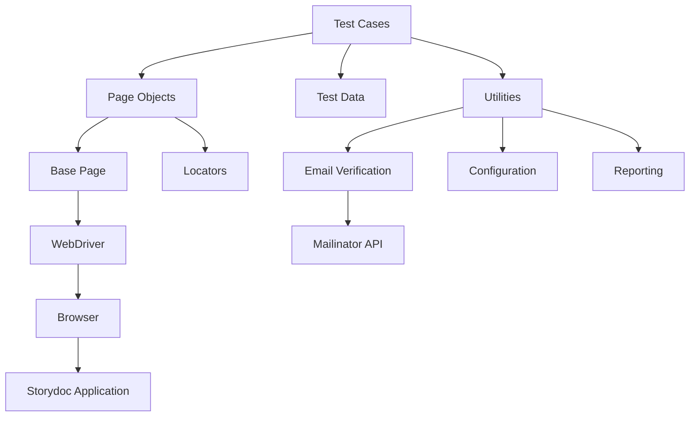
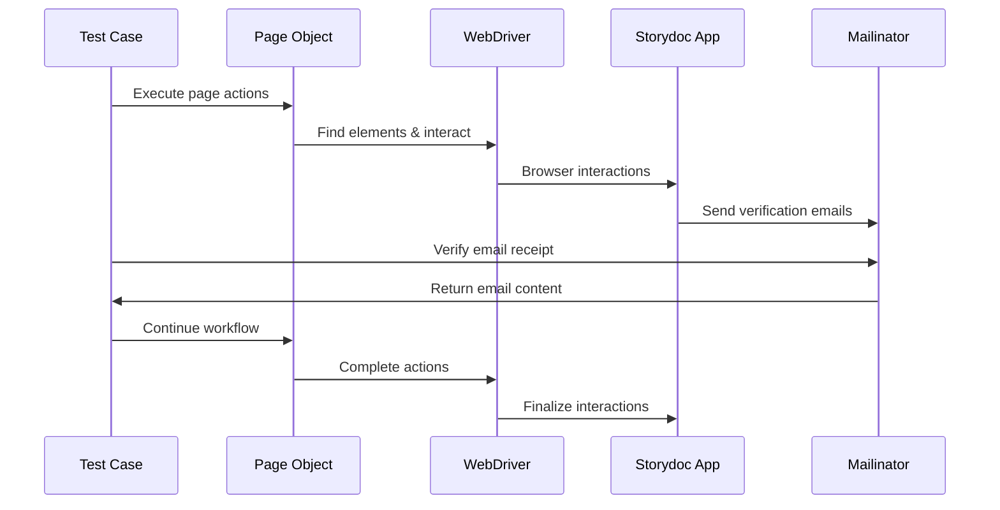
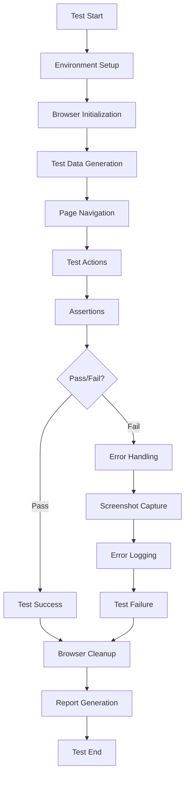
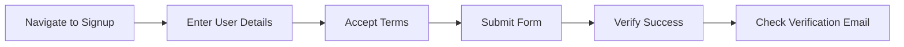
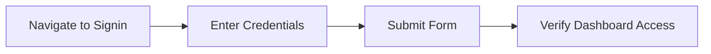
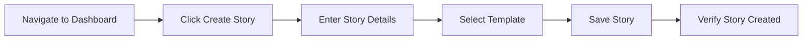
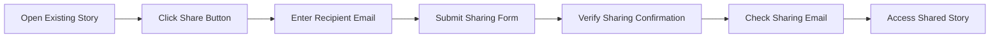
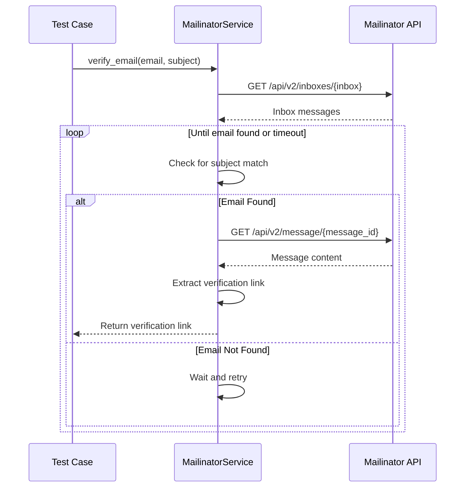

# Storydoc Test Automation Framework Overview

## Table of Contents
- [Introduction](#introduction)
- [Architecture Overview](#architecture-overview)
- [Technology Stack](#technology-stack)
- [Framework Components](#framework-components)
- [Test Execution Flow](#test-execution-flow)
- [User Workflows](#user-workflows)
- [Mailinator Integration](#mailinator-integration)
- [Getting Started](#getting-started)
- [CI/CD Integration](#cicd-integration)
- [Further Documentation](#further-documentation)

## Introduction

The Storydoc Test Automation Framework is a robust, maintainable solution for automated testing of the Storydoc web application. Built on the Page Object Model (POM) design pattern, the framework enables reliable testing of critical user workflows within the Storydoc platform.

### Purpose

This framework addresses the business need for reliable, maintainable test automation to ensure quality and stability of the Storydoc platform. By automating core user flows, it reduces manual testing effort, accelerates release cycles, and improves overall product quality.

### Key Features

- **Page Object Model Architecture**: Clear separation between test logic and UI implementation details
- **End-to-End Workflow Testing**: Comprehensive tests for user registration, authentication, story creation, and sharing
- **Email Verification**: Integration with Mailinator for automated email verification
- **Robust Synchronization**: Advanced waiting strategies to handle timing issues
- **Comprehensive Reporting**: Detailed test execution reports with screenshots
- **CI/CD Integration**: Seamless integration with continuous integration pipelines

## Architecture Overview

The framework follows the Page Object Model (POM) design pattern, which creates an abstraction layer between test code and UI implementation details. This separation significantly improves test maintainability, readability, and reusability.

### Design Principles

1. **Separation of Concerns**: Test logic is decoupled from UI implementation details
2. **Don't Repeat Yourself (DRY)**: Common functionality is centralized in base classes
3. **Single Responsibility**: Each component has a focused purpose
4. **Explicit over Implicit**: Clear, explicit interactions are preferred over hidden behavior

### Component Architecture



### Component Interactions



## Technology Stack

The framework leverages the following technologies:

| Component | Technology | Version | Purpose |
|-----------|------------|---------|---------|
| Core Language | Python | 3.9+ | Primary programming language |
| Browser Automation | Selenium WebDriver | 4.10+ | Browser interaction and control |
| Test Framework | pytest | 7.3+ | Test execution, assertions, and fixtures |
| Reporting | pytest-html | 3.2+ | HTML test reports generation |
| Parallel Execution | pytest-xdist | 3.3+ | Parallel test execution |
| HTTP Client | requests | 2.31+ | API interactions with Mailinator |
| WebDriver Management | webdriver-manager | 4.0+ | Automated driver installation |
| Environment Management | python-dotenv | 1.0+ | Environment configuration |

### Architecture Decisions

The technology stack was selected based on the following criteria:
- **Maturity and Stability**: All components are well-established in the industry
- **Community Support**: Strong communities for troubleshooting and knowledge sharing
- **Integration Capabilities**: Seamless integration between components
- **Maintainability**: Technologies that support clean, readable code
- **Python Ecosystem**: Leveraging the robust Python ecosystem for testing

## Framework Components

### Page Objects

Page Objects encapsulate the UI interactions for specific pages within the Storydoc application. Each page object provides methods that represent user actions on that page.

```python
class SignupPage(BasePage):
    """Page object for the signup page"""
    
    def __init__(self, driver):
        super().__init__(driver)
        self.url = "https://editor-staging.storydoc.com/sign-up"
    
    def enter_email(self, email):
        """Enter the email address in the email field"""
        self.input_text(SignupLocators.EMAIL_FIELD, email)
    
    def enter_password(self, password):
        """Enter the password in the password field"""
        self.input_text(SignupLocators.PASSWORD_FIELD, password)
    
    # Additional methods...
```

### Locators

Locators are separated from page objects to improve maintainability. When the UI changes, only the locators need to be updated, not the test logic.

```python
class SignupLocators:
    """Locators for the signup page"""
    EMAIL_FIELD = (By.ID, "email")
    PASSWORD_FIELD = (By.ID, "password")
    NAME_FIELD = (By.ID, "name")
    TERMS_CHECKBOX = (By.CSS_SELECTOR, "input[type='checkbox']")
    SIGNUP_BUTTON = (By.CSS_SELECTOR, "button[type='submit']")
    SIGNUP_SUCCESS = (By.CSS_SELECTOR, ".signup-success")
```

### Base Page

The BasePage class provides common functionality for all page objects, including element interaction, waiting strategies, and screenshot capture.

```python
class BasePage:
    """Base class for all page objects"""
    
    def __init__(self, driver):
        self.driver = driver
        self.wait = WebDriverWait(driver, 10)
        self.url = None
    
    def open(self):
        """Open the page URL in the browser"""
        if self.url:
            self.driver.get(self.url)
        else:
            raise ValueError("URL not defined for page")
    
    # Additional methods...
```

### Utilities

The framework includes several utility components:

#### Email Verification

The MailinatorService class handles email verification through the Mailinator API.

```python
class MailinatorService:
    """Service for interacting with Mailinator"""
    
    def wait_for_email(self, email_address, subject, timeout=60):
        """Wait for an email with the specified subject"""
        # Implementation...
        
    def extract_verification_link(self, message):
        """Extract verification link from the email content"""
        # Implementation...
```

#### Configuration Management

The ConfigurationService manages environment-specific settings through environment variables and .env files.

#### Test Data Management

Test data is generated dynamically to ensure test isolation and repeatable execution.

#### Reporting

The framework leverages pytest-html for comprehensive HTML test reports, with additional custom reporting enhancements.

## Test Execution Flow

The test execution follows a structured flow from initialization to reporting:



### Error Handling

The framework implements robust error handling strategies:

1. **Explicit Waits**: All element interactions use explicit waits to handle timing issues
2. **Retry Mechanisms**: Flaky operations are automatically retried
3. **Exception Handling**: Detailed exception logging with context
4. **Screenshot Capture**: Automatic screenshots on test failures
5. **Recovery Mechanisms**: Graceful handling of non-critical failures

## User Workflows

The framework is designed to test four core user workflows within the Storydoc application:

### User Registration



1. Navigate to the signup page
2. Enter email, password, and other required information
3. Accept terms and conditions
4. Submit the signup form
5. Verify successful registration
6. Check for verification email in Mailinator

### User Authentication



1. Navigate to the signin page
2. Enter registered email and password
3. Submit the signin form
4. Verify successful login and dashboard access

### Story Creation



1. Navigate to the dashboard
2. Click the create story button
3. Enter story title and select template
4. Add content to the story
5. Save the story
6. Verify the story appears in the dashboard

### Story Sharing



1. Open an existing story
2. Click the share button
3. Enter recipient email address
4. Submit the sharing form
5. Verify successful sharing
6. Check for sharing email in Mailinator
7. Access the shared story using the link in the email

## Mailinator Integration

The framework integrates with Mailinator to verify email delivery for both user registration and story sharing workflows.

### Email Verification Flow



### Implementation Details

The MailinatorService provides the following key functionalities:

1. **Inbox Checking**: Retrieve messages for a specific email address
2. **Email Waiting**: Poll for new emails with timeout handling
3. **Content Extraction**: Parse email content to extract verification links
4. **Link Verification**: Access extracted links to complete verification flows

## Getting Started

### Prerequisites

- Python 3.9 or higher
- Chrome browser (latest version)
- Git

### Installation

1. Clone the repository:
   ```bash
   git clone https://github.com/your-organization/storydoc-automation.git
   cd storydoc-automation
   ```

2. Create and activate a virtual environment:
   ```bash
   python -m venv venv
   source venv/bin/activate  # On Windows: venv\Scripts\activate
   ```

3. Install dependencies:
   ```bash
   pip install -r requirements.txt
   ```

4. Set up environment variables by copying and modifying the example file:
   ```bash
   cp .env.example .env
   # Edit .env with appropriate values
   ```

### Running Tests

Run all tests:
```bash
pytest
```

Run specific test:
```bash
pytest tests/test_user_registration.py
```

Generate HTML report:
```bash
pytest --html=report.html
```

## CI/CD Integration

The framework is designed to integrate seamlessly with CI/CD pipelines, particularly GitHub Actions.

### GitHub Actions Workflow

```yaml
name: Storydoc Automation Tests

on:
  push:
    branches: [ main ]
  pull_request:
    branches: [ main ]
  schedule:
    - cron: '0 0 * * *'  # Daily at midnight

jobs:
  test:
    runs-on: ubuntu-latest
    
    steps:
    - uses: actions/checkout@v3
    
    - name: Set up Python
      uses: actions/setup-python@v4
      with:
        python-version: '3.9'
    
    - name: Install dependencies
      run: |
        python -m pip install --upgrade pip
        pip install -r requirements.txt
    
    - name: Run tests
      run: |
        pytest --html=report.html
    
    - name: Upload test report
      uses: actions/upload-artifact@v3
      with:
        name: test-report
        path: report.html
```

### Pipeline Integration Benefits

1. **Continuous Testing**: Tests run automatically on code changes
2. **Early Feedback**: Issues are identified early in the development cycle
3. **Regression Protection**: Ensures existing functionality remains intact
4. **Documentation**: Test reports provide up-to-date documentation of application behavior

## Further Documentation

For more detailed information on specific aspects of the framework, refer to the following documentation:

- [Setup Guide](setup_guide.md) - Detailed setup instructions
- [Page Objects Documentation](page_objects.md) - In-depth documentation on page object implementation
- [Test Cases Documentation](test_cases.md) - Documentation of test case structure and organization
- [Mailinator Integration](mailinator_integration.md) - Detailed guide on the email verification mechanism
- [Best Practices](best_practices.md) - Guidelines for effective use of the framework
- [Troubleshooting Guide](troubleshooting.md) - Common issues and their resolutions

## Contributing

Contributions to the framework are welcome. Please follow these steps:

1. Create a feature branch from the main branch
2. Implement your changes with appropriate tests
3. Ensure all existing tests pass
4. Submit a pull request with a clear description of the changes

## License

This framework is proprietary and confidential. Unauthorized use, distribution, or reproduction is prohibited.